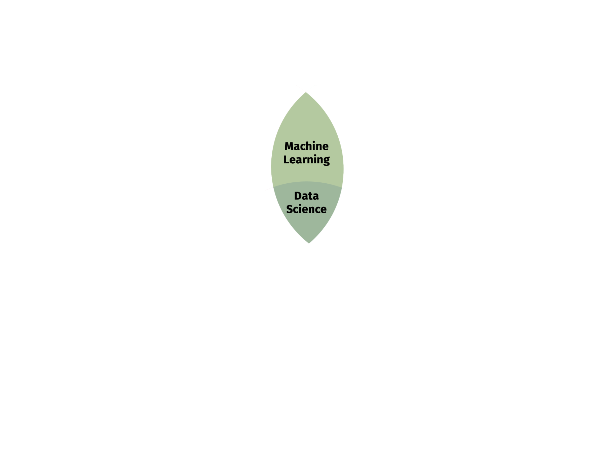
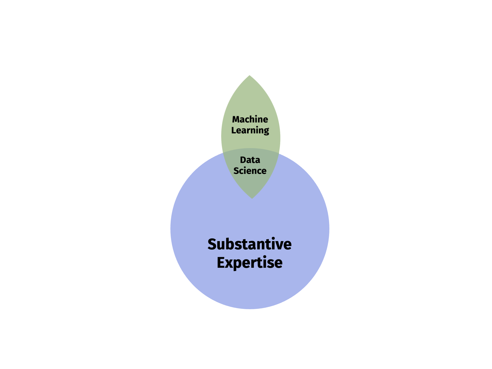
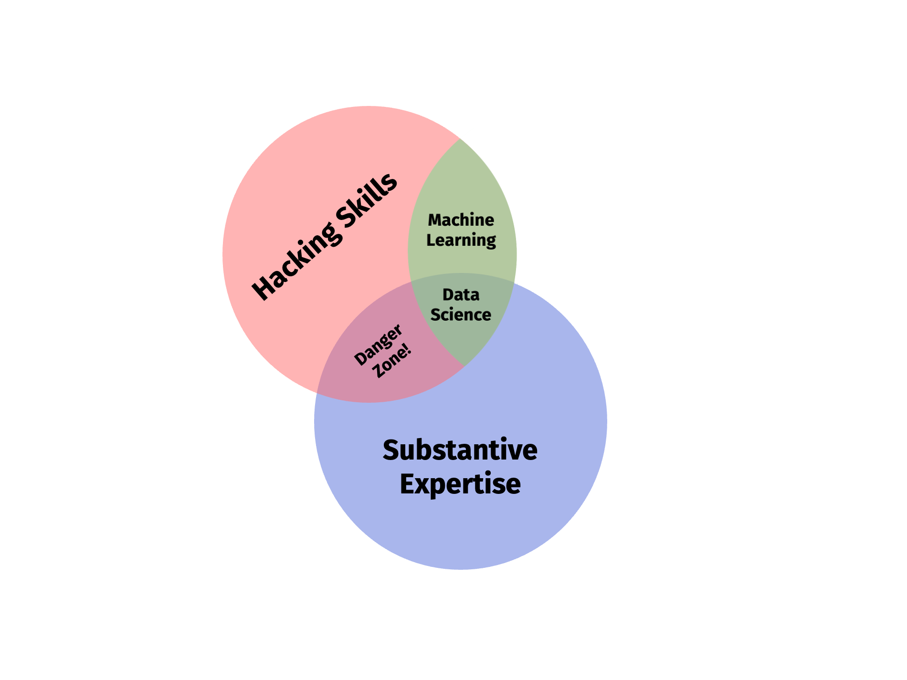
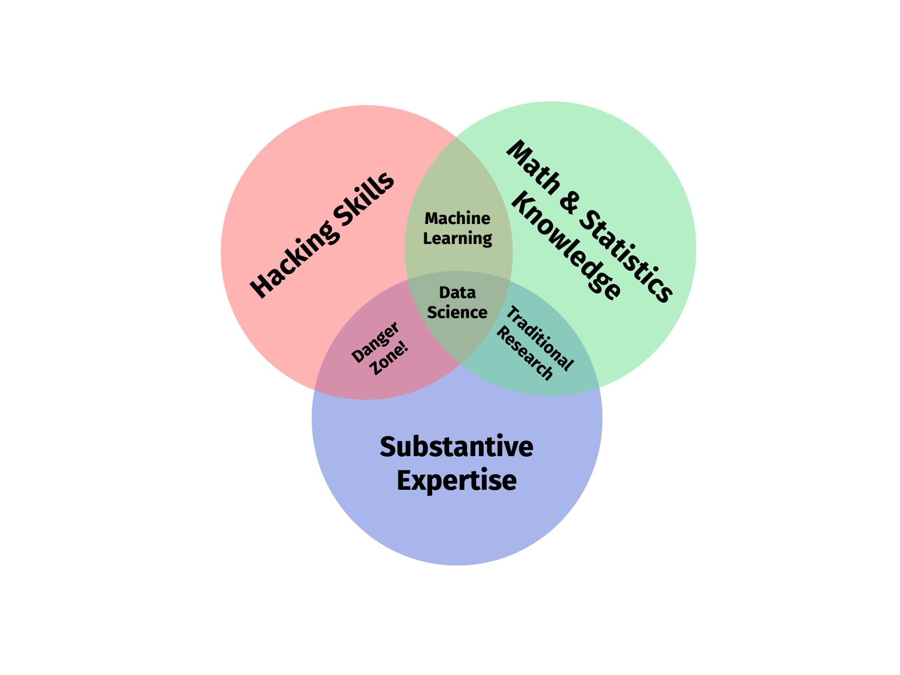
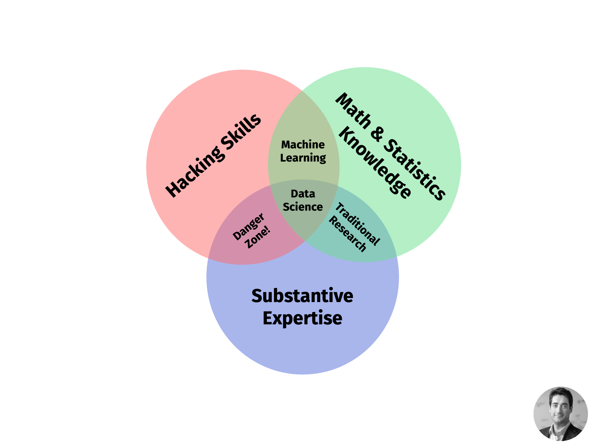

```{css, echo=FALSE} 
@media print { # print out incremental slides; see https://stackoverflow.com/questions/56373198/get-xaringan-incremental-animations-to-print-to-pdf/56374619#56374619
  .has-continuation {
    display: block !important;
  }
}
```

```{r setup, include=FALSE}
# figures formatting setup
options(htmltools.dir.version = FALSE)
library(knitr)
opts_chunk$set(
  prompt = T,
  fig.align="center", #fig.width=6, fig.height=4.5, 
  # out.width="748px", #out.length="520.75px",
  dpi=300, #fig.path='Figs/',
  cache=T, #echo=F, warning=F, message=F
  engine.opts = list(bash = "-l")
  )

## Next hook based on this SO answer: https://stackoverflow.com/a/39025054
knit_hooks$set(
  prompt = function(before, options, envir) {
    options(
      prompt = if (options$engine %in% c('sh','bash')) '$ ' else 'R> ',
      continue = if (options$engine %in% c('sh','bash')) '$ ' else '+ '
      )
})
```


SESSION 1: 
  - EXPECTATION MANAGEMENT
  - What is data science slides from workshop
  - glimpse on research
  - glimpse on ethics
  - organizational issues


# Table of contents

1. [Welcome!](#welcome)

2. [Class logistics](#logistics)

3. [What is data science?](#whatisdatascience)

4. [Sneak preview](#preview)


---
class: inverse, center, middle
name: git

# Git and GitHub
<html><div style='float:left'></div><hr color='#EB811B' size=1px style="width:1000px; margin:auto;"/></html>

---

# TL;DL


---

# TL;DL

<div align="center">

</div>

---

# TL;DL

<div align="center">

</div>

---

# TL;DL

<div align="center">

</div>

---

# TL;DL

<div align="center">

</div>

---

# TL;DL

<div align="center">

</div>


---

# TL;DL

<br><br><br><br>
<div align="center" class = "font200">
<b>To gain a deep understanding of the ethical implications of data science work, we need to teach the fundamentals of data science.</b>
</div>


---
class: inverse, center, middle

# What's data science?

<html><div style='float:left'></div><hr color='#EB811B' size=1px style="width:1000px; margin:auto;"/></html>


---

# The data science pipeline

.pull-left[

**Preparatory work**

- **Problem definition** predict, infer, describe
- **Design** conceptualize, build data collection device
- **Data collection** recruit, collect, monitor

]

---

# The data science pipeline

.pull-left[

**Preparatory work**

- **Problem definition** predict, infer, describe
- **Design** conceptualize, build data collection device
- **Data collection** recruit, collect, monitor

**Data operation**

]

.pull-right-center[
<br><br><br>
<div align="center">

</div>
]

---

# The data science pipeline

.pull-left[

**Preparatory work**

  - **Problem definition** predict, infer, describe
  - **Design** conceptualize, build data collection device
  - **Data collection** recruit, collect, monitor

**Data operation**

   - **Wrangle**: import, tidy, manipulate
   
]

.pull-right-center[
<br><br><br>
<div align="center">

</div>
]


---

# The data science pipeline

.pull-left[

**Preparatory work**

  - **Problem definition** predict, infer, describe
  - **Design** conceptualize, build data collection device
  - **Data collection** recruit, collect, monitor

**Data operation**

   - **Wrangle**: import, tidy, manipulate
   - **Explore**: visualize, describe, discover


]

.pull-right-center[
<br><br><br>
<div align="center">

</div>
]


---

# The data science pipeline

.pull-left[

**Preparatory work**

  - **Problem definition** predict, infer, describe
  - **Design** conceptualize, build data collection device
  - **Data collection** recruit, collect, monitor

**Data operation**

   - **Wrangle**: import, tidy, manipulate
   - **Explore**: visualize, describe, discover
   - **Model**: build, test, infer, predict


]

.pull-right-center[
<br><br><br>
<div align="center">

</div>
]


---

# The data science pipeline

.pull-left[

**Preparatory work**

  - **Problem definition** predict, infer, describe
  - **Design** conceptualize, build data collection device
  - **Data collection** recruit, collect, monitor

**Data operation**

   - **Wrangle**: import, tidy, manipulate
   - **Explore**: visualize, describe, discover
   - **Model**: build, test, infer, predict

**Dissemination**

  - **Communicate**: to the public, media, policymakers
  - **Publish**: journals/proceedings, blogs, software
  - **Productize**: make usable, robust, scalable


]

.pull-right-center[
<br><br><br>
<div align="center">

</div>
]


---

# The data science pipeline

.pull-left[

**Preparatory work**

  - **Problem definition** predict, infer, describe
  - **Design** conceptualize, build data collection device
  - **Data collection** recruit, collect, monitor

**Data operation**

   - **Wrangle**: import, tidy, manipulate
   - **Explore**: visualize, describe, discover
   - **Model**: build, test, infer, predict

**Dissemination**

  - **Communicate**: to the public, media, policymakers
  - **Publish**: journals/proceedings, blogs, software
  - **Productize**: make usable, robust, scalable


]

.pull-right-center[
<br><br><br>
<div align="center">

</div>
]


---

# The data science pipeline

.pull-left[

**Preparatory work**

  - **Problem definition** predict, infer, describe
  - **Design** conceptualize, build data collection device
  - **Data collection** recruit, collect, monitor

**Data operation**

   - **Wrangle**: import, tidy, manipulate
   - **Explore**: visualize, describe, discover
   - **Model**: build, test, infer, predict

**Dissemination**

  - **Communicate**: to the public, media, policymakers
  - **Publish**: journals/proceedings, blogs, software
  - **Productize**: make usable, robust, scalable


]

.pull-right-center[
<br><br>
<div align="center">

</div>
]


---
class: inverse, center, middle

# Everyday ethics in data science

<html><div style='float:left'></div><hr color='#EB811B' size=1px style="width:1000px; margin:auto;"/></html>


---
class: center
background-image: url("pics/clickworker.png")

# How do I pay clickworkers fairly?


---
class: center
background-image: url("pics/webscraping2.jpeg")
background-size: contain

# How do I respect intellectual property?

---
class: center
background-image: url("pics/google-streetview.webp")
background-size: contain
background-color: #000000

# How do I protect the privacy of my research subjects?

---
class: center
background-image: url("pics/hate-online.jpeg")
background-size: contain
background-color: #000000

# How do I protect the safety of my research subjects?

---
class: center
background-image: url("pics/xkcd.png")
background-size: contain
background-color: #000000

# How do I ensure statistical, measurement validity, etc.?


---
class: center
background-image: url("pics/versioncontrol.jpeg")
background-size: contain
background-color: #000000

# How do I ensure an open science workflow?


---
class: center
background-image: url("pics/meeting-presentation.png")
background-size: contain
background-color: #000000

# How do I communicate results honestly?


---
background-image: url("pics/research-ethics-2.png")
background-size: contain
background-color: #000000

# Data science ethics

.pull-left-center[
<br><br><br>
<div align="center" class = "font200">
<b>Data science ethics </br>∋</b> </br> <b>Classical research ethics<sup>1</sup></b>
</div>
<br><br><br><br><br><sup>1</sup>Honesty, objectivity, prudence, openness, respect for intellectual property, social responsibility, ...
]


---
background-image: url("pics/research-ethics-3.png")
background-size: contain
background-color: #000000

# Data science ethics

.pull-left-center[
<br><br><br>
<div align="center" class = "font200">
<b>Data science ethics </br>∋</b> </br> <b>The ethics of </br> everyday decisions </br> of data scientists</b>
</div>
]


