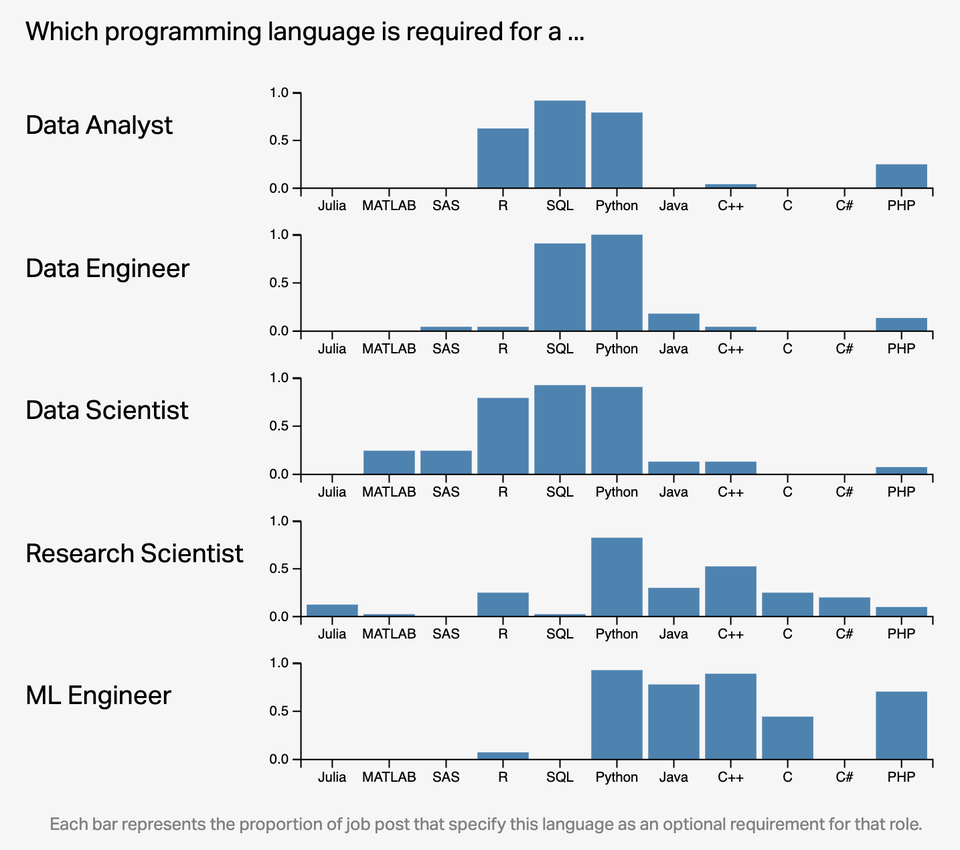

class: inverse, center, middle
name: welcome

```{css, echo=FALSE} 
@media print { # print out incremental slides; see https://stackoverflow.com/questions/56373198/get-xaringan-incremental-animations-to-print-to-pdf/56374619#56374619
  .has-continuation {
    display: block !important;
  }
}
```

```{r setup, include=FALSE}
# figures formatting setup
options(htmltools.dir.version = FALSE)
library(knitr)
opts_chunk$set(
  prompt = T,
  fig.align="center", #fig.width=6, fig.height=4.5, 
  # out.width="748px", #out.length="520.75px",
  dpi=300, #fig.path='Figs/',
  cache=T, #echo=F, warning=F, message=F
  engine.opts = list(bash = "-l")
  )

## Next hook based on this SO answer: https://stackoverflow.com/a/39025054
knit_hooks$set(
  prompt = function(before, options, envir) {
    options(
      prompt = if (options$engine %in% c('sh','bash')) '$ ' else 'R> ',
      continue = if (options$engine %in% c('sh','bash')) '$ ' else '+ '
      )
})

library(tidyverse)
library(hrbrthemes)
library(fontawesome)
```


# Welcome!

---

# Roadmap

</br></br></br></br>

1. [Welcome!](#welcome)

2. [What is data science?](#whatisdatascience)

3. [Sneak preview](#preview)

3. [Q&A](#qanda)


---

# Introductions

### Course

`r fa('globe')` https://github.com/intro-to-data-science-21

Much of this course lives on GitHub. You will find lecture materials, code, assignments, and other people's presentations there. We also have Moodle, which is for everything else.

--

### Me

`r fa('address-book')` I'm [Simon Munzert](https://simonmunzert.github.io/) [si’mən munsɜrt], or just Simon [saɪmən].

`r fa('envelope')` [munzert@hertie-school.org](mailto:munzert@hertie-school.org)

`r fa('graduation-cap')` Assistant Professor of Data Science and Public Policy

--

### You

What's your name? Why are you here? And would you share a funny fact about yourself?


---

# More about you (one year ago)

<div align="center">
<br>

</div>


---
class: inverse, center, middle
name: whatisdatascience

# What is data science?
<html><div style='float:left'></div><hr color='#EB811B' size=1px style="width:1000px; margin:auto;"/></html>


---

# An old classic

<div align="center">

</div>

---

# An old classic

<div align="center">

</div>

---

# An old classic

<div align="center">

</div>

---

# An old classic

<div align="center">

</div>


---

# An old classic

<div align="center">

</div>

---

# An old classic

<div align="center">

</div>


---

# The data science pipeline

.pull-left[

**Preparatory work**

- **Problem definition** predict, infer, describe
- **Design** conceptualize, build data collection device
- **Data collection** recruit, collect, monitor

]

---

# The data science pipeline

.pull-left[

**Preparatory work**

- **Problem definition** predict, infer, describe
- **Design** conceptualize, build data collection device
- **Data collection** recruit, collect, monitor

**Data operation**

]

.pull-right-center[
<br><br><br>
<div align="center">

</div>
]

---

# The data science pipeline

.pull-left[

**Preparatory work**

  - **Problem definition** predict, infer, describe
  - **Design** conceptualize, build data collection device
  - **Data collection** recruit, collect, monitor

**Data operation**

   - **Wrangle**: import, tidy, manipulate
   
]

.pull-right-center[
<br><br><br>
<div align="center">

</div>
]


---

# The data science pipeline

.pull-left[

**Preparatory work**

  - **Problem definition** predict, infer, describe
  - **Design** conceptualize, build data collection device
  - **Data collection** recruit, collect, monitor

**Data operation**

   - **Wrangle**: import, tidy, manipulate
   - **Explore**: visualize, describe, discover


]

.pull-right-center[
<br><br><br>
<div align="center">

</div>
]


---

# The data science pipeline

.pull-left[

**Preparatory work**

  - **Problem definition** predict, infer, describe
  - **Design** conceptualize, build data collection device
  - **Data collection** recruit, collect, monitor

**Data operation**

   - **Wrangle**: import, tidy, manipulate
   - **Explore**: visualize, describe, discover
   - **Model**: build, test, infer, predict


]

.pull-right-center[
<br><br><br>
<div align="center">

</div>
]


---

# The data science pipeline

.pull-left[

**Preparatory work**

  - **Problem definition** predict, infer, describe
  - **Design** conceptualize, build data collection device
  - **Data collection** recruit, collect, monitor

**Data operation**

   - **Wrangle**: import, tidy, manipulate
   - **Explore**: visualize, describe, discover
   - **Model**: build, test, infer, predict

**Dissemination**

  - **Communicate**: to the public, media, policymakers
  - **Publish**: journals/proceedings, blogs, software
  - **Productize**: make usable, robust, scalable


]

.pull-right-center[
<br><br><br>
<div align="center">

</div>
]


---

# The data science pipeline

.pull-left[

**Preparatory work**

  - **Problem definition** predict, infer, describe
  - **Design** conceptualize, build data collection device
  - **Data collection** recruit, collect, monitor

**Data operation**

   - **Wrangle**: import, tidy, manipulate
   - **Explore**: visualize, describe, discover
   - **Model**: build, test, infer, predict

**Dissemination**

  - **Communicate**: to the public, media, policymakers
  - **Publish**: journals/proceedings, blogs, software
  - **Productize**: make usable, robust, scalable


]

.pull-right-center[
<br><br><br>
<div align="center">

</div>
]


---

# The data science pipeline

.pull-left[

**Preparatory work**

  - **Problem definition** predict, infer, describe
  - **Design** conceptualize, build data collection device
  - **Data collection** recruit, collect, monitor

**Data operation**

   - **Wrangle**: import, tidy, manipulate
   - **Explore**: visualize, describe, discover
   - **Model**: build, test, infer, predict

**Dissemination**

  - **Communicate**: to the public, media, policymakers
  - **Publish**: journals/proceedings, blogs, software
  - **Productize**: make usable, robust, scalable


]

.pull-right-center[
<br><br>
<div align="center">

</div>
]


---
class: inverse, center, middle
name: preview

# Sneak preview
<html><div style='float:left'></div><hr color='#EB811B' size=1px style="width:1000px; margin:auto;"/></html>


---

# Introduction to Data Science in a nutshell

<div align="center">
<br>

</div>


---
class: inverse, center, middle

# Sneak preview <br> Learning to love a programming environment

<html><div style='float:left'></div><hr color='#EB811B' size=1px style="width:1000px; margin:auto;"/></html>


---
class: center
background-color: #fff

# The tidyverse

<div align="center">
<br>

</div>


---

# Why R and RStudio?

### Data science positivism

- Alongside Python, R has become the *de facto* language for data science.
  - See: [*The Impressive Growth of R*](https://stackoverflow.blog/2017/10/10/impressive-growth-r/), [*The Popularity of Data Science Software*](http://r4stats.com/articles/popularity/)
- Open-source (free!) with a global user-base spanning academia and industry.
  - "Do you want to be a profit source or a cost center?"

--

### Bridge to multiple other programming environments, with statistics at heart

- Already has all of the statistics support, and is amazingly adaptable as a “glue” language to other
programming languages and APIs.
- The RStudio IDE and ecosystem allow for further, seemless integration.

--

### Path dependency

- It's also the language that I - and many data scientists with a foot in public policy - know best.
- (Learning multiple languages is a good idea, though.)


---
# Why R and RStudio? (cont.)

<div align="center">

</div>
`Credit` [Left_Ad8361/Reddit](https://www.reddit.com/r/dataisbeautiful/comments/qw1bew/oc_which_programming_language_is_required_to_land/)


---
class: inverse, center, middle

# Sneak preview <br> Collecting web data at scale

<html><div style='float:left'></div><hr color='#EB811B' size=1px style="width:1000px; margin:auto;"/></html>


---
# Scraping the web for social research


.pull-left-center[
<div align="center">

<br><br>

</div>
]

.pull-right-center[
<div align="center">

<br>

</div>
]


---
# Web scraping

.pull-left[

### What is web scraping?

1. Pulling (unstructured) data from websites (HTMLs)
2. Bringing it into shape (into an analysis-ready format)

### The philosophy of scraping with R

- No point-and-click procedure
- Script the entire process from start to finish
- **Automate**
  - The downloading of files
  - The scraping of information from web sites
  - Tapping APIs
  - Parsing of web content
  - Data tidying, text data processing
- Easily scale up scraping procedures
- Scheduling of scraping tasks
]

.pull-right-center[
<br>
<div align="center">

</div>
`Credit` [prowebscraping.com](http://prowebscraping.com/web-scraping-vs-web-crawling/)
]

---
# Technologies of the world wide web

.pull-left[

- To fully unlock the potential of web data for data science, we draw on certain web technologies.
- Importantly, often a basic understanding of these technologies is sufficient as the focus is on web data collection, not [web development](https://en.wikipedia.org/wiki/Web_development).
- Specifically, we have to understand
  - How our machine/browser/R communicates with web servers (→ **HTTP/S**)
  - How websites are built (→ **HTML**, **CSS**, basics of **JavaScript**)
  - How content in webpages can be effectively located (→ **XPath**, **CSS selectors**)
  - How dynamic web applications are executed and tapped (→ **AJAX**, **Selenium**)
  - How data by web services is distributed and processed (→ **APIs**, **JSON**, **XML**)
  
]

.pull-right-center[
<div align="center">
<br>

</div>
`Credit` [ADCR](http://r-datacollection.com/)
]


---
class: inverse, center, middle

# Sneak preview <br> Reflecting everyday ethics in data science

<html><div style='float:left'></div><hr color='#EB811B' size=1px style="width:1000px; margin:auto;"/></html>


---
class: center
background-image: url("pics/webscraping2.jpeg")
background-size: contain

# How do I respect intellectual property?

---
class: center
background-image: url("pics/hate-online.jpeg")
background-size: contain
background-color: #000000

# How do I protect the safety of my research subjects?


---
class: center
background-image: url("pics/versioncontrol.jpeg")
background-size: contain
background-color: #000000

# How do I ensure an open science workflow?


---
class: center
background-image: url("pics/meeting-presentation.png")
background-size: contain
background-color: #000000

# How do I communicate results honestly?


---
class: inverse, center, middle

# Sneak preview <br> Tools for Data Science Workshop

<html><div style='float:left'></div><hr color='#EB811B' size=1px style="width:1000px; margin:auto;"/></html>


---

# Tools for Data Science Workshop

<div align="center">
<br>

<br>
<a href ="https://intro-to-data-science-21-workshop.github.io/">https://intro-to-data-science-21-workshop.github.io/</a>
</div>

---
# Tools for Data Science Workshop

.pull-left[
<div align="center">
<br>

</div>
]

.pull-right-center[
<div align="center">
<br>

</div>
]


---
class: inverse, center, middle
name: qanda

# Q & A
<html><div style='float:left'></div><hr color='#EB811B' size=1px style="width:1000px; margin:auto;"/></html>


---
# Question time!

.pull-left[

<b>Please AMA!</b>

- About the course
- About the MDS curriculum
- About the Hertie School
- About the Data Science Lab
- About anything else
  
<div align="center">

</div>

]

.pull-right-center[
<div align="center">
<br>

</div>
]


