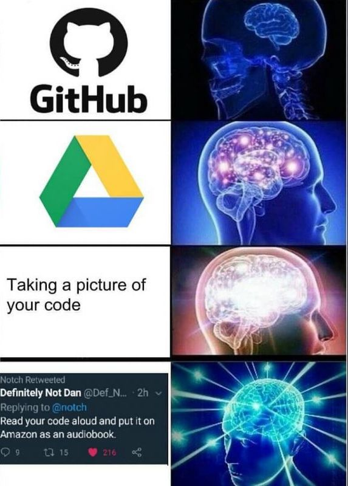
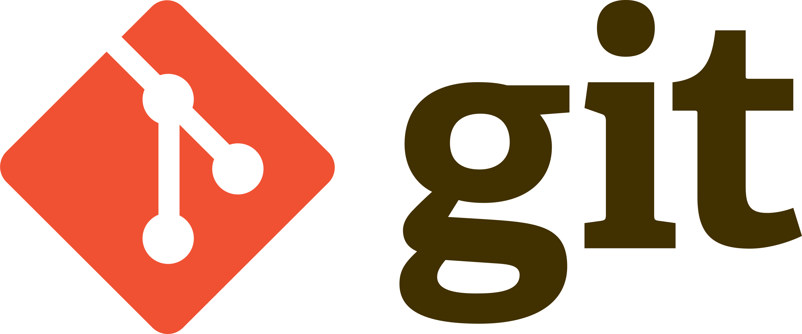
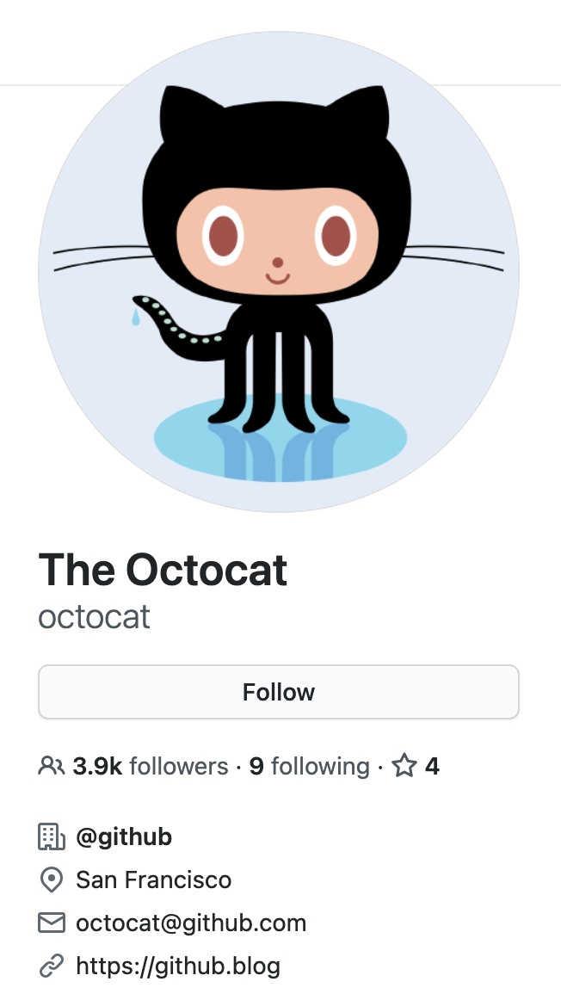
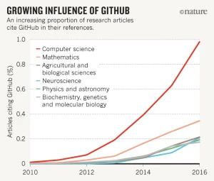
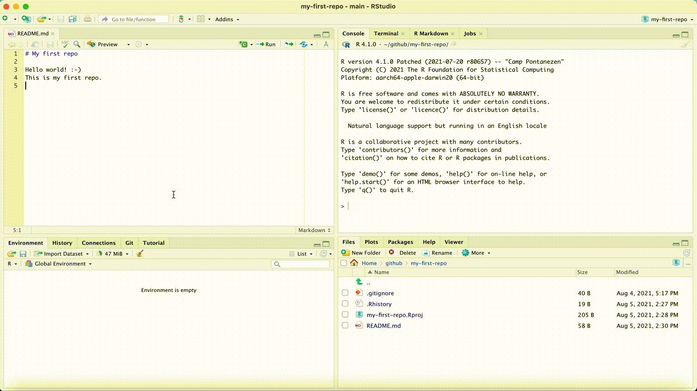

```{css, echo=FALSE} 
@media print { # print out incremental slides; see https://stackoverflow.com/questions/56373198/get-xaringan-incremental-animations-to-print-to-pdf/56374619#56374619
  .has-continuation {
    display: block !important;
  }
}
```

```{r setup, include=FALSE}
# figures formatting setup
options(htmltools.dir.version = FALSE)
library(knitr)
opts_chunk$set(
  prompt = T,
  fig.align="center", #fig.width=6, fig.height=4.5, 
  # out.width="748px", #out.length="520.75px",
  dpi=300, #fig.path='Figs/',
  cache=T, #echo=F, warning=F, message=F
  engine.opts = list(bash = "-l")
  )

## Next hook based on this SO answer: https://stackoverflow.com/a/39025054
knit_hooks$set(
  prompt = function(before, options, envir) {
    options(
      prompt = if (options$engine %in% c('sh','bash')) '$ ' else 'R> ',
      continue = if (options$engine %in% c('sh','bash')) '$ ' else '+ '
      )
})
```


# Table of contents

1. [Git and GitHub](#git)<sup>1</sup>

2. [Getting started](#gettingstarted)

3. [Git(Hub) + RStudio](#rstudio)

4. [Git from the shell](#shell)

5. [Merge conflicts](#merge)

6. [Branches and forking](#branches)

7. [Other tips](#other)

8. [Summary](#summary)

.footnote[<sup>1</sup> Much of this lecture draws on materials from Grant McDermott's excellent [*Data Science for Economists*](https://github.com/uo-ec607/lectures) class.]
---
class: inverse, center, middle
name: git

# Git and GitHub
<html><div style='float:left'></div><hr color='#EB811B' size=1px style="width:1000px; margin:auto;"/></html>

---

# Why version control?

<div align="center">

</div>

`Credit` [phdcomics.com](http://phdcomics.com/comics/archive.php?comicid=1531&quot;&gt;creativity&lt;/a&gt;.&lt;!--more--&gt;&lt;/p&gt;)

---
# More reasons to do version control

.pull-left[
**Have you ever...**

- Changed your code, realized it was a mistake and wanted to revert back?
- Lost code or had a backup that was too old?
- Wanted to see the difference between different versions of your code?
- Wanted to review the history of some code?
- Wanted to submit a change to someone else's code?
- Wanted to share your code, or let other people work on your code?
- Wanted to see how much work is being done, when, and by whom?
- Wanted to experiment with but not interfering with working code?

`Credit` [si618/Stackoverflow](https://stackoverflow.com/questions/1408450/why-should-i-use-version-control)]

.pull-right-center[
<br>
<div align="center">

</div>

`Credit` [bhimanshukalra/devrant.com](https://devrant.com/rants/1840468/version-control)
]

---

# Git(Hub) solves this problem

.pull-left[
<div align="center">

</div>

- Git is a distributed version control system.
- Imagine if your Dropbox (or Google Drive, or MS OneDrive for that matter) and the "Track changes" feature in MS Word had a baby.
- In fact, it's even better than that because Git is optimized for the things that data scientists spend a lot of time working on - code!
- There is a learning curve, but it's worth it.
- Being familiar with Git is taken for granted when you interact with other data scientists.
- It is by far [not the only version control software](https://en.wikipedia.org/wiki/Comparison_of_version-control_software), but certainly the most popular one.
- According to [StackOverflow's 2021 Developer Survey](https://insights.stackoverflow.com/survey/2021#most-popular-technologies-tools-tech), more than 93% of respondents report to use Git - more than any other tool.
]

--

.pull-right[
<div align="center">

</div>

- It's important to realize that Git and GitHub are distinct things.
- GitHub is an online hosting platform that allows you to host your code online.
- It relies on Git and makes some of its functionality more accessible.
- Also, it provides many more useful features to collaborate with others. (Similar platforms include Bitbucket and GitLab.)
- Just like we don't *need* Rstudio to run R code, we don't *need* GitHub to use Git... But it will make our lives easier.
]

---

# Git: some background

.pull-left-wide[
**Where does Git come from?**

- Git was created in 2005 by Linux creator Linus Torvalds.
- The initial motivation was to have a non-proprietary version control system to manage Linux kernel development.
- Check out this (quite opinionated) [talk by Linus Torvalds on Git](https://www.youtube.com/watch?v=4XpnKHJAok8) two years after its creation.

**What's the meaning of `Git`?**

- Anything, [apparently](https://en.wikipedia.org/wiki/Git#Naming).
- Also, it's pronounced [ɡɪt], not [d͡ʒɪt].

**How to interact with Git?**
- There are many [Git GUIs](https://en.wikipedia.org/wiki/Comparison_of_Git_GUIs), giving you the option to use git without the shell (often with reduced functionality). A popular choice is [GitHub Desktop](https://desktop.github.com/), but we will mainly use the [Git integration into the RStudio IDE](https://support.rstudio.com/hc/en-us/articles/200532077-Version-Control-with-Git-and-SVN).
]

.pull-right-small-center[
<div align="center">

<br>
<br>

</div>

`Credit` [Krd (photo), Von Sprat (crop/extraction), CC BY-SA 4.0.](https://commons.wikimedia.org/w/index.php?curid=54706023)
]


---

# GitHub: some background

.pull-left-wide[
**Where does GitHub come from?**

- GitHub.com launched in April 2008 by [Tom Preston-Werner, Chris Wanstrath, P.J. Hyett and Scott Chacon](https://productmint.com/github-business-model-how-does-github-make-money/).
- In 2018, Microsoft acquired the company for more than US$7 billion.


**What's the business model?**
- GitHub offers various subscription plans and has expanded its services beyond hosting Git-based version control.

**Some interesting facts**
- GitHub's mascot is "[Octocat](https://github.com/octocat)", a human-cat-octopus hybrid with five arms. 
- There are [56m+ developers on Github](https://octoverse.github.com/), with 60m+ new repositories created in 2020 alone.
- Part of GitHub's history are controversies around issues like harassment allegations or incidences of censorship.
]

.pull-right-narrow-center[
<div align="center">


`Credit` [Screenshot](https://github.com/octocat3)
]

---

# Git(Hub) for scientific research

.pull-left[
### From software development...

- Git and GitHub's role in global software development is not in question.
- There's a high probability that your favourite app, program or package is built using Git-based tools. (RStudio is a case in point.)

### ... to scientific research

- Data science involves product building, collaboration, transparency. GH helps with all that.
- Journals have increasingly strict requirements regarding reproducibility and access. GH makes this easy (DOI integration, off-the-shelf licenses, etc.).
- I host all of the code and data for my [papers](https://simonmunzert.github.io/publications.html) on GH. My [website](https://simonmunzert.github.io/) lives there. And this [course](https://github.com/Fall-2021-Introduction-to-Data-Science) does, too.
]

.pull-right-center[
<br>
<div align="center">

</div>

`Credit` "[Democratic databases: science on GitHub](https://www.nature.com/news/democratic-databases-science-on-github-1.20719)" (Perkel, 2016, *Nature*).
]


---
class: inverse, center, middle
name: gettingstarted

# Getting started
<html><div style='float:left'></div><hr color='#EB811B' size=1px style="width:1000px; margin:auto;"/></html>

---

# First step: register a GitHub account

Good news: It's free!

Simply go to [https://github.com](https://github.com) to sign up.

Some things to consider:

- As a student, you qualify for a [free GitHub Pro account](https://education.github.com/discount_requests/student_application).
- The Pro account comes with a couple of [additional features](https://docs.github.com/en/get-started/learning-about-github/githubs-products#github-pro).
- Register for a free account first, then pursue the special offers.
- Choose your username [wisely](https://happygitwithr.com/github-acct.html). This isn't Instagram, so maybe avoid puns and "funny" nicknames.


---

# Second step: install Git

Again, Git is an independent piece of software. You need to have it installed on your machine to call it from RStudio or the command line.

Chances are that that's already the case. Here's how you can check using the command line:

```{bash}
which git
```

And here's how you can check the version:

```{bash}
git --version
```

If you want to install (or update) Git on your Mac/Linux machine, I recommend using [Homebrew](https://brew.sh/), "the missing package manager for macOS (or Linux)":

```{bash, eval = FALSE}
brew install git
```

To install/update Git for Windows, check out [happygitwithr.com](https://happygitwithr.com/install-git.html).


---

# Third step: introduce yourself to Git

This is particularly important when you work with Git but without the GitHub overhead. The idea is to define how your commits are labelled. Others should easily identify your commits as coming from you.

To that end, we set our user name and email address like this:

```{bash, eval = FALSE}
git config --global user.name 'simonmunzert'
git config --global user.email 'simon.munzert@example.com'
```

The user name can be (but does not have to be) your GitHub user name. The email address should definitely be the one associated with your GitHub account.

Check out [these setup instructions](http://swcarpentry.github.io/git-novice/02-setup/) from [Software Carpentry](https://software-carpentry.org/about/) to learn about more configuration options.


---
class: inverse, center, middle
name: rstudio

# Git(Hub) + RStudio
<html><div style='float:left'></div><hr color='#EB811B' size=1px style="width:1000px; margin:auto;"/></html>

---

# Link a GitHub repo to an RStudio Project 

One of the (many) great features of RStudio is how well it integrates version control into your everyday workflow.
- Even though Git is a completely separate program to R, they feel like part of the same "thing" in RStudio.
- This next section is about learning the basic Git(Hub) commands and the recipe for successful project integration with RStudio.

--

The starting point for our workflow is to link a GitHub repository (i.e. "repo") to an RStudio Project. Here are the steps we're going to follow:

1. Create the repo on GitHub and initialize with a README.
2. Copy the HTTPS/SSH link (the green "Clone or Download" button).
3. Open up RStudio.
4. Navigate to **File -> New Project -> Version Control -> Git**.
5. Paste your copied link into the "Repository URL:" box.
6. Choose the project path ("Create project as subdirectory of:") and click **Create Project**.

--

Let's see how that works in practice.

---

# Link a GitHub repo to an RStudio Project 

<div align="center">

</div>

---

# Make some local changes

Look at the Environment panel in your RStudio IDE. Do you see the "Git" tab? 

1. Click on it. 
2. Look what's in there. There should already be some files in there, which we'll ignore for the moment.
3. Now open up the README file (see the "Files" tab in the bottom-right panel).
4. Add some text like "Hello World!" and save the README.
5. Have you noticed the changes in the "Git" panel? 

Again, see the GIF walkthrough on the next slide...


---

# Make some local changes 

<div align="center">

</div>

---

# Main Git operations

Now that you've cloned your first repo and made some local changes, it's time to learn the four main Git operations.

1. **Stage** (or "add")
  - Tell Git that you want to add changes to the repo history (file edits, additions, deletions, etc.)
2. **Commit**
  - Tell Git that, yes, you are sure these changes should be part of the repo history.
3. **Push**
  - Push any (committed) local changes to the GitHub repo.
4. **Pull**
  - Get any new changes made on the GitHub repo (i.e. the upstream remote), either by your collaborators or you on another machine.


--

For the moment, it will be useful to group the first two operations and last two operations together. (They are often combined in practice too, although you'll soon get a sense of when and why they should be split up.)

--

Ready for more GIFs?

---

# Stage and Commit

<div align="center">

</div>


---

# Push and Pull

<div align="center">

</div>

---

# Recap

Here's a step-by-step summary of what we just did.
- Made some changes to a file and saved them locally.
- *Staged* these local changes.
- *Committed* these local changes to our Git history with a helpful message.
- *Pulled* from the GitHub repo just in case anyone else made changes too (not expected here, but good practice).
- *Pushed* our changes to the GitHub repo.

--

🦊 Always pull from the upstream repo *before* you push any changes. Seriously, do this even on solo projects; making it a habit will save you headaches down the road.

--

🤓 You were likely challenged for your GitHub credentials at some point. Learn how to cache these [here](https://happygitwithr.com/credential-caching.html).

--

🤓 Speaking of credentials, an even better approach is to [switch to SSH](https://happygitwithr.com/ssh-keys.html). I recommend you do this once you feel comfortable with the main Git operations.

---

# Why this workflow?

Creating the repo on GitHub first means that it will always be "upstream" of your (and any other) local copies.
- In effect, this allows GitHub to act as the central node in the distributed VC network.
- Especially valuable when you are collaborating on a project with others — more on this later — but also has advantages when you are working alone.
- If you would like to move an existing project to GitHub, my advice is still to create an empty repo there first, clone it locally, and then copy all your files across.

--

RStudio Projects are great. 
- Again, they interact seamlessly with Git(Hub), as we've just seen. 
- They also solve absolute vs. relative path problems, since the `.Rproj` file acts as an anchor point for all other files in the repo.<sup>1</sup>

.footnote[<sup>1</sup> You know that calling files from `YourComputer/YourName/Documents/Special-Subfolder/etc` in your scripts is one of the deadly sins of programming, right?]

---
class: inverse, center, middle
name: shell

# Git from the shell
<html><div style='float:left'></div><hr color='#EB811B' size=1px style="width:1000px; margin:auto;"/></html>

---

# Why bother with the shell?

The GitHub + RStudio Project combo is ideal for new users.
- RStudio's Git integration and built-in GUI cover all the major operations.
- RStudio Projects FTW.

--

However, there are some benefits:
- The shell is more powerful and flexible. It lets you do things that the RStudio Git GUI can't.
- Working in the shell is potentially more appropriate for projects that aren't primarily based in R.
- Knowing the basic Git commands in the shell is generally a good thing for a data scientist.
- We're going to cover the shell in more detail in a later session, so this is a sneak preview.

---

# Main Git shell commands

Clone a repo into current directory.

```bash
$ git clone REPOSITORY-URL
```

See the commit history (hit spacebar to scroll down or q to exit). You need to be in a git repo to see something.

```bash
$ git log
```

What has changed? 

```bash
$ git status
```
---

# Main Git shell commands (cont.)

Stage ("add") a file or group of files.
```bash
$ git add NAME-OF-FILE-OR-FOLDER
```

You can use [wildcard](https://ryanstutorials.net/linuxtutorial/wildcards.php) characters to stage a group of files (e.g. sharing a common prefix). There are a bunch of useful flag options too:

- Stage all files.
```bash
$ git add -A
```
- Stage updated files only (modified or deleted, but not new).
```bash
$ git add -u
```
- Stage new files only (not updated).
```bash
$ git add .
```

---

# Main Git shell commands (cont.)

Commit your changes.
```bash
$ git commit -m "Helpful message"
```

Pull from the upstream repository (i.e. GitHub).
```bash
$ git pull
```

Push any local changes that you've committed to the upstream repo (i.e. GitHub).
```bash
$ git push
```

---
class: inverse, center, middle
name: merge

# Merge conflicts
<html><div style='float:left'></div><hr color='#EB811B' size=1px style="width:1000px; margin:auto;"/></html>


---

# When things don't match up

### The context

- While version control also makes sense when you work alone, it becomes essential when you collaborate with others.
- When multiple people work on the same code simultaneously on different machines, this can lead to problems. 
- One way to avoid these problems is to simply not work on code simultaneously. This is an option in small teams, but not in bigger projects.

--

### The problem
- Merge conflicts occur when Git cannot resolve differences in the code between two commits. 
- Not all code differences result in merge conflicts. When changes in code occur on different lines or in different files, Git will successfully merge commits.
- The fact that merge conflicts can occur is not a bug, but a key feature of Git! It gives you the agency to address them properly.


---

# A hypothetical example

### Think of two collaborators, C1 and C2. You are C1.

- C1: You invite C2 to join you as a collaborator on the "test" GitHub repo that you created earlier. (See the *Settings* tab of your repo, then → *Manage access*.)

- C2: Clones C1's repo to their local machine. Makes some edits to the README (e.g., deletes lines of text and adds their own). Stages, commits and pushes these changes.

- C1: You make your own changes to the README on your local machine. Stage, commit and then try to push them (*after* pulling from the GitHub repo first).

- C1 encounters a  `merge conflict` error that needs to be fixed.

--

🤓 Note what Git is doing here: It protects your contribution by refusing to merge. It wants to make sure that you don't accidentally overwrite all of your changes by pulling C2's version of the modified file.

--

🦊 In toy examples like these, the source of the problem is obvious. In bigger projects, `git status` can provide a helpful summary to see which files are in conflict.


---

# Interpreting merge conflicts

Let's see what's happening here by opening up the README file in RStudio/your preferred text editor. You should see something like:

```bash
# README
Some text here.
<<<<<<< HEAD
Text added by Collaborator 2.
=======
Text added by Collaborator 1.
>>>>>>> 814e09178910383c128045ce67a58c9c1df3f558.
More text here.
```

---
count: false

# Interpreting merge conflicts

Let's see what's happening here by opening up the README file in RStudio/your preferred text editor. You should see something like:

```bash
# README
Some text here.
<<<<<<< HEAD
Text added by Collaborator 2.
=======
Text added by Collaborator 1.
>>>>>>> 814e09178910383c128045ce67a58c9c1df3f558.
More text here.
```

What do these symbols mean?


---
count: false

# Interpreting merge conflicts

Let's see what's happening here by opening up the README file in RStudio/your preferred text editor. You should see something like:

```bash
# README
Some text here.
*<<<<<<< HEAD
Text added by Collaborator 2.
=======
Text added by Collaborator 1.
>>>>>>> 814e09178910383c128045ce67a58c9c1df3f558.
More text here.
```

What do these symbols mean?

- `<<<<<<< HEAD` Indicates the start of the merge conflict.

---
count: false

# Interpreting merge conflicts

Let's see what's happening here by opening up the README file in RStudio/your preferred text editor. You should see something like:

```bash
# README
Some text here.
<<<<<<< HEAD
Text added by Collaborator 2.
*=======
Text added by Collaborator 1.
>>>>>>> 814e09178910383c128045ce67a58c9c1df3f558.
More text here.
```

What do these symbols mean?

- `<<<<<<< HEAD` Indicates the start of the merge conflict.
- `=======` Indicates the break point used for comparison.

---
count: false

# Interpreting merge conflicts

Let's see what's happening here by opening up the README file in RStudio/your preferred text editor. You should see something like:

```bash
# README
Some text here.
<<<<<<< HEAD
Text added by Collaborator 2.
=======
Text added by Collaborator 1.
*>>>>>>> 814e09178910383c128045ce67a58c9c1df3f558.
More text here.
```

What do these symbols mean?

- `<<<<<<< HEAD` Indicates the start of the merge conflict.
- `=======` Indicates the break point used for comparison.
- `>>>>>>> <long string>` Indicates the end of the lines that had a merge conflict.

---

# Fixing merge conflicts

### How merge conflicts are fixed

- Fixing these conflicts is a matter of (manually) editing the README file.
- Delete the lines of the text that you don't want.
- Then, delete the special Git merge conflict symbols.
- Once that's done, you should be able to stage, commit, pull and finally push your changes to the GitHub repo without any errors.

--

### Caveats
- C1 gets to decide what to keep because they fixed the merge conflict.
- But: The full commit history is preserved, so C2 can always recover their changes if desired.
- A more elegant and democratic solution to merge conflicts (and repo changes in general) is provided by Git **branches**. We'll get there next.

---

# Aside: Line endings and different OSs

### Problem

During your collaboration, you may have encountered a situation where Git is highlighting differences on seemingly unchanged sentences.
- If that is the case, check whether your partner is using a different OS to you.

The "culprit" is the fact that Git evaluates an invisible character at the end of every line. This is [how Git tracks changes](https://help.github.com/articles/dealing-with-line-endings/).
- For Linux and MacOS, that ending is "LF".
- For Windows, that ending is "CRLF".
- Check out [this Wikipedia article](https://en.wikipedia.org/wiki/Newline) for valuable cocktail party knowledge about where these terms come from.

--

### Solution

Open up the shell and enter

```bash
$ git config --global core.autocrlf input
```

(Windows users: Change `input` to `true`).

---
class: inverse, center, middle
name: branches

# Branches and forking
<html><div style='float:left'></div><hr color='#EB811B' size=1px style="width:1000px; margin:auto;"/></html>

---

# What are branches and why use them?

.pull-left-wide[
### Branches are cool.
- Think of your repo as a growing tree.
- Branches allow you to take a snapshot of your existing repo and try out a whole new idea *without affecting* your main (i.e. "master") branch.
- Only once you (and your collaborators) are 100% satisfied, would you merge it back into the master branch.<sup>1</sup>
  - This is how most new features in modern software and apps are developed.
  - It is also how bugs are caught and fixed.
  - But researchers can easily use it to try out new ideas and analysis (e.g. robustness checks, revisions, etc.).
- If you aren't happy, then you can just delete the experimental branch and continue as if nothing happened.

.footnote[<sup>1</sup> As with real trees, you can actually have branches of branches (of branches). But let's not get ahead of ourselves.]
]
.pull-right-small-center[
</br>
<div align="center">

</div>

`Credit` [noble desktop](https://www.nobledesktop.com/learn/git/git-branches)
]

---

# Create a new branch in RStudio

<div align="center">

</div>

---

# Branch shell commands

Create a new branch on your local machine and switch to it:
```bash
$ git checkout -b NAME-OF-YOUR-NEW-BRANCH
```

Push the new branch to GitHub:
```bash
$ git push origin NAME-OF-YOUR-NEW-BRANCH
```

List all branches on your local machine:
```bash
$ git branch
```

Switch back to (e.g.) the master branch:
```bash
$ git checkout master
```

Delete a branch
```bash
$ git branch -d NAME-OF-YOUR-FAILED-BRANCH
$ git push origin :NAME-OF-YOUR-FAILED-BRANCH
```

---

# Merging branches + Pull requests

You have two options:

--

### 1. Locally
- Commit your final changes to the new branch (say we call it "new-idea").
- Switch back to the master branch: `$ git checkout master`
- Merge in the new-idea branch changes: `$ git merge new-idea`
- Delete the new-idea branch (optional): `$ git branch -d new-idea`
  
--

### 2. Remotely (i.e. *pull requests* on GitHub)
- PRs are a way to notify collaborators — or yourself! — that you have completed a feature.
- You write a summary of all the changes contained in the branch.
- You then assign suggested reviewers of your code — including yourself potentially — who are then able to approve these changes ("Merge pull request") on GitHub.

--

Let's see how that works in practice.

---

# Your first pull request

### Enter new branch

- First, operate in the new branch.
- Switch over to it if you haven't already.
- Remember: `$ git checkout new-idea` (or just click on the branches tab in RStudio)

--

### Make edits

- Make some local changes and then commit + push them to GitHub.
- For a start, the changes themselves don't really matter. Add text to the README, add some new files, whatever.

--

### Create pull request

- After pushing these changes, head over to your repo on GitHub.
- You should see a new green button with "Compare & pull request". Click it.
- Add a meta description of what this PR accomplishes. You can also change the title if you want.
- Click "Create pull request".
- (Here's where you or your collaborators would review all the changes.)
- Once satisfied, click "Merge pull request" and then confirm.

---

# Your first pull request (cont.)

<div align="center">

</div>

---

# Forks

### What are forks?

- Git forks lie somewhere between cloning a repo and branching from it.
- In fact, if you fork a repo then you are really creating a copy of it.

--

### How does it work?

- Forking a repo on GitHub is [very simple](https://help.github.com/articles/fork-a-repo/); just click the "Fork" button in the top-right corner of said repo.
- This will create an independent copy of the repo under your GitHub account.

--

### What to do with a forked repo?

- Once you fork a repo, you are free to do anything you want to it. (It's yours.) However, forking — in combination with pull requests — is actually how much of the world's software is developed. For example:
  - Outside user *B* forks *A*'s repo. She adds a new feature (or fixes a bug she's identified) and then [issues an upstream pull request](https://help.github.com/articles/creating-a-pull-request-from-a-fork/).
  - *A* is notified and can then decide whether to merge *B*'s contribution with the main project.
- If the original repo is still under active development, you might want to stay up to date. Learn more about syncing a fork [here](https://help.github.com/articles/syncing-a-fork/).


---
class: inverse, center, middle
name: other

# Other tips
<html><div style='float:left'></div><hr color='#EB811B' size=1px style="width:1000px; margin:auto;"/></html>

---

# README

### Why README?

- README files are special in GitHub because they act as repo landing pages. 
- They're the first thing viewers of your repo see and should therefore communicate what the repo is about.

### Where README?

- For a project tied to a research paper, this is where you should be explicit about the goal of the research paper, the software requirements, how to run the analysis, and so forth (e.g. [here](https://github.com/grantmcdermott/bycatch)).
- On the other end of the scale, many GitHub repos are basically standalone README files. Think of these as version-controlled blog posts (e.g. [here](https://github.com/jfiksel/github-classroom-for-teachers)). 
- R packages that are published on GitHub often provide more useful information in the README (and in the repo in general) than on CRAN (if they're published there at all). See, e.g., [here](https://github.com/saschagobel/legislatoR) vs. [here](https://cran.r-project.org/web/packages/legislatoR/index.html).

### How README?

- READMEs should be written in Markdown, which GH automatically renders.
- You'll learn more about [Markdown](https://www.markdownguide.org/) (and its close relation, [R Markdown](https://rmarkdown.rstudio.com/)) during the course of our homework assignments.

---

# .gitignore

.pull-left-wide[
### What is .gitignore?

- A .gitignore file tells Git what to ignore.
- This is especially useful if you want to exclude whole folders or a class of files (e.g. based on size or type).
- Proprietary data files should be ignored from the beginning if you intend to make a repo public at some point.
- Very large individual files (>100 MB) exceed GitHub's maximum allowable size and should be ignored regardless. See <a href="https://help.github.com/articles/working-with-large-files/" target="_blank">here</a> and <a href="https://help.github.com/articles/versioning-large-files/" target=_"blank">here</a>.
]

.pull-right-small-center[
</br>
<div align="center">

</div>

`Credit` [RulerD/reddit.com](https://www.reddit.com/r/ProgrammerHumor/comments/bfanuc/version_control/)
]

---

# .gitignore (cont.)

### Multiple ways to create a .gitignore

- A .gitignore file was automatically generated if you cloned your repo with an RStudio Project.
- You could also have the option of adding one when you first create a repo on GitHub.
- Or, you can create one with your preferred text editor. (Must be saved as ".gitignore".)

--

### How to specify rules in the .gitignore file 

- To ignore a single a file: `FILE-I-WANT-TO-IGNORE.csv`
- To ignore a whole folder (and all of its contents, subfolders, etc.): `FOLDER-NAME/**`
- The standard shell commands and special characters apply.
  - E.g., ignore all CSV files in the repo: `*.csv`
  - E.g., ignore all files beginning with "test": `test*`
  - E.g., don't ignore a  particular file: `!somefile.txt`

---

# GitHub Issues

### What is a GitHub Issue?

- [GitHub Issues](https://guides.github.com/features/issues/) are another great way to interact with your collaborators and/or package maintainers.
- They are a genuine feature of GitHub (not Git).
- Think of it as a communication board where you can flag bugs, request new features, suggest changes, etc.
- Repo maintainers can keep the issues as a to do list (and close issues that have been "solved"), but also communicate with people who brought up the issue.

--

### How to deal with issues?

- Before filing an issue, you should check the list of open (and maybe also closed) issues.
- If you spot any problems with these lecture notes, feel free to file an issue [here](https://github.com/Fall2021-GRAD-C11-Intro-to-DS/lectures/issues)!
  
  
  
---
class: inverse, center, middle
name: summary

# Summary
<html><div style='float:left'></div><hr color='#EB811B' size=1px style="width:1000px; margin:auto;"/></html>

---

# Recipe (shell commands in grey)

1. Create a repo on GitHub and initialize with a README.

2. Clone the repo to your local machine. Preferably using an RStudio Project, but as you wish. (E.g. Shell command: `$ git clone REPOSITORY-URL`)

3. Stage any changes you make: `$ git add -A`

4. Commit your changes: `$ git commit -m "Helpful message"`

5. Pull from GitHub: `$ git pull`

6. (Fix any merge conflicts.)

7. Push your changes to GitHub: `$ git push`

--

Repeat steps 3—7 (but especially steps 3 and 4) often.

---

# FAQ

.pull-left[
**Q: When should I use version control with Git? Is DropBox/OneDrive/Google Docs not enough?**

A: It's not evil to use these tools. 
- Depending on the size and complexity of a project, version history of cloud storage services might seem sufficient (and more convenient to use!). 
- But as an aspiring data scientist, Git/GitHub is going to become part of your workflow. And it will be less painful the more experience you have.

**Q: Should I try to work in the shell, or are convenient GUIs as given by RStudio, GitHub Desktop etc. fine, too?**

A: Again, it's not evil to use these tools. 
- Start simple and stay within the RStudio IDE.
- Return to the shell once you've learned more.
]

.pull-right[
**Q: When should I commit (and push) changes?**

A: Early and often.
- It's not quite as important as saving your work regularly, but it's a close second.
- You should certainly push everything that you want your collaborators to see.
  

**Q: Do I need branches if I am working on a solo project?**

A: You don't *need* them, but they offer big advantages in maintaining a sane workflow.
- Experiment without any risk to the main project!
- If you combine them with pull requests, then you can compress significant additions to your project (which may comprise many small edits) into a single branch.
]

---

# FAQ (cont.)

.pull-left[
**Q: What's the difference between cloning and forking a repo?**

A: Cloning directly ties your local version to the original repo, while forking creates a copy on your GitHub (which you can then clone).
- <a href="http://happygitwithr.com/clone.html" target="_blank">Cloning</a> makes it easier to fetch updates (and is often the best choice for new GitHub users), but <a href="http://happygitwithr.com/fork.html" target="_blank">forking</a> has advantages too.
]

.pull-right[
**Q: What happens when something goes wrong?**

A: Think: "Oh shit, Git!" and check out http://ohshitgit.com/.


**Q: What happens when something goes <i>horribly</i> wrong?**

A: Burn it down and start again.
- http://happygitwithr.com/burn.html
- This is a great advantage of Git's distributed nature. If something goes horribly wrong, there's usually an intact version somewhere else.
]

---

# Coming up

### Get the course materials

If you haven't done so already, now is a good time to clone/fork the course materials to your local computer.

### The first assignment

Now that you've learned the necessary basics, Mock Assignment 0 is up on GitHub Classroom. Check it out to learn how to work on and submit assignments!


### Next lecture

R and the tidyverse, and: good coding style!


