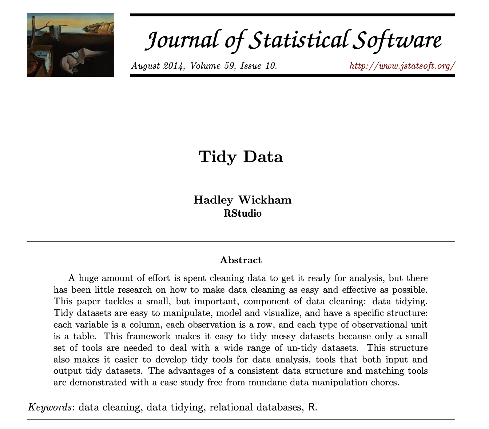
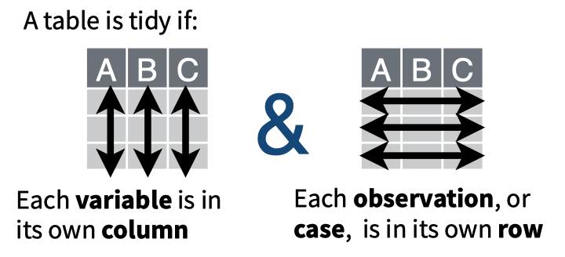
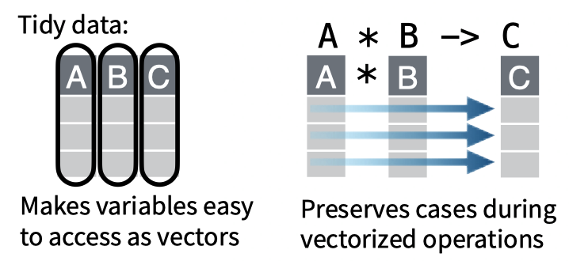
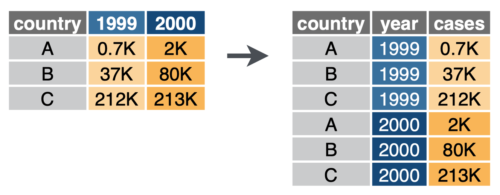
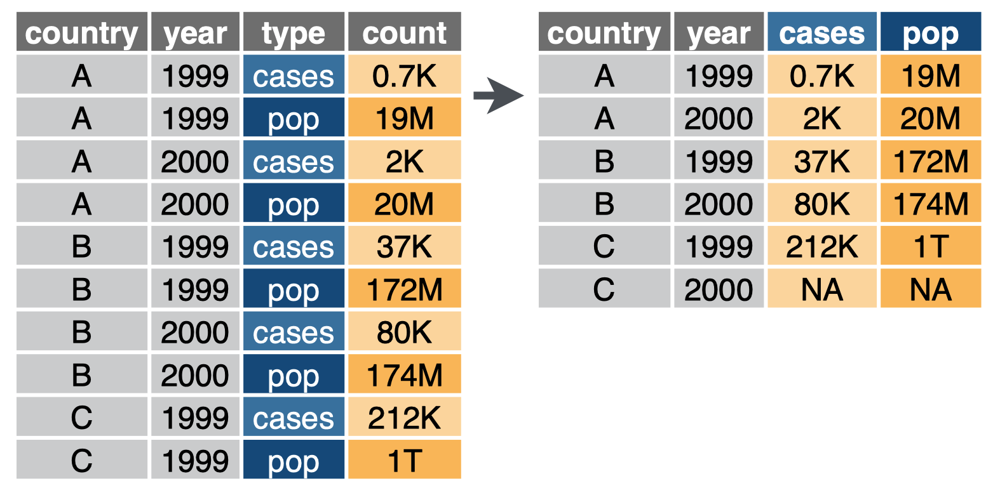

```{css, echo=FALSE} 
@media print { # print out incremental slides; see https://stackoverflow.com/questions/56373198/get-xaringan-incremental-animations-to-print-to-pdf/56374619#56374619
  .has-continuation {
    display: block !important;
  }
}
```

```{r setup, include=FALSE}
# figures formatting setup
options(htmltools.dir.version = FALSE)
library(knitr)
opts_chunk$set(
  prompt = T,
  fig.align="center", #fig.width=6, fig.height=4.5, 
  # out.width="748px", #out.length="520.75px",
  dpi=300, #fig.path='Figs/',
  cache=T, #echo=F, warning=F, message=F
  engine.opts = list(bash = "-l")
  )

## Next hook based on this SO answer: https://stackoverflow.com/a/39025054
knit_hooks$set(
  prompt = function(before, options, envir) {
    options(
      prompt = if (options$engine %in% c('sh','bash')) '$ ' else 'R> ',
      continue = if (options$engine %in% c('sh','bash')) '$ ' else '+ '
      )
})
```


# Table of contents

1. [Tidyverse basics](#basics)<sup>1</sup>

2. [Pipes](#pipes)

3. [Data wrangling with dplyr](#dplyr)

4. [Data tidying with tidyr](#tidyr)

5. [Tidy programming](#programming)

6. [Coding style](#style)

7. [Summary](#summary)

.footnote[<sup>1</sup> Parts of this lecture draws on materials from Grant McDermott's excellent [*Data Science for Economists*](https://github.com/uo-ec607/lectures) class.]

---
class: inverse, center, middle
name: basics

# Tidyverse basics

<html><div style='float:left'></div><hr color='#EB811B' size=1px style="width:1000px; margin:auto;"/></html>

---

# What is the tidyverse?

.pull-left[
### R packages for data science

- Let's take it from the [tidyverse website](https://www.tidyverse.org/):

**"The tidyverse is an opinionated collection of R packages designed for data science. All packages share an underlying design philosophy, grammar, and data structures."**

- It's the contribution of many people of the R community.
- [Hadley Wickham](http://hadley.nz/) had a key role in shaping it by developing many of the core packages, such as `ggplot2`, `dplyr`, `tidyr`, `tibble`, and `stringr`.
- Install the complete tidyverse with:

```{r, eval = FALSE}
install.packages("tidyverse")
```
]

.pull-right-center[
<div align="center">

</div>
<div align="center">

</div>
Hadley Wickham
]

---

# A guide to the tidyverse

.pull-left[
### Valuable resources

- [Welcome to the Tidyverse](https://tidyverse.tidyverse.org/articles/paper.html), a quick overview from many tidyverse contributors)
- [Tidy data](https://vita.had.co.nz/papers/tidy-data.pdf), a foundational paper on data wrangling and structuring, by Hadley Wickham, 2014, *Journal of Statistical Software*; check [here](https://cran.r-project.org/web/packages/tidyr/vignettes/tidy-data.html) for a hands-on vignette based on the `tidyr` package
- [The tidyverse design guide](https://design.tidyverse.org/), a (soon-to-be book) manifesto to promote design consistency across the tidyverse
- [R for Data Science](https://r4ds.had.co.nz/), our main textbook for this course
]

.pull-right-center[
<div align="center">

</div>
<div align="center">

</div>
]


---

# Tidyverse packages

### Loading the tidyverse

```{r tverse, cache = FALSE}
library(tidyverse)
```

--

- We see that we have actually loaded a number of packages (which could also be loaded individually): `ggplot2`, `tibble`, `dplyr`, etc.
- We can also see information about the package versions and some namespace conflicts.


---

# Tidyverse packages *cont.*

- In addition to the currently 8 core packages, the tidyverse includes many others for more specialized usage.<sup>1</sup>
- See [here](https://www.tidyverse.org/packages/) for an overview, or just in R directly:

```{r tverse_pkgs}
tidyverse_packages()
```

.footnote[
<sup>1</sup> It also includes a *lot* of dependencies upon installation. This is a matter of some [controversy](http://www.tinyverse.org/).
]

--

- We'll use several of these additional packages during the remainder of this course (e.g., the `lubridate` package for working with dates and the `rvest` package for web scraping).
- However, bear in mind that these packages will have to be loaded separately.


---

# The tidyverse philosophy

### Key philosophy for tidy data

1. Each variable forms a column.
2. Each observation forms a row.
3. Each type of observational unit forms a table.

Basically, tidy data is more likely to be [long (i.e. narrow) format](https://en.wikipedia.org/wiki/Wide_and_narrow_data) than wide format.

--

### More unifying principles

- Today, the tidyverse stands for more than just "tidy data".
- It is guided by the principles of being **human centered**, **consistent**, **composable**, and **inclusive**.
- We will learn about these [unifying principles](https://design.tidyverse.org/unifying-principles.html) inductively when working with more and more tidyverse packages.
- Later today, we will learn about [tidyverse style principles])(https://style.tidyverse.org/) of low-level code formatting.

--

### Resources

Check out the [tidyverse design guide](https://design.tidyverse.org/) for a comprehensive treatment of the tidyverse philosophy. 


---
# Tidyverse vs. base R

<div align="center">

</div>


---

# Tidyverse vs. base R: what's the difference?

- Both are compatible. You can wrangle your data with `dplyr`, plot it with `ggplot2`, and model it with yet another package.
- Ultimately, the tidyverse is just a bunch of (hugely popular!) packages that share design principles.
- Often, tidyverse packages don't reinvent the wheel. Instead, they offer more consistency in naming, arguments, and output (among other things).
- For instance, compare function naming principles (`tidyverse::snake_case` vs `base::period.case` rule; more on these conventions later) in these examples:

| tidyverse  |  base |
|---|---|
| `?readr::read_csv`  | `?utils::read.csv` |
|  `?dplyr::if_else` |  `?base::ifelse` |
|  `?tibble::tibble` |  `?base::data.frame` |

- If you call up the above examples, you'll see that the tidyverse alternative typically offers some enhancements or other useful options (and sometimes restrictions) over its base counterpart.

--

- And **remember:** There are (almost) always multiple ways to achieve a single goal in R.


---

# Tidyverse vs. base R: what's the difference? *cont.*

.pull-left-center[
**Tidyverse**

<div align="center">

</div>

`Credit` [sawiki.com](https://www.sakwiki.com/tiki-index.php?page=Craftsman)
]

--

.pull-right-center[
**Base R**
<div align="center">

</div>

`Credit` [multimedialab.be](http://www.multimedialab.be/doc/images/index.php?album=design&image=2007_Wenger_Giant_Swiss_Knife_2007.jpg)

]


---

# Tidyverse vs. base R: what to use?

.pull-left[
### Stories from the past

- When I started to learn R ~13 years ago, there was no tidyverse. The learning curve felt much steeper. I often switched back to Stata for data wrangling.
- As the tidyverse grew, R became more convenient to use for the entire research pipeline.
- There's simply no need for you to live through the same pain.

### Why we start with the tidyverse

- Because [clever people think it's the right way](http://varianceexplained.org/r/teach-tidyverse/).
- Documentation + community support are great.
- Having a consistent syntax makes it easier to learn.
]

--

.pull-right[

### You still will want to check out base R alternatives later

- Base R is extremely flexible and powerful (and stable).
- There are some things that you'll have to venture outside of the tidyverse for.
- A combination of tidyverse and base R is often the best solution to a problem.
- Excellent base R data manipulation tutorials: [here](https://www.rspatial.org/intr/index.html) and [here](https://github.com/matloff/fasteR).

]

---

# Now, let's get started with the tidyverse!


.pull-left[
### R packages you'll need today

  ☑ [**tidyverse**](https://www.tidyverse.org/)

  ☑ [**nycflights13**](hhttps://github.com/hadley/nycflights13)

You can install/update them both with the following command.

```{r, eval = FALSE}
install.packages(
  c('tidyverse', 'nycflights13'), 
  repos = 'https://cran.rstudio.com', 
  dependencies  = TRUE
)
```
]

.pull-right-center[
<br>
<div align="center">

</div>
]


---
class: inverse, center, middle
name: pipes

# Pipes

<html><div style='float:left'></div><hr color='#EB811B' size=1px style="width:1000px; margin:auto;"/></html>


---
class: inverse, center, middle

<div align="center">

</div>

`Credit` [likestowastetime/imgur](https://imgur.com/gallery/v2Mjdra)

---
# The pipe
<br><br><br><br><br>
<div align="center" class = "font750">
%>%
</div>

---

# Example

.pull-left[
**The pipe way**
```{r, eval = FALSE}
Alex %>%
  wake_up(7) %>%
  shower(temp = 38) %>%
  breakfast(c("coffee", "croissant")) %>%
  walk(step_function()) %>%
  bvg(
    train = "U2",
    destination = "Stadtmitte"
  ) %>%
  hertie(course = "Intro to DS")
```
]

.pull-right[
**The classic way**
```{r, eval = FALSE}
hertie(
  bvg(
    walk(
      breakfast(
        shower(
          wake_up(
            Alex, 7
          ),
          temp = 38
        ),
        c("coffee", "croissant")
      ),
      step_function()
    ),
    train = "U2",
    destination = "Stadtmitte"
  ),
  course = "Intro to DS"
)
```
]


---

# Example

.pull-left[
**The pipe way**
```{r, eval = FALSE}
Alex %>%
  wake_up(7) %>%
  shower(temp = 38) %>%
  breakfast(c("coffee", "croissant")) %>%
  walk(step_function()) %>%
  bvg(
    train = "U2",
    destination = "Stadtmitte"
  ) %>%
  hertie(course = "Intro to DS")
```
]

.pull-right[
**The classic way, nightmare edition**
```{r, eval = FALSE}
alex_awake <- wake_up(Alex, 7)
alex_showered <- shower(alex_awake, 
                        temp = 38)
alex_replete <- breakfast(alex_showered, 
                          c("coffee", "croissant"))
alex_underway <- walk(alex_replete, 
                      step_function())
alex_on_train <- bvg(alex_underway, 
                         train = "U2", 
                         destination = "Stadtmitte")
alex_hertie <- hertie(alex_on_train, 
                      course = "Intro to DS")
```
]

---

# The beauty of pipes

### A simple but powerful tool

- The forward-pipe operator `%>%` pipes the left-hand side values forward into expressions on the right-hand side.
- We replace `f(x)` with `x %>% f()`.

--

### Why piping is cool

- It structures sequences of data operations as pipes, i.e. left-to-right (as opposed to from the inside and out).
- It serves the natural way of reading ("do this, then this, then this, ...").
- It avoids nested function calls.
- It improves cognitive performance of code writers and readers.
- It minimizes the need for local variables and function definitions.

--

### Background

- The pipe was originally created in 2014 by [Stefan Milton Bache](https://stefanbache.dk/) and published with the [`magrittr`](https://magrittr.tidyverse.org/) package.
- Magrittr? [Get it?](https://en.wikipedia.org/wiki/The_Treachery_of_Images) 🤡
- The basics come with the tidyverse by default, but `magrittr` can do more (watch out for the "tee" pipe, `%T>%`, the "exposition" pipe, `%$%`, and the "assignment" pipe, `%<>%`). Also, be sure to check out [aliases](https://rdrr.io/cran/magrittr/man/aliases.html).


---

# Piping etiquette

### When to avoid the pipe

- Pipes are not very handy when you need to manipulate more than one object at a time. Reserve pipes for a sequence of steps applied to one primary object.
- Don't use the pipe when there are meaningful intermediate objects that can be given informative names (and that are used later on).

--

### Instead, here's how to use it

- `%>%` should always have a space before it, and should usually be followed by a new line.
- A one-step pipe can stay on one line, but unless you plan to expand it later on, you should consider rewriting it to a regular function call.
- `magrittr`allows you to omit `()` on functions that don't have arguments (as in `mydata %>% summary`). Avoid this feature.

---

# The base R pipe: |>

The magrittr pipe has proven so successful and popular that the R core team [recently added](https://stat.ethz.ch/R-manual/R-devel/library/base/html/pipeOp.html) a "native" pipe operator to base R (version 4.1), denoted `|>`.<sup>1</sup>

--

- Here's how it works:

```r
mtcars |> subset(cyl == 4) |> head()
mtcars |> subset(cyl == 4) |> (\(x) lm(mpg ~ disp, data = x))()
```

.footnote[<sup>1</sup> That's actually a `|` followed by a `>`. The default font on these slides just makes it look extra fancy.]

--

- This illustrates how the popularity of the tidyverse has repercussions on the development of base R.
- Note that with the native pipe, the RHS function has to be written out together with the brackets (i.e., `... |> head()` instead of `... |> head`).
- Also note the use of the new shorthand inline function syntax, `\(x)`, to pass content to the RHS but not to the first argument.
- Now, should we use the "magrittr" pipe or the native pipe? The native pipe might make more sense in the long term, since it avoids dependencies and might be more efficient. Check out [this Stackoverflow post](https://stackoverflow.com/questions/67633022/what-are-the-differences-between-rs-new-native-pipe-and-the-magrittr-pipe) for a discussion of differences.


---
class: inverse, center, middle
name: dplyr

# dplyr

<html><div style='float:left'></div><hr color='#EB811B' size=1px style="width:1000px; margin:auto;"/></html>

---

# Key dplyr verbs

.pull-left-wide[
There are five key `dplyr` verbs that you need to learn.<sup>1</sup>

1. `filter()`: Filter (i.e. subset) rows based on their values.

2. `arrange()`: Arrange (i.e. reorder) rows based on their values.

3. `select()`: Select (i.e. subset) columns by their names.

4. `mutate()`: Create new columns.

5. `summarize()`: Collapse multiple rows into a single summary value.<sup>2</sup>

But let's start with studying the key commands using the `starwars` dataset that comes pre-packaged with `dplyr`. 

]


.footnote[
<sup>1</sup> There is much, much more in `dplyr`, and we will look beyond these core functions later. Have a glimpse at the [overview at tidyverse.org](https://dplyr.tidyverse.org/) and at this excellent [cheat sheet](https://github.com/rstudio/cheatsheets/blob/master/data-transformation.pdf).
</br>
<sup>2</sup> `summarize()` with an "s" works too. I slightly prefer the barbarian version though.
]


.pull-right-small-center[
<div align="center">
<br>

</div>
]


---
name: filter

# 1) dplyr::filter()

We can chain multiple filter commands with the pipe (`%>%`), or just separate them within a single filter command using commas.

```{r filter1}
starwars %>% 
  filter( 
    species == "Human", 
    height >= 190
    ) 
```

---

# 1) dplyr::filter() *cont.*

Regular expressions work well, too.
```{r filter2}
starwars %>% 
  filter(stringr::str_detect(name, "Skywalker"))
```

---

# 1) dplyr::filter() *cont.*

A very common `filter()` use case is identifying (or removing) missing data cases. 
```{r filter3}
starwars %>% 
  filter(is.na(height))
```

--

To remove missing observations, simply use negation: `filter(!is.na(height))`.


---

# 1) dplyr::filter() *cont.*

Importantly, when we list several filter conditions, `filter()` interprets them as a Boolean "AND". 

```{r filter4}
starwars %>% 
  filter(str_detect(name, "Skywalker"), 
                    eye_color == "blue")
```

--

We can work with operators `|` ("OR") and `&` ("AND") and combine them with parentheses to specify more complex filter commands, as in:

```{r filter5, eval = FALSE}
starwars %>% 
  filter(species == "Wookiee" | (species == "Human" & height >= 200))
```


---

# 2) dplyr::arrange()

`arrange()` sorts observations in increasing order by default.

```{r arrange1}
starwars %>% 
  arrange(birth_year)
```

--

*Note:* Arranging on a character-based column (i.e. strings) will sort alphabetically.

---

# 2) dplyr::arrange() *cont.*

We can also arrange items in descending order using `arrange(desc())`.

```{r arrange2}
starwars %>% 
  arrange(desc(birth_year))
```

---
name: select

# 3) dplyr::select()

Use commas to select multiple columns out of a data frame. (You can also use `<first>:<last>` for consecutive columns). Deselect a column with "-".

```{r select1}
starwars %>% 
  select(name:skin_color, species, -height)
```

---

# 3) dplyr::select() *cont.*

You can also rename some (or all) of your selected variables in place.
```{r select2}
starwars %>%
  select(alias = name, crib = homeworld, sex = gender) 
```

--

If you just want to rename columns without subsetting them, you can use `rename()`.

---

# 3) dplyr::select() *cont.*

The `select(contains(<PATTERN>))` option provides a nice shortcut in relevant cases.
```{r select3}
starwars %>% 
  select(name, contains("color"))
```

--

There are many more useful selection helpers, such as `starts_with()`, `ends_with()`, and `matches()`. See [here](https://dplyr.tidyverse.org/reference/select.html) for an overview.

---

# 3) dplyr::select() *cont.*

The `select(..., everything())` option is another useful shortcut if you only want to bring some variable(s) to the "front" of a data frame.

```{r select4}
starwars %>% 
  select(species, homeworld, everything()) %>%
  head(5)
```

--

</br>
*Note:* The new `relocate()` function available in dplyr 1.0.0 has brought a lot more functionality to the ordering of columns. See [here](https://www.tidyverse.org/blog/2020/03/dplyr-1-0-0-select-rename-relocate/).


---

# 4) dplyr::mutate()

You can create new columns from scratch with `mutate()`, or (more commonly) as transformations of existing columns.

```{r mutate2}
starwars %>% 
  select(name, birth_year) %>%
  mutate(
    dog_years = birth_year * 7, ## Separate with a comma
    comment = paste0(name, " is ", dog_years, " in dog years.")
    ) %>%
  slice(1:6) # Just show first six observations
```

--

*Note:* `mutate()` is order aware. So you can chain multiple mutates in a single call.

---

# 4) dplyr::mutate() *cont.*

Boolean, logical and conditional operators all work well with `mutate()` too.
```{r mutate3}
starwars %>% 
  select(name, height) %>%
  filter(name %in% c("Luke Skywalker", "Anakin Skywalker")) %>% 
  mutate(tall1 = height > 180) %>%
  mutate(tall2 = ifelse(height > 180, "Tall", "Short")) ## Same effect, but can choose labels

```

---

# 4) dplyr::mutate() *cont.*

Lastly, combining `mutate()` with the `across()` feature allows you to easily work on a subset of variables. For example:

```{r, mutate4}
starwars %>% 
  select(name:eye_color) %>% 
  mutate(across(where(is.character), toupper)) %>% #<< 
  head(5)
```

--

</br>
*Note:* More on `across()` and `where()` later!

---
name: summarize

# 5) dplyr::summarize()

You can summarize variables with all sorts of operations (e.g., `mean()`, `median()`, `n()`, `n_distinct()`, `sum()`, `first()`, `last()`, ...).

```{r summ1}
starwars %>% 
  group_by(species, gender) %>% 
  summarize(mean_height = mean(height, na.rm = TRUE)) %>%
  head(5)
```

--

*Note:* This is particularly useful in combination with the `group_by()` command. Again, more on this later!


---

# 5) dplyr::summarize() *cont.*

Note that including `na.rm = TRUE` is usually a good idea with the functions fed into `summarize()` Otherwise, any missing value will propagate to the summarized value too.

```{r summ2}
## Probably not what we want
starwars %>% 
  summarize(mean_height = mean(height))
## Much better
starwars %>% 
  summarize(mean_height = mean(height, na.rm = TRUE))
```

---

# 5) dplyr::summarize() *cont.*

The same `across()`-based workflow that we saw with `mutate()` a few slides back also works with `summarize()`. For example:

```{r, summ4}
starwars %>% 
  group_by(species) %>% 
  summarize(across(where(is.numeric), mean, na.rm = TRUE)) %>%
  head(5)
```


---

# Grouping with dplyr::group_by()

With `group_by()`, you can create a "grouped" copy of a table grouped by unique values of a column. If multiple columns are specified, the function groups by all available combinations of values.

```{r, groupby1}
by_species_gender <- starwars %>% group_by(species, gender) 
by_species_gender
```

---

# Grouping with dplyr::group_by() *cont.*

.pull-left[
### More notes on grouping

- Grouping doesn't change how the data looks (apart from listing how it's grouped).
- Grouping changes how it acts with other dplyr verbs such as `summarize()` and `mutate()`, as we've already seen.
- By default, `group_by()` overrides existing grouping. Use `.add = TRUE` to append instead.
- By default, groups formed by factor levels that don't appear in the data are dropped. Set `.drop = FALSE` if you want to keep them.
- `ungroup()` removes existing grouping.
- `dplyr` notifies you about grouping variables every time you do operations on or with them. If you find these messages annoying, [switch them off](https://twitter.com/MattCowgill/status/1278463099272491008) with `options(dplyr.summarise.inform = FALSE)`.
]

.pull-right[
</br>
```{r, groupby2}
options(dplyr.summarise.inform = FALSE)
by_species_gender %>% 
  summarize(mean(height, na.rm = TRUE)) %>% 
  filter(n_distinct(gender) ==2)
```
]

---

# Other dplyr goodies

--

`slice()`: Subset rows by position rather than filtering by values. There's also `slice_sample()` to randomly select rows, `slice_head()` and `slice_tail()`to select first or last rows, and more.

```{r}
starwars %>% slice(c(1, 5))
```

--

`pull()`: Extract a column from as a data frame as a vector or scalar.

```{r}
starwars %>% filter(gender=="feminine") %>% pull(height)
```

---

# Other dplyr goodies *cont.*

`count()` and `distinct()`: Number and isolate unique observations.

```{r}
starwars %>% count(species) %>% head(6)
starwars %>% distinct(species) %>% pull() %>% sort() %>% magrittr::extract(1:5) 
```

--

You could also use a combination of `mutate()`, `group_by()`, and `n()`, e.g. `starwars %>% group_by(species) %>% mutate(num = n())`.

---

# Other dplyr goodies *cont.*

`where()`: Select the variables for which a function returns true.

```{r}
starwars %>% select(where(is.numeric)) %>% names()
```

--

`across()`: Summarize or mutate multiple variables in the same way. More information [here](https://dplyr.tidyverse.org/reference/across.html).

```{r}
starwars %>% 
  mutate(across(where(is.numeric), scale)) %>% 
  head(3)
```


---

# Other dplyr goodies *cont.*

`case_when()`: Vectorize multiple `if_else()` (or base R `ifelse()`) statements.

```{r}
starwars %>% 
  mutate( 
    height_cat = case_when(
      height < 160 ~ "tiny",
      height >= 160 & height < 190 ~ "medium",
      height >= 190 & height < 220 ~ "tall",
      height >= 220 ~ "giant"
    )
  ) %>%
  pull(height_cat) %>% table()
```

--

There are also a whole class of [window functions](https://cran.r-project.org/web/packages/dplyr/vignettes/window-functions.html) for getting leads and lags, ranking, creating cumulative aggregates, etc. See `vignette("window-functions")`.

--

`inner_join()`, `left_join()`, `right_join()`: Enough already, we'll talk about this in the next session!


---
class: inverse, center, middle
name: tidyr

# tidyr

<html><div style='float:left'></div><hr color='#EB811B' size=1px style="width:1000px; margin:auto;"/></html>

---

# Key tidyr verbs

.pull-left-wide[

`tidyr` is part of the core tidyverse. There are four key `tidyr`verbs that you need to learn.

1. `pivot_longer()`: Pivot wide data into long format (i.e. "melt").<sup>1</sup> 

2. `pivot_wider()`: Pivot long data into wide format (i.e. "cast").<sup>2</sup> 

3. `separate()`: Separate (i.e. split) one column into multiple columns.

4. `unite()`: Unite (i.e. combine) multiple columns into one.

.footnote[
<sup>1</sup> Updated version of `tidyr::gather()`.

<sup>2</sup> Updated version of `tidyr::spread()`.
]  

]

.pull-right-small-center[
<div align="center">
<br>

</div>
]


---

# On "longer" and "wider" datasets

.pull-left-wide[
Remember the **key philosophy for tidy data**?

1. Each variable forms a column.
2. Each observation forms a row.
3. Each type of observational unit forms a table.

One of the most common tasks for data scientists is to **reshape** data from one form to the other. 

There are **multiple ways to store the same data in a dataset** (or in across multiple tables; but more on that in the next session).

Here, we learn how to shift between 
- **"wider"** formats, i.e. data being stored across more columns and
- **"longer"** formats, i.e. data being stored across more rows.
]

.pull-right-small-center[
<div align="center">
</br>
Tidy data in a nutshell

</br>
</br>
Benefits of tidy data

</div>
]

---

# From wide to long to wide

.pull-left-wide[

### From wider to longer

- `pivot_longer()` pivots `cols` columns, moving column names into a `names_to`column, and column values into a `values_to`column.
- Recall a panel study design with multiple observations per unit.
- In the classical long format, each row represents one observation.
- Note how this is approaching the ideal of **tidy data**.

### From longer to wider

- `pivot_wider()` pivots a `names_from` and a `values_from` column into a rectangular field of cells.
- In a panel study design, this would allow you to have one variable per measurement (e.g., pre- and posttreatment outcome variable).
- While this is nice for the human eye, it is sometimes not what fits the tidyverse workflow. Also, wenn you have multiple repeated measurements (think: variables in a population survey), the number of columns is quickly inflated. Be ready to `pivot_longer()`. 
]

.pull-right-small-center[
`pivot_longer()`
<div align="center">

</br>
</br>
</br>
</div>

`pivot_wider()`
<div align="center">

</div>
]


---

# 1) tidyr::pivot_longer()

```{r pivot_longer1a}
stocks = data.frame( ## Could use "tibble" instead of "data.frame" if you prefer
  time = as.Date('2009-01-01') + 0:1,
  X = rnorm(2, 0, 1),
  Y = rnorm(2, 0, 2),
  Z = rnorm(2, 0, 4)
  )
stocks
```

--

```{r pivot_longer1b}
tidy_stocks <- stocks %>% pivot_longer(-time, names_to="stock", values_to="price")
tidy_stocks
```


---
name: pivot_wider

# 2) tidyr::pivot_wider()

```{r pivot_wider1a, dependson=tidy_stocks}
tidy_stocks %>% pivot_wider(names_from = stock, values_from = price)
```

--

```{r pivot_wider1b, dependson=tidy_stocks}
tidy_stocks %>% pivot_wider(names_from= time, values_from = price)
```


--

</br>
*Note:* The second example &mdash; which has combined different pivoting arguments &mdash; has effectively transposed the data.

---
name: separate

# 3) tidyr::separate()

Sometimes, cell values provide information that should be stored in separate columns. `separate()` offers one way of doing this. (*Side note*: Once you learn regular expressions, you will have an even more powerful tool for this task.)

```{r sep1a}
economists = data.frame(name = c("Adam.Smith", "Paul.Samuelson", "Milton.Friedman"))
economists
```

--

`separate()` in action: 

```{r sep1b}
economists %>% separate(name, c("first_name", "last_name")) 
```

--

You can also specify the separation character with `separate(..., sep=".")`. The way `sep` works also depends on column typ (character vs. numberic). Check out the [function reference](https://tidyr.tidyverse.org/reference/separate.html).


---

# 3) tidyr::separate() *cont.*

A related function is `separate_rows()`, for splitting up cells that contain multiple fields or observations (a frustratingly common occurence with survey data).

```{r sep2a}
jobs = data.frame(
  name = c("Jack", "Jill"),
  occupation = c("Homemaker", "Philosopher, Philanthropist, Troublemaker") 
  ) 
jobs
```

--

`separate_rows()` in action: 

```{r sep2b}
jobs %>% separate_rows(occupation)
```


---
name: unite

# 4) tidyr::unite()

`separate()` has a complementary function, `unite()`. Unsurprinsingly, it unites values from multiple columns into one.

```{r unite1}
gdp = data.frame(
  yr = rep(2016, times = 3),
  mnth = rep(1, times = 3),
  dy = 1:3,
  gdp = rnorm(3, mean = 100, sd = 2)
  )
gdp 
## Combine "yr", "mnth", and "dy" into one "date" column
gdp %>% unite(date, c("yr", "mnth", "dy"), sep = "-")
```

---

# 4) tidyr::unite() *cont.*

.pull-left[
Note that `unite()` will automatically create a character variable. You can see this better if we convert it to a tibble. 
```{r unite2}
gdp_u = gdp %>% 
  unite(date, 
        c("yr", "mnth", "dy"), 
        sep = "-") %>% 
  as_tibble()
gdp_u
```
]

--

.pull-right[
If you want to convert it to something else (e.g. date or numeric) then you will need to modify it using `mutate()`. See below for an example, using the [lubridate](https://lubridate.tidyverse.org/) package's super helpful date conversion functions.

```{r unite3, message=F}
library(lubridate)
gdp_u %>% mutate(date = ymd(date))
```
]

---

# Other tidyr goodies

`crossing()`: Get the full combination of a group of variables.<sup>1</sup>

```{r cross1}
crossing(side=c("left", "right"), height=c("top", "bottom"))
```

.footnote[
<sup>1</sup> See `?expand()` and `?complete()` for more specialized functions that allow you to fill in (implicit) missing data or variable combinations in existing data frames. Base R alternative: `expand.grid()`.
]  

--

`drop_na(data, ...)`: Drop rows containing NAs in `...` columns.

--

`fill(data, ..., direction = c("down", "up"))`: Fill in NAs in `...` columns with most recent non-NA values.


---
class: inverse, center, middle
name: programming

# Tidy programming

<html><div style='float:left'></div><hr color='#EB811B' size=1px style="width:1000px; margin:auto;"/></html>


---

# Tidy programming basics

"Tidy programming" is not a strictly defined practice in the tidyverse. However, there are some common programming strategies that help you keep your code and workflow tidy. These include:

- Pipes (you already know that ✅)
- User-generated functions
- Functional programming with `purrr`

--

The latter two are extremely helpful - in particular when you are confronted with iterative tasks.

--

We will now learn the basics of creating your own functions and functional programming with R. There is much more to learn about these topics, so we will revisit them as the course progresses.

---

# Creating functions

### Why creating functions?

That's a legit question. There are 18,000+ **packages** on CRAN (and many, many more on GitHub and other repositories) containing zillions of functions. Why should you create yet another one?
- Every data science project is unique. There are problems only you have to solve. 
- For problems that are repetitive, you'll quickly look for options to automate the task.
- Functions are a great way to automate.

--

### Examples where creating functions makes sense

--

1. You want to scrape thousands of websites. This implies multiple steps, from downloading to parsing and cleaning. All these steps can be achieved with existing functions, but the fine-tuning is specific to the set of websites. You build one (or a set of) scraping functions that take the websites as input and return a cleaned data frame ready to be analyzed.

--

2. You want to estimate not one but multiple models on your dataset. The models vary both in terms of data input and specification. Again, based on existing modeling functions you tailor your own, allowing you to run all these models automatically and to parse the results into one clean data frame.

---

# Basic syntax

.pull-left[
Writing your own function in R is easy with the `function()` function<sup>1</sup>. The basic syntax is as follows:

```{r, eval = FALSE}
my_func <- function(ARGUMENTS) {
    OPERATIONS
    return(VALUE)
  }
```

.footnote[<sup>1</sup> Yes, a function to create functions. 🤯]
]

---

# Basic syntax

.pull-left[
Writing your own function in R is easy with the `function()` function<sup>1</sup>. The basic syntax is as follows:

```{r, eval = FALSE}
my_func <- function(ARGUMENTS) { #<<
    OPERATIONS
    return(VALUE)
  }
```

- We write functions to apply them later. So, we have to give them a name. Here, we name it "`my_func`".
- Also, our function (almost) always needs input, plus we want to specify how exactly the function should behave. We can use arguments for this, which are specified as arguments of the `function()` function.

.footnote[<sup>1</sup> Yes, a function to create functions. 🤯]
]

---

# Basic syntax

.pull-left[
Writing your own function in R is easy with the `function()` function<sup>1</sup>. The basic syntax is as follows:

```{r, eval = FALSE}
my_func <- function(ARGUMENTS) {
    OPERATIONS #<<
    return(VALUE)
  }
```

- Next, we specify anything we want the function to to.
- This comes in between curly brackets, `{...}`.
- Importantly, we can recycle arguments by calling them by their name.

.footnote[<sup>1</sup> Yes, a function to create functions. 🤯]
]

---

# Basic syntax

.pull-left[
Writing your own function in R is easy with the `function()` function<sup>1</sup>. The basic syntax is as follows:

```{r, eval = FALSE}
my_func <- function(ARGUMENTS) {
    OPERATIONS 
    return(VALUE) #<<
  }
```

- Finally, we specify what the function should return. 
- This could be a list, data.frame, vector, sentence - or anything else really.

.footnote[<sup>1</sup> Yes, a function to create functions. 🤯]
]

---

# Basic syntax

.pull-left[
Writing your own function in R is easy with the `function()` function<sup>1</sup>. The basic syntax is as follows:

```{r, eval = FALSE}
my_func <- function(ARGUMENTS) {
    OPERATIONS 
    return(VALUE) 
  } #<<
```

- Oh, and don't forget to close the curly brackets...

.footnote[<sup>1</sup> Yes, a function to create functions. 🤯]
]

---

# Basic syntax

.pull-left[
Writing your own function in R is easy with the `function()` function<sup>1</sup>. The basic syntax is as follows:

```{r, eval = FALSE}
my_func <- function(ARGUMENTS) {
    OPERATIONS 
    return(VALUE) 
  } 
```

.footnote[<sup>1</sup> Yes, a function to create functions. 🤯]
]

.pull-right[
Let's try it out with a simple example function - one that converts temperatures from [Fahrenheit to Celsius](https://en.wikipedia.org/wiki/Conversion_of_scales_of_temperature#Fahrenheit):<sup>2</sup>

```{r, eval = FALSE}
fahrenheit_to_celsius <- function(temp_F) {
  temp_C <- (temp_F - 32) * (5/9)
  return(temp_C)
}
```

.footnote[<sup>2</sup> Courtesy of [Software Carpentry](https://swcarpentry.github.io/r-novice-inflammation/02-func-R/).]

]

---

# Basic syntax

.pull-left[
Writing your own function in R is easy with the `function()` function<sup>1</sup>. The basic syntax is as follows:

```{r, eval = FALSE}
my_func <- function(ARGUMENTS) {
    OPERATIONS 
    return(VALUE) 
  } 
```

.footnote[<sup>1</sup> Yes, a function to create functions. 🤯]
]

.pull-right[
Let's try it out with a simple example function - one that converts temperatures from [Fahrenheit to Celsius](https://en.wikipedia.org/wiki/Conversion_of_scales_of_temperature#Fahrenheit):<sup>2</sup>

```{r, eval = FALSE}
fahrenheit_to_celsius <- function(temp_F) { #<<
  temp_C <- (temp_F - 32) * (5/9)
  return(temp_C)
}
```

- Our function has an intuitive name.
- Also, it takes just one thing as input, which we call `temp_F`.

.footnote[<sup>2</sup> Courtesy of [Software Carpentry](https://swcarpentry.github.io/r-novice-inflammation/02-func-R/).]

]

---

# Basic syntax

.pull-left[
Writing your own function in R is easy with the `function()` function<sup>1</sup>. The basic syntax is as follows:

```{r, eval = FALSE}
my_func <- function(ARGUMENTS) {
    OPERATIONS 
    return(VALUE) 
  } 
```

.footnote[<sup>1</sup> Yes, a function to create functions. 🤯]
]

.pull-right[
Let's try it out with a simple example function - one that converts temperatures from [Fahrenheit to Celsius](https://en.wikipedia.org/wiki/Conversion_of_scales_of_temperature#Fahrenheit):<sup>2</sup>

```{r, eval = FALSE}
fahrenheit_to_celsius <- function(temp_F) {
  temp_C <- (temp_F - 32) * (5/9)  #<<
  return(temp_C)
}
```

- We now take up the argument `temp_F`, do something with it, and store the output in a new object, `temp_C`.
- Importantly, that object only lives within the function. When the function is run, we cannot access it from the environment.


.footnote[<sup>2</sup> Courtesy of [Software Carpentry](https://swcarpentry.github.io/r-novice-inflammation/02-func-R/).]

]

---

# Basic syntax

.pull-left[
Writing your own function in R is easy with the `function()` function<sup>1</sup>. The basic syntax is as follows:

```{r, eval = FALSE}
my_func <- function(ARGUMENTS) {
    OPERATIONS 
    return(VALUE) 
  } 
```

.footnote[<sup>1</sup> Yes, a function to create functions. 🤯]
]

.pull-right[
Let's try it out with a simple example function - one that converts temperatures from [Fahrenheit to Celsius](https://en.wikipedia.org/wiki/Conversion_of_scales_of_temperature#Fahrenheit):<sup>2</sup>

```{r, eval = FALSE}
fahrenheit_to_celsius <- function(temp_F) {
  temp_C <- (temp_F - 32) * (5/9)
  return(temp_C)   #<<
}
```

- Finally, the output is returned.


.footnote[<sup>2</sup> Courtesy of [Software Carpentry](https://swcarpentry.github.io/r-novice-inflammation/02-func-R/).]

]

---

# Basic syntax

.pull-left[
Writing your own function in R is easy with the `function()` function<sup>1</sup>. The basic syntax is as follows:

```{r, eval = FALSE}
my_func <- function(ARGUMENTS) {
    OPERATIONS 
    return(VALUE) 
  } 
```

.footnote[<sup>1</sup> Yes, a function to create functions. 🤯]
]

.pull-right[
Let's try it out with a simple example function - one that converts temperatures from [Fahrenheit to Celsius](https://en.wikipedia.org/wiki/Conversion_of_scales_of_temperature#Fahrenheit):

```{r, eval = TRUE}
fahrenheit_to_celsius <- function(temp_F) {
  temp_C <- (temp_F - 32) * (5/9)
  return(temp_C)
}
```

Now, let's try out the function:
{{content}}
]

--

```{r, eval = TRUE}
fahrenheit_to_celsius(451)
```
{{content}}

--

Pretty hot, isn't it?
{{content}}

---

# Functions: default argument values, if(), else()

.pull-left[

Let's make the function a bit more complex, but also more fun.
]

.pull-right[

```{r, eval = FALSE}
temp_convert <- 
  function(temp, from = "f") {
  if (!(from %in% c("f", "c"))){ 
    stop("No valid input 
          temperature specified.")
  }
  if (from == "f") {
    out <- (temp - 32) * (5/9)
  } else {
    out <- temp * (9/5) + 32
  }
  if((from == "c" & temp > 30) | 
     (from == "f" & out > 30)) {
    message("That's damn hot!")
  }else{
    message("That's not so hot.")
  }
  return(out) # return temperature
}
```
]

---

# Functions: default argument values, if(), else()

.pull-left[

Let's make the function a bit more complex, but also more fun.

- By giving `from` a default value (`"f"`), we ensure that the function returns valid output when only the key input, `temp`, is provided.
]

.pull-right[

```{r, eval = FALSE}
temp_convert <- 
  function(temp, from = "f") { #<<
  if (!(from %in% c("f", "c"))){ 
    stop("No valid input 
          temperature specified.")
  }
  if (from == "f") {
    out <- (temp - 32) * (5/9)
  } else {
    out <- temp * (9/5) + 32
  }
  if((from == "c" & temp > 30) | 
     (from == "f" & out > 30)) {
    message("That's damn hot!")
  }else{
    message("That's not so hot.")
  }
  return(out) # return temperature
}
```
]


---

# Functions: default argument values, if(), else()

.pull-left[

Let's make the function a bit more complex, but also more fun.

- By giving `from` a default value (`"f"`), we ensure that the function returns valid output when only the key input, `temp`, is provided.
- `if() {...}` allows us to make conditional statements. Here, we test for the validity of the input for argument `from`.

]

.pull-right[

```{r, eval = FALSE}
temp_convert <- 
  function(temp, from = "f") { 
  if (!(from %in% c("f", "c"))){ #<<
    stop("No valid input 
          temperature specified.")
  }
  if (from == "f") {
    out <- (temp - 32) * (5/9)
  } else {
    out <- temp * (9/5) + 32
  }
  if((from == "c" & temp > 30) | 
     (from == "f" & out > 30)) {
    message("That's damn hot!")
  }else{
    message("That's not so hot.")
  }
  return(out) # return temperature
}
```
]


---

# Functions: default argument values, if(), else()

.pull-left[

Let's make the function a bit more complex, but also more fun.

- By giving `from` a default value (`"f"`), we ensure that the function returns valid output when only the key input, `temp`, is provided.
- `if() {...}` allows us to make conditional statements. Here, we test for the validity of the input for argument `from`.
- If the condition is not met, the function breaks and prints a message.

]

.pull-right[

```{r, eval = FALSE}
temp_convert <- 
  function(temp, from = "f") { 
  if (!(from %in% c("f", "c"))){ 
    stop("No valid input 
          temperature specified.") #<<
  }
  if (from == "f") {
    out <- (temp - 32) * (5/9)
  } else {
    out <- temp * (9/5) + 32
  }
  if((from == "c" & temp > 30) | 
     (from == "f" & out > 30)) {
    message("That's damn hot!")
  }else{
    message("That's not so hot.")
  }
  return(out) # return temperature
}
```
]

---

# Functions: default argument values, if(), else()

.pull-left[

Let's make the function a bit more complex, but also more fun.

- By giving `from` a default value (`"f"`), we ensure that the function returns valid output when only the key input, `temp`, is provided.
- `if() {...}` allows us to make conditional statements. Here, we test for the validity of the input for argument `from`.
- If the condition is not met, the function breaks and prints a message.
- We `else()` we specify what to do if the `if()` condition is not met.
]

.pull-right[

```{r, eval = FALSE}
temp_convert <- 
  function(temp, from = "f") { 
  if (!(from %in% c("f", "c"))){ 
    stop("No valid input 
          temperature specified.")
  }
  if (from == "f") {
    out <- (temp - 32) * (5/9)
  } else {  #<<
    out <- temp * (9/5) + 32
  }
  if((from == "c" & temp > 30) | 
     (from == "f" & out > 30)) {
    message("That's damn hot!")
  }else{
    message("That's not so hot.")
  }
  return(out) # return temperature
}
```
]

---

# Functions: default argument values, if(), else()

.pull-left[

Let's make the function a bit more complex, but also more fun.

- By giving `from` a default value (`"f"`), we ensure that the function returns valid output when only the key input, `temp`, is provided.
- `if() {...}` allows us to make conditional statements. Here, we test for the validity of the input for argument `from`.
- If the condition is not met, the function breaks and prints a message.
- We `else()` we specify what to do if the `if()` condition is not met.
- Make R more talkative with `message()`. Future-You will like it!
]

.pull-right[

```{r, eval = FALSE}
temp_convert <- 
  function(temp, from = "f") { 
  if (!(from %in% c("f", "c"))){ 
    stop("No valid input 
          temperature specified.")
  }
  if (from == "f") {
    out <- (temp - 32) * (5/9)
  } else {  
    out <- temp * (9/5) + 32
  }
  if((from == "c" & temp > 30) | 
     (from == "f" & out > 30)) {
    message("That's damn hot!") #<<
  }else{
    message("That's not so hot.") #<<
  }
  return(out) # return temperature
}
```
]

---

# Functional programming

R is a functional language. It encourages to use and build your own functions to solve problems. Often, this implies decomposing a large problem into small pieces, and solving each of them with independent functions.

There is much more to learn about functions and [functional programming](https://en.wikipedia.org/wiki/Functional_programming). Useful resources include:

- The chapter on functions in [R for Data Science](https://r4ds.had.co.nz/functions.html).
- The section on functional programming in [Advanced R](https://adv-r.hadley.nz/fp.html).
- The [R packages](https://r-pkgs.org/) book, which we will turn to later in more detail. In a way, bundling functions in a package is sometimes the next logical step.


---

# Iteration

### The ubiquity of iteration

- Often we have to run the same task over and over again, with minor variations. Examples:
  - Standardize values of a variable
  - Recode all numeric variables in a dataset
  - Running multiple models with varying covariate sets
- A benefit of scripting languages in data (as opposed to point-and-click solutions) is that we can easily automate the process of iteration

--

### Ways to iterate

- A simple approach is to copy-and-paste code with minor modifications (→ "[duplicate code](https://en.wikipedia.org/wiki/Duplicate_code)", → "[copy-and-paste programming](https://en.wikipedia.org/wiki/Copy-and-paste_programming)"). This is lazy, error-prone, not very efficient, and violates the "[Don't repeat yourself](https://en.wikipedia.org/wiki/Don%27t_repeat_yourself)" (DRY) principle. 
- In R, [vectorization](https://adv-r.hadley.nz/perf-improve.html#vectorise), that is applying a function to every element of a vector at once, already does a good share of iteration for us.
- `for()` [loops](https://r4ds.had.co.nz/iteration.html) are intuitive and straightforward to build, but sometimes not very efficient.
- Finally, we learned about functions. Now, we learn how to unleash their power by applying them to anything we interact with in R at scale.


---

# Iteration with purrr

.pull-left-wide[

### The tidyverse way to iterate

- For *real* functional programming in base R, we can use the `*apply()` family of functions (`lapply()`, `sapply()`, etc.). See [here](https://nsaunders.wordpress.com/2010/08/20/a-brief-introduction-to-apply-in-r/) for an excellent summary.
- In the tidyverse, this functionality comes with the `purrr` package.
- At its core is the `map*()` family of functions. 


### How `purrr` works

- The idea is always to **apply** a function to **x**, where x can be a list, vector, data.frame, or something more complex. 
- The output is then returned as output of a pre-defined type (e.g., a list).
- The set of `map()`-style functions is quite comprehensive; see this [cheat sheet](https://github.com/rstudio/cheatsheets/blob/master/purrr.pdf) for an overview.
]

.pull-right-small-center[
<div align="center">
<br>

</div>
]

---

# Iteration with purrr: map()

The `map*()` functions all follow a similar syntax:

<div align="center">
`map(.x, .f, ...)`
</div>

We use it to apply a function `.f`


Overview
The map functions https://r4ds.had.co.nz/iteration.html#the-map-functions
Mapping over multiple arguments https://r4ds.had.co.nz/iteration.html#mapping-over-multiple-arguments


---
class: inverse, center, middle
name: style

# Coding style

<html><div style='float:left'></div><hr color='#EB811B' size=1px style="width:1000px; margin:auto;"/></html>

---

# Coding style: the basics

### Why adhering to a particular style of coding?

- It reduces the number of arbitrary decisions you have to consciously make during coding. We make an arbitrary decision (convention) once, not always ad hoc.
- It provides consistency.
- It makes code easier to write.
- It makes code easier to read, especially in the long term (i.e. two days after you've closed a script).
	
--

### What are questions of style?

- Questions of style are a matter of opinion.
- We will mostly follow Hadley Wickham’s opinion as expressed in the "[tidyverse style guide](https://style.tidyverse.org/)".
- We'll consider how to
  - name,
  - comment,
  - structure, and
  - write.
  
---
# Naming things

**Surprisingly many things can go wrong with naming...**

.pull-left-center[
<br><br><br><br>
"There are only two hard things in Computer Science: cache invalidation and naming things." - *Phil Karlton*

<br>
`Credit` [karlton.org](https://www.karlton.org/2017/12/naming-things-hard/)
]

.pull-right-center[
<div align="center">
<br>
<b></b>
<br>

<br>
</div>

`Credit` [Mashable](https://in.mashable.com/tech/13755/elon-musk-announces-the-birth-of-his-baby-in-the-most-elon-musk-way-possible)
]


---

# Naming files

- Code file names should be meaningful and end in `.R`.
- Avoid using special characters in file names. Stick with numbers, letters, dashes (`-`), and underscores (`_`).
- Some examples:

```bash
# Good
fit_models.R
utility_functions.R

# Bad
fit models.R
foo.r
stuff.r
```

- If files should be run in a particular order, prefix them with numbers: 

```bash
00_download.R
01_explore.R
...
09_model.R
10_visualize.R
```

---

# Naming objects and variables

.pull-left[
- There are various conventions of how to write phrases without spaces or punctuation. Some of these have been adapted in programming, such as [camelCase](https://en.wikipedia.org/wiki/Camel_case), [PascalCase](https://techterms.com/definition/pascalcase), or [snake_case](https://en.wikipedia.org/wiki/Snake_case).
- The [`tidyverse`](https://style.tidyverse.org/syntax.html#object-names) way: Object and variable names should use only lowercase letters, numbers, and underscores.
- Examples:

```bash
# Good
day_one # snake_case
day_1 # snake_case

# Less good
dayOne # camelCase
DayOne # PascalCase
day.one # dot.case

# Dysfunctional
day-one # kebab-case
```
]

.pull-right-center[
<div align="center">
<br>

<br>
</div>

`Credit` [cassert24/Reddit](https://www.reddit.com/r/ProgrammerHumor/comments/cj5g0f/any_pascalcase_supports_out_there/)
]

---

# Naming functions

- In addition to following the general advice for object names, strive to use verbs for function names:

```bash
# Good
add_row()
permute()

# Bad
row_adder()
permutation()
```
- Also, try avoiding function names that already exist, in particular those that come with a loaded package.
- This often implies a trade-off between shortness and uniqueness. In any case, you would try to avoid situations that force you disambiguate functions with the same name (as in `dplyr::select`; see ["R packages"](https://r-pkgs.org/namespace.html)).
- Check out this [Wikipedia page](https://en.wikipedia.org/wiki/Naming_convention_(programming) or this [Stackoverflow post](https://stackoverflow.com/questions/17326185/what-are-the-different-kinds-of-cases) for more background on naming conventions in programming!

---
# Commenting on things

.pull-left[

### Why commenting at all?

- It’s often tempting to set up a project assuming that you will be the only person working on it, e.g. as homework. But that's almost never true. 
- You have project partners, co-authors, principals.
- Even if not, there's someone else who you always have to keep happy: Future-you.
- Comment often to make Future-you happy about Past-you by document what Present-You is doing/thinking/planning to do.
]

.pull-right-center[
<div align="center">
Past-you
<br>

<br>
Present-you
<br>

<br>
Future-you
<br>

<br>
</div>
]

---
# Commenting on things *cont.*

.pull-left[
### General advice

- Each line of a comment should begin with the comment symbol and a single space: `# `
- Use comments to record important findings and analysis decisions.
- If you need comments to explain what your code is doing, consider rewriting your code to be clearer. 
- But: comments can work well as "sub-headlines".
- If you discover that you have more comments than code, consider switching to R Markdown.
- (Longer) comments generally work better if they get their own line.

```{r, eval = FALSE}
# define job status
dat$at_work <- dat$job %in% c(2, 3)
dat$at_work <- dat$job %in% c(2, 3) # define job status
```
]

.pull-right[
### Giving structure

- Use commented lines together with dashes to break up your file into easily readable chunks.
- RStudio automatically detects these chunks and turns them into sections in the script outline.

```{r, eval = FALSE}
# Input/output ---------------------

# input
c("data/survey2021.csv")

#  output
c("survey_2021_cleaned.RData",
  "resp_ids.csv")

# Load data ------------------------

# Plot data ------------------------
```
]


---
# Other stuff

.pull-left[
- Use **spaces** generously, but not too generously. Always put a space after a comma, never before, just like in regular English.
- Use `<-`, not `=`, for **assignment**.
- For **logical operators**, prefer `TRUE` and `FALSE` over `T` and `F`.
- To facilitate readability, **keep your lines short**. Strive to limit your code to about 80 characters per line.
- If a **function call is too long** to fit on a single line, use one line each for the function name, each argument, and the closing bracket.
- Use **pipes**. When you use them, they should always have a space before it, and should usually be followed by a new line.
]

.pull-right[
 
**Spacing**
 
```{r, eval = FALSE} 
# Good
mean(x, na.rm = TRUE)
height <- (feet * 12) + inches

# Bad
mean(x,na.rm=TRUE) 
mean ( x, na.rm = TRUE )
height<-feet*12+inches
``` 

**Piping**
 
```{r, eval = FALSE} 
babynames %>%
  filter(name %>% equals("Kim")) %>%
  group_by(year, sex) %>%
  summarize(total = sum(n)) %>%
  qplot(year, total, color = sex, data = ., 
        geom = "line") %>%
  add(ggtitle('People named "Kim"')) %>%
  print
``` 
]


---
class: inverse, center, middle
name: summary

# Summary
<html><div style='float:left'></div><hr color='#EB811B' size=1px style="width:1000px; margin:auto;"/></html>

---

# FAQ

.pull-left[
**Q: How much time should I invest to learn the tidyverse?**

A: A week clearly is not enough. You will automatically practice more over the course of the semester. Coding is also self-learning, though. Look out for other tidyverse packages that sound interesting, and practice them!

**Q: Should I still learn base R?**

A: You are going to, automatically. All I've done is to nudge you to a certain preference. But base R is not evil. It's just a bit less accessible.
]

.pull-right[
**Q: Does the tidyverse also work for Big Data**

A: Sure! However, when dealing with large datasets, you might want to consider the [`data.table`](https://rdatatable.gitlab.io/data.table/) package as an alternative to `dplyr`. Or just use [`dtplyr`](https://github.com/tidyverse/dtplyr), a `data.table` backend for dplyr that allows you to write dplyr code that is automatically translated to the equivalent, but usually much faster, data.table code.
  

**Q: What from the tidyverse should I learn next?**

```{r, eval = FALSE}
sample(tidyverse_packages(), 1)
```
]

---

# Coming up


### The first **real** assignment

Now we get serious: Assignment 1 is up on GitHub Classroom. Check it out and solve problems with the tidyverse.


### Next lecture

Relational databases and SQL


