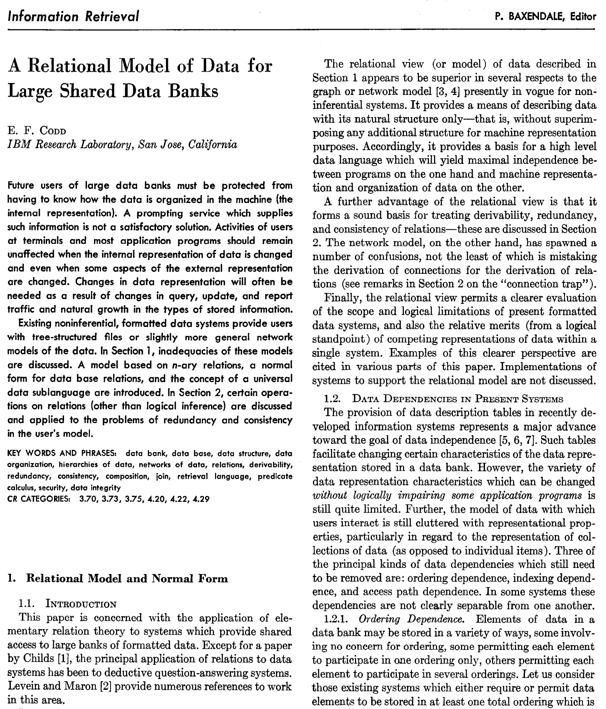
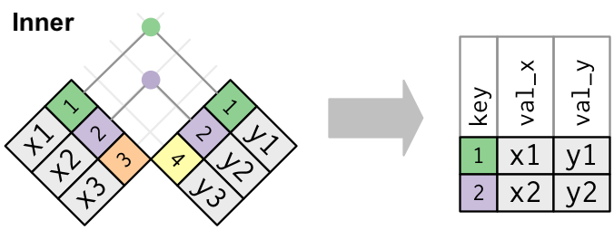

```{css, echo=FALSE} 
@media print { # print out incremental slides; see https://stackoverflow.com/questions/56373198/get-xaringan-incremental-animations-to-print-to-pdf/56374619#56374619
  .has-continuation {
    display: block !important;
  }
}
```

```{r setup, include=FALSE}
# figures formatting setup
options(htmltools.dir.version = FALSE)
library(knitr)
opts_chunk$set(
  prompt = T,
  fig.align="center", #fig.width=6, fig.height=4.5, 
  # out.width="748px", #out.length="520.75px",
  dpi=300, #fig.path='Figs/',
  cache=T, #echo=F, warning=F, message=F
  engine.opts = list(bash = "-l")
  )

## Next hook based on this SO answer: https://stackoverflow.com/a/39025054
knit_hooks$set(
  prompt = function(before, options, envir) {
    options(
      prompt = if (options$engine %in% c('sh','bash')) '$ ' else 'R> ',
      continue = if (options$engine %in% c('sh','bash')) '$ ' else '+ '
      )
})

library(tidyverse)
```


# Table of contents

1. [Relational data](#relational)

2. [Database fundamentals](#databases)

3. [Back to dplyr: joins](#joins)

4. [SQL](#sql)

5. [Talking to databases with R](#dbr)

6. [Other database types](#otherdb)

7. [Summary](#summary)


---
class: inverse, center, middle
name: relational

# Relational data

<html><div style='float:left'></div><hr color='#EB811B' size=1px style="width:1000px; margin:auto;"/></html>


---

# The ubiqity of multi-dimensional data structures

.pull-left[
## From data frames...

- When you have a background in social sciences, your top-of-the-head mental image of data might be a rectangular [spreadsheet](https://en.wikipedia.org/wiki/Spreadsheet).
- In fact, much of classical "statistical" software (SPSS, Stata, MS Excel) operates with rectangular data frames by default. 
- At the same time, your perception might be [file-based](https://en.wikipedia.org/wiki/List_of_file_formats). Data is stored in files, and these files are read (and produced) by our data management software.
- In many cases, the two-dimensional structure makes sense. For instance, we observe
  - persons x attitudes
  - countries x characteristics
  - social media posts x text features
]

--

.pull-right[
## ... to complex data structures

- The longer you think about it, the more problematic it becomes to store your data in two-dimensional structures.
- Examples:
  - countries x persons x characteristics x time
  - countries x states x communities x time x variables
  - social media posts x retweets x users x user characteristics x network features x meta data 
- Mapping three- onto two-dimensional structures is easy (think: `pivot_longer`, `pivot_wider`).
- With multiple heterogeneous data sources, things get messy.
]


---

# Use of databases in data science


---

# When databases become useful

.pull-left[
- You want to present or make data available on a website. Using a database, you only need one tool to achieve this.
- You collaborate with others on a data collection project. With a database, you have a common, always accessible, and reliable infrastructure at hand that multiple users can access at the same time.
- When several parties are involved, who is allowed to do what with the database might differ (e.g., read-only, access to parts of the data, limited admin rights, etc.). Most databases allow defining different usage rights for different users.
]

--

.pull-right[
- You have loads of data that exceed the working memory on your computer. Databases are limited by available disk size (or can be distributed across multiple disks/machines).
- Your data structure is complex. Databases allow/encourage you to store, retrieve and subset data with complex data structures.
- Your data is big and you have to access/subset/operate frequently. Querying databases is fast.
- You care about data quality and have clear expectations how data should look like. Using databases you can define specific rules for extending and updating your database.
]


---

# Getting some terminology right

## We should distinguish:

- The **data structure**: tables, columns, keys, normal forms
- The **data manipulations**: selects, joins, grouping
- The **database management system**: e.g., Postgres, Oracle, SQL Server, sqlite
- The **query language**, e.g., SQL

## What we will cover and won't cover

- We will cover essential structures and manipulations, how to interact with databases from within R, and basics of SQL
- We will not cover SQL or any particular database system in detail


dbms-r-sql.png


---

# Why databases?

- Big data, big problems
- Store data which is too big to fit into memory
- Access big data effectively

# Where are the databases

Databases can exist
- locally or remotely
- in-memory or on-disk

# Why are databases so efficient?

- They rely on binary search trees https://en.wikipedia.org/wiki/Binary_search_tree
- But also see hash tables: https://en.wikipedia.org/wiki/Hash_table
- Analogy: (Relational) databases organize data in one more tables. Think of a list of data frames in R. To access information from a specific table (data frame), we first have to index it from the database (list) and then execute our query functions
- Another useful analogy (from McDermott): A b-tree shares the spirit of the file cabinet ordering system, but takes it step further so that we eliminate at least half of the remaining data from our search at each step. E.g. We need to find a person’s tax records in a million-row dataset. In the first step we immediately realise that it’s somewhere in the first 500k rows. In the next step we immediately realise that it’s somewhere in rows 250k-500k, etc.


---

# Data warehousing


---
# Codd's relational model for databases

.pull-left[

- The concept of relational databases builds on the [relational model (RM) for database management](https://en.wikipedia.org/wiki/Relational_model), as proposed by [Edgar F. "Ted" Codd](https://en.wikipedia.org/wiki/Edgar_F._Codd) in 1969/1970.<sup>1</sup>
- Todd described the RM formally in mathematical terms, but also introduced it using concepts that are still in use today (normalization, keys, joins, redundancy, etc.).
- The key assumption of the relational model is that all data can be represented as relations (tables).
- Information is then represented by data values in relations.

<div align="center">
 
</div>
[Ted Codd](https://en.wikipedia.org/wiki/File:Edgar_F_Codd.jpg), Turing Award winner 1981
]


.pull-right-center[
<div align="center">

</div>
`Credit` [Communications of the ACM 13(6), 1970](https://dl.acm.org/doi/10.1145/362384.362685)
]


---
class: inverse, center, middle
name: databases

# Relational database fundamentals

<html><div style='float:left'></div><hr color='#EB811B' size=1px style="width:1000px; margin:auto;"/></html>


---
# Database normalization

https://en.wikipedia.org/wiki/Database_normalization


---
class: inverse, center, middle
name: joins

# Back to dplyr: joins

<html><div style='float:left'></div><hr color='#EB811B' size=1px style="width:1000px; margin:auto;"/></html>


---

# Relational data in R

For the simple examples that I'm going to show here, we'll need some data sets that come bundled with the [**nycflights13**](http://github.com/hadley/nycflights13) package. 

Let's load it now and then inspect these data frames in your own console.

```{r, eval = T}
library(nycflights13)
```

```{r, echo = F}
data(flights)
```

---
# Relational data in R *cont.*

The package contains the tables `flights`, `airlines`, `airports`, `planes`, and `weather`.

--

The `airlines` data frame lets you look up the full carrier name from its [abbreviated code](https://en.wikipedia.org/wiki/List_of_airline_codes): 
```{r}
head(airlines, 10)
```


---
# Relational data in R *cont.*

The package contains the tables `flights`, `airlines`, `airports`, `planes`, and `weather`.

`airports` gives information about each airport, identified by the `faa` [airport code](https://airportcodes.io/en/faa-codes/): 
```{r}
head(airports, 10)
```


---
# Relational data in R *cont.*

The package contains the tables `flights`, `airlines`, `airports`, `planes`, and `weather`.


 `planes` gives information about each plane, identified by its `tailnum` (aircraft registration a.k.a. [tail number](https://en.wikipedia.org/wiki/Aircraft_registration): 
```{r}
head(planes, 10)
```

---
# Relational data in R *cont.*

The package contains the tables `flights`, `airlines`, `airports`, `planes`, and `weather`.

`weather` gives the [weather](https://www.youtube.com/watch?v=1ZyT_Aiey1U) at each NYC airport for each hour: 
```{r}
head(weather, 10)
```

---
# Relational data in R *cont.*

The package contains the tables `flights`, `airlines`, `airports`, `planes`, and `weather`.

Finally, `flights` gives data on each of the `r nrow(flights)` flights in the dataset: 

```{r}
head(flights, 10)
```


---
# Relational data in R *cont.*

.pull-left[
- We can illustrate the relationships between the different tables with a schematic drawing.<sup>1</sup>
- One table seems central (`flights`), but that's not a necessary feature of relational databases.
- Key to understanding the diagram is that each relation always concerns a pair of tables:
  - `flights` connects to `planes` via `tailnum`.
  - `flights` connects to `airlines` via `carrier`.
  - `flights` connects to `airports` via `origin` and `dest`.
  - `flights` connects to `weather` via `origin` (location) and `year`, `month`, `day`, and `hour` (time).
]

.pull-right[
<br>
<div align="center">

</div>
]

.footnote[<sup>1</sup> Of course there are R packages that help you create such data models visually, e.g., the [dm package](https://cynkra.github.io/dm/).]

---
# Relational data in R *cont.*

.pull-left[
## Question time

1. Imagine you wanted to draw (approximately) the route each plane flies from its origin to its destination. What variables would you need? What tables would you need to combine?

2. We know that some days of the year are “special”, and fewer people than usual fly on them. How might you represent that data as a data frame? What would be the primary keys of that table? How would it connect to the existing tables?
]

.pull-right[
<br>
<div align="center">

</div>
]


---

# Joins

.pull-left[
One of the mainstays of the `dplyr` package is merging data with the family of [join operations](https://cran.r-project.org/web/packages/dplyr/vignettes/two-table.html).

Luckily, the functions are both intuitive to apply and consistent with SQL join vocabulary. The main functions are:

- `inner_join(df1, df2)`
- `left_join(df1, df2)`
- `right_join(df1, df2)`
- `full_join(df1, df2)`
- `semi_join(df1, df2)`
- `anti_join(df1, df2)`
]

.pull-right[
<br>
<div align="center">

</div>
]

---

# The logic of joins

We start with a simple setup of two tables `x` and `y`:

<div align="center">

</div>

--

The **colored columns** represent the key variables, the **gray columns** the value variables. The basic ideas of joining will generalize to multiple keys and values.

--

Joining is about connecting each row in `x` to zero, one, or more rows in `y`:

<div align="center">

</div>

---

# The logic of joins

We start with a simple setup of two tables `x` and `y`:

<div align="center">

</div>


The **colored columns** represent the key variables, the **gray columns** the value variables. The basic ideas of joining will generalize to multiple keys and values.


Joining is about connecting each row in `x` to zero, one, or more rows in `y`:

<div align="center">

</div>

In an actual join, matches will be indicated with dots. The number of dots = the number of matches = the number of rows in the output.

---

# The logic of joins *cont.*

.pull-left-wide[

## Inner join

- An inner join matches pairs of observations when their keys are equal.
- The output of an inner join is a new table that contains the key and values of both tables.
- Unmatched rows are not included in the result. To be used with caution, because [it's easy to lose observations](https://twitter.com/SolomonMg/status/1436742352039669760)!


## Outer joins

- Outer joins keep observations that appear in at least one of the tables.
- There are three types of outer joins:
  - A **left join** keeps all observations in `x`.
  - A **right join** keeps all observations in `y`.
  - A **full join** keeps all observations in `x` and `y`.
- Use the left join unless you have a strong reason not to do so; it preserves original observations even when there isn't a match.
]

.pull-right-narrow[
<div align="center">

<br>

</div>

]


---
# Keys

- Variables used to connect each pair of tables are called keys. 
- A key is a variable (or set of variables) that uniquely identifies an observation.
- In simple cases, a single variable is sufficient to identify an observation (plane → `tailnum`).
- In other cases, multiple variables are needed (look again at the `weather` table).

--

## Primary keys

- A primary key uniquely identifies an observation in its own table.
- It is either a column containing a (sometimes autogenerated and otherwise meaningless) identifier that uniquely identifies each row, or
- Several substantively meaningful columns whose row values *taken together* uniquely identify each row.

--

## Foreign keys

- A foreign key is a column containing primary key(s) from another table.
- It is the piece of information necessary to join both tables.
- Note that a variable can be both a primary *and* a foreign key. In our example, `origin` is part of the `weather` primary key, and is also a foreign key for the `airports` table.


---

# Joins in R

Let's perform a [left join](https://stat545.com/bit001_dplyr-cheatsheet.html#left_joinsuperheroes-publishers) on the flights and planes datasets. 
- *Note*: I'm going subset columns after the join, but only to keep text on the slide.

--

```{r join1}
left_join(flights, planes) %>%
  select(year, month, day, dep_time, arr_time, carrier, flight, tailnum, type, model)
```

---

# Joins in R *cont.*

Note that `dplyr` made a reasonable guess about which columns to join on (i.e. columns that share the same name). It also told us its choices: 

```
*## Joining, by = c("year", "tailnum")
```

However, there's an obvious problem here: the variable "year" does not have a consistent meaning across our joining datasets!
- In one it refers to the *year of flight*, in the other it refers to *year of construction*.

--

Luckily, there's an easy way to avoid this problem. 
- See if you can figure it out before turning to the next slide.
- Try `?dplyr::join`.

---

# Joins in R *cont.*


You just need to be more explicit in your join call by using the `by = ` argument.
- You can also rename any ambiguous columns to avoid confusion. 
```{r join2}
left_join(
  flights,
  planes %>% rename(year_built = year), ## Not necessary w/ below line, but helpful
  by = "tailnum" ## Be specific about the joining column
  ) %>%
  select(year, month, day, dep_time, arr_time, carrier, flight, tailnum, year_built, type, model) %>%
  head(3) ## Just to save vertical space on the slide
```

---

# Joins in R *cont.*

Last thing to mention on joins for now; note what happens if we again specify the join column... but don't rename the ambiguous "year" column in at least one of the given data frames:

```{r join3}
left_join(
  flights,
  planes, ## Not renaming "year" to "year_built" this time
  by = "tailnum"
  ) %>%
  select(contains("year"), month, day, dep_time, arr_time, carrier, flight, tailnum, type, model) %>%
  head(3)
```

--

Make sure you know what "year.x" and "year.y" are. Again, it pays to be specific.


---

# Duplicate keys

- If you're lucky, keys are unique. But that's not always the case.
- There are two common scenarios:

--

1. One table has duplicate keys, the other hasn't. This gives us a one-to-many relationship.

<div align="center">

</div>

--

2. Both tables have duplicate keys. This is usually an error because in neither table do the keys uniquely identify an observation. When joining duplicated keys, we get all possible combinations (the Cartesian product, a many-to-many relationship):
  
<div align="center">

</div>


---
class: inverse, center, middle
name: sql

# SQL

<html><div style='float:left'></div><hr color='#EB811B' size=1px style="width:1000px; margin:auto;"/></html>


---
# What is SQL?

## Background and history

- SQL (pronounced [ɛsˌkjuːˈɛl] as in S-Q-L, or [siːkwəl] as in sequel)  stands for **Structured Query Language**. Initially it was called SEQUEL (Structured English Query Language), but this was dropped due to trademark issues.
- It's a domain-specific language designed to query data contained in relational databases.
- Initially developed at IBM by [Donald D. Chamberlin](https://en.wikipedia.org/wiki/Donald_D._Chamberlin) and [Raymond F. Boyce](https://en.wikipedia.org/wiki/Raymond_F._Boyce) in 1974.

--

## Why SQL?

- While database types differ, most of the relational databases you'll encounter speak SQL.
- The key skill to work with databases (outside R) is to learn how to speak SQL. Once you've mastered this, you should be able to work with any of them.
- SQL is featured as a required skill in many (most?) data science job ads out there.


---
# General SQL syntax

## Classes of SQL syntax

- Data query language (DQL) to perform queries on the data [`SELECT`, `FROM`, `WHERE`]
- Data definition language (DDL) to describe data structure and its relations (create tables, columns, define data types, keys, constraints) [`CREATE`, `ALTER`, `DROP`]
- Data manipulation language (DML) to fill database or retrieve information from it [`SELECT`, `FROM`, `WHERE`, `INSERT`, `UPDATE`, `DELETE`]
- Data control language (DCL) to define usage/admin rights [`GRANT`, `REVOKE`]


---
# General SQL syntax *cont.*

.pull-left[
- SQL statements start with a command describing the desired action (`SELECT`), followed by the unit on which it should be executed (`SELECT column1`), and one or more clauses (`WHERE column 2 = 1`).
- Although it's customary to write all SQL statements in capital letters, SQL is actually case insensitive towards its key words. 
- Each SQL statement ends with a semicolon, so SQL statements can span across multiple lines.
- Comments either start with `--` or have to be put in between `/*` and `*/`.
]

--

.pull-right[

```{r, echo = FALSE}
library(DBI)
db = dbConnect(RSQLite::SQLite(), dbname = "sql.sqlite")
```

```{text, connection = db, eval = FALSE}
CREATE DATABASE database1 ;
SELECT column1 FROM table1 WHERE column2 = 1 ;
UPDATE table1 SET column1 = 1 WHERE column2 > 3 ;
INSERT INTO table1 (column1, column2)
VALUES ('rc11', 'rc12'), ('rc21', 'rc22') ;
```

```{text, connection = db, eval = FALSE}
-- One line comment.
/*
Comment spanning
several lines
*/
```
]

---
# SQL examples


---
class: inverse, center, middle
name: dbr

# Talking to databases with R

<html><div style='float:left'></div><hr color='#EB811B' size=1px style="width:1000px; margin:auto;"/></html>


---

# Connecting to databases with R

- R can connect to all major existing databases types (and to virtually anything else, too).
- There are various R packages that allow you to connect to particular database types, e.g.:

| DBMS  |  R package |
|---|---|
| SQLite  | [`RSQLite`](https://cran.r-project.org/web/packages/RSQLite/index.html) |
| MySQL  | [`RMySQL`](https://cran.r-project.org/web/packages/RMySQL/index.html) |
|  PostgreSQL |  [`RPostgres`](https://cran.r-project.org/web/packages/RPostgres/index.html) |
|  Oracle Database |  [`ROracle`](https://cran.r-project.org/web/packages/ROracle/index.html) |


---

# A common interface to relational databases from R

https://cran.r-project.org/web/packages/DBI/vignettes/DBI-proposal.html
https://db.rstudio.com/getting-started/overview
https://en.wikipedia.org/wiki/Database#Database_management_system
https://www.dataquest.io/blog/sql-basics/


---

# Using SQL directly in R

- Behind the scenes, dplyr is translating your R code into SQL. You can use the `show_query()` function to display the SQL code that was used to generate a queried table.

- So, do you even need to learn SQL? 


---
class: inverse, center, middle
name: otherdb

# Other database types

<html><div style='float:left'></div><hr color='#EB811B' size=1px style="width:1000px; margin:auto;"/></html>


---
# Non-relational databases


---
class: inverse, center, middle
name: summary

# Summary

<html><div style='float:left'></div><hr color='#EB811B' size=1px style="width:1000px; margin:auto;"/></html>

---
# Summing it up

.pull-left[
Most data scientists **never design a database**. 

- But they almost all end up interacting with them.
- Also, with database administrators (DBAs).

Lots of academic data work consists of working with *bad re-inventions* of the relational database.

- Looking at you, Excel users.
- Looking at you, instructor.

Thinking about data relationally **will help you with statistics**.

- Multilevel models, time-series, network analysis, NLP
]

.pull-right[
</br>

| Database concept  |  Statistical concept |
|---|---|
| Table  | Sample |
| Column  | Variable |
|  Row |  Unit |
|  Value |  Observation |
|  Foreign key relationships |  Nested variables |
|  Many-to-many relationships |  Crossed variables (possibly unbalanced) |
]

---
class: center
background-image: url("pics/excel-not-database-simpsons.png")
background-size: contain
background-color: #000000

# Databases: Maybe not the most exciting technology...

<br><br><br><br><br><br><br><br><br><br><br><br><br><br><br><br><br>
<p style="background-color:black;color:white;"><b>... but awesomely useful and not going away.</b></p>


---

# Coming up

<br><br> 

### Assignment

None! But you'll get the chance to practice databasing with R in the lab.


### Next lecture

Web data and technologies - relational data structures FTW!


