```{css, echo=FALSE} 
@media print { # print out incremental slides; see https://stackoverflow.com/questions/56373198/get-xaringan-incremental-animations-to-print-to-pdf/56374619#56374619
  .has-continuation {
    display: block !important;
  }
}
```

```{r setup, include=FALSE}
# figures formatting setup
options(htmltools.dir.version = FALSE)
library(knitr)
opts_chunk$set(
  prompt = T,
  fig.align="center", #fig.width=6, fig.height=4.5, 
  # out.width="748px", #out.length="520.75px",
  dpi=300, #fig.path='Figs/',
  cache=F, #echo=F, warning=F, message=F
  engine.opts = list(bash = "-l")
  )

## Next hook based on this SO answer: https://stackoverflow.com/a/39025054
knit_hooks$set(
  prompt = function(before, options, envir) {
    options(
      prompt = if (options$engine %in% c('sh','bash')) '$ ' else 'R> ',
      continue = if (options$engine %in% c('sh','bash')) '$ ' else '+ '
      )
})

library(tidyverse)
```


# Table of contents

<br>

1. [Why databases?](#whydb)

2. [Relational database fundamentals](#relationaldb)

3. [Back to `dplyr`: joins](#joins)

4. [SQL](#sql)

5. [Talking to databases with R](#dbr)

7. [Summary](#summary)


---
class: inverse, center, middle
name: whydb

# Why databases?

<html><div style='float:left'></div><hr color='#EB811B' size=1px style="width:1000px; margin:auto;"/></html>


---

# The ubiqity of multi-dimensional data structures

.pull-left[
## From data frames...

- When you have a background in social sciences, your top-of-the-head mental image of data might be a rectangular [spreadsheet](https://en.wikipedia.org/wiki/Spreadsheet).
- In fact, much of classical "statistical" software (SPSS, Stata, MS Excel) operates with rectangular data frames by default. 
- At the same time, your perception might be [file-based](https://en.wikipedia.org/wiki/List_of_file_formats). Data is stored in files, and these files are read (and produced) by our data management software.
- In many cases, the **two-dimensional structure** makes sense. For instance, we observe
  - persons x attitudes
  - countries x characteristics
  - social media posts x text features
]

.pull-right-center[
<br><br>
<div align="center">
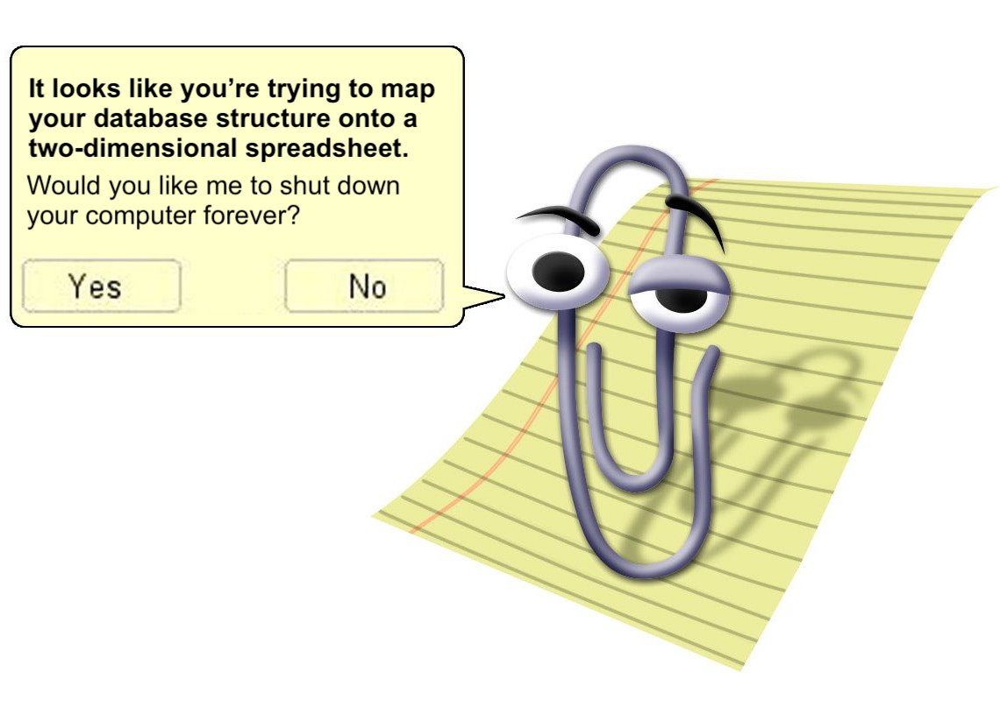 
</div>
]


---

# The ubiqity of multi-dimensional data structures

.pull-left-center[
<div align="center">
 
</div>
`Credit` [saschagobel/legislatoR](https://github.com/saschagobel/legislatoR)
]

.pull-right[
## ... to complex data structures

- However, the longer you think about it, the more problematic it becomes to store your data in two-dimensional structures.
- **Examples**:
  - countries x persons x characteristics x time
  - countries x states x communities x time x variables
  - social media posts x retweets x users x user characteristics x network features x meta data
- Mapping three- onto two-dimensional structures is easy (think: `pivot_longer`, `pivot_wider`).
- With **multiple heterogeneous data sources**, things get messy.
- Managing complex data structures is just one perk of using databases.
]


---

# When databases become useful

.pull-left[
## Accessibility and concurrency
- You want to present or **make data available on a website**. Using a database, you only need one tool to achieve this.
- You **collaborate with others** on a data collection project. With a database, you have a common, simultaneously accessible, and reliable infrastructure at hand that multiple users can access at the same time.
- When several parties are involved, who is allowed to do what with the database might differ (e.g., read-only, access to parts of the data, limited admin rights, etc.). Most databases allow **defining different usage rights for different users**.
]

--

.pull-right[
## Size and speed
- You have **loads of data that exceed the working memory** on your computer. Databases are limited by available disk size (or can be distributed across multiple disks/machines).
- Your **data structure is complex**. Databases allow/encourage you to store, retrieve and subset data with complex data structures.
- Your data is big and you have to **access/subset/operate frequently**. Querying databases is fast.
- You care about **data quality** and have clear expectations how data should look like. Using databases you can define specific rules for extending and updating your database.
]


---

# Talking about databases

.pull-left[

## What we should distinguish

- The **types of databases**, e.g.: relational, navigational, NoSQL, NewSQL
- The **database management system**, e.g.: PostgreSQL, Oracle, SQL Server, SQLite
- The **data structure**, e.g.: tables, columns, keys, normal forms
- The **data manipulations**, e.g.: selects, joins, grouping
- The **query language**, e.g., SQL

Also, there are so many more ways to [classify databases](https://en.wikipedia.org/wiki/Database#Classification). But that's enough for now.

Today, **we focus on relational databases**. They are by no means the only type of databases (see above), but they're ubiquitous and won't go away any time soon. 
]

--
.pull-right[

## Databases versus data frames

When reading/talking about features of databases, you will encounter a particular jargon. Here's how database concepts map onty R data frame jargon:

| R jargon  |  Database jargon |
|---|---|
| column  | attribute/field |
| row  | tuple/record |
| element/cell | attribute value |
|  data frame |  relation/table |
|  column types |  table schema |
|  bunch of related data frames |  database |

]


---
class: inverse, center, middle
name: relationaldb

# Relational database fundamentals

<html><div style='float:left'></div><hr color='#EB811B' size=1px style="width:1000px; margin:auto;"/></html>


---
# Codd's relational model for databases

.pull-left[
- The concept of relational databases builds on the [relational model (RM) for database management](https://en.wikipedia.org/wiki/Relational_model), as proposed by [Edgar F. "Ted" Codd](https://en.wikipedia.org/wiki/Edgar_F._Codd) in 1969/1970.<sup>1</sup>
- Todd described the RM formally in mathematical terms, but also introduced it using concepts that are still in use today (normalization, keys, joins, redundancy, etc.).
- The key assumption of the relational model is that all data can be represented as relations (tables).
- Information is then represented by data values in relations.
- When you think this is trivial, check out the [history of databases](https://en.wikipedia.org/wiki/Database) and live through the pain of the early era of navigational DBMS in the 1960s and the NoSQL era that we've (not yet) overcome.

<!--
<div align="center">
 
</div>
[Ted Codd](https://en.wikipedia.org/wiki/File:Edgar_F_Codd.jpg), Turing Award winner 1981
-->
]


.pull-right-center[
<div align="center">

</div>
`Credit` [Communications of the ACM 13(6), 1970](https://dl.acm.org/doi/10.1145/362384.362685)
]


---
# Codd's relational model for databases (cont.)

.pull-left[
## Storing data in tables

- Again, the key concept of relational databases is that all information can be represented in a table.
- A single table already introduces relations: All data in one row belongs to the same record.
- If we want to represent more complex relations (i.e., measuring a person's weight twice or measuring the weight of their children as well), we can relate data from one table to another.

## Example

- We have collected data on Peter, Paul, and Mary.
- We have information on birthdays, telephone numbers, and favorite foods.
- How can we represent this information in tables?

]

--

.pull-right[
<br>
<div align="center">
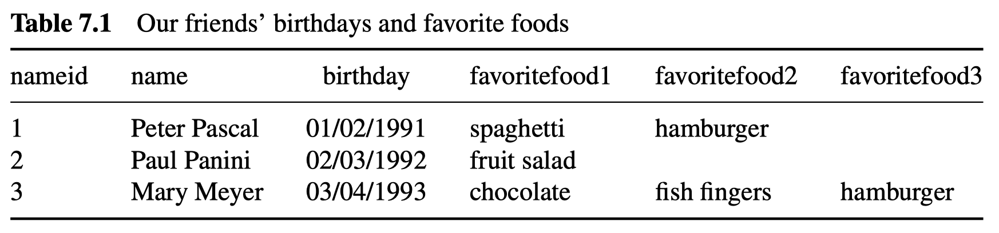
</div>
<div align="center">
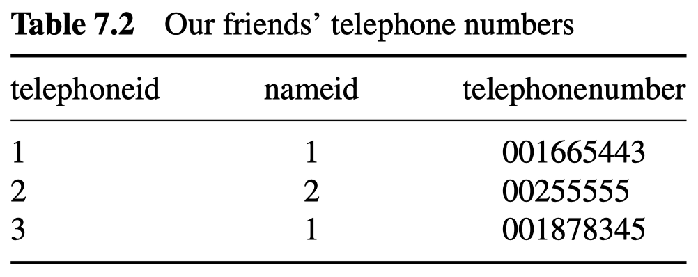
</div>

- We start representing the data in two tables.
- They are linked via the key `nameid`, so we don't have to add the full names to the phone numbers table.
- Note that we have a 1:m (one-to-many) relation here because Peter has two phone numbers.
]


---
# Codd's relational model for databases (cont.)

.pull-left[
## Storing data in tables

- Again, the key concept of relational databases is that all information can be represented in a table.
- A single table already introduces relations: All data in one row belongs to the same record.
- If we want to represent more complex relations (i.e., measuring a person's weight twice or measuring the weight of their children as well), we can relate data from one table to another.

## Example

- We have collected data on Peter, Paul, and Mary.
- We have information on birthdays, telephone numbers, and favorite foods.
- How can we represent this information in tables?

]

.pull-right[
<br>
<div align="center">

</div>
<div align="center">

</div>

- However, the way we store the data is not ideal. In the first table, we have three columns measuring effectively the same thing. And what if there's more favorite food? Adding information in such a fashion creates a lot of redundant information. 
]

---
# Codd's relational model for databases (cont.)

.pull-left[
## Storing data in tables

- Again, the key concept of relational databases is that all information can be represented in a table.
- A single table already introduces relations: All data in one row belongs to the same record.
- If we want to represent more complex relations (i.e., measuring a person's weight twice or measuring the weight of their children as well), we can relate data from one table to another.

## Example

- We have collected data on Peter, Paul, and Mary.
- We have information on birthdays, telephone numbers, and favorite foods.
- How can we represent this information in tables?

]

.pull-right[
<br>
<div align="center">
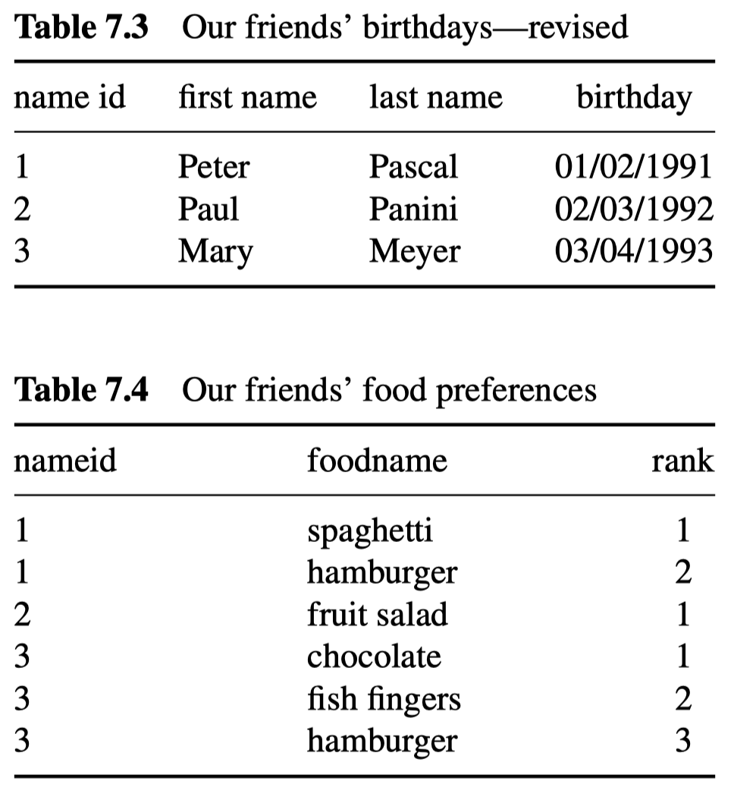
</div>

- Splitting up the information by creating another table for food preferences is better.
- There's still some redundancy left. Is it really necessary to have `hamburger` in the table twice?
]


---
# Codd's relational model for databases (cont.)

.pull-left[
## Storing data in tables

- Again, the key concept of relational databases is that all information can be represented in a table.
- A single table already introduces relations: All data in one row belongs to the same record.
- If we want to represent more complex relations (i.e., measuring a person's weight twice or measuring the weight of their children as well), we can relate data from one table to another.

## Example

- We have collected data on Peter, Paul, and Mary.
- We have information on birthdays, telephone numbers, and favorite foods.
- How can we represent this information in tables?

]

.pull-right[
<br>
<div align="center">
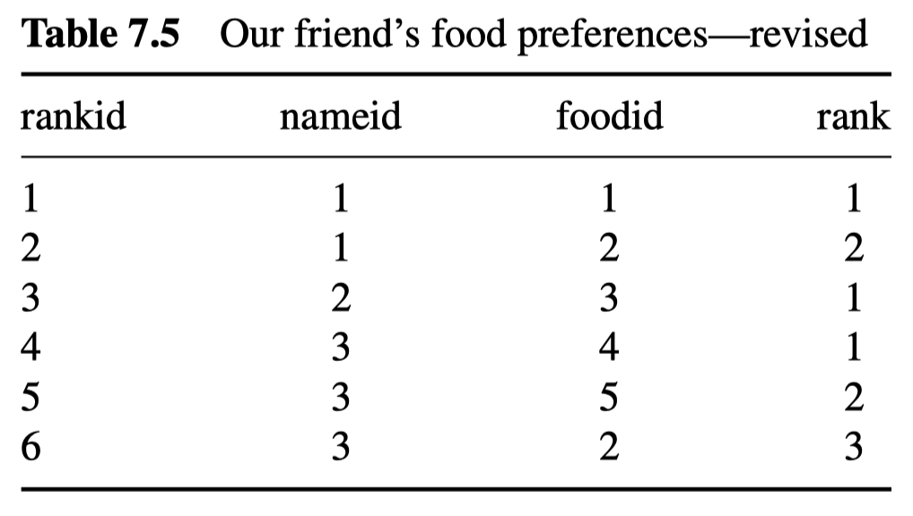
</div>
<div align="center">
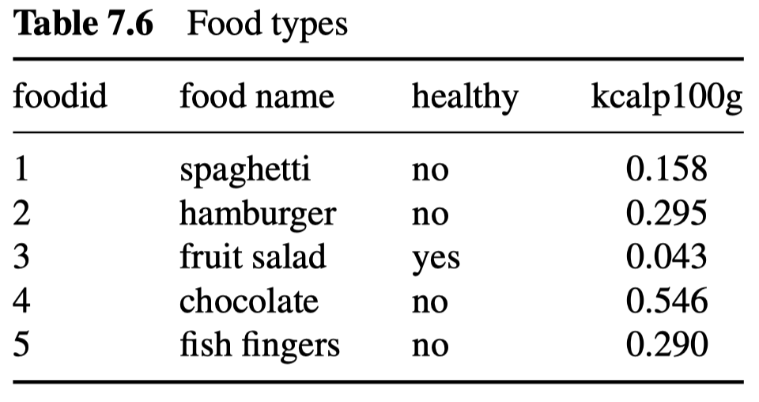
</div>

- Now that's better.
- In restructuring the information in our database, we **avoided redundancy (duplication)**.
- This is the process of **database normalization**.
]


---
# Database schema

.pull-left[

## What schemas are

- The database schema describes the structure of a database. It represents the map or blueprint of how the database is constructed.
- The schema specifies all core ingredients of the database, including tables, fields, keys relationships, views, etc.
- The visualization helps database users understand the relationships between the tables.

<br>
<div align="center">
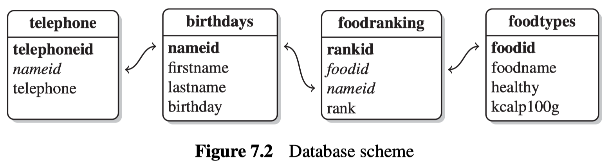
</div>

]

.pull-right[

## How they can look like

<div align="center">

</div>
`Credit` [Timo Tijhof/Wikimedia Commons](https://commons.wikimedia.org/wiki/File:MediaWiki_1.19_database_schema_(r102798))
]


---
# Database normalization

.pull-left[
## What is database normalization?

**From the [Wikipedia](https://en.wikipedia.org/wiki/Database_normalization)**: "Database normalization is the process of **structuring a database**, usually a relational database, in accordance with a series of so-called **normal forms** in order to **reduce data redundancy and improve data integrity**. It was first proposed by Edgar F. Codd as part of his relational model."

- You'll probably not have to apply normalization yourself because you are a user not a designer of databases.
- However, it helps to have an idea of what the first normal forms are.
- Higher-order normal forms imply lower-order normal forms (e.g., in order to satisfy the 3rd normal form, the 1st and 2nd normal forms have to be satisfied, too).
]

--

.pull-right[
## Normalization and tidy data

There is also a straightforward link to [Hadley Wickham's "tidy data"](https://www.jstatsoft.org/article/view/v059i10): 

1. Each variable forms a column.
2. Each observation forms a row.
3. Each type of observational unit forms a table.

This is Codd's 3rd normal form using "statistical" jargon and applied to a single dataset. 
]

---

# Database normalization (cont.)

The **normal forms** (from least normalized to most normalized):

<div align="center">
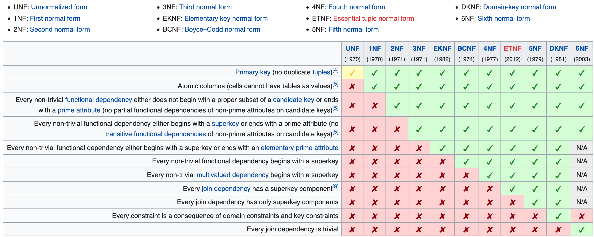
</div>
`Credit` [English Wikipedia, "Database normalization"](https://en.wikipedia.org/wiki/Database_normalization)


---

# Database normalization (cont.)

<div align="center">
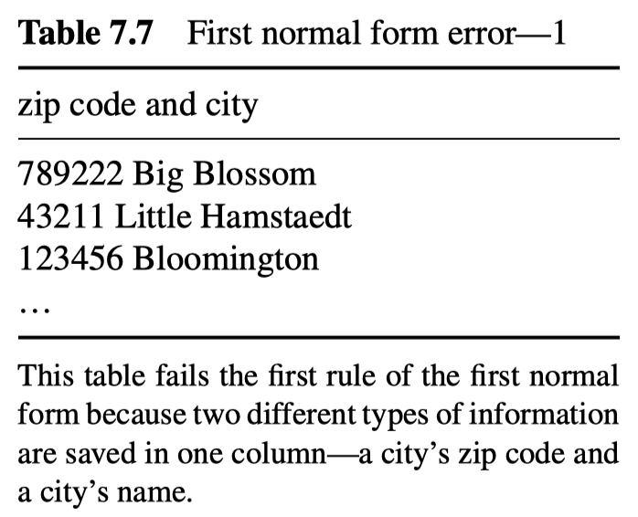
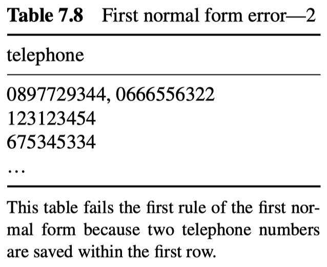
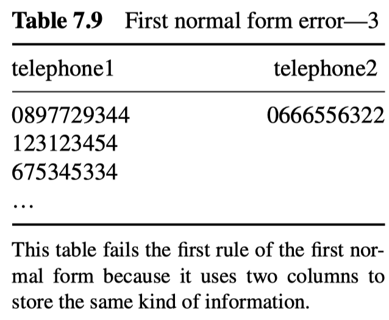
</div>
<br>
<div align="center">
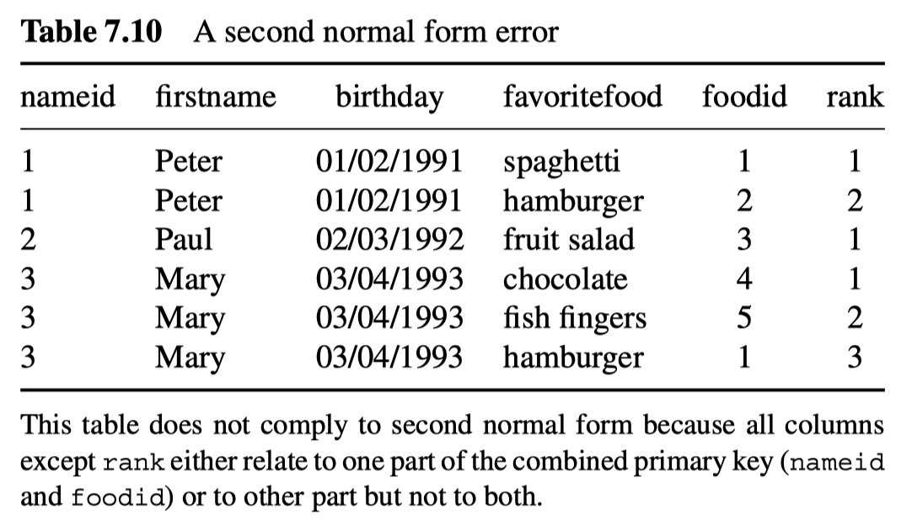
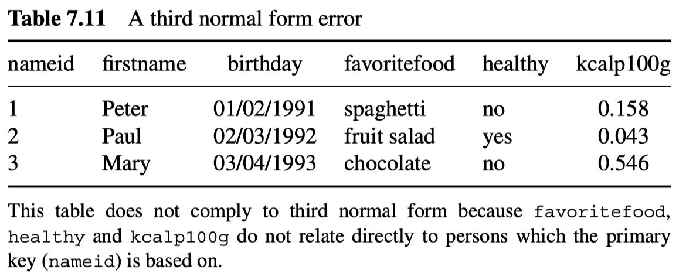
</div>


---

# Databases and Database Management Systems

.pull-left-wide[

## What are databases?

- Databases are an organized collection of data.
- They are organized to afford efficient retrieval of (selections) of data.
- They entail data + metadata about structure and organization.
- They are generally accessed through a database management system.


## Where are databases?

- Databases can exist locally or remotely, in-memory or on-disk.
- When they are stored locally, they are not stored as binary file (not text file). 
- Commonly, we think of a **client-server model**:
  - Databases live on a **server**, which manages them
  - Users interact with the server through a **client** program.
  - Lets multiple users **access** the same database **simultaneously**.

]

.pull-right-small[

]

---
# Databases and Database Management Systems


## What are DBMS?

.pull-left-wide[
- Database Management Systems (DBMS) provide **efficient**, **reliable**, **convenient**, **safe**, **multi-user** storage of and access to **massive** amounts of data.
    - **Massive**: Think Terabytes, not Gigabytes. Handle data that resides outside memory.
    - **Safe**: Robust to power outages, node failures, etc.
    - **Multi-user**: Concurrency control. Not one user, but multiple.
    - **Convenient**: High-level query languages.
    - **Efficient**: Just fast.
    - **Reliable**: High uptime.
- There are [so many DBMS](https://en.wikipedia.org/wiki/List_of_relational_database_management_systems) for relational database structures alone.

]

.pull-right-small[


]


---
class: inverse, center, middle
name: joins

# Back to dplyr: joins

<html><div style='float:left'></div><hr color='#EB811B' size=1px style="width:1000px; margin:auto;"/></html>


---

# Relational data in R

For the simple examples that I'm going to show here, we'll need some data sets that come bundled with the [**nycflights13**](http://github.com/hadley/nycflights13) package. 

Let's load it now and then inspect these data frames in your own console.

```{r, eval = T}
library(nycflights13)
```

```{r, echo = F}
data(flights)
```

---
# Relational data in R *cont.*

The package contains the tables `flights`, `airlines`, `airports`, `planes`, and `weather`.

--

The `airlines` data frame lets you look up the full carrier name from its [abbreviated code](https://en.wikipedia.org/wiki/List_of_airline_codes): 
```{r}
head(airlines, 10)
```


---
# Relational data in R *cont.*

The package contains the tables `flights`, `airlines`, `airports`, `planes`, and `weather`.

`airports` gives information about each airport, identified by the `faa` [airport code](https://airportcodes.io/en/faa-codes/): 
```{r}
head(airports, 10)
```


---
# Relational data in R *cont.*

The package contains the tables `flights`, `airlines`, `airports`, `planes`, and `weather`.


 `planes` gives information about each plane, identified by its `tailnum` (aircraft registration a.k.a. [tail number](https://en.wikipedia.org/wiki/Aircraft_registration)): 
```{r}
head(planes, 10)
```

---
# Relational data in R *cont.*

The package contains the tables `flights`, `airlines`, `airports`, `planes`, and `weather`.

`weather` gives the [weather](https://www.youtube.com/watch?v=1ZyT_Aiey1U) at each NYC airport for each hour: 
```{r}
head(weather, 10)
```

---
# Relational data in R *cont.*

The package contains the tables `flights`, `airlines`, `airports`, `planes`, and `weather`.

Finally, `flights` gives data on each of the `r nrow(flights)` flights in the dataset: 

```{r}
head(flights, 10)
```


---
# Relational data in R *cont.*

.pull-left[
- We can illustrate the relationships between the different tables with a schematic drawing.<sup>1</sup>
- One table seems central (`flights`), but that's not a necessary feature of relational databases.
- Key to understanding the diagram is that each relation always concerns a pair of tables:
  - `flights` connects to `planes` via `tailnum`.
  - `flights` connects to `airlines` via `carrier`.
  - `flights` connects to `airports` via `origin` and `dest`.
  - `flights` connects to `weather` via `origin` (location) and `year`, `month`, `day`, and `hour` (time).
]

.pull-right[
<br>
<div align="center">

</div>
]

.footnote[<sup>1</sup> Of course there are R packages that help you create such data models visually, e.g., the [dm package](https://cynkra.github.io/dm/).]

---
# Relational data in R *cont.*

.pull-left[
## Question time

1. Imagine you wanted to draw (approximately) the route each plane flies from its origin to its destination. What variables would you need? What tables would you need to combine?

2. We know that some days of the year are “special”, and fewer people than usual fly on them. How might you represent that data as a data frame? What would be the primary keys of that table? How would it connect to the existing tables?
]

.pull-right[
<br>
<div align="center">

</div>
]


---

# Joins

.pull-left[
One of the mainstays of the `dplyr` package is merging data with the family of [join operations](https://cran.r-project.org/web/packages/dplyr/vignettes/two-table.html).

Luckily, the functions are both intuitive to apply and consistent with SQL join vocabulary.

The main functions are:

- `inner_join(df1, df2)`
- `left_join(df1, df2)`
- `right_join(df1, df2)`
- `full_join(df1, df2)`
- `semi_join(df1, df2)`
- `anti_join(df1, df2)`
]

.pull-right[
<br>
<div align="center">

</div>
]

---

# The logic of joins

We start with a simple setup of two tables `x` and `y`:

<div align="center">

</div>

--

The **colored columns** represent the key variables, the **gray columns** the value variables. The basic ideas of joining will generalize to multiple keys and values.

--

Joining is about connecting each row in `x` to zero, one, or more rows in `y`:

<div align="center">

</div>

---

# The logic of joins

We start with a simple setup of two tables `x` and `y`:

<div align="center">

</div>


The **colored columns** represent the key variables, the **gray columns** the value variables. The basic ideas of joining will generalize to multiple keys and values.


Joining is about connecting each row in `x` to zero, one, or more rows in `y`:

<div align="center">

</div>

In an actual join, matches will be indicated with dots. The number of dots = the number of matches = the number of rows in the output.

---

# The logic of joins *cont.*

.pull-left-wide[

## Inner join

- An inner join matches pairs of observations when their keys are equal.
- The output of an inner join is a new table that contains the key and values of both tables.
- Unmatched rows are not included in the result. To be used with caution, because [it's easy to lose observations](https://twitter.com/SolomonMg/status/1436742352039669760)!


## Outer joins

- Outer joins keep observations that appear in at least one of the tables.
- There are three types of outer joins:
  - A **left join** keeps all observations in `x`.
  - A **right join** keeps all observations in `y`.
  - A **full join** keeps all observations in `x` and `y`.
- Use the left join unless you have a strong reason not to do so; it preserves original observations even when there isn't a match.
]

.pull-right-narrow[
<div align="center">

<br>

</div>

]


---
# Keys

- Variables used to connect each pair of tables are called keys. 
- A key is a variable (or set of variables) that uniquely identifies an observation.
- In simple cases, a single variable is sufficient to identify an observation (plane → `tailnum`).
- In other cases, multiple variables are needed (look again at the `weather` table).

--

## Primary keys

- A primary key uniquely identifies an observation in its own table.
- It is either a column containing a (sometimes autogenerated and otherwise meaningless) identifier that uniquely identifies each row, or
- Several substantively meaningful columns whose row values *taken together* uniquely identify each row.

--

## Foreign keys

- A foreign key is a column containing primary key(s) from another table.
- It is the piece of information necessary to join both tables.
- Note that a variable can be both a primary *and* a foreign key. In our example, `origin` is part of the `weather` primary key, and is also a foreign key for the `airports` table.


---

# Joins in R

Let's perform a [left join](https://stat545.com/bit001_dplyr-cheatsheet.html#left_joinsuperheroes-publishers) on the flights and planes datasets. 
- *Note*: I'm going subset columns after the join, but only to keep text on the slide.

--

```{r join1}
left_join(flights, planes) %>%
  select(year, month, day, dep_time, arr_time, carrier, flight, tailnum, type, model)
```

---

# Joins in R *cont.*

Note that `dplyr` made a reasonable guess about which columns to join on (i.e. columns that share the same name). It also told us its choices: 

```
*## Joining, by = c("year", "tailnum")
```

However, there's an obvious problem here: the variable "year" does not have a consistent meaning across our joining datasets!
- In one it refers to the *year of flight*, in the other it refers to *year of construction*.

--

Luckily, there's an easy way to avoid this problem. 
- See if you can figure it out before turning to the next slide.
- Try `?dplyr::join`.

---

# Joins in R *cont.*


You just need to be more explicit in your join call by using the `by = ` argument.
- You can also rename any ambiguous columns to avoid confusion. 
```{r join2}
left_join(
  flights,
  planes %>% rename(year_built = year), ## Not necessary w/ below line, but helpful
  by = "tailnum" ## Be specific about the joining column
  ) %>%
  select(year, month, day, dep_time, arr_time, carrier, flight, tailnum, year_built, type, model) %>%
  head(3) ## Just to save vertical space on the slide
```

---

# Joins in R *cont.*

Last thing to mention on joins for now; note what happens if we again specify the join column... but don't rename the ambiguous "year" column in at least one of the given data frames:

```{r join3}
left_join(
  flights,
  planes, ## Not renaming "year" to "year_built" this time
  by = "tailnum"
  ) %>%
  select(contains("year"), month, day, dep_time, arr_time, carrier, flight, tailnum, type, model) %>%
  head(3)
```

--

Make sure you know what "year.x" and "year.y" are. Again, it pays to be specific.


---

# Duplicate keys

- If you're lucky, keys are unique. But that's not always the case.
- There are two common scenarios:

--

1. One table has duplicate keys, the other hasn't. This gives us a one-to-many relationship.

<div align="center">

</div>

--

2. Both tables have duplicate keys. This is usually an error because in neither table do the keys uniquely identify an observation. When joining duplicated keys, we get all possible combinations (the Cartesian product, a many-to-many relationship):
  
<div align="center">

</div>


---
class: inverse, center, middle
name: sql

# SQL

<html><div style='float:left'></div><hr color='#EB811B' size=1px style="width:1000px; margin:auto;"/></html>


---
# What is SQL?

## Background and history

- SQL (pronounced [ɛsˌkjuːˈɛl] as in S-Q-L, or [siːkwəl] as in sequel)  stands for **Structured Query Language**. Initially it was called SEQUEL (Structured English Query Language), but this was dropped due to trademark issues.
- It's a domain-specific language designed to query data contained in relational databases.
- Initially developed at IBM by [Donald D. Chamberlin](https://en.wikipedia.org/wiki/Donald_D._Chamberlin) and [Raymond F. Boyce](https://en.wikipedia.org/wiki/Raymond_F._Boyce) in 1974.

--

## Why SQL?

- While database types differ, most of the relational databases you'll encounter speak SQL.
- The key skill to work with databases (outside R) is to learn how to speak SQL. Once you've mastered this, you should be able to work with any of them.
- SQL is featured as a required skill in many (most?) data science job ads out there.


---
# General SQL syntax

## Classes of SQL syntax

- **Data query language** (DQL) to perform queries on the data [`SELECT`, `FROM`, `WHERE`]
- **Data definition language** (DDL) to describe data structure and its relations (create tables, columns, define data types, keys, constraints) [`CREATE`, `ALTER`, `DROP`]
- **Data manipulation language** (DML) to fill database or retrieve information from it [`SELECT`, `FROM`, `WHERE`, `INSERT`, `UPDATE`, `DELETE`]
- **Data control language** (DCL) to define usage/admin rights [`GRANT`, `REVOKE`]

--

## A generic query

The main SQL tool is `SELECT`, which allows you to perform queries on a table in a database. It has the generic form:

```{r, echo = FALSE}
library(DBI)
db = dbConnect(RSQLite::SQLite(), dbname = "sql.sqlite")
```

```{text, connection = db, eval = FALSE}
SELECT columns or computations
  FROM table
  WHERE condition
  GROUP BY columns
  HAVING condition
  ORDER BY column [ASC | DESC]
  LIMIT offset,count;
```


---
# General SQL syntax *cont.*

.pull-left[

## Basic rules

- SQL statements start with a command describing the desired action (`SELECT`), followed by the unit on which it should be executed (`SELECT column1`), and one or more clauses (`WHERE column 2 = 1`).
- Although it's customary to write all SQL statements in capital letters, SQL is actually case insensitive towards its key words. 
- Each SQL statement ends with a semicolon, so SQL statements can span across multiple lines.
- Comments either start with `--` or have to be put in between `/*` and `*/`.
]

.pull-right[

<br>

```{text, connection = db, eval = FALSE}
CREATE DATABASE database1 ;
SELECT column1 FROM table1 WHERE column2 = 1 ;
UPDATE table1 SET column1 = 1 WHERE column2 > 3 ;
INSERT INTO table1 (column1, column2)
VALUES ('rc11', 'rc12'), ('rc21', 'rc22') ;
```

```{text, connection = db, eval = FALSE}
-- One line comment.
/*
Comment spanning
several lines
*/
```
]

---
# General SQL syntax *cont.*

## Notes from a dplyr user

- SQL syntax is intuitive [until it isn't](https://blog.jooq.org/a-beginners-guide-to-the-true-order-of-sql-operations/).
- A key problem: SQL imposes a **lexical order** of operations which does not necessarily match the **logical order** of operations you'd have in mind.

--

## The good news

- With `dplyr` we have a package that can effectively speak SQL for us.
- Those queries (formulated with `dplyr` commands!) can then easily be submitted as SQL queries to the database (also thanks to the `DBI` package).
- So, do you still have to learn SQL? Probably not, but it won't hurt!


---
# More resources to get started with SQL

Another hands-on beginner SQL tutorial at [DataQuest](https://www.dataquest.io/blog/sql-basics).

A good starting point to learn about the basics of SQL at [Codeacademy](https://www.codecademy.com/learn/learn-sql).

If you want to know more about how indexes work in SQLite, check out [this resource](https://www.sqlite.org/queryplanner.html).

Another good read is [10 easy steps to a complete understanding of SQL](https://blog.jooq.org/10-easy-steps-to-a-complete-understanding-of-sql/) by Lukas Eder.


---
class: inverse, center, middle
name: dbr

# Talking to databases with R

<html><div style='float:left'></div><hr color='#EB811B' size=1px style="width:1000px; margin:auto;"/></html>


---

# Connecting to databases with R

.pull-left-wide[

## A database interface

- DBMS implement SQL but all have somewhat different conventions.
- R can connect to all major existing databases types (and to virtually anything else, too).
- The R package [`DBI`](https://cran.r-project.org/web/packages/DBI/vignettes/DBI-proposal.html) (**D**ata**B**ase **I**nterface) is a unified interface to them.
- In addition, we need a separate "driver" for each DBMS.


## Drivers for open-source/commercial DBs 

- There are various R packages that allow you to connect to particular **open-source** database types including SQLite (via [`RSQLite`](https://cran.r-project.org/web/packages/RSQLite/index.html)),  MySQL ([`RMySQL`](https://cran.r-project.org/web/packages/RMySQL/index.html)), 
PostgreSQL ([`RPostgres`](https://cran.r-project.org/web/packages/RPostgres/index.html)),
Google BigQuery ([`bigrquery`](https://cran.r-project.org/web/packages/bigrquery/index.html)), MariaDB ([`RMariaDB`](https://cran.r-project.org/web/packages/RMariaDB/index.html)), DuckDB ([`duckdb`](https://cran.r-project.org/web/packages/duckdb/index.html)), and more.
- For **commercial databases** such as Microsoft SQL Server or Oracle, the [`odbc`](https://github.com/r-dbi/odbc) package provides a DBI-compliant interface to Open Database Connectivity (ODBC) drivers.
]


.pull-right-small-center[
<br>
<div align="center">
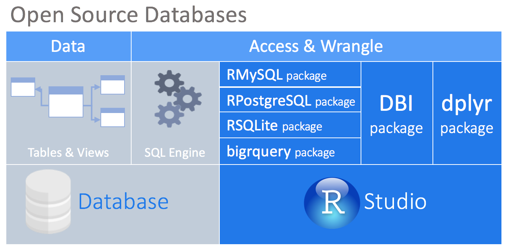
<br>


</div>
`Credit` [db.rstudio.com](https://db.rstudio.com/)
]


---
# Talking to databases

.pull-left[
## dplyr as a database interface

- Good news: `dplyr` is able to interact with databases directly by translating the `dplyr` verbs into SQL queries. This convenient feature allows you to "speak" directly with the database from R.
- Using `dplyr` as an interface allows you to:
  1. Run data exploration routines over all of the data, instead of importing part of the data into R.
  2. Use the SQL Engine to run the data transformations. In effect, computation is being pushed to the database.
  3. Collect into R only a targeted dataset.
  4. Keep all your code in R. There is no need to alternate between languages or tools to perform the data exploration.
]

.pull-right-center[
<br>
<div align="center">

</div>
`Credit` [db.rstudio.com](https://db.rstudio.com/)
]


---
# A hands-on database session with R

Before we start, we load the `DBI` package to connect to a DBMS and the `RSQLite` package to communicate with an SQLite database. Tidyverse and `dplyr`/`dbplyr` will be used, too. Also, we will rely on `nycflights13` for some toy data sets.

```{r}
library(DBI)
library(RSQLite)
library(tidyverse)
library(nycflights13)
```

---
# Connecting to the database

Now, let's set up a connection with an SQLite database. In fact, we will not interact with an existing one but build up our own, which will live in the memory:

```{r, echo = FALSE, cache = FALSE}
con <- dbConnect(RSQLite::SQLite(), dbname = "nycflightsdb")
knitr::opts_chunk$set(connection = "nycflightsdb")
```

```{r, eval = FALSE}
con <- dbConnect(RSQLite::SQLite(), dbname = ":memory:")
```

`con` represents our database connection via which we'll interact with the database.

--

The arguments to `DBI::dbConnect()` vary from database to database, but the first argument is always the database backend. For instance, it’s `RSQLite::SQLite()` for RSQLite, `RMariaDB::MariaDB()` for RMariaDB, `RPostgres::Postgres()`, and `bigrquery::bigquery()` for BigQuery.

--

Also, in real life, chances are that the database lives on a server and you have to authenticate to connect to it. This could look as follows:

```{r, eval = FALSE}
con <- DBI::dbConnect(RSQLite::SQLite(), 
                      host = "mydatabase.host.com",
                      user = "simon",
                      password = "mypassword"
)
```


---
# Filling the database

Next, we upload a local data frame into the remote data source; here: our database. Note that this is specific to our (toy) example. You'll probably not have to build up your own database.

```{r, cache = FALSE}
dplyr::copy_to(
  dest = con, 
  df = nycflights13::flights, 
  name = "flights")
```


---
# Filling the database

Next, we upload a local data frame into the remote data source; here: our database. Note that this is specific to our (toy) example. You'll probably not have to build up your own database.

```{r, eval = FALSE}
dplyr::copy_to(
  dest = con, 
  df = nycflights13::flights, 
  name = "flights",
  temporary = FALSE, 
  indexes = list(
    c("year", "month", "day"), 
    "carrier", 
    "tailnum",
    "dest"
  )
)
```

We can also explicitly set up indexes that will allow us to quickly process the data by day, carrier, plane, and destination. While creating the right indices is key to good database performance, in common applications this will be taken care of by the database maintainer.


---
# Querying the database

Now it's time to start querying our database. First, we generate reference table from the database using `dplyr`'s `tbl`():

```{r, cache = FALSE}
flights_db <- tbl(con, "flights")
```

Note that `flights_db` is a remote source; the table is not stored in our local environment. We can use it as a "pointer" to the actual database. Next, we perform various queries, such as:

```{r}
flights_db %>% select(year:day, dep_delay, arr_delay)
```

Yes, we can use `dplyr` syntax to do database queries! 


---
# Querying the database

The most important difference between ordinary data frames and remote database queries is that your R code is translated into SQL and executed in the database on the remote server, not in R on your local machine. When working with databases, **`dplyr` tries to be as lazy as possible**:
 - It never pulls data into R unless you explicitly ask for it.
 - It delays doing any work until the last possible moment: it collects together everything you want to do and then sends it to the database in one step.

This even applies when you assign the output of a database query to an object:

```{r}
tailnum_delay_db <- flights_db %>% 
  group_by(tailnum) %>%
  summarise(
    delay = mean(arr_delay),
    n = n()
  ) %>% 
  arrange(desc(delay)) %>%
  filter(n > 100)
```

---
# Querying the database

Laziness also has some downsides. Because there’s generally no way to determine how many rows a query will return unless you actually run it, nrow() is always NA:

```{r, error = TRUE}
nrow(tailnum_delay_db)
```

Because you can’t find the last few rows without executing the whole query, you can’t use tail():

```{r, error = TRUE}
tail(tailnum_delay_db)
```

If you then want to pull the data into a local data frame, use `dplyr::collect()`:

```{r, warning = FALSE}
tailnum_delay <- tailnum_delay_db %>% collect()
tailnum_delay
```

---

# Using SQL directly in R

- Again, because it is so cool: Yes, we can use `dplyr` syntax to do database queries! 
- Behind the scenes, `dplyr` is translating your R code into SQL. 
- The `dbplyr` package is doing the work for us.
- You can use the `show_query()` function to display the SQL code that was used to generate a queried table: 

```{r, warning = FALSE}
tailnum_delay_db %>% show_query()
```

- If you still want to formulate SQL queries and pass them on to the DBMS, use `DBI::dbGetQuery()`:

```{r}
sql_query <- "SELECT * FROM flights WHERE dep_delay > 240.0 LIMIT 5"
dbGetQuery(con, sql_query)
```

```{r, echo = FALSE}
DBI::dbDisconnect(con)
```


---
# More useful resources to get started with R and databases

A comprehensive overview of database interaction using R from RStudio at [db.rstudio.com](https://db.rstudio.com/getting-started/overview). This also features a set of best practices that go beyond what we covered today.

[Databases 101](https://raw.githack.com/uo-ec607/lectures/master/16-databases/16-databases.html) by Grant McDermott, also featuring example code to connect to Google BigQuery.

An [introduction to `dbplyr`](https://cran.r-project.org/web/packages/dbplyr/vignettes/dbplyr.html) coming as a package vignette.


---
class: inverse, center, middle
name: summary

# Summary

<html><div style='float:left'></div><hr color='#EB811B' size=1px style="width:1000px; margin:auto;"/></html>

---
# Summing it up

.pull-left[
Most data scientists **never design a database**. 

- But they almost all end up interacting with them.
- Also, with database administrators (DBAs).

Lots of academic data work consists of working with *bad re-inventions* of the relational database.

- Looking at you, Excel users.
- Looking at you, instructor.

Thinking about data relationally **will help you with statistics**.

- Multilevel models, time-series, network analysis, NLP
]

.pull-right[
</br>

| Database concept  |  Statistical concept |
|---|---|
| Table  | Sample |
| Column  | Variable |
|  Row |  Unit |
|  Value |  Observation |
|  Foreign key relationships |  Nested variables |
|  Many-to-many relationships |  Crossed variables (possibly unbalanced) |
]

---
class: center
background-image: url("pics/excel-not-database-simpsons.png")
background-size: contain
background-color: #000000

# Databases: Maybe not the most exciting technology...

<br><br><br><br><br><br><br><br><br><br><br><br><br><br><br><br><br>
<p style="background-color:black;color:white;"><b>... but awesomely useful and not going away.</b></p>


---

# Coming up

<br><br> 

### Assignment

None! But you'll get the chance to practice databasing with R in the lab.


### Next lecture

Web data and technologies - relational data structures FTW!


