```{css, echo=FALSE} 
@media print { # print out incremental slides; see https://stackoverflow.com/questions/56373198/get-xaringan-incremental-animations-to-print-to-pdf/56374619#56374619
  .has-continuation {
    display: block !important;
  }
}
```

```{r setup, include=FALSE}
# figures formatting setup
options(htmltools.dir.version = FALSE)
library(knitr)
opts_chunk$set(
  prompt = T,
  fig.align="center", #fig.width=6, fig.height=4.5, 
  # out.width="748px", #out.length="520.75px",
  dpi=300, #fig.path='Figs/',
  cache=F, #echo=F, warning=F, message=F
  engine.opts = list(bash = "-l")
  )

## Next hook based on this SO answer: https://stackoverflow.com/a/39025054
knit_hooks$set(
  prompt = function(before, options, envir) {
    options(
      prompt = if (options$engine %in% c('sh','bash')) '$ ' else 'R> ',
      continue = if (options$engine %in% c('sh','bash')) '$ ' else '+ '
      )
})

library(tidyverse)
```


# Table of contents

<br>

1. [Web data for data science](#webdata)

2. [HTML basics](#html)

3. [XPath basics](#xpath)

4. [CSS basics](#css)

5. [Scraping static webpages with R](#scrapingstatic)

6. [Web scraping: good practice](#goodpractice)

7. [Summary](#summary)


---
class: inverse, center, middle
name: webdata

# Web data for data science

<html><div style='float:left'></div><hr color='#EB811B' size=1px style="width:1000px; margin:auto;"/></html>


---
# What is web data?

<br>
<div align="center">
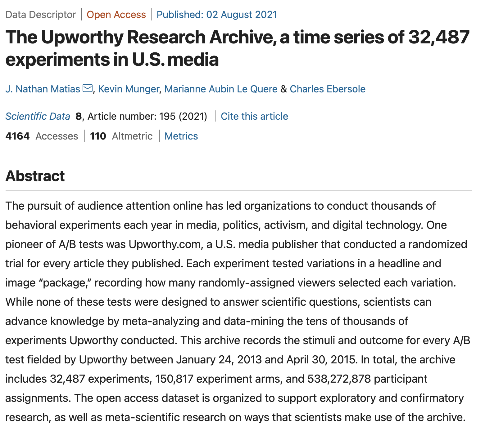

</div>


---
# What is web data? (cont.)

<br>
<div align="center">
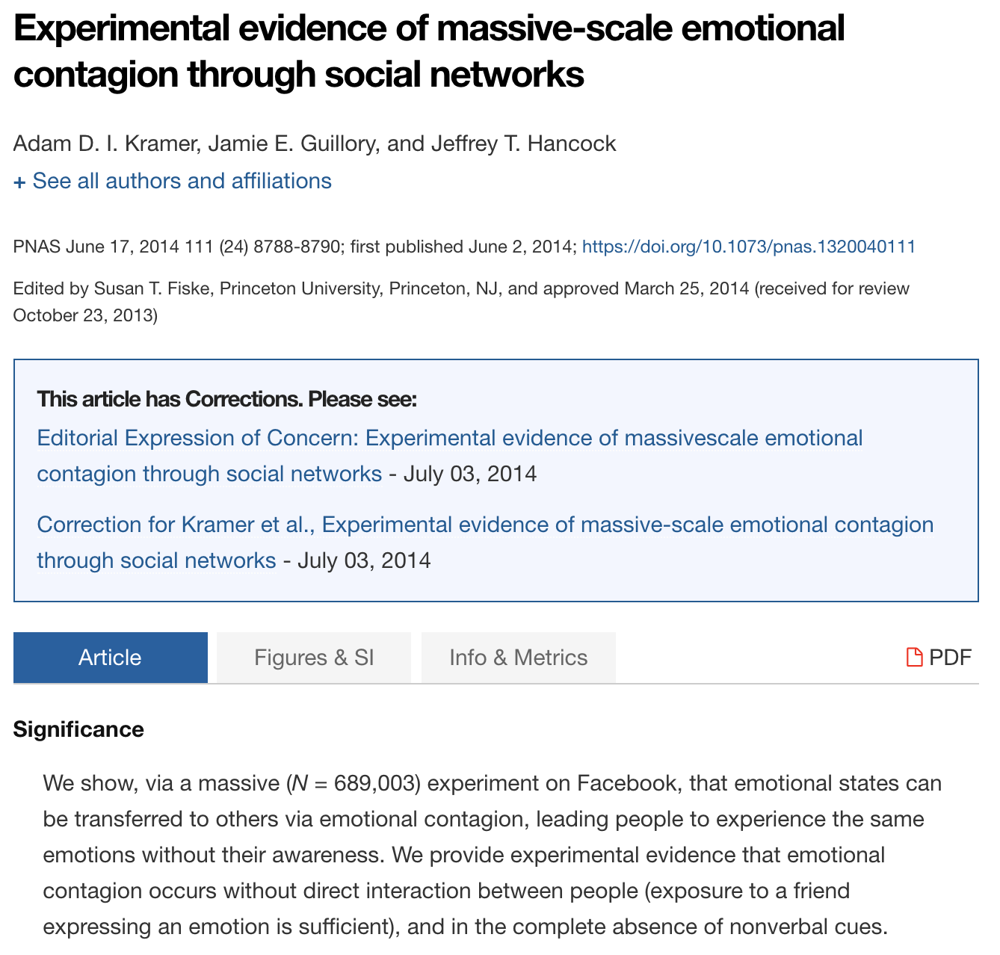
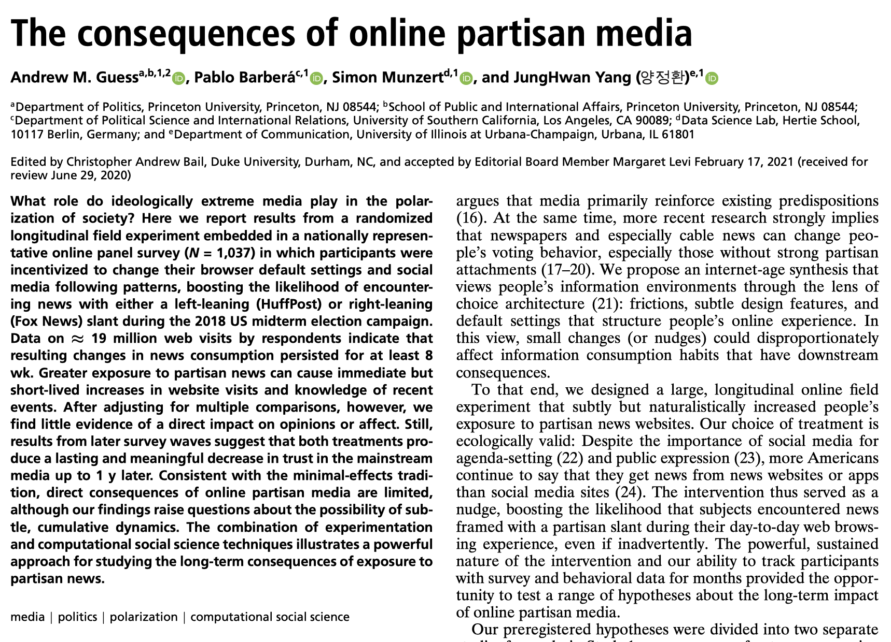
</div>

---
# What is web data? (cont.)

.pull-left[

### So what is web data, really?

- Not all data you get from the web is "web data".
- Web data is **data that is created on, for, or via the web**. By that definition, a survey dataset that you download from a data repository is not web data.
- On the other hand, survey data collected online (i.e., web/mobile questionnaires) is web data but we don't consider it in today's session.
- Examples of web data: 
  - Online news articles
  - Social media network structures
  - Crowdsourced databases (e.g., Wikidata)
  - Server logs (e.g., viewership statistics)
  - Data from surveys, experiments, clickworkers
  - Just any website
  
]

--

.pull-right[

### And why is web data attractive?

- Data is abundant online.
- Human behavior increasingly takes place online.
- Countless services track human behavior.
- Getting data from the web is cheap and often quick.
- An analysis workflow that involves web data can often be easily updated.
- The vast majority of web data was not created with a data analysis purpose in mind. This fact is often a feature, not a bug.

<p style="color:red">
Today, we focus on one particular way of collecting data from the web: <b>web scraping</b>. This also limits the type of web data we'll be talking about (basically: data from static webpages). But it'll be fun nevertheless.
</p>

]


---
# Web scraping

.pull-left[

### What is web scraping?

1. Pulling (unstructured) data from websites (HTMLs)
2. Bringing it into shape (into an analysis-ready format)

### The philosophy of scraping with R

- No point-and-click procedure
- Script the entire process from start to finish
- **Automate**
  - The downloading of files
  - The scraping of information from web sites
  - Tapping APIs
  - Parsing of web content
  - Data tidying, text data processing
- Easily scale up scraping procedures
- Scheduling of scraping tasks
]

.pull-right-center[
<br>
<div align="center">

</div>
`Credit` [prowebscraping.com](http://prowebscraping.com/web-scraping-vs-web-crawling/)
]

---
# Technologies of the world wide web

.pull-left[

- To fully unlock the potential of web data for data science, we draw on certain web technologies.
- Importantly, often a basic understanding of these technologies is sufficient as the focus is on web data collection, not [web development](https://en.wikipedia.org/wiki/Web_development).
- Specifically, we have to understand
  - How our machine/browser/R communicates with web servers (→ **HTTP/S**)
  - How websites are built (→ **HTML**, **CSS**, basics of **JavaScript**)
  - How content in webpages can be effectively located (→ **XPath**, **CSS selectors**)
  - How dynamic web applications are executed and tapped (→ **AJAX**, **Selenium**)
  - How data by web services is distributed and processed (→ **APIs**, **JSON**, **XML**)
  
]

.pull-right-center[
<div align="center">
<br>
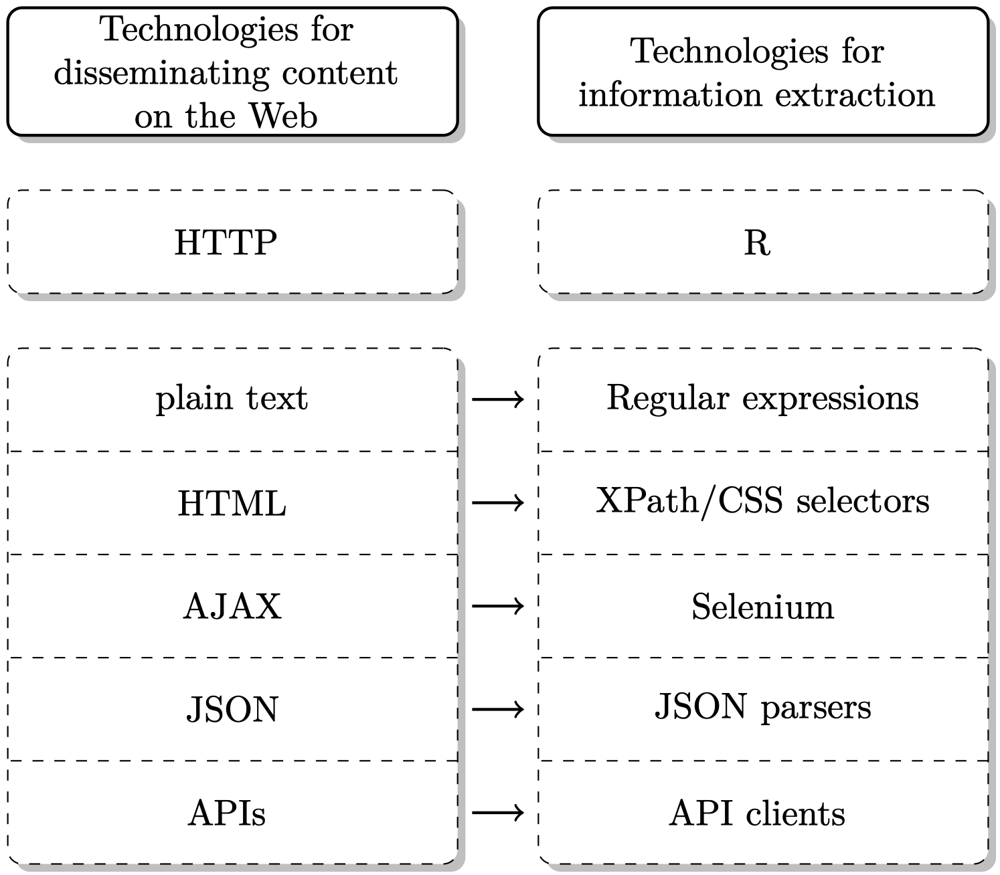
</div>
`Credit` [ADCR](http://r-datacollection.com/)
]


---
class: inverse, center, middle
name: html

# HTML basics

<html><div style='float:left'></div><hr color='#EB811B' size=1px style="width:1000px; margin:auto;"/></html>


---
# HTML background

.pull-left-wide[

### What is HTML?

- **H**yper**T**ext **M**arkup **L**anguage
- Markup language = plain text + markups
- Originally specified by [Tim Berners-Lee](https://en.wikipedia.org/wiki/Tim_Berners-Lee) at [CERN](https://en.wikipedia.org/wiki/CERN) in 1989/90 
- [W3C](https://en.wikipedia.org/wiki/World_Wide_Web_Consortium) standard for the construction of websites.
- The fundamentals of HTML haven't changed much recently. Current version is HTML 5.2 (published in 2017). 


### What is it good for?

- In the early days, the internet was mainly good for sharing texts. But plain text is boring. <span style="font-family:Comic Sans MS">Markup</span> <span style="color:purple">is</span> *fun*!
- HTML lies underneath of what you see in your browser. You don't see it because your browser interprets and renders it for you.
- A basic understanding of HTML helps us locate the information we want to retrieve.

]

.pull-right-small-center[

<br>
<div align="center">

<br><br>

</div>

]


---
# HTML tree structure

.pull-left[

### The DOM tree

- HTML documents are hierarchically structured. Think of them as a tree with multiple nodes and branches.
- When a webpage (HTML resource) is loaded, the browser creates a [Document Object Model](https://en.wikipedia.org/wiki/Document_Object_Model) of that page - the **DOM Tree**.
- Think of it as a representation that considers all HTML elements as objects than can be accessed.

### Parts of the tree

- The DOM is constituted of **nodes**, which are just data types that can be referred to - such as "attribute node", "text node", or "element node".
- A **node set** is a set of nodes. This will become relevant when you learn about XPath, which you can use to access multiple nodes (e.g., all `title` nodes).
]

.pull-right[

```{html, prompt = FALSE, eval = FALSE}
<!DOCTYPE html> 
  <html> 
    <head>
      <title id=1>First HTML</title>
    </head>
  <body>
    I am your first HTML file! 
  </body>
</html>
```

<div align="center">
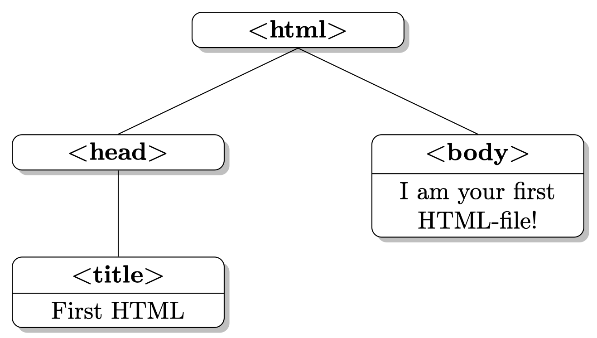
</div>
]

---
# HTML: elements and attributes

.pull-left[
### Elements

- Elements are a combination of start tags, content, and end tags.
- Example: `<title>First HTML</title>`
- An element is everything from (including) the element's start tag to (including) the element's end tag, but also other elements that are nested within that element.
- Syntax:

| Component  |  Representation |
|---|---|
| Element title  | `title` |
|  Start tag |  `<title>` |
|  End tag |  `</title>` |
|  Value |  `First HTML` |
]

.pull-right[
### Attributes

- Describe elements and are stored in the start tag.
- There are specific attributes for specific elements.
- Example: `<a href="http://www.r-datacollection.com/">Link to Homepage</a>`
- Syntax:
  - Name-value pairs: `name="value"`
  - Simple and double quotation marks possible
  - Several attributes per element possible
  
### Why tags and attributes are important

- Tags structure HTML documents.
- In the context of web scraping, the structure can be exploited to locate and extract data from websites.

]

---
# Important tags and attributes

### Anchor tag `<a>`

- Links to other pages or resources.
- Classical links are always formatted with an anchor tag.
- The `href` attribute determines the target location.
- The value is the name of the link.

Link to another resource:
```{html, eval = FALSE, prompt = FALSE}
<a href="en.wikipedia.org/wiki/List_of_lists_of_lists">Link with absolute path</a>
```

Reference within a document:
```{html, eval = FALSE, prompt = FALSE}
<a id="top">Reference point</a>
```

Link to a reference within a document:
```{html, eval = FALSE, prompt = FALSE}
<a href="#top">Link to reference point</a>
```

---
# Important tags and attributes

### Heading tags `<h1>`, `<h2>`, ..., and paragraph tag `<p>`

- Structure text and paragraphs.
- Heading tags range from level 1 to 6.
- Paragraph tag induces a line break.

Examples:
```{html, eval = FALSE, prompt = FALSE}
<p>This text is going to be a paragraph one day and separated from other text by line breaks.</p>
```

```{html, eval = FALSE, prompt = FALSE}
<h1>heading of level 1 - this will be BIG</h1>
...
<h6>heading of level 6 - the smallest heading</h6>
```


---
# Important tags and attributes

### Listing tags `<ul>`, `<ol>`, and `<dl>`

- The `<ol>` tag creates a numeric list.
- The `<ul>` tag creates an unnumbered list.
- The `<dl>` tag creates a description list.
- List elements within `<ol>` and `<ul>` are indicated with the `<li>` tag.

Example:
```{html, prompt = FALSE, eval = FALSE}
<ul>
  <li>Dogs</li>
  <li>Cats</li>
  <li>Fish</li>
</ul>
```


---
# Important tags and attributes

### Organizational and styling tags `<div>` and `<span>`

- They are used to group content over lines (`<div>`, creating a block-level element) or within lines (`<span>`, creating an inline-element).
- By grouping or dividing content into blocks, it's easier to identify or apply different styling to them.
- They do not change the layout themselves but work together with CSS (see later!).

.pull-left[
Example of CSS definition:

```{css, prompt = FALSE, eval = FALSE}
div.happy {
  color:pink; 
  font-family:"Comic Sans MS";
  font-size:120% 
} 
span.happy { 
  color:pink; 
  font-family:"Comic Sans MS"; 
  font-size:120% 
}
```
]

.pull-right[
In the HTML document:

```{html, prompt = FALSE, eval = FALSE}
<div class="happy">
  <p>I am a happy-styled paragraph</p>
</div>
  
unhappy text with <span class="happy">some 
happiness</span>
```
]


---
# Important tags and attributes

### Form tag `<form>`

- Allows to incorporate HTML forms.
- Client can send information to the server via forms.
- Whenever you type something into a field or click on radio buttons in your browser, you are interacting with forms.

Example:

```{html, prompt = FALSE, eval = FALSE}
<form name="submitPW" action="Passed.html" method="get">
  password:
  <input name="pw" type="text" value="">
  <input type="submit" value="SubmitButtonText"
</form>
```


---
# Important tags and attributes

### Table tags `<table>`, `<tr>`, `<td>`, and `<th>`

- Standard HTML tables always follow a standard architecture.
- The different tags allow defining the table as a whole, individual rows (including the heading), and cells.
- If the data is hidden in tables, scraping will be straightforward.

Example:

```{html, prompt = FALSE, eval = FALSE}
<table> 
  <tr> <th>Rank</th> <th>Nominal GDP</th> <th>Name</th> </tr> 
  <tr> <th></th> <th>(per capita, USD)</th> <th></th> </tr> 
  <tr> <td>1</td> <td>170,373</td> <td>Lichtenstein</td> </tr> 
  <tr> <td>2</td> <td>167,021</td> <td>Monaco</td> </tr> 
  <tr> <td>3</td> <td>115,377</td> <td>Luxembourg</td> </tr> 
  <tr> <td>4</td> <td>98,565</td> <td>Norway</td> </tr> 
  <tr> <td>5</td> <td>92,682</td> <td>Qatar</td> </tr>
</table>
```


---
# More resources on HTML

.pull-left-wide[

### More HTML
- All in all there are over 100 HTML elements.
- But overall, it's still a fairly tight and easy-to-understand markup language.
- Knowing more about the rest is probably not necessary to become a good web scraper, but it helps parsing (in your brain) HTML documents quicker.

### More resources
- Check out the excellent [MDN Web Docs](https://developer.mozilla.org/en-US/docs/Web/HTML) for an overview, which also point to additional tutorials and references.
- The [W3Schools tutorials](https://www.w3schools.com/) are also a classic.
- While you're at it, you might also want to learn about related technologies such as CSS (used to specify a webpage's appearance/layout) and JavaScript (used to enrich HTMLs with additional functionality and options to interact).

]

.pull-right-small[
<div align="center">
<br><br><br>
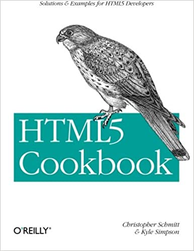
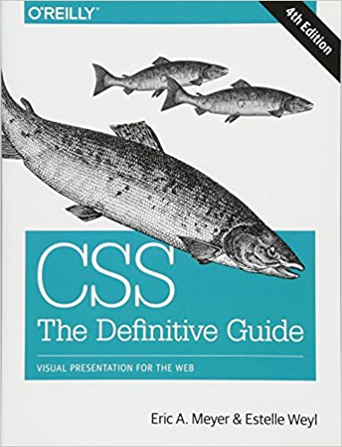
<br>
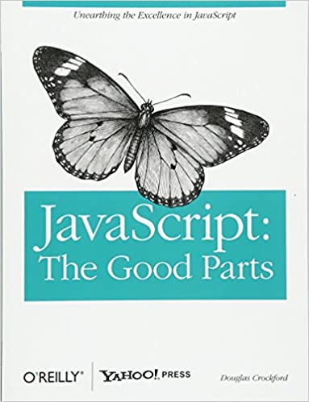
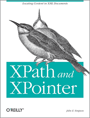
</div>
]


---
# Accessing the web using your browser vs. R

.pull-left-wide[

### Using your browser to access webpages

1. You click on a link, enter a URL, run a Google query, etc.
2. Browser/your machine sends request to server that hosts website.
3. Server returns resource (often an HTML document).
4. Browser interprets HTML and renders it in a nice fashion.

### Using R to access webpages

1. You manually specify a resource.
2. R/your machine sends a request to the server that hosts the website.
3. The server returns a resource (e.g., an HTML file).
4. R parses the HTML, but does not render it in a nice fashion.
5. It's up to you to tell R what content to extract.

]

.pull-right-small[
<div align="center">
<br><br>

<br><br><br>

</div>
]


---
# Interacting with your browser

### On web browsers

- Modern browsers are complex pieces of software that take care of multiple operations while you browse the web. And they're basically all doing a good job.<sup>1</sup> Common operations are to retrieve resources, render and display information, and provide interface for user-webpage interaction.
- Although our goal is to automate web data retrieval, the browser is an important tool in web scraping workflow.

### The use of browsers for web scraping

- Give you an intuitive impression of the architecture of a webpage
- Allow you to inspect the source code
- Let you construct XPath/CSS selector expressions with plugins
- Render dynamic web content (JavaScript interpreter)

.footnote[<sup>1</sup> Check out this Wikipedia article on the [Browser Wars](https://en.wikipedia.org/wiki/Browser_wars) that happened in the 1990s and 2000s (yes, there was Browser War I and Browser War II - and for once Germany was not to blame) to relive some of your instructor's pains when he started to look into this "internet".]


---
# Inspecting HTML source code

.pull-left-small[
<br><br><br>
- Goal: retrieving data from a Wikipedia page on [List of tallest buildings](https://en.wikipedia.org/wiki/List_of_tallest_buildings)
- Right-click on page (anywhere)
- Select `View Page Source`
- HTML (CSS, JavaScript) code can be ugly
- But looking more closely, we find the displayed information
]

.pull-right-wide[
<br>
<video width="768" height="432" controls>
  <source src="pics/inspect-pagesource.mp4" type="video/mp4">
Your browser does not support the video tag.
</video>
]


---
# Inspecting the live HTML source code with the DOM explorer

.pull-left-small[
- Goal: retrieving data from a Wikipedia page on [List of tallest buildings](https://en.wikipedia.org/wiki/List_of_tallest_buildings)
- Right-click on the element of interest
- Select `Inspect`
- The Web Developer Tools window pops up
- Corresponding part in the HTML tree is highlighted
- Interaction with the tree possible!
]

.pull-right-wide[
<video width="768" height="432" controls>
  <source src="pics/inspect-pagedom.mp4" type="video/mp4">
Your browser does not support the video tag.
</video>
]

---
# When to do what with your browser

.pull-left-wide[

### When to inspect the complete page source

- Check whether data is in static source code (the search function helps!)
- For small HTML files: understand structure

### When to use the DOM explorer

- Almost always
- Particularly useful to construct XPath/CSS selector expressions
- To monitor dynamic changes in the DOM tree

### A note on browser differences

- Inspecting the source code (as shown on the following slides) works more or less identically in Chrome and Firefox.
- In Safari, go to → `Preferences`, then → `Advanced` and select `Show Develop menu in menu bar`. This unlocks the `Show Page Source` and `Inspect` options and the Web Developer Tools.
]

.pull-right-small-center[
<br>
<div align="center">
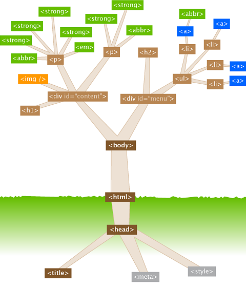
</div>

`Credit` [watershedcreative.com](http://watershedcreative.com/naked/html-tree.html)
]


---
class: inverse, center, middle
name: xpath

# XPath basics

<html><div style='float:left'></div><hr color='#EB811B' size=1px style="width:1000px; margin:auto;"/></html>

---
# Accessing the DOM tree with R

### Different perspectives on HTML

- HTML documents are human-readable.
- HTML tags structure the document, comprising the DOM.
- **Web user perspective**: The browser interprets the code and renders the page.
- **Web scraper perspective**: Parse the document retaining the structure, use the tree/tags to locate information.

--

### HTML parsing

- Our goal is to get HTML into R while retaining the tree structure. That's similar to getting a spreadsheet into R and retaining the rectangular structure.
- HTML is human-readable, so we could also import HTML files as plain text via `readLines()`. That's a bad option though - the document's structure would not be retained.
- The `xml2` package allows us to parse XML-style documents. HTML is a "flavor" of XML, so it works for us.
- The `rvest` package, which we will mainly use for scraping, wraps the `xml2` package, so we rarely have to load it manually. 
- There is one high-level function to remember: `read_html()`. It represents the HTML in a list-style fashion.

---
# Accessing the DOM tree with R (cont.)

### Getting HTML into R

Parsing a website is straightforward:

```{r, eval = TRUE, message= FALSE}
library(rvest)
parsed_doc <- read_html("https://google.com")
parsed_doc
```

There are various functions to inspect the parsed document. They aren't really helpful - better use the browser instead if you want to dive into the HTML.

```{r, eval = FALSE, message= FALSE}
xml2::html_structure(parsed_doc)
xml2::as_list(parsed_doc)
```

---
# What's XPath?

### Definition

- Short for **XML Path Language**, another W3C standard.
- A query language for XML-based documents (including HTML).
- With XPath we can access node sets (e.g., elements, attributes) and extract content.

### Why XPath for web scraping?

- Source code of webpages (HTML) structures both layout and content.
- Not only content, but context matters!
- XPath enables us to extract content based on its location in the document (and potentially other features).
- With XPath, we can tell R to do things like:
  1. Give me all `<li>` elements in the document!
  2. Look for all `<table>` elements in the document and give me the third one!
  3. Extract all content in `<p>` elements that is labelled with `class=newscontent`! 


---
# Example: source code

```{html, prompt = FALSE, eval = FALSE}
<!DOCTYPE HTML PUBLIC "-//IETF//DTD HTML//EN">
<html> 
 <head>
  <title>Collected R wisdoms</title>
 </head>
 <body>
  <div id="R Inventor" lang="english" date="June/2003">
   <h1>Robert Gentleman</h1>
    <p><i>'What we have is nice, but we need something very different'</i></p>
    <p><b>Source: </b>Statistical Computing 2003, Reisensburg</p>
  </div>
  <div lang="english" date="October/2011">
   <h1>Rolf Turner</h1>
    <p><i>'R is wonderful, but it cannot work magic'</i> 
    <br><emph>answering a request for automatic generation of 'data from a known mean and 95% CI'</emph></p>
    <p><b>Source: </b><a href="https://stat.ethz.ch/mailman/listinfo/r-help">R-help</a></p>
  </div>
  <address>
   <a href="http://www.rdatacollectionbook.com"><i>The book homepage</i></a>
  </address>
 </body> 
</html>
```

---
# Example: DOM tree

<div align="center">
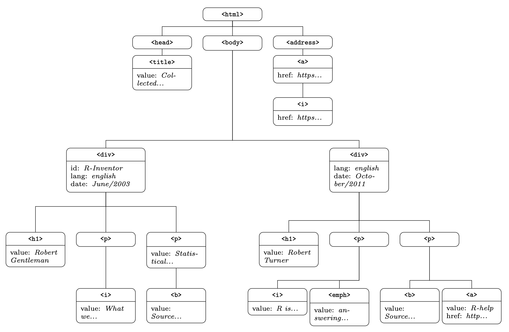
</div>


---
# Applying XPath on HTML in R

- Load package `rvest`
- Parse HTML document with `read_html()`

```{r, eval = TRUE, message= FALSE}
library(rvest)
parsed_doc <- read_html("materials/fortunes.html")
parsed_doc
```

- Query document using `html_elements()`
- `rvest` can process XPath queries as well as CSS selectors.
- Today, we'll focus on XPath:

```{r, eval = TRUE, message= FALSE}
html_elements(parsed_doc, xpath = "//div[last()]/p/i")
```


---
# Grammar of XPath

### Basic rules

1. We access nodes/elements by writing down the hierarchical structure in the DOM that locates the element set of interest.
2. A sequence of nodes is separated by `/`.
3. The easiest localization of a element is given by the absolute path (but often not the most efficient one!).
4. Apply XPath on DOM in R using `html_elements()`.

```{r, eval = TRUE, message= FALSE}
html_elements(parsed_doc, xpath = "//div[last()]/p/i")
```


---
# Grammar of XPath

### Absolute vs. relative paths

**Absolute paths** start at the root element and follow the whole way down to the target element (with simple slashes, `/`).

```{r, eval = TRUE, message= FALSE}
html_elements(parsed_doc, xpath = "/html/body/div/p/i")
```

**Relative paths** skip nodes (with double slashes, `//`).

```{r, eval = TRUE, message= FALSE}
html_elements(parsed_doc, xpath = "//body//p/i")
```

Relative paths are often preferrable. They are faster to write and more comprehensive. On the other hand, they are less targeted and therefore potentially less robust, and running them takes more computing time, as the entire tree has to be evaluated. But that's usually not relevant for reasonably small documents.

---
# Grammar of XPath

### The wildcard operator

- Meta symbol `*`
- Matches any element
- Works only for one arbitrary element
- Far less important than, e.g., wildcards in content-based queries (regex!)

```{r, eval = TRUE, message= FALSE}
html_elements(parsed_doc, xpath = "/html/body/div/*/i")

# the following does not work:
html_elements(parsed_doc, xpath = "/html/body/div/*/i")
```

---
# Grammar of XPath

### Navigational operators `"."`and `".."`

- `"."` accesses elements on the same level ("self axis"), which is useful when working with predicates (see later!).
- `".."` accesses elements at a higher hierarchical level.

```{r, eval = TRUE, message= FALSE}
html_elements(parsed_doc, xpath = "//title/..")
```

```{r, eval = TRUE, message= FALSE}
html_elements(parsed_doc, xpath = "//div[starts-with(./@id, 'R')]")
```


---
# Element (node) relations ("axes") in XPath

.pull-left[
### Family relations between elements

- The tools learned so far are sometimes not sufficient to access specific elements without accessing other, undesired elements as well.
- Relationship statuses are useful to establish unambiguity. 
- Can be combined with other elements of the grammar
- Basic syntax: `element1/relation::element2`
- We describe relation of `element2` to `element1`
- `element2` is to be extracted - we always extract the element at the end!
]

.pull-right[
<div align="center">
<br>
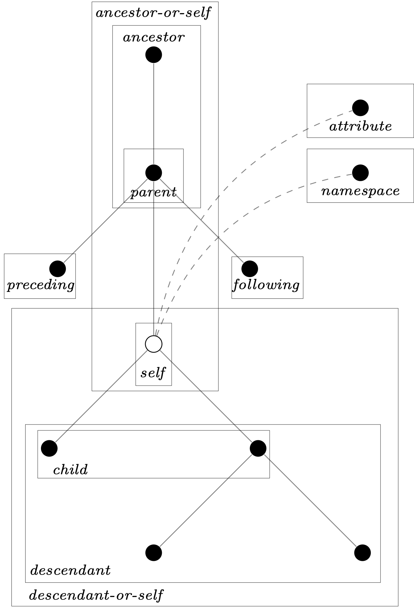
</div>
]

---
# Element (node) relations in XPath

| <div style="width:230px">Axis name</div> |  Description |
|---|---|
| `ancestor`  | All ancestors (parent, grandparent etc.) of the current element |
| `ancestor-or-self` | All ancestors of the current element and the current element itself |
| `attribute` |  All attributes of the current element |
| `child` | All children of the current element  |
| `descendant` | All descendants (children, grandchildren etc.) of the current element  |
| `descendant-or-self` |  All descendants of the current element and the current element itself |
| `following` | Everything in the document after the closing tag of the current element  |
| `following-sibling`  | All siblings after the current element  |
| `parent` | The parent of the current element  |
| `preceding` | All elements that appear before the current element, except ancestors/attribute elements  |
| `preceding-sibling` | All siblings before the current element  |
| `self` | The current element  |

---
# Element (node) relations in XPath

Example: access the `<div>` elements that are ancestors to an `<a>` element:

```{r, eval = TRUE, message= FALSE}
html_elements(parsed_doc, xpath = "//a/ancestor::div")
```

Another example: Select all `<h1>` nodes that precede a `<p>` node:

```{r, eval = TRUE, message= FALSE}
html_elements(parsed_doc, xpath = "//p/preceding-sibling::h1")
```


---
# Predicates

### What are predicates?

- Predicates are conditions based on an element's features (`true/false`).
- Think of them as ways to filter nodesets.
- They are applicable to a variety of features: name, value attribute.
- Basic syntax: `element[predicate]`

Select all first `<p>` elements that are children of a `<div>` element, using a **numeric predicate**:

```{r, eval = TRUE, message= FALSE}
html_elements(parsed_doc, xpath = "//div/p[1]")
```

--

Can you find out what the following expressions do? 

```{r, eval = FALSE, message= FALSE}
html_elements(parsed_doc, xpath = "//div/p[last()-1]") 
html_elements(parsed_doc, xpath = "//div[count(./@*)>2]")
html_elements(parsed_doc, xpath = "//*[string-length(text())>50]")
```

---
# Predicates (cont.)

Select all `<div>` nodes that contain an attribute named `’October/2011’`, using a **textual predicate**:

```{r, eval = TRUE, message= FALSE}
html_elements(parsed_doc, xpath ="//div[@date='October/2011']")
```

Rudimentary string matching is also possible using string functions like `contains()`, `starts-with()`, or `ends-with()`.

--

Can you tell what the following calls do?

```{r, eval = FALSE, message= FALSE}
html_elements(parsed_doc, xpath = "//div[starts-with(./@id, 'R')]")
html_elements(parsed_doc, xpath = "//div[substring-after(./@date, '/')='2003']//i")
```

---
# Content extraction 

- Until now, we used XPath expressions to extract complete nodes or nodesets (that is, elements with tags).
- However, in most cases we're interested in extracting the content only.
- To that end, we can use extractor functions that are applied on the output of XPath query calls.

| Function  |  Argument | Return value |
|---|---|---|
| `html_text()` |  | Element value |
| `html_text2()` |  | Element value (with a bit more cleanup) |
| `html_attr()` | `name` | Element attribute |
| `html_attrs()` |  | (All) element attributes |
| `html_name()` | `trim` | Element name |
| `html_children()` |  | Element children |


---
# Content extraction (cont.)

Extracting **element values/content**:

```{r, eval = TRUE}
html_elements(parsed_doc, xpath = "//title") %>% html_text2()
```

Extracting **attributes**:

```{r, eval = TRUE}
html_elements(parsed_doc, xpath = "//div[1]") %>% html_attrs()
```

Extracting **attribute values**:

```{r, eval = TRUE}
html_elements(parsed_doc, xpath = "//div") %>% html_attr("lang")
```


---
# More XPath?

### Training resources

- XPath is a little language of its own. As always with languages, mastery comes with practice.
- A good environment for practice is the [XPath expression testbed at whitebeam.org](http://www.whitebeam.org/library/guide/TechNotes/xpathtestbed.rhtm).
- Also check out this [cheat sheet](https://devhints.io/xpath).

### XPath creator tools

- Now, do you really have to construct XPath expressions by your own? No! At least not always.
- **SelectorGadget**: [http://selectorgadget.com](http://selectorgadget.com) is a browser plugin that constructs XPath statements via a point-and-click approach. The generated expressions are not always efficient and effective though (more on this later).
- Web developer tools - the internal browser functionality to study the DOM, among other things, also lets you extract XPath statements for selected nodes. These are specific to unique nodes/elements though, and therefore less helpful to extract node sets. (But they come in handy when we want to script live navigation, e.g. for Selenium.)


---
class: inverse, center, middle
name: css

# CSS basics

<html><div style='float:left'></div><hr color='#EB811B' size=1px style="width:1000px; margin:auto;"/></html>


---
# What is CSS?

.pull-left[
### Background

- **C**ascading **S**tyle **S**heets (CSS) is a style sheet language that allows web developers to adjust the "look and feel" of websites.
- By using CSS to adjust style features such as layout, colors, and fonts, it's easier to separate content (HTML) from presentation (CSS).

### Three ways to insert CSS into HTML

1. **External CSS.** Inside `<head>` with a reference to the external file inside the `<link>` element.
2. **Internal CSS.** Inside `<head>` and stored in `<style>` elements. 
3. **Inline CSS.** Inside `<body>` using the `style` attribute of elements.
  
]

--

.pull-right[
**External CSS**
```{html, prompt = FALSE, eval = FALSE}
<head>
  <link rel="stylesheet" href="mystyle.css">
</head>
```

**Internal CSS**
```{html, prompt = FALSE, eval = FALSE}
<head>
   <style>
      h1 {
         color: red;
         margin-left: 20px;
      }
   </style>
</head>
```

**Inline CSS**
```{html, prompt = FALSE, eval = FALSE}
<p style="color: blue;">This is a paragraph.</p>
```
]

---
# CSS selectors

.pull-left[

### Selectors

- CSS selectors find/select the HTML elements that should be styled.
- There are various categories of selectors. In addition to generic element selectors (which selected just based on the element name, such as `<p>`), we often care about:
  - **CSS id selectors**, which use the `id` attribute of an HTML element. Think of them as "labels", as in `<p id="para1">`. The respective CSS selector would be `#para1`.
  - **CSS class selectors**, which use the `class` attribute of an HTML element, as in `<p class = "center large">`. Note that these can refer to more than one class (here: `center` and `large`). The respective CSS selector would be `p.center.large`.

]

--

.pull-right[

### Writing CSS selectors

- Just as XPath, CSS selectors are a little language of their own.
- I won't teach you more about it, but you might nevertheless want to learn it.
- Check out the CSS diner tutorial at https://flukeout.github.io/. It's one of the best tutorials of anything out there.

<div align="center">
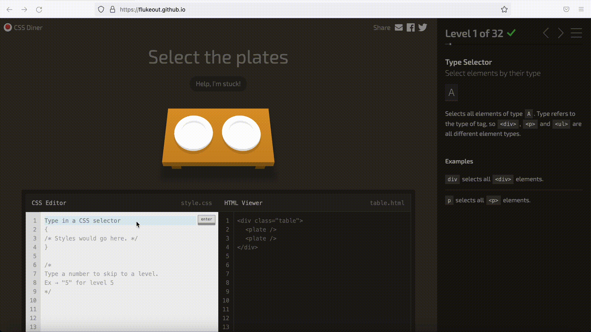
</div>
]


---
class: inverse, center, middle
name: scrapingstatic

# Scraping static webpages with R

<html><div style='float:left'></div><hr color='#EB811B' size=1px style="width:1000px; margin:auto;"/></html>


---
# The scraping workflow

.pull-left[
### Key tools for scraping static webpages

1. You are able to inspect HTML pages in your browser using the web developer tools.
2. You are able to parse HTML into R with `rvest`.
3. You are able to speak XPath (or CSS selectors).
4. You are able to apply XPath expressions with `rvest`.
5. You are able to tidy web data with R/`dplyr`/`regex`.


### The big picture

- Every scraping project is different, but the coding pipeline is fundamentally similar.
- The (technically) hardest steps are location (XPath, CSS selectors) and extraction (clean-up), sometimes the scaling (from one to multiple sources).
]

.pull-right[
<br><br><br>
<div align="center">
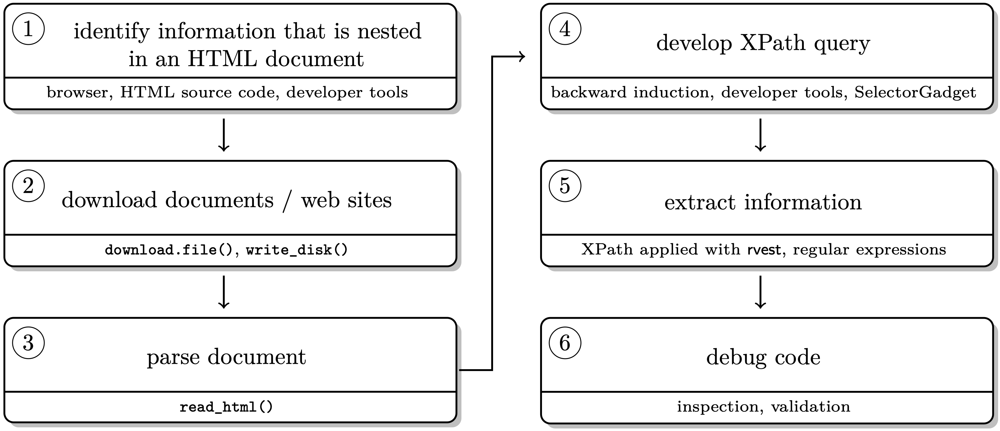
</div>
]

---
# Web scraping with rvest

.pull-left-wide[

`rvest` is a suite of scraping tools. It is part of the tidyverse and has made scraping with R much more convenient.

There are three key `rvest` verbs that you need to learn.<sup>1</sup>

1. `read_html()`: Read (parsing) an HTML resource.

2. `html_elements()`: Find elements that match a CSS selector or XPath expression.

3. `html_text2()`: Extract the text/value inside the node set.


]

.footnote[
<sup>1</sup> There is more in `rvest` than what we can cover today. Have a glimpse at the [overview at tidyverse.org](https://rvest.tidyverse.org/) and at this excellent (unofficial) [cheat sheet](https://github.com/yusuzech/r-web-scraping-cheat-sheet).
]


.pull-right-small-center[
<div align="center">
<br>

</div>
]


---
# Web scraping with rvest: example

.pull-left-vsmall[
- We are going to scrape a information from a Wikipedia article on women philosophers available at [https://en.wikipedia.org/wiki/](https://en.wikipedia.org/wiki/List_of_women_philosophers) [List_of_women_philosophers](https://en.wikipedia.org/wiki/List_of_women_philosophers).
- The article provides two types of lists - one by period and one sorted alphabetically. We want the alphabetical list.
- The information we are actually interested in - names - is stored in unordered list elements.
]

.pull-right-vwide[
<div align="center">
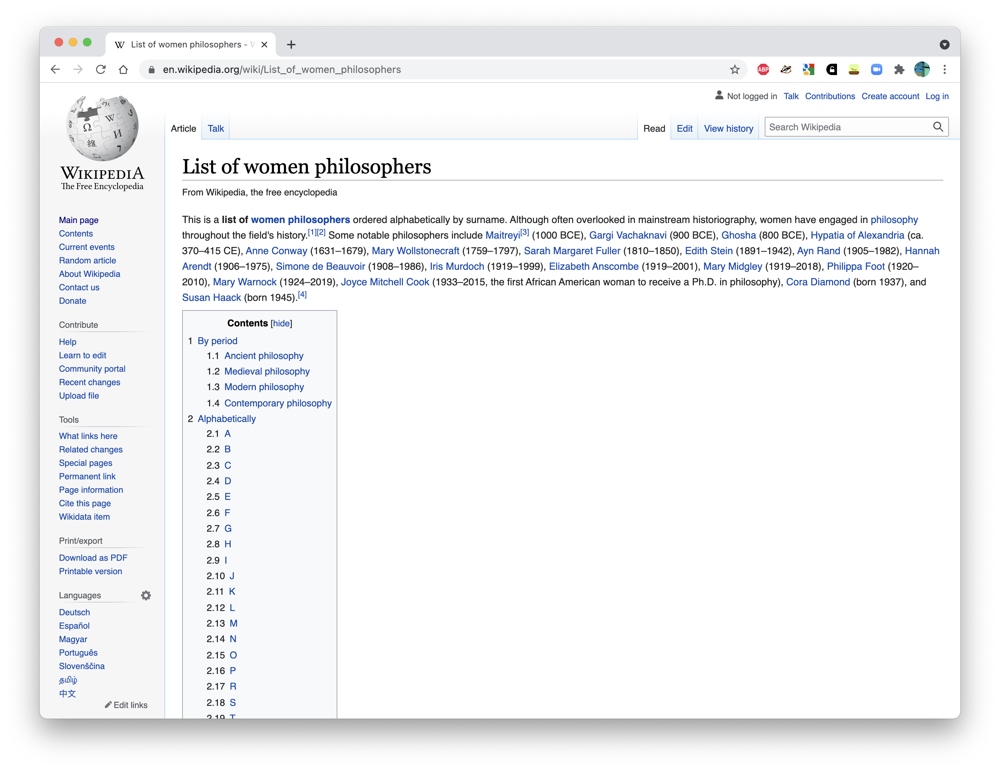
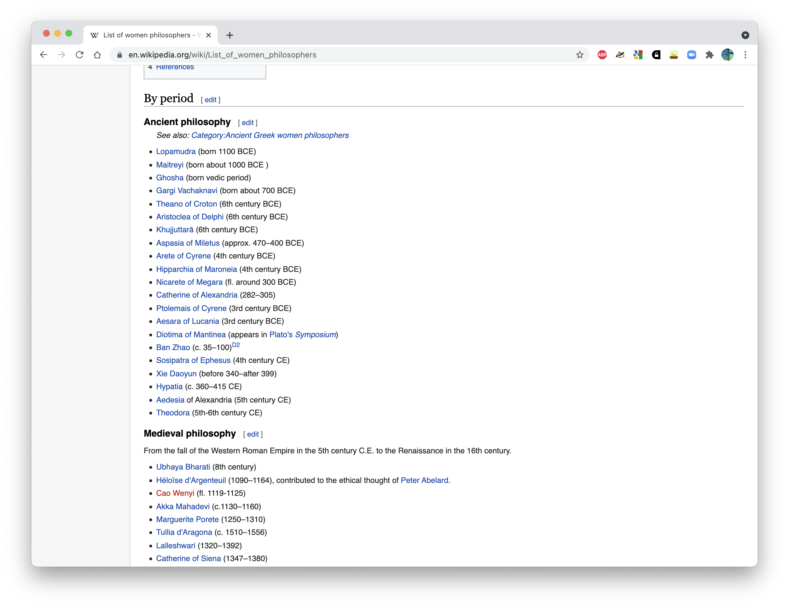
<br>
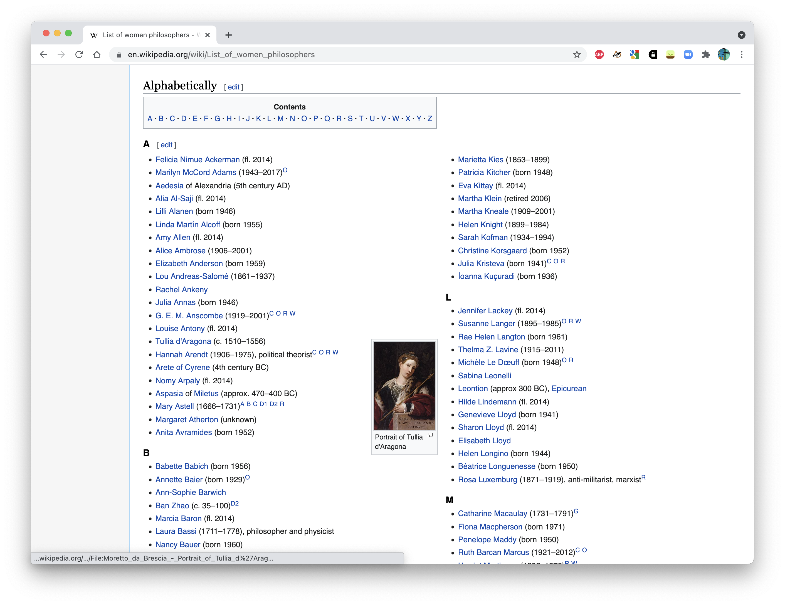
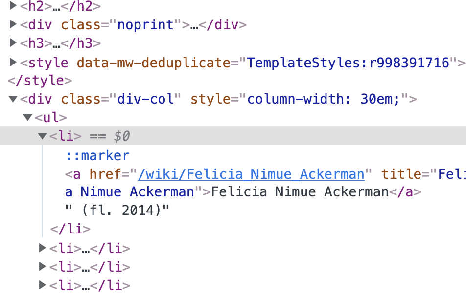
</div>
]


---
# Scraping HTML tables: example (cont.)

**Step 1:** Parse the page
```{r, eval = FALSE}
url_p <- read_html("https://en.wikipedia.org/wiki/List_of_women_philosophers")
```

```{r, eval = TRUE, echo = FALSE}
library(rvest)
url <- "https://en.wikipedia.org/w/index.php?title=List_of_women_philosophers&oldid=1041210397"
url_p <- read_html(url)
```

--

**Step 2:** Develop an XPath expression (or multiple) that select the information of interest and apply it

```{r, eval = TRUE}
elements_set <- html_elements(url_p, xpath = "//h2/span[text()='Alphabetically']//following::li/a[1]")

```

--

The XPath expression reads:

- `//h2`: Look for  `h2` elements anywhere in the document.
- `/span[text()='Alphabetically']`: Within that element look for `span` elements with the content `"Alphabetically"`.
- `//following::li`: In the DOM tree following that element (at any level), look for `li` elements.
- `/a[1]` within these elements look for the first `a` element you can find.

---
# Scraping HTML tables: example (cont.)

**Step 3:** Extract information and clean it up

```{r, eval = TRUE}
phil_names <- elements_set %>% html_text2()
phil_names[c(1:2, 101:102)]
```

--

**Step 4:** Clean up (here: select the subset of links we care about)

```{r, eval = TRUE}
names_iffer <-
  seq_along(phil_names) >=  seq_along(phil_names)[str_detect(phil_names, "Felicia Nimue Ackerman")] &
  seq_along(phil_names) <=   seq_along(phil_names)[str_detect(phil_names, "Alenka Zupančič")]
philosopher_names_clean <- phil_names[names_iffer]
length(philosopher_names_clean)
philosopher_names_clean[1:5]
```


---
# Quick-n-dirty static webscraping with SelectorGadget

.pull-left[

### The hassle with XPath

- The most cumbersome part of web scraping (data tidying aside) is the construction of XPath expressions that match the components of a page you want to extract.
- It will take a couple of scraping projects until you’ll truly have mastered XPath.

### A much-appreciated helper

- **SelectorGadget** is a JavaScript browser plugin that constructs XPath statements (or CSS selectors) via a point-and-click approach.
- It is available here: http://selectorgadget.com/ (there is also a Chrome extension).
- The tool is magic and you will love it.

]

--

.pull-right[

### What does SelectorGadget do?

- You activate the tool on any webpage you want to scrape.
- Based on your selection of components, the tool learns about your desired components and generates an XPath expression (or CSS selector) for you.

### Under the hood

- Based on your selection(s), the tool looks for similar elements on the page.
- The underlying algorithm, which draws on Google’s diff-match-patch libraries, focuses on CSS characteristics, such as tag names and `<div>` and `<span>` attributes.

]

---
# SelectorGadget: example

<video width="980" height="551" controls>
  <source src="pics/selectorgadget-nytimes.mp4" type="video/mp4">
Your browser does not support the video tag.
</video>


---
# SelectorGadget: example (cont.)

```{r, eval = FALSE}
library(rvest)
url_p <- read_html("https://www.nytimes.com")
# xpath: paste the expression from Selectorgadget!
# note: we use single quotation marks here (' instead of ") to wrap around the expression!
xpath <- '//*[contains(concat( " ", @class, " " ), concat( " ", "erslblw0", " " ))]//*[contains(concat( " ", @class, " " ), concat( " ", "e1lsht870", " " ))]'
headlines <- html_elements(url_p, xpath = xpath) 
headlines_raw <- html_text(headlines)
length(headlines_raw)
head(headlines_raw)
```

```{r, eval = TRUE, echo = FALSE}
library(rvest)
url_p <- read_html("materials/nytimes-com-2021-09-29.html")
xpath <- '//*[contains(concat( " ", @class, " " ), concat( " ", "erslblw0", " " ))]//*[contains(concat( " ", @class, " " ), concat( " ", "e1lsht870", " " ))]'
headlines <- html_elements(url_p, xpath = xpath) # we use single quotation marks here to wrap around the expression!
headlines_raw <- html_text(headlines)
length(headlines_raw)
head(headlines_raw)
```


---
# SelectorGadget: when to use and not to use it

Having learned about a semi-automated approach to generating XPath expressions, you might ask: 

**Why bother with learning XPath at all?**

Well...

- SelectorGadget is not perfect. Sometimes, the algorithm will fail.
- Starting from a different element sometimes (but not always!) helps.
- Often the generated expressions are unnecessarily complex and therefore difficult to debug.
- In my experience, SelectorGadget works 50-60% of the times when scraping from static webpages.
- You are also prepared for the remaining 40-50%!


---
# Scraping HTML tables

<div align="center">

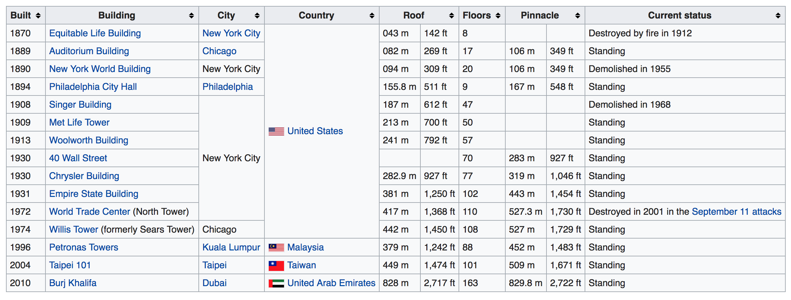
<br>
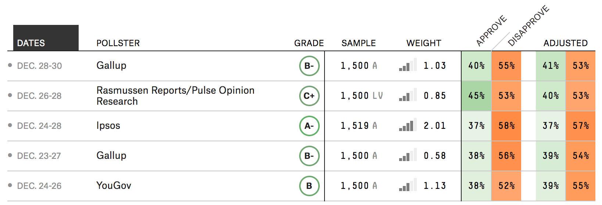
</div>


---
# Scraping HTML tables

- HTML tables are everywhere.
- They are easy to spot in the wild - just look for `<table>` tags!
- Exactly because scraping tables is an easy and repetitive task, there is a dedicated `rvest` function for it: `html_table()`.

.pull-left-vsmall[
<br>
<br>
**Function definition**
```{r, eval = FALSE}
html_table(x, 
    header = NA,
    trim = TRUE,
    dec = ".",
    na.strings = "NA",
    convert = TRUE
 )
```
]

.pull-right-vwide[
<br>

| Argument |  Description |
|---|---|
| `x` | Document (from `read_html()`) or node set (from `html_elements()`). |
| `header` | Use first row as header? If `NA`, will use first row if it consists of `<th>` tags. |
| `trim` | Remove leading and trailing whitespace within each cell? |
| `dec` | The character used as decimal place marker. |
| `na.strings` | Character vector of values that will be converted to `NA` if `convert` is `TRUE`. |
| `convert` | If `TRUE`, will run `type.convert()` to interpret texts as int, dbl, or `NA`. |
]

---
# Scraping HTML tables: example

.pull-left-small[
- We are going to scrape a small table from the Wikipedia page [https://en.wikipedia.org/wiki/](https://en.wikipedia.org/wiki/List_of_human_spaceflights) [List_of_human_spaceflights](https://en.wikipedia.org/wiki/List_of_human_spaceflights).
- (Note that we're actually using an old version of the page (dating back to May 1, 2018), which is accessible [here](https://en.wikipedia.org/w/index.php?title=List_of_human_spaceflights&oldid=778165808). Wikipedia pages change, but this old revision and associated link won't.))
- The table is not entirely clean: There are some empty cells, but also images and links.
- The HTML code looks straightforward though.
]

.pull-right-wide[
<div align="center">
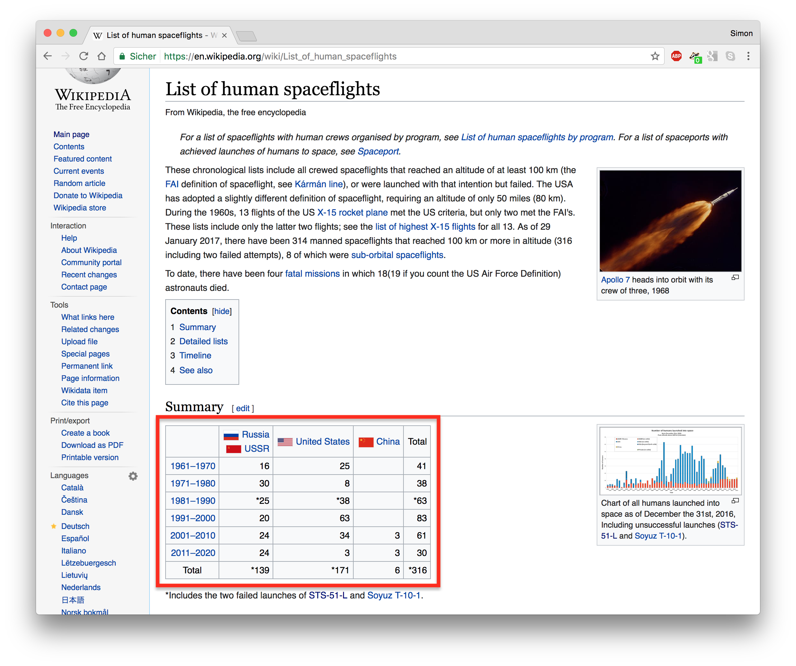
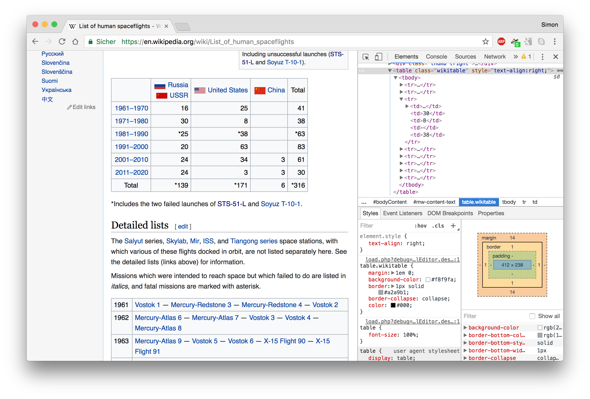
<br>
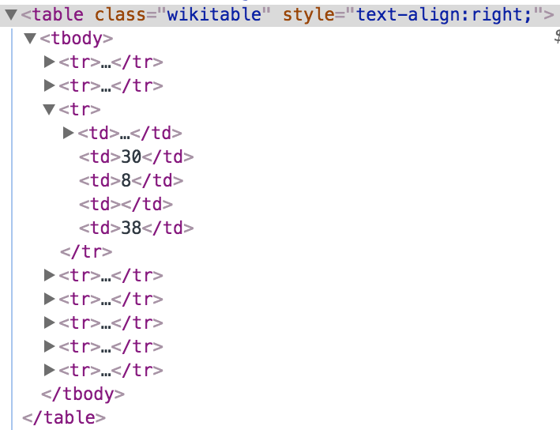
</div>
]

---
# Scraping HTML tables: example (cont.)

```{r, eval = FALSE}
library(rvest)
url <- "https://en.wikipedia.org/wiki/List_of_human_spaceflights"
url_p <- read_html(url)
tables <- html_table(url_p, header = TRUE)
spaceflights <- tables[[1]]
spaceflights
```


```{r, eval = TRUE, echo = FALSE}
library(rvest)
url <- "https://en.wikipedia.org/w/index.php?title=List_of_human_spaceflights&oldid=778165808"
url_p <- read_html(url)
tables <- html_table(url_p, header = TRUE)
spaceflights <- tables[[1]]
spaceflights
```


---
class: inverse, center, middle
name: goodpractice

# Web scraping: good practice

<html><div style='float:left'></div><hr color='#EB811B' size=1px style="width:1000px; margin:auto;"/></html>


---
# Scraping: the rules of the game

<br>

1. You take all the responsibility for your web scraping work.

2. Think about the nature of the data. Does it entail sensitive information? Do not collect personal data without explicit permission.

3. Take all copyrights of a country’s jurisdiction into account. If you publish data, do not commit copyright fraud.

4. If possible, stay identifiable. Stay polite. Stay friendly. Obey the scraping etiquette.

5. If in doubt, ask the author/creator/provider of data for permission—if your interest is entirely scientific, chances aren’t bad that you get data.

---
# Consult robots.txt

.pull-left[
### What's robots.txt?

-  "[Robots exclusion standard](https://en.wikipedia.org/wiki/Robots_exclusion_standard)", informal protocol to prohibit web robots from crawling content
- Located in the root directory of a website (e.g.,  [google.com/robots.txt](https://www.google.com/robots.txt))
- Documents which bot is allowed to crawl which resources (and which not)
- Not a technical barrier, but a sign that asks for compliance

### What's robots.txt?

- Not an official W3C standard
- Rules listed bot by bot
- General rule listed under `User-agent: *` (most interesting entry for R-based crawlers)
- Directories folders listed separately
]

.pull-right[

**Example**

```{txt, prompt = FALSE, eval = FALSE}
User-agent: Googlebot 
Disallow: /images/ 
Disallow: /private/
```

**Universal ban**

```{txt, prompt = FALSE, eval = FALSE}
User-agent: * 
Disallow: /
```

**Allow declaration**

```{txt, prompt = FALSE, eval = FALSE}
User-agent: * 
Disallow: /images/ 
Allow: /images/public/
```

**Crawl delay (in seconds)**

```{txt, prompt = FALSE, eval = FALSE}
User-agent: *
Crawl-delay: 2
```


]


---
# Downloading HTML files

.pull-left[

### Stay modest when accessing lots of data

- Content on the web is publicly available.
- But accessing the data causes server traffic.
- Stay polite by querying resources as sparsely as possible.

### Two easy-to-implement practices

1. Do not bombard the server with requests - and if you have to, do so at modest pace.
2. Store web data on your local drive first, then parse.

]


.pull-right[

### Looping over a list of URLs

```{r, eval = FALSE}
for (i in 1:length(list_of_urls)) { 
  if (!file.exists(paste0(folder, file_names[i]))) {
    download.file(list_of_urls[i],
                  destfile = paste0(folder, file_names[i])
                  )
    Sys.sleep(runif(1, 1, 2))
    }
}
```

- `!file.exists()` checks whether a file does not exist in the specified location.
- `download.file()` downloads the file to a folder. The destination file (location + name) has to be specified.
- `Sys.sleep()` suspends the execution of R code for a given time interval (in seconds).
]

---
# Staying identifiable

.pull-left[

### Don't be a phantom

- Downloading massive amounts of data may arouse attention from server administrators.
- Assuming that you've got nothing to hide, you should stay identifiable beyond your IP address.

### Two easy-to-implement practices

1. Get in touch with website administrators / data owners.
2. Use HTTP header fields `From` and `User-Agent` to provide information about yourself.

]


.pull-right[

### Staying identifiable in practice

```{r, eval = FALSE}
url <- "http://a-totally-random-website.com"
rvest_session <- session(url, 
 add_headers(From = "my@email.com", 
             `UserAgent` = 
               R.Version()$version.string
             )
) 
headlines <- rvest_session %>% 
             html_elements(xpath = "p//a") %>% 
             html_text()
```


- `rvest`'s `session()` creates a session object that responds to HTTP and HTML methods.
- Here, we provide our email address and the current R version as `User-Agent` information.
- This will pop up in the server logs: The webpage administrator has the chance to easily get in touch with you.

]


---
# Scraping etiquette (cont.)

<div align="center">
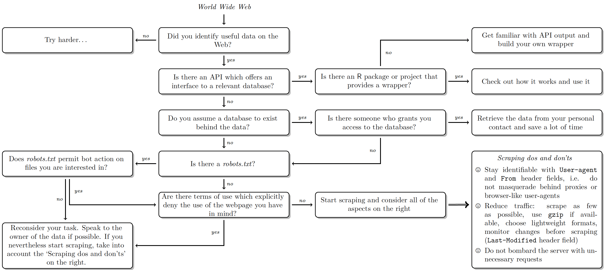
</div>


---
class: inverse, center, middle
name: summary

# Summary

<html><div style='float:left'></div><hr color='#EB811B' size=1px style="width:1000px; margin:auto;"/></html>


---
# Outlook

Until now, the toy examples were limited to single HTML pages. However, often we want to **scrape data from multiple pages**. You might think of newspaper articles, Wikipedia pages, shopping items and the like. In such scenarios, automating the scraping process becomes really powerful. Also, principles of polite scraping are more relevant then.

In other cases, you might be confronted with 
- forms, 
- authentication, 
- dynamic (JavaScript-enriched) content, or want to 
- automatically navigate through pages interactively.

Moreover, we've ignored a major alternative way to collect data from the web so far which goes beyond scraping: accessing [web APIs](https://en.wikipedia.org/wiki/Web_API). Be sure to check out the respective sessions in the workshop.

There's only so much we can cover in one session. Check out more material online [here](https://github.com/hertie-data-science-lab/ds-workshop-webscraping) and [there](https://github.com/yusuzech/r-web-scraping-cheat-sheet) to learn about solutions to some of these problems.


---

# Coming up

<br><br> 

### Assignment

Assignment 3 is about to go online on GitHub Classroom. Check it out and start scraping the web (politely).

### Next lecture

Model fitting and simulation. Now that we know how to retrieve data, let's learn how to run and learn from them.


