```{css, echo=FALSE} 
@media print { # print out incremental slides; see https://stackoverflow.com/questions/56373198/get-xaringan-incremental-animations-to-print-to-pdf/56374619#56374619
  .has-continuation {
    display: block !important;
  }
}
```

```{r setup, include=FALSE}
# figures formatting setup
options(htmltools.dir.version = FALSE)
library(knitr)
opts_chunk$set(
  comment = "  ",
  prompt = T,
  fig.align="center", #fig.width=6, fig.height=4.5, 
  # out.width="748px", #out.length="520.75px",
  dpi=300, #fig.path='Figs/',
  cache=F, #echo=F, warning=F, message=F
  engine.opts = list(bash = "-l")
  )

## Next hook based on this SO answer: https://stackoverflow.com/a/39025054
knit_hooks$set(
  prompt = function(before, options, envir) {
    options(
      prompt = if (options$engine %in% c('sh','bash')) '$ ' else 'R> ',
      continue = if (options$engine %in% c('sh','bash')) '$ ' else '+ '
      )
})

library(tidyverse)
library(nycflights13)
library(modelsummary)
library(kableExtra)
```


# Table of contents

<br>

1. [Crafting formulas](#formulas)

2. [Running models](#models)

3. [Processing estimation output](#postestimation)

4. [Reporting modeling results](#reporting)

5. [Simulating fake data](#simulation)

6. [Summary](#summary)


---
background-image: url("pics/data-model-jesus.jpeg")
background-size: contain
background-color: #000000

# The modeling workflow

`Credit` [David Hood](https://twitter.com/Thoughtfulnz/status/1446972794135216131)

---
# The modeling workflow

.pull-left-wide[
### Why modeling?

- Modeling is at the heart of the data science workflow.
- We use models to explore, test, infer, predict based on data.
- The art and science of statistical modeling is vast.
- Today, we will focus on key steps of the workflow which are common in most modeling endeavors. We won't touch on theoretical/statistical backgrounds though and ignore workflow issues in particular areas, such as simulation-based Bayesian inference. 
]

--

.pull-right-small[
### Steps of the workflow

1. **Choose** a modeling strategy
2. **Specify** the model (structural components / parameters)
3. **Run/implement** the model (estimation)
4. **Evaluate** the model output
5. **Present** the results
]

--

<div align="center">
<br>

</div>


<!-- ############################################ -->
---
class: inverse, center, middle
name: formulas

# Crafting formulas

<html><div style='float:left'></div><hr color='#EB811B' size=1px style="width:1000px; margin:auto;"/></html>


---
background-image: url("pics/albert-einstein-lm.png")
background-size: contain
background-color: #000000

# Crafting formulas


---
# Model building

### Systematic + stochastic components of models

- When we try to model data, we often start by assuming a data-generating process that looks like

$$Y = f(x) + \epsilon$$

- In doing so, we decompose a model (or data-generating process) into a random or stochastic part (here: $\epsilon$) and a systematic/structural/deterministic part (here: $f(x)$).
- (We might go on to impose further assumptions about the stochastic component, e.g., $\epsilon \sim N(0, 1)$.)

- In many cases, we want to learn how certain variables systematically relate to each other. To that end, we specify the systematic component of a model and then "let the data speak" to estimate parameters associate with elements of the systematic component.
- As an example, we might specify

$$f(x) = \beta_{0} + \beta_{1}x$$

- But how can we express our belief about the model structure in R?


---
# Model building in R

### Model formulas in R

- In R, there's a standardized way to specify models like this: working with the `formula` class.
- In many cases you can still think of the model formula as just a string specifying the structural part of your model (there are exceptions).
- But `formula` class objects also allow you to do more useful things with formula.
- The basic structure of a formula is the tilde symbol (~) and at least one independent (righthand) variable. In most (but not all) situations, a single dependent (lefthand) variable is also needed. Thus we can construct a formula quite simply by just typing:

```{r, eval = FALSE}
y ~ x
```

- Spaces in formulas are not important, but I recommend using them to make the formulas more readable. 
- Running a model with a formula is straightforward. Note that we don't even have to put the formula in parentheses - it is automatically interpreted as one formula expression when provided as the first argument:

```{r, eval = FALSE}
lm(arr_delay ~ distance + origin, data = flights)
```

---
# Model formulas in R (cont.)

### Storing formulas 

- A more explicit way is to write the formula as string and then use `as.formula()` to turn it into a formula object. This implies that we can store formulas as an R object and check its class.

```{r, eval = TRUE}
fmla <- as.formula("arr_delay ~ distance + origin")
class(fmla)
```

- Next, we'd pass on the `formula` object to the model function, e.g.:

```{r, eval = TRUE}
lm(fmla, data = flights)
```

---
# Formula syntax: basics

- We can use multiple independent variables by simply separating them with the plus (+) symbol:

```{r, eval = FALSE}
y ~ x1 + x2
```

- If we use a minus (-) symbol, objects in the formula are ignored in an analysis:

```{r, eval = FALSE}
y ~ x1 - x2
```

- We can also use this to drop the intercept:

```{r, eval = FALSE}
y ~ x1 - x2 - 1
```

- The `.` operator refers to all other variables in the matrix/data frame not yet included in the model. This is useful when you plan to run a regression on all variables in a matrix/data frame:

```{r, eval = FALSE}
y ~ .
```

---
# Formula syntax: interactions

In a regression modeling context, we often need to specify interaction terms. There are two ways to do this. If we want to include two variables and their interaction, we use the star/asterisk (`*`) symbol:

```{r, eval = FALSE}
y ~ x1 * x2
```

That's equivalent to

```{r, eval = FALSE}
y ~ x1 + x2 + x1*x2
```

If you only want their interaction, but not the variables themselves as main effects (which you probably don't want), use the colon symbol:

```{r, eval = FALSE}
y ~ x1:x2
```

---
# Formula syntax: variable transformations

One trick to formulas is that they don't evaluate their contents. So, for example, if we wanted to include $x$ and $x^2$ in our model, we might be tempted to type:

```{r, eval = FALSE}
y ~ x + x^2
```

This won't work though. We therefore have to either calculate and store all of the variables we want to include in the model in advance, or we need to use the `I()` "as-is" operator, short for "Inhibit Interpretation/Conversion of Objects". In a formula function, `I()` is used to inhibit the interpretation of operators such as `+`, `-`, `*` and `^` as formula operators, so they are used as arithmetical operators. To obtain our desired two-term formula, we type:

```{r, eval = FALSE}
y ~ x + I(x^2)
```

Again, the alternative would have been something like:

```{r, eval = FALSE}
data$x2 <- (data$x)^2
y ~ x + x2
```


---
# Specifying multiple models

### When one model is not enough

- Often we want to specify not one but multiple different models.
- Such models can differ in terms of model family, modelled outcome, covariate/feature set, transformations of input variables, and data being modelled.

### Generating model formulas at scale

- If outcomes/features vary across models, so does the model formula.
- Regarding formulas as character strings, it's straightforward to generate them in a programmatic fashion.

--

**Example:**

```{r, eval = TRUE}
xvars <- paste0("x", 1:20)
fmla <- as.formula(paste("y ~ ", paste(xvars, collapse= "+")))
fmla
```

---
# Specifying multiple models (cont.)

- Another example of multiple model specification is [extreme bounds analysis (EBA)](https://en.wikipedia.org/wiki/Extreme_bounds_analysis).
- Here, the idea is to compute all possible estimates given a set of allowed coefficients to answer questions like:
  - Which determinants are robustly associated with the dependent variable across a large number of possible regression models?
  - Is a particular determinant robustly associated with the dependent variable?
- In its basic form, EBA just estimates models with all possible combinations of variables and then looks into the distribution (or range → extreme bounds) of effects across all models.
- There are R packages to do this for us (e.g., `ExtremeBounds` [by Marek Hlavac](https://cran.r-project.org/web/packages/ExtremeBounds/vignettes/ExtremeBounds.pdf)) but we can also run the basics on our own.

--

### Example

**Step 1: Define dependent variable and covariate set**

```{r, eval = TRUE}
depvar <- "arr_delay"
covars <- c("dep_delay", "carrier", "origin", "air_time", "distance", "hour")
```

---
# Specifying multiple models (cont.)

**Step 1a (just for fun): Compute the number of unique combinations of all these covariates**

```{r, eval = TRUE}
combinations <- 
  map(1:6, function(x) {combn(1:6, x)}) %>% # create all possible combinations (draw 1 to 6 out of 6)
  map(ncol) %>% # extract number of combinations
  unlist() %>% # pull out of list structure
  sum() # compute sum
```


---
# Specifying multiple models (cont.)

**Step 2: Build function to run lm models across set of all possible variable combinations **

```{r, eval = TRUE}
combn_models <- function(depvar, covars, data)
{
  combn_list <- list()
  # generate list of covariate combinations
  for (i in seq_along(covars)) {
    combn_list[[i]] <- combn(covars, i, simplify = FALSE)
  }
  combn_list <- unlist(combn_list, recursive = FALSE)
  # function to generate formulas
  gen_formula <- function(covars, depvar) {
    form <- as.formula(paste0(depvar, " ~ ", paste0(covars, collapse = "+")))
    form
  }
  # generate formulas
  formulas_list <- purrr::map(combn_list, gen_formula, depvar = depvar)
  # run models
  models_list <- purrr::map(formulas_list, lm, data = data)
  models_list
}
```


---
# Specifying multiple models (cont.)

**Step 3: Run models (careful, this'll generate a quite heavy list)**

```{r, eval = TRUE, echo = FALSE, include = FALSE}
models_list <- combn_models(depvar = depvar,  covars = covars, data = sample_n(flights, 10000))
length(models_list)
models_list[[1]]
```

```{r, eval = FALSE}
models_list <- combn_models(depvar = depvar,  covars = covars, data = flights)
```

How many models did we fit?

```{r, eval = TRUE}
length(models_list)
```

And what did we get? A glimpse at the first list element:

```{r, eval = TRUE}
models_list[[1]]
```


<!-- ############################################ -->
---
class: inverse, center, middle
name: models

# Running models

<html><div style='float:left'></div><hr color='#EB811B' size=1px style="width:1000px; margin:auto;"/></html>


---
background-image: url("pics/turing-bombe.jpeg")
background-size: contain
background-color: #000000

# Running models


---
# Model families

Today we'll mostly focus on linear models as an example. However, there is a multitude of families of statistical models that allow extend linear models. Examples are

- **Generalized linear models** [`stats::glm()`], which extend linear models to include non-continuous responses (e.g., binary or categorical data, counts) 
- **Generalized additive models** [`mgcv::gam()`], which extend generalized linear models to incorporate arbitrary smooth functions
- **Penalized linear models** [`glmnet::glmnet()`], which introduce terms that penalize complex models to make models that generalize better to new datasets

--

Also there is so much more to learn in terms of [modeling/machine learning/AI](https://en.wikipedia.org/wiki/Machine_learning). There are many (MANY!) models for measurement, (un-)supervised learning, clustering, dimensionality reduction, ... R is uniquely flexible for implementing these models. To get a quick glance at the universe from afar, check out the [CRAN Task Views](https://cran.r-project.org/web/views/), a curated online directory of topics and the R packages relevant for tasks related to these.


---
# Running models: examples

Luckily, these models work all similarly from a programming experience - once you've mastered how to run linear models, you will find it easy to implement others. Understanding and applying them wisely is a different matter though.

**Logistic regression**

```{r, eval = FALSE}
logit_out <- stats::glm(am ~ cyl + hp + wt, data = mtcars, family = binomial)
```

**Generalized additive model regression**

```{r, eval = FALSE}
gam_out <- mgcv::gam(mpg ~ s(disp) + s(wt), data = mtcars)
```

**Penalized (here: lasso) regression**

```{r, eval = FALSE}
lasso_out <- glmnet(as.matrix(mtcars[-1]), mtcars[,1], standardize = TRUE, alpha  = 1)
```

**Multilevel model with random intercepts**

```{r, eval = FALSE}
library(lme4)
ml_out <- lmer(arr_delay ~ distance + origin + (1|carrier) + (1|tailnum), data = flights)
```

---
# Decisions in the modeling workflow
.pull-left[

### Big data and the need for models

- In the early days of the big data hype, people were overly enthusiastic about its implications for modeling (see quote on the right).
- This is falling for the inception that we can simply "let the data speak".
- However, the data science workflow is a sequence of subjective decisions from start to finish, with lots of researcher degrees of freedom.
- Think of all the weakly justified decisions regarding:
  - data collection / selection
  - measurement
  - model choice
  - model specification
  - reporting
]

.pull-right[

<br><br>

<div style="background-color:rgba(0, 0, 0, 0.1)">
"Scientists are trained to recognize that correlation is not causation, that no conclusions should be drawn simply on the basis of correlation between X and Y. (...) Once you have a model, you can connect the data sets with confidence. Data without a model is just noise. (...) There is now a better way. Petabytes allow us to say: "Correlation is enough." We can stop looking for models. We can analyze the data without hypotheses about what it might show."
</div>

 *Chris Anderson*, ["The End of Theory: The Data Deluge makes the Scientific Method Obsolete (2008, *Wired*)"](https://www.wired.com/2008/06/pb-theory/)

]


---
# Decisions in the modeling workflow
.pull-left[

### Big data and the need for models

- In the early days of the big data hype, people were overly enthusiastic about its implications for modeling (see quote on the right).
- This is falling for the inception that we can simply "let the data speak".
- However, the data science workflow is a sequence of subjective decisions from start to finish, with lots of researcher degrees of freedom.
- Think of all the weakly justified decisions regarding:
  - data collection / selection
  - measurement
  - model choice
  - model specification
  - reporting
  
**Question:** How do researchers usually deal with this?
]

.pull-right[

<br><br>

<div style="background-color:rgba(0, 0, 0, 0.1)">
"Scientists are trained to recognize that correlation is not causation, that no conclusions should be drawn simply on the basis of correlation between X and Y. (...) Once you have a model, you can connect the data sets with confidence. Data without a model is just noise. (...) There is now a better way. Petabytes allow us to say: "Correlation is enough." We can stop looking for models. We can analyze the data without hypotheses about what it might show."
</div>

 *Chris Anderson*, ["The End of Theory: The Data Deluge makes the Scientific Method Obsolete (2008, *Wired*)"](https://www.wired.com/2008/06/pb-theory/)

]


---
# Nested models

.pull-left-center[
<div align="center">
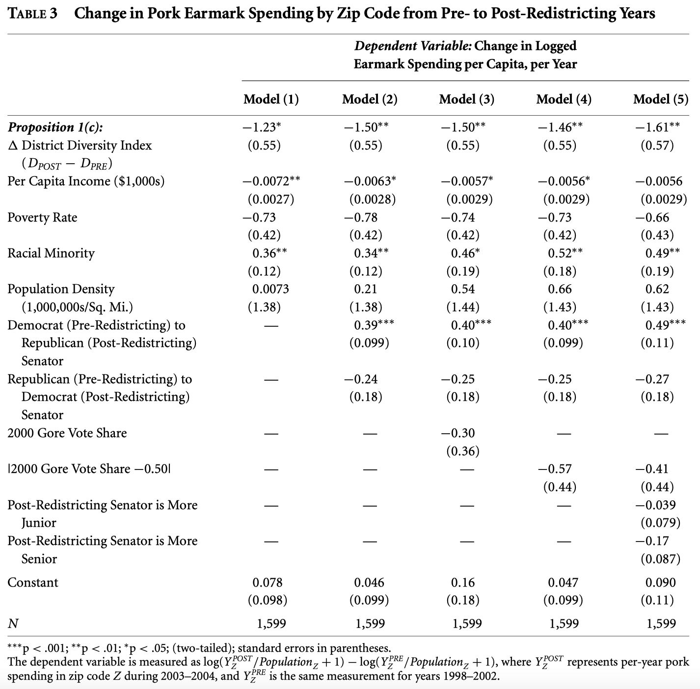
</div>
`Credit` Chen 2010, [The Effect of Electoral Geography on Pork Barreling in Bicameral Legislatures](https://www.jstor.org/stable/25652208)
]

.pull-right-center[
<div align="center">
<br><br>

</div>
`Credit` Park et al. 2009, [Being immersed in social networking environment: Facebook groups, uses and gratifications, and social outcomes](https://pubmed.ncbi.nlm.nih.gov/19619037/)
]


---
# Exploring the model space

.pull-left[

- **Another idea:** run not an arbitrary (small) set of models but as many (plausible ones) as possible to get an idea how much conclusions change depending on arbitrary data wrangling and modeling choices (the "model distribution").
- There are various related procedures and labels used in different subfields to promote this idea, including:
  - Multiverse analysis ([Steegen et al. 2016](https://journals.sagepub.com/doi/10.1177/1745691616658637))
  - Specification curves ([Simonsohn et al. 2020](https://www.nature.com/articles/s41562-020-0912-z))
  - Computational multimodel analysis ([Young and Holsteen 2015](http://fmwww.bc.edu/repec/bocode/m/Model_Uncertainty_and_Robustness.pdf))
- Also check out critical perspective on "[Mülltiverse Analysis](http://www.the100.ci/2021/03/07/mulltiverse-analysis/)" (Julia Rohrer). The bottom line: Mindless multiversing doesn't give more robustness or insight.
]

.pull-right[
<div align="center">

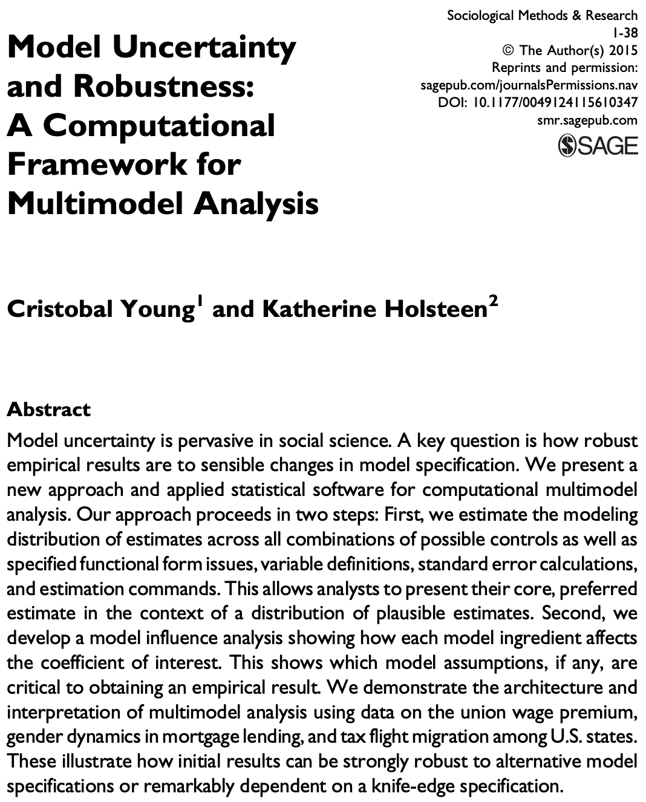
</div>
]

---
# Specification curves


.pull-left[

- Specification curve analysis (SCA) facilitates the visual identification of the source of variation in results across multiple specifications.
- The key feature, the specification curve, provides all gathered estimates sorted by effect size and highlighted by significance.
- SCA is carried out in three main steps:
  1. Define the set of reasonable specifications to estimate; 
  2. Estimate all specifications and report the results in a descriptive specification curve; and 
  3. Conduct joint statistical tests using an inferential specification curve.
- As of now there are two R packages that offer high-level functions for specification: `specr` (see [here](https://cran.r-project.org/web/packages/specr/vignettes/specr.html)) and `Multiverse` (see [here](https://mucollective.github.io/multiverse/)).
]

.pull-right[
<div align="center">
<br>
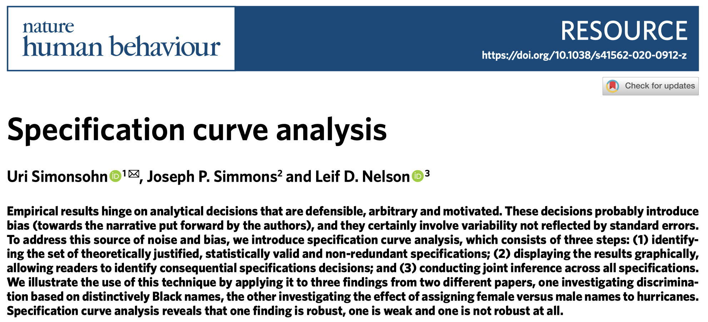
<br>
<br>
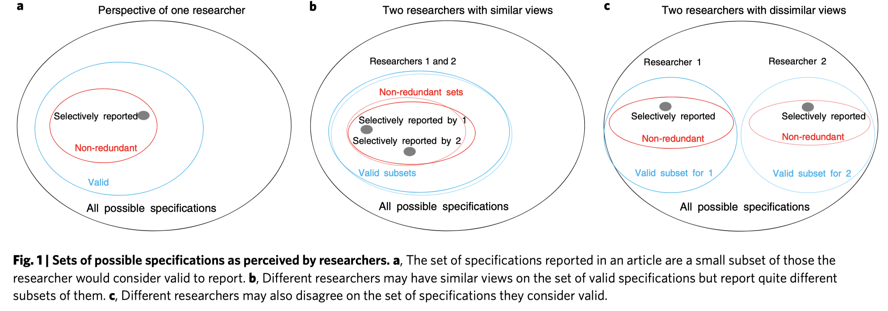
</div>
]


---
# Specification curves (cont.)

<div align="center">

</div>


<!-- ############################################ -->
---
class: inverse, center, middle
name: postestimation

# Processing estimation output

<html><div style='float:left'></div><hr color='#EB811B' size=1px style="width:1000px; margin:auto;"/></html>


---
background-image: url("pics/computer-nerd-mod.jpg")
background-size: contain
background-color: #000000

# Processing estimation output

---
# Why model processing?

.pull-left-small2[
When estimating a model, we usually estimate parameters (or simulate distributions thereof). There is, however, more that we can take away from the estimation, including:

]

.pull-right-wide2[

```{r, eval = FALSE, prompt = FALSE}
summary(model_out)

Call:
lm(formula = arr_delay ~ distance + origin, data = flights)

Residuals:
    Min      1Q  Median      3Q     Max 
 -89.04  -24.00  -11.83    7.26 1281.45 

Coefficients:
              Estimate Std. Error t value Pr(>|t|)    
(Intercept) 13.4140488  0.1748144   76.73   <2e-16 ***
distance    -0.0040451  0.0001097  -36.87   <2e-16 ***
originJFK   -2.7042552  0.1887083  -14.33   <2e-16 ***
originLGA   -4.4561694  0.1935123  -23.03   <2e-16 ***
---
Sig. codes:  0 '***' 0.001 '**' 0.01 '*' 0.05 '.' 0.1 ' ' 1

Residual standard error: 44.51 on 327342 degrees of freedom
(9430 observations deleted due to missingness)
Multiple R-squared: 0.005503, Adjusted R-squared: 0.005493 
F-statistic: 603.7 on 3 and 327342 DF,  p-value: < 2.2e-16
```

]


---
# Why model processing?

.pull-left-small2[
When estimating a model, we usually estimate parameters (or simulate distributions thereof). There is, however, more that we can take away from the estimation, including:

- **Estimated coefficients** and associated standard errors, T-statistics, p-values, confidence intervals
]

.pull-right-wide2[

```{r, eval = FALSE, prompt = FALSE}
summary(model_out)

Call:
lm(formula = arr_delay ~ distance + origin, data = flights)

Residuals:
    Min      1Q  Median      3Q     Max 
 -89.04  -24.00  -11.83    7.26 1281.45 

Coefficients: #<<
              Estimate Std. Error t value Pr(>|t|)     #<<
(Intercept) 13.4140488  0.1748144   76.73   <2e-16 *** #<<
distance    -0.0040451  0.0001097  -36.87   <2e-16 *** #<<
originJFK   -2.7042552  0.1887083  -14.33   <2e-16 *** #<<
originLGA   -4.4561694  0.1935123  -23.03   <2e-16 *** #<<
--- #<<
Sig. codes:  0 '***' 0.001 '**' 0.01 '*' 0.05 '.' 0.1 ' ' 1 #<<

Residual standard error: 44.51 on 327342 degrees of freedom
(9430 observations deleted due to missingness)
Multiple R-squared: 0.005503, Adjusted R-squared: 0.005493 
F-statistic: 603.7 on 3 and 327342 DF,  p-value: < 2.2e-16
```

]


---
# Why model processing?

.pull-left-small2[
When estimating a model, we usually estimate parameters (or simulate distributions thereof). There is, however, more that we can take away from the estimation, including:

- **Estimated coefficients** and associated standard errors, T-statistics, p-values, confidence intervals
- **Model summaries**, including goods of fit measures, information on model convergence, number of observations used
]

.pull-right-wide2[

```{r, eval = FALSE, prompt = FALSE}
summary(model_out)

Call:
lm(formula = arr_delay ~ distance + origin, data = flights)

Residuals:
    Min      1Q  Median      3Q     Max 
 -89.04  -24.00  -11.83    7.26 1281.45 

Coefficients:
              Estimate Std. Error t value Pr(>|t|)    
(Intercept) 13.4140488  0.1748144   76.73   <2e-16 ***
distance    -0.0040451  0.0001097  -36.87   <2e-16 ***
originJFK   -2.7042552  0.1887083  -14.33   <2e-16 ***
originLGA   -4.4561694  0.1935123  -23.03   <2e-16 ***
---
Sig. codes:  0 '***' 0.001 '**' 0.01 '*' 0.05 '.' 0.1 ' ' 1

Residual standard error: 44.51 on 327342 degrees of freedom #<<
(9430 observations deleted due to missingness) #<<
Multiple R-squared: 0.005503, Adjusted R-squared: 0.005493 #<<
F-statistic: 603.7 on 3 and 327342 DF,  p-value: < 2.2e-16 #<<
```

]


---
# Why model processing?

.pull-left-small2[
When estimating a model, we usually estimate parameters (or simulate distributions thereof). There is, however, more that we can take away from the estimation, including:

- **Estimated coefficients** and associated standard errors, T-statistics, p-values, confidence intervals
- **Model summaries**, including goods of fit measures, information on model convergence, number of observations used
- **Observation-level information** that arises from the estimated model, such as fitted/predicted values, residuals, estimates of influence
]

.pull-right-wide2[

```{r, eval = FALSE, prompt = FALSE}
summary(model_out)

Call:
lm(formula = arr_delay ~ distance + origin, data = flights)

Residuals: #<<
    Min      1Q  Median      3Q     Max  #<<
 -89.04  -24.00  -11.83    7.26 1281.45  #<<

Coefficients:
              Estimate Std. Error t value Pr(>|t|)    
(Intercept) 13.4140488  0.1748144   76.73   <2e-16 ***
distance    -0.0040451  0.0001097  -36.87   <2e-16 ***
originJFK   -2.7042552  0.1887083  -14.33   <2e-16 ***
originLGA   -4.4561694  0.1935123  -23.03   <2e-16 ***
---
Sig. codes:  0 '***' 0.001 '**' 0.01 '*' 0.05 '.' 0.1 ' ' 1

Residual standard error: 44.51 on 327342 degrees of freedom
(9430 observations deleted due to missingness)
Multiple R-squared: 0.005503, Adjusted R-squared: 0.005493 
F-statistic: 603.7 on 3 and 327342 DF,  p-value: < 2.2e-16
```

]


---
# Processing estimation output in R

.pull-left-small[

- Fitting a model returns an object of a certain model class (here: `lm`).
- Printing that object returns a quite minimalist set of information - just the input formula and coefficients.
]

.pull-right-wide[

```{r, eval = TRUE}
model_out <- lm(arr_delay ~ distance + origin, data = flights)
class(model_out)
model_out
```
]

---
# Processing estimation output in R

.pull-left-small[
- Fitting a model returns an object of a certain model class (here: `lm`).
- Printing that object returns a quite minimalist set of information - just the input formula and coefficients.
- The anatomy of the object is considerably more complex. It comes as a list of various components, including the coefficients, residuals, fitted values, and original model input.
]

.pull-right-wide[

```{r, eval = TRUE}
names(model_out)
```
]


---
# Processing estimation output in R

.pull-left-small[
- Fitting a model returns an object of a certain model class (here: `lm`).
- Printing that object returns a quite minimalist set of information - just the input formula and coefficients.
- The anatomy of the object is considerably more complex. It comes as a list of various components, including the coefficients, residuals, fitted values, and original model input.
- There's no way to print this list the slide in full - it's just too long.
]

.pull-right-wide[

```{r, eval = TRUE}
str(model_out)
```
]


---
# Processing estimation output in R

.pull-left-small[

- However, there are some high-level functions we can apply to do something useful with the model object, including:
  - `coef()` to extract the coefficients
]

.pull-right-wide[

```{r, eval = TRUE}
coef(model_out)
```
]


---
# Processing estimation output in R

.pull-left-small[

- However, there are some high-level functions we can apply to do something useful with the model object, including:
  - `coef()` to extract the coefficients
  - `fitted.values()` to extract the outcome values predicted by the model
]

.pull-right-wide[

```{r, eval = TRUE}
coef(model_out)
fitted.values(model_out)[1:5]
```
]


---
# Processing estimation output in R

.pull-left-small[

- However, there are some high-level functions we can apply to do something useful with the model object, including:
  - `coef()` to extract the coefficients
  - `fitted.values()` to extract the outcome values predicted by the model
  - `residuals()` to extract the residuals
]

.pull-right-wide[

```{r, eval = TRUE}
coef(model_out)
fitted.values(model_out)[1:5]
residuals(model_out)[1:5]
```
]


---
# Processing estimation output in R

.pull-left-small[

- However, there are some high-level functions we can apply to do something useful with the model object, including:
  - `coef()` to extract the coefficients
  - `fitted.values()` to extract the outcome values predicted by the model
  - `residuals()` to extract the residuals
  - `model.matrix()` to extract the matrix of original input variables (predictors)
]

.pull-right-wide[

```{r, eval = TRUE}
coef(model_out)
fitted.values(model_out)[1:5]
residuals(model_out)[1:5]
model.matrix(model_out) %>% head(4)
```
]


---
# Processing estimation output in R

.pull-left-small[

- To learn more about the estimated model, we can apply the `summary()` function.
- The `summary` method is specific to the model class it is applied to (here: "`lm` "). To learn more, you'd have to call, e.g., `?summary.lm` or `?summary.glm`.

]

.pull-right-wide[

```{r, eval = TRUE}
summary(model_out)
```
]

---
# Processing estimation output in R

.pull-left-small[

- To learn more about the estimated model, we can apply the `summary()` function.
- The `summary` method is specific to the model class it is applied to (here: "`lm` "). To learn more, you'd have to call, e.g., `?summary.lm` or `?summary.glm`.
- The function creates more than a printed summary in the console. It returns an object of class `summary.lm`, which can be further dissected.
]

.pull-right-wide[

```{r, eval = TRUE}
class(summary(model_out))
```

]

---
# Processing estimation output in R

.pull-left-small[

- To learn more about the estimated model, we can apply the `summary()` function.
- The `summary` method is specific to the model class it is applied to (here: "`lm` "). To learn more, you'd have to call, e.g., `?summary.lm` or `?summary.glm`.
- The function creates more than a printed summary in the console. It returns an object of class `summary.lm`, which can be further dissected.
- Again, there's no way to print this list on the slide in full - it's just too long.
]

.pull-right-wide[

```{r, eval = TRUE}
str(summary(model_out))
```

]


---
# Dissecting model objects

.pull-left[

### The problem

"While model inputs usually require tidy inputs, such attention to detail doesn’t carry over to model outputs. Outputs such as predictions and estimated coefficients aren’t always tidy. This makes it more difficult to combine results from multiple models. For example, in R, the default representation of model coefficients is not tidy because it does not have an explicit variable that records the variable name for each estimate, they are instead recorded as row names. (...) This knocks you out of the flow of analysis and makes it harder to combine the results from multiple models. I’m not currently aware of any packages that resolve this problem."

 *Hadley Wickham*, ["Tidy Data"](https://www.jstatsoft.org/article/view/v059i10)

]

.pull-right[

### The solution?

See next slide!

]


---
# Processing estimation output with broom


.pull-left-wide[

`broom` is a suite of tools that summarizes key information about models. It takes the messy output of built-in functions in R, such as `lm` or `t.test`, and turns them into tidy `tibbles()` (think: dataframes). The output is not ready for publication but an important intermediary step that makes post-processing of estimation results more convenient. It is part of the [tidyverse](https://www.tidyverse.org/) and [tidymodels](https://www.tidymodels.org/).

There are three key `broom` verbs that you need to learn.<sup>1</sup>

1. `tidy()`: Summarizes information about model components.

2. `glance()`: Reports information about the entire model.

3. `augment()`: Adds information about observations to a dataset.

]

.footnote[
<sup>1</sup> For a more detailed and comprehensive introduction, see the [official documentation at https://broom.tidymodels.org/](https://broom.tidymodels.org/).
]

.pull-right-small-center[
<div align="center">
<br>

</div>
]

---
# Tidy model objects with tidy()

`broom`'s `tidy()` function extracts the coefficient block (the model component) together with inferential statistics:

```{r, eval = TRUE}
broom::tidy(model_out, conf.int = TRUE, conf.level = 0.95)
```

--

Here, we also extract the upper and lower bounds on the 95% confidence intervals for the estimates. What makes the function so convenient is the fact that the output comes as a tidy `tibble` with useful variable names.

What exactly is extracted depends on the model type. You can learn more about the tidying function by typing `?tidy.[model class]`, e.g.: `?tidy.lm`.

---
# Summarize model statistics with glance()

`broom`'s `glance()` function extracts summary statistics of the model and provides them in a single-row `tibble`: 

```{r, eval = TRUE}
broom::glance(model_out)
```


---
# Augment data with model information with augment()

`broom`'s `augment()` function adds model information about each observation in a dataset, including, e.g.:
  - predicted values (in the `.fitted` column)
  - residuals (`.resid`)
  - standard errors of fitted values (`.se.fit`; optional)

```{r, eval = TRUE}
broom::augment(model_out, se_fit = TRUE) %>% head(3)
```

--

It is also possible to pass on data that was not used during model fitting using the `newdata` argument. This requires that at least all predictor variable columns used to fit the model are present. Providing new data can be useful if one is interested to generate predictions for a test set.


---
# Unlocking the power of broom with multiple models

The true power of broom unfolds in settings where you want to combine results from multiple analyses (using subgroups of data, different models, bootstrap replicates of the original data frame, permutations, imputations, ...). 

--

**Does this ring a bell?** Well, let's go back to our covariate selection sensitivity analysis. Recall that in **Steps 1 to 3**, we had specified and run 63 models. Let's evaluate the results now. First, extract the results in a tidy fashion:

--

**Step 4 (continuing the analysis from above): Extract results from all models**

```{r, eval = TRUE}
models_broom <- map(models_list, broom::tidy)
models_broom[[1]] # inspect one list entry
```

Next, let's merge them all into one data frame:

```{r, eval = TRUE}
models_broom_df <- map_dfr(models_broom, rbind)
```

---
# Unlocking the power of broom with multiple models

**Step 5: Summarize the estimates for subset of key predictors**

```{r, eval = TRUE, fig.height = 1.75}
models_broom_df %>% 
  filter(!str_detect(term, "Intercept|carrier")) %>%
  ggplot(aes(estimate)) + 
  geom_histogram(binwidth = .1, color = "red") + 
  geom_vline(xintercept = 0, linetype="dashed") + 
  facet_grid(cols = vars(term), scales = "free_y") + 
  theme_minimal()
```


<!-- ############################################ -->
---
class: inverse, center, middle
name: reporting

# Reporting modeling results

<html><div style='float:left'></div><hr color='#EB811B' size=1px style="width:1000px; margin:auto;"/></html>


---
background-image: url("pics/bobross-rplot.png")
background-size: contain
background-color: #000000

# Reporting modeling results


---
# Reporting modeling results


.pull-left[
### Why good reporting is as important as good modeling

- Hardly anybody will read your code. Most stakeholders will not even be able to understand what you've done.
- Not all components of your model are equally relevant.
- Good communication of your model can save a lot of time a space.
]

.pull-right[
### Making reporting part of the workflow

- Our vision of the data science workflow is to **automate as much as possible** in order to have time for the really important decisions.
- Since reporting results is usually at the end of the workflow, this step is affected by any change in the previous steps. Any manual work here hurts twice.
- Reporting and publishing results should be seen as part of the workflow. Even if we don't work with RMarkdown to write our reports, we want avoid copy-and-paste work into other software.
]

<div align="center">

</div>


---
# Summarizing models (and data) with modelsummary

.pull-left-wide[

`modelsummary` is a suite of tools to create table and plot summaries of models and data. It supports hundreds of model types out-of-the-box and the output can be saved to a wide variety of formats, including HTML, PDF, Text/Markdown, LaTeX, MS Word, JPG, and PNG. 

There are three key `modelsummary` verbs that you need to learn.<sup>1</sup>

1. `modelsummary()`: Create regression tables with side-by-side models.

2. `modelplot()`: Create coefficient plots of model results.

3. `datasummary_*()`: Create data summaries such as cross-tabs or balance tables.

]

.footnote[
<sup>1</sup> There is more in `modelsummary` than what we can cover today. Have a glimpse at Vincent Arel-Bundock's [page](https://vincentarelbundock.github.io/modelsummary/).
]

.pull-right-small-center[
<div align="center">
<br>

</div>
]


---
# Creating regression tables with modelsummary()

.pull-left-small[

- `modelsummary()` takes one or several models as input. Multiple models are provided as (optionally named) list.
- The extraction of information (estimates, standard errors, model summaries etc.) is taken care of by the function.
- On this slide you see how `modelsummary()` generates content ready to be rendered as HTML table. With the `output` argument, we can also ask the function to creat `.tex`, `.rmd`, `.txt`, `.png`, and `.jpg`.
- Although the defaults are good, be sure to refine the table before publishing it.

]

.pull-right-wide[

```{r, echo = FALSE}
model1_out <- lm(arr_delay ~ dep_delay, data = flights)
model2_out <- lm(arr_delay ~ distance, data = flights)
model3_out <- lm(arr_delay ~ dep_delay + distance, data = flights)
```


```{r}
modelsummary(list(model1_out, model2_out, model3_out))
```

]

---
# Modifying regression tables

.pull-left-vsmall[

- Here's one example for that.
- With `estimate` we define a [`glue`](https://glue.tidyverse.org/reference/glue.html) string to display estimates alongside confidence intervals.
- We suppress uncertainty statistics with `statistic`.
- We omit any goodness-of-fit stats with `gof_omit` and a regular expression.
- We provide a `title`.
]

.pull-right-vwide[

```{r, echo = TRUE, eval = TRUE}
# estimate three toy models
model1_out <- lm(arr_delay ~ dep_delay, data = flights)
model2_out <- lm(arr_delay ~ distance, data = flights)
model3_out <- lm(arr_delay ~ dep_delay + distance, data = flights)
models <- list(model1_out, model2_out, model3_out)

# create table
modelsummary(models, 
             estimate = "{estimate} [{conf.low}, {conf.high}]",
             statistic = NULL,
             gof_omit = ".+",
             title = "Linear regression of flight delay at arrival (in mins)") 
```
]

---
# Modifying regression tables (cont.)

.pull-left-wide[
The `modelsummary()` function is extremely versatile. The defaults are good, but it will pay off to invest some time to learn the details, which are documented [here](https://vincentarelbundock.github.io/modelsummary/articles/modelsummary.html).

In addition, it supports other table-making packages to further customize the appearance of tables. The details are documented [here](https://vincentarelbundock.github.io/modelsummary/articles/appearance.html).

But I don't want to force anything on you. As always in R, there are several other excellent packages that help to create tables, including:

- `gtsummary` by [Daniel Sjoberg](http://www.danieldsjoberg.com/gtsummary/)
- `textreg` by [Philip Leifeld](https://cran.r-project.org/web/packages/texreg/index.html)
- `stargazer` by [Marek Hlavac](https://cran.r-project.org/web/packages/stargazer/index.html)
- `sjPlot` by [Daniel Lüdecke](https://strengejacke.github.io/sjPlot/)

In any case, do invest some time in learning the function's options and in actually producing readable and informative tables before publishing them. (1-3 hours per table are fine!)
]

.pull-right-small[
```{r, eval = FALSE}
modelsummary(
  models,
  output = "default",
  fmt = 3,
  estimate = "estimate",
  statistic = "std.error",
  vcov = NULL,
  conf_level = 0.95,
  stars = FALSE,
  coef_map = NULL,
  coef_omit = NULL,
  coef_rename = NULL,
  gof_map = NULL,
  gof_omit = NULL,
  group = term ~ model,
  group_map = NULL,
  add_rows = NULL,
  align = NULL,
  notes = NULL,
  title = NULL,
  escape = TRUE,
  ...
)
```
]


---
# modelsummary() tables: more examples

.pull-left-center[
<div align="center">
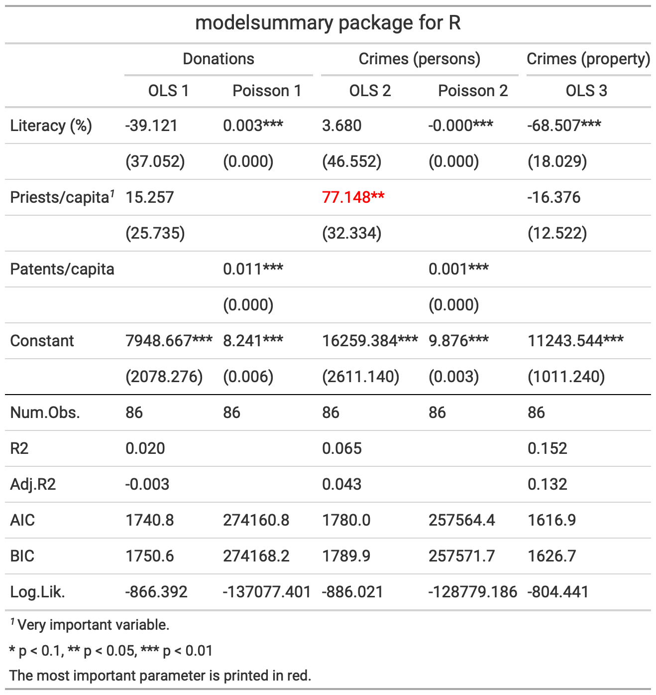
</div>
]

.pull-right-center[
<div align="center">
<br><br>
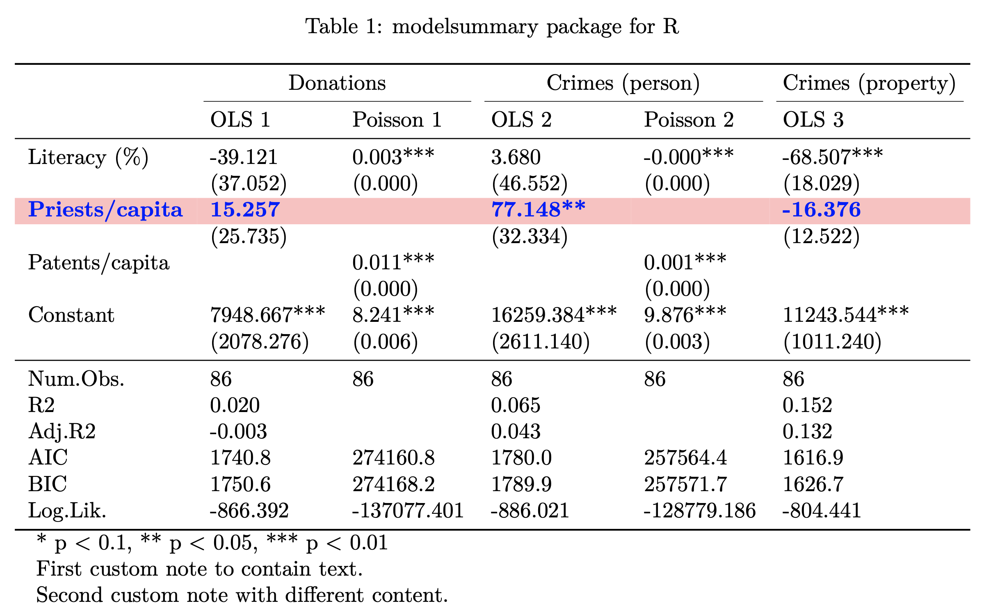
</div>
]


---
# Tables vs. plots to communicate model results

.pull-left[
### The limits of tables

- Tables of coefficients work ok when models are linear and additive.
- They are good to communicate "precise" information.<sup>1</1>
- The are, however, less informative for
  - non-linear relationships between $x$ and $y$ ( $x^2$, $log(x)$, etc.),
  - interaction effects,
  - models for categorical data.
  ]
  
.pull-right[
### The promise of plots 

- *Coefficient plots* can make it more straightforward to focus on two key features of estimated parameters: effect size and uncertainty. 
- What's more, they make comparisons across effects and models much easier. We humans are visual animals.
- Other plots can go a long way to display other implications of models that are not visible from a tabular output, e.g., *predicted probability plots*, *marginal effects plots*, ...
]

.footnote[<sup>1</sup> But sometimes give more precision than warranted. As a rule of thumb, never report more than three decimal points. In most cases, 0-2 is enough. Your estimates are less precise than that anyway.]


---
# Coefficient plots in the wild

.pull-left-center[
<br>
<div align="center">
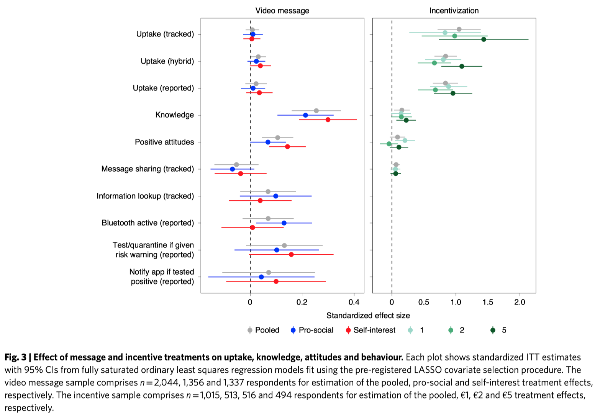
</div>
`Credit` [Munzert et al. 2020](https://www.nature.com/articles/s41562-020-01044-x)
]

.pull-right-center[
<div align="center">
<br><br><br>

</div>
`Credit` [Helbling and Traunmüller 2016](https://journals.sagepub.com/doi/10.1177/0010414015612388)

]


---
# Creating coefficient plots with modelplot()

.pull-left-small[
- `modelplot()` takes one or several models as input. Multiple models are provided as (optionally named) list.
- Again, the extraction of information (estimates, standard errors, model summaries etc.) is taken care of by the function.
- The graphs produced by `modelplot()` are simple `ggplot2` objects. They can be post-processed (and exported) accordingly.
- Although the defaults are good, be sure to refine the plot before publishing it.
]

.pull-right-wide[
```{r, out.width = "450px"}
modelplot(model_out)
```
]

---
# Modifying coefficient plots


.pull-left-vsmall[

- Here's one example for that.
- We provide intuitive variable names with `coef_map`.
- We drop the intercept with `coef_omit`.
- We make more layout adaptations with `ggplot2` functions that make the plot better readable.
]

.pull-right-vwide[

```{r, echo = TRUE, eval = TRUE, out.width = "550px", fig.height = 2}
cm <- c("distance" = "Distance", 
        "originLGA" = "Origin: LGA", 
        "originJFK" = "Origin: JFK")
modelplot(model_out, 
          coef_omit = "Interc", 
          coef_map = cm) + 
  xlim(-5, .25) + 
  geom_vline(xintercept = 0, linetype="dashed") + 
  labs(title = "Linear regression of flight delay at arrival (in mins)",
       caption = "Data source: nycflights13 package") + 
  theme_minimal()
```
]

---
# Working with interpretable effect sizes

.pull-left[
### Take care when plotting effect sizes

- One of the major perks of coefficient plots is the comparability of effects across coefficients.
- This can be, however, also one of the major problems of these kinds of plots
- In order for them to make visual sense, the underlying covariates have to be inherently comparable. By showing slopes, the plot shows the effect of a unit change in each covariate on the outcome, but unit changes may not be comparable across variables.
- Also check out the documentation of the [`effectsize` package](https://easystats.github.io/effectsize/) for a more thorough discussion of the problem (and how to tackle it).
]

.pull-right[
### Addressing the issue

- There are several ways to address the problem, including:
  - Rescale variables to show intuitive unit changes in X (e.g., 1km instead of 1m)
  - Rescale to full scale (minimum to maximum) changes in X
  - Standardize variables to show standard deviation changes in X
- Note that any rescaling operation also affects how you interpret the coefficients (and we're only talking about the linear case!). Sometimes it also makes sense to standardize the response variable. In that case, the coefficients can be interpreted as the change in the response in standard deviations for a 1 unit change in the predictor (whatever that is).
]

---
# Working with interpretable effect sizes (cont.)

.pull-left[

**Rescaling (1 unit = 1000 miles)** 

```{r, echo = TRUE, eval = FALSE, out.width = "350px", fig.height = 2}
# rescale continuous variable
flights$distance1kmiles <- flights$distance/1000
model_out_kmiles <- lm(arr_delay ~ 
       distance1kmiles + origin, data = flights)

# plot model (detailed fine-tuning not shown)
modelplot(model_out_kmiles)
```

```{r, echo = FALSE, eval = FALSE, out.width = "550px", fig.height = 2}
# rescale continuous variable
flights$distance1kmiles <- flights$distance / 1000
model_out_kmiles <-lm(arr_delay ~ distance1kmiles + origin, data = flights)
cm <- c("distance1kmiles" = "Distance (1k miles)",
        "originLGA" = "Origin: LGA",
        "originJFK" = "Origin: JFK")

# one model, one plot (more options)
modelplot(model_out_kmiles, coef_omit = "Interc", coef_map = cm) + 
  xlim(-5, .25) + 
  geom_vline(xintercept = 0, linetype="dashed") + 
  labs(title = "Linear regression of flight delay at arrival (in mins)",
       caption = "Data source: nycflights13 package") + 
  theme_minimal()
```

<div align="center">
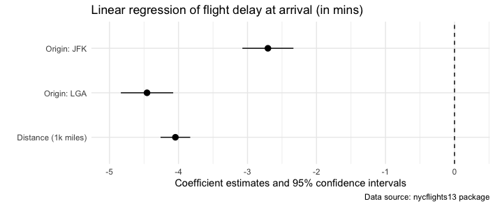
</div>

]

.pull-right[
**Standardization (1 unit = 1 s.d. on the covariate)** 

```{r, echo = TRUE, eval = FALSE, out.width = "350px", fig.height = 2}
# rescale continuous variable
flights$distance_std <- standardize(flights$distance)
model_out_std <- lm(arr_delay ~ 
       distance_std + origin, data = flights)

# plot model (detailed fine-tuning not shown)
modelplot(model_out_std)
```

```{r, echo = FALSE, eval = FALSE, out.width = "350px", fig.height = 2}
# standardized continuous variable
flights$distance_std <- effectsize::standardize(flights$distance)
model_out_std2 <-lm(arr_delay ~ distance_std + origin, data = flights)
cm <- c("distance_std" = "Distance (standardized)",
        "originLGA" = "Origin: LGA",
        "originJFK" = "Origin: JFK")

# one model, one plot (more options)
modelplot(model_out_std2, coef_omit = "Interc", coef_map = cm) + 
  xlim(-5, .25) + 
  geom_vline(xintercept = 0, linetype="dashed") + 
  labs(title = "Linear regression of flight delay at arrival (in mins)",
       caption = "Data source: nycflights13 package") + 
  theme_minimal()
```

<div align="center">
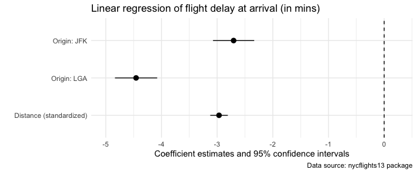
</div>
]


---
# More reporting with plots

.pull-left[
- There is much, much more that can be done with plots and model reporting (stay tuned for the session on visualization!).
- Always be aware about what a model gives you and which relationships you want to explore or highlight.
- As another example, see the fitted vs. true plots on the right. The upper scatter plot compares fitted (x-axis) vs. true (y-axis) values from our standard model. It illustrates a really poor fit.
- The lower scatter plot compares fitted-vs-true for a slight modification of our standard model in which we also take `dep_delay` into account as predictor. Apparently, its a very powerful one.
]

.pull-right[
<div align="center">
<br>
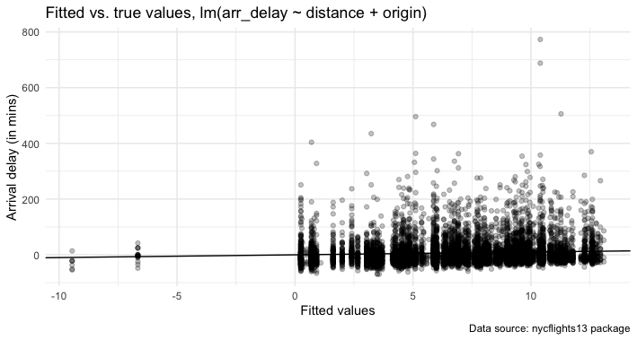
<br>
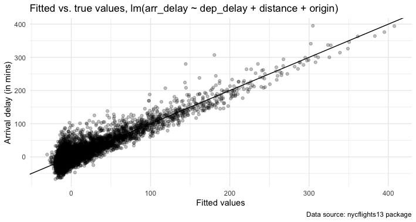
</div>
]


---
class: inverse, center, middle
name: summary

# Summary

<html><div style='float:left'></div><hr color='#EB811B' size=1px style="width:1000px; margin:auto;"/></html>


---
# Summary

Some final bits of advice that didn't fit on the main slides:

1. Before you actually run models, **describe the data**. That's not only for you. Every report should begin with a visualization of the phenomena of interest, plotting the rawest data available that is also legible in a graph.

2. **Plot early, and plot often**! Visualization is not only a great tool for communication, but also for exploration and statistical analysis (more on that later).

3. **Fit many models**. At least if you don't commit to one particular subset (→ preregistration). Think in terms of series of models, starting with the utterly simple and continuing through to the hopelessly complex.

4. **Table results with care**. Please don’t just report which effects were significant and which were non-significant. Please don’t report just p-values. Please don’t just report the estimated effects of the significant effects. Report all estimates that you also discuss.

5. **Invest more time in refining plots** than you planned to. Good figures aren't only plots. Think of informative headers and notes. Ideally, your figures are self-contained.


---
# Coming up

<br><br> 

### Assignment

Assignment 4 is about to go online on GitHub Classroom. Check it out and start modeling!

### Next lecture

Visualization. But first: Mid-term exam week - no class, enjoy the break!


