```{css, echo=FALSE} 
@media print { # print out incremental slides; see https://stackoverflow.com/questions/56373198/get-xaringan-incremental-animations-to-print-to-pdf/56374619#56374619
  .has-continuation {
    display: block !important;
  }
}
```

```{r setup, include=FALSE}
# figures formatting setup
options(htmltools.dir.version = FALSE)
library(knitr)
opts_chunk$set(
  comment = "  ",
  prompt = T,
  fig.align="center", #fig.width=6, fig.height=4.5, 
  # out.width="748px", #out.length="520.75px",
  dpi=300, #fig.path='Figs/',
  cache=F, #echo=F, warning=F, message=F
  engine.opts = list(bash = "-l")
  )

## Next hook based on this SO answer: https://stackoverflow.com/a/39025054
knit_hooks$set(
  prompt = function(before, options, envir) {
    options(
      prompt = if (options$engine %in% c('sh','bash')) '$ ' else 'R> ',
      continue = if (options$engine %in% c('sh','bash')) '$ ' else '+ '
      )
})

library(tidyverse)
library(nycflights13)
library(kableExtra)
```


# Table of contents

<br>

1. [Why data visualization?](#whyviz)

2. [Data visualization as a method](#method)

3. [Types of data visualization](#plottypes)<sup>1</sup>

4. [Ingredients of data visualization](#ingredients)<sup>1</sup>

5. [Principles of good data visualization](#rules)<sup>1</sup>

6. [Visualization with R](#vizr)

7. [The best statistical graph of all times](#bestgraph)

.footnote[<sup>1</sup> Much of these sections draw on materials from Claus Wilke's excellent book [*Fundamentals of Data Visualization*](https://clauswilke.com/dataviz/).]

<!-- ############################################ -->
---
class: inverse, center, middle
name: whyviz

# Why data visualization?

<html><div style='float:left'></div><hr color='#EB811B' size=1px style="width:1000px; margin:auto;"/></html>


---
# You came for this...

.pull-left-small2[
<div align="center">
<br>

<br>

</div>
]

.pull-right-small2[
<div align="center">
<br>

</div>
]

.pull-right-small2[
<div align="center">
<br>

<br>

</div>
]


---
# ... but you'll be getting this

.pull-left[
<br>
<div align="center">

</div>
]

.pull-right[
<br>
<div align="center">
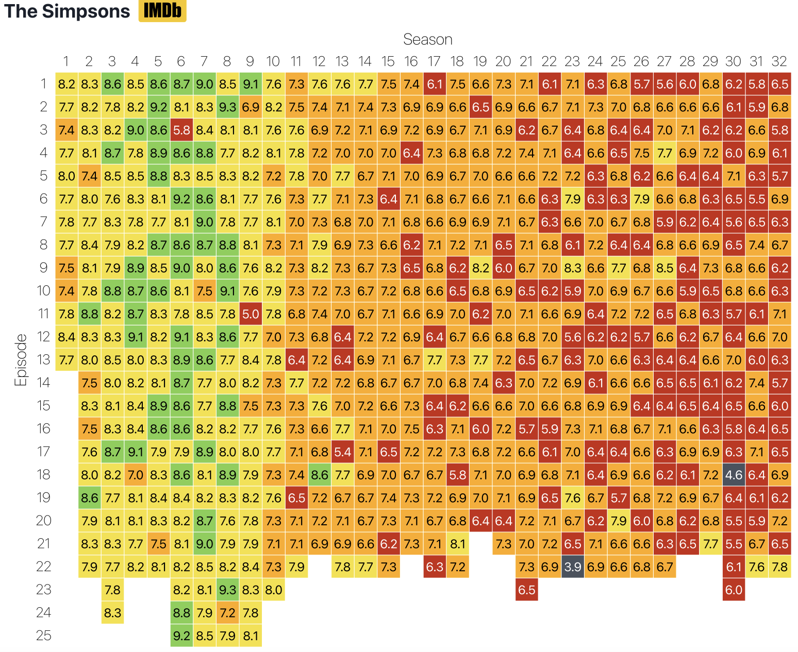
</div>
]


---
# Why data visualization?

.pull-left[

### A new method for the DS toolbox

- Data visualization is a method for making sense (and not just pictures) of data.
- Note that this is more than data visualization in the narrow sense, i.e. the act of encoding quantitative information in visual objects.
- Data scientists are mostly interested in patterns, not individual and exact values.
- Two ways to make sense of quantitative information:

<div align="center">

</div>
]

--

.pull-right[

### The case for visualization

- Visualization **provides useful summaries** for large, complicated data sets – in fact, the utility of visualization increases with data size.
- Visualization **lets you see things** that would otherwise be invisible, in particular relationships among data (patterns, trends, exceptions). 
- Visualization comes with **little or no assumptions** about the nature of the data.
- Visualization facilitates interaction between researcher and data – **it’s a hypothesis generating device**.

<i> "The critical question is how best to transform the data into something that people can understand for optimal decision making." </i>
[Colin Ware, 2013](https://books.google.de/books?id=qFmS95vf6H8C&pg=PA5)
]


---
# 1854 Broad Street cholera outbreak

.pull-left[
<div align="center">
<br>

</div>
]


.pull-right[
- One of the most famous data viusalizations of all times: [John Snow](https://en.wikipedia.org/wiki/John_Snow)'s cholera case map.
- The [Broad Street cholera outbreak](https://en.wikipedia.org/wiki/1854_Broad_Street_cholera_outbreak) in in Soho, London in 1854 was studied by physician John Snow to study its causes (rival hypotheses: germ-contaminated water vs. airborne transmission).
- The germ theory was not established at this point but the map helped highlight how cases clustered around a contaminated pump (which was by far not the only source of contaminated water though).
- Fun fact: this is what doing good data viz gives you:

<div align="center">

</div>
]


---
# Nightingale's rose


.pull-left[
<div align="center">
<br><br><br>

</div>
]


.pull-right[
- One of the potentially most influential graphs is by [Florence Nightingale](https://en.wikipedia.org/wiki/Florence_Nightingale), statistician and founder of modern nursing.
- She pioneered in using graphs to communicate data and to ease drawing conclusions.
- Nightingale's Rose, a polar area diagram, illustrates seasonal sources of soldier mortality in the field hospital Nightingale managed during the Crimean War and highlights that epidemic disease are responsible for more deaths than battlefield wounds. 
- Nightingale's work revolutionized points hygiene and other practices in hospitals, ultimately saving millions of lives.
]

---
# Nightingale's rose (cont.)


.pull-left[
<div align="center">
<br><br><br>

</div>
]


.pull-right[
- One of the potentially most influential graphs is by [Florence Nightingale](https://en.wikipedia.org/wiki/Florence_Nightingale), statistician and founder of modern nursing.
- She pioneered in using graphs to communicate data and to ease drawing conclusions.
- Nightingale's Rose, a polar area diagram, illustrates seasonal sources of soldier mortality in the field hospital Nightingale managed during the Crimean War and highlights that epidemic disease are responsible for more deaths than battlefield wounds. 
- Nightingale's work revolutionized points hygiene and other practices in hospitals, ultimately saving millions of lives.
- [Gelman and Unwin (2012)](http://www.stat.columbia.edu/~gelman/research/published/vis14.pdf) present an alternative presentation of the same data.
- More historical visualizations [here](https://storymaps.arcgis.com/stories/9c2f390fa3f54ed4a11a7d4a66e7c8cc)
]


---
# Graphs vs. tables I: model estimates

.pull-left[
<div align="center">
<br>

</div>
]

.pull-right[
<div align="center">
<br>

</div>
]


---
# Graphs vs. tables II: amounts

<div align="center">
<br>
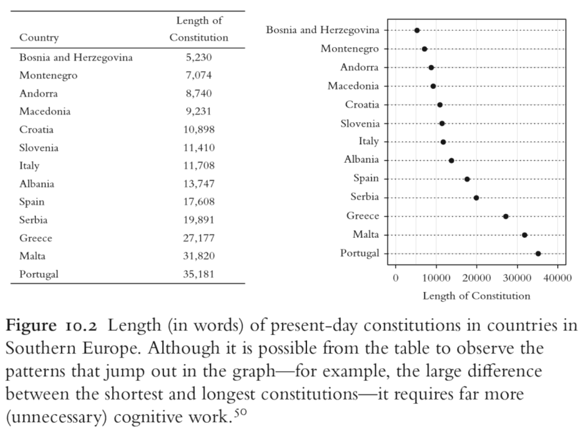
</div>


---
# Graphs vs. tables III: relationships

.pull-left[
- The table on the right comprises data sets I through IV, each consisting of eleven $(x,y)$ points.
- Carefully study the table. How do $x$ and $y$ as well as their relationship compare across datasets?
]

.pull-right[
<br>
<div align="center">

</div>
]

---
# Graphs vs. tables III: relationships (cont.)

.pull-left[
- The table on the right comprises data sets I through IV, each consisting of eleven $(x,y)$ points.
- Carefully study the table. How do $x$ and $y$ as well as their relationship compare across datasets?
- It shows that all the data sets have nearly identical simple descriptive statistics in terms of mean, standard deviation, correlation, and linear fit!
]

.pull-right[
<br>
<div align="center">

</div>
]

---
# Graphs vs. tables III: relationships (cont.)

.pull-left[
- The table on the right comprises data sets I through IV, each consisting of eleven $(x,y)$ points.
- Carefully study the table. How do $x$ and $y$ as well as their relationship compare across datasets?
- It shows that all the data sets have nearly identical simple descriptive statistics in terms of mean, standard deviation, correlation, and linear fit!
- Plotting the data reveals wildly different distributions, countering the impression that "numerical calculations are exact, but graphs are rough" ([Anscombe 1973](https://www.tandfonline.com/doi/abs/10.1080/00031305.1973.10478966)).
- The dataset was constructed by [Francis Anscombe](https://en.wikipedia.org/wiki/Frank_Anscombe) and is known as "[Anscombe's quartet](https://en.wikipedia.org/wiki/Anscombe%27s_quartet)".
- Graphs 3, Tables 0. Case closed.
]

.pull-right[
<br>
<div align="center">

</div>
]


<!-- ############################################ -->
---
class: inverse, center, middle
name: method

# Data visualization as a method

<html><div style='float:left'></div><hr color='#EB811B' size=1px style="width:1000px; margin:auto;"/></html>


---
# Different goals, different looks


.pull-left[
### Exploratory visualization

- "Analytic plots"
- Mostly for ourselves
- Often quick and dirty

### Goals

- What's in the data?
- Get a sense of size and complexity of data.
- Explore and interact.
- "Forces us to notice what we never expected to see" (Tukey 1977)
]

--

.pull-right[
### Explanatory visualization

- "Presentation plots"
- For others after the research is completed
- Few, carefully crafted, attractive graphs

### Goals

- Communicate content of data.
- Tell a story with data.
- Attract attention and interest.
- "Forces readers to see the information the designer wanted to convey" (Kosslyn 1994)
]

---
# Different goals, different looks (cont.)

.pull-left[
### Exploratory visualization

<div align="center">
<br>

</div>
]

.pull-right[
### Explanatory visualization

<div align="center">
<br>

</div>
]


---
# The handcraft of visualization

.pull-left[
### Visualization as an iterative process

- The choice of the right graphical format ultimately depends on the task or problem it is trying to solve.
- Always try different graphical formats on the same data – they may reveal different aspects.
- Constructing visualizations is almost always an iterative process – the first graph is rarely also the final one.

<div align="center">

</div>
]

--

.pull-right[
### A tool for comparison

- "The fundamental analytical act in statistical reasoning is to answer the question 'compared to what?'
- Whether we are evaluating changes over space or time, searching big data bases, adjusting and controlling for variables, designing experiments, specifying multiple regressions, or doing just about any kind of evidence-based reasoning, the essential point is to make intelligent and appropriate comparisons.
- Thus visual displays, if they are to assist thinking, should show comparisons."

<div align="right">
Edward Tufte, <a href="http://atc.berkeley.edu/201/readings/Tufte_BE_2006.pdf">Beautiful Evidence</a>, p.127.
</div>
]


---
# Visualization in the data science workflow

.pull-left[
Data visualization is a key skill for data scientists. It is relevant in every step of the workflow.
]

.pull-right[

<div align="center">
<br>

</div>
]

---
# Visualization in the data science workflow

.pull-left[
Data visualization is a key skill for data scientists. It is relevant in every step of the workflow.

**Wrangle**
- Sanity checks
- Identification of outliers
- Guidance of recoding operations
]

.pull-right[

<div align="center">
<br>

</div>
]

---
# Visualization in the data science workflow

.pull-left[
Data visualization is a key skill for data scientists. It is relevant in every step of the workflow.

**Wrangle**
- Sanity checks
- Identification of outliers
- Guidance of recoding operations
]

.pull-right[

<div align="center">
<br>

</div>

<div align="center">
<br>
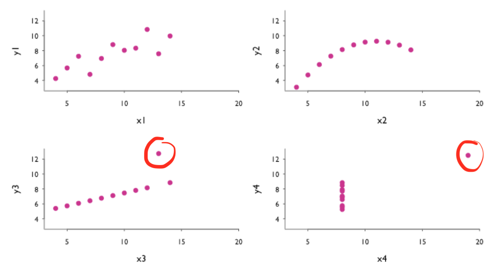
</div>
<div align="center" style="font-size:16px;">
Scatter plots to identify outliers in bivariate relationships.
</div>
]


---
# Visualization in the data science workflow

.pull-left[
Data visualization is a key skill for data scientists. It is relevant in every step of the workflow.

**Wrangle**
- Sanity checks
- Identification of outliers
- Guidance of recoding operations

**Explore**
- Summarize distributions
- Discover patterns, relationships
]

.pull-right[

<div align="center">
<br>

</div>

]


---
# Visualization in the data science workflow

.pull-left[
Data visualization is a key skill for data scientists. It is relevant in every step of the workflow.

**Wrangle**
- Sanity checks
- Identification of outliers
- Guidance of recoding operations

**Explore**
- Summarize distributions
- Discover patterns, relationships
]

.pull-right[

<div align="center">
<br>

</div>

<div align="center">
<br>

</div>
<div align="center" style="font-size:16px;">
Correlogram to visualize amount of association <br> between pairs of variables.
</div>
]


---
# Visualization in the data science workflow (cont.)

.pull-left[
Data visualization is a key skill for data scientists. It is relevant in every step of the workflow.

**Model**
- Test hypotheses
- Summarize (multiple) model estimates
- Visualize uncertainty
- Report robustness/sensitivity analyses
]

.pull-right[

<div align="center">
<br>

</div>

]

---
# Visualization in the data science workflow (cont.)

.pull-left[
Data visualization is a key skill for data scientists. It is relevant in every step of the workflow.

**Model**
- Test hypotheses
- Summarize (multiple) model estimates
- Visualize uncertainty
- Report robustness/sensitivity analyses
]

.pull-right[

<div align="center">
<br>

</div>

<div align="center">
<br>

</div>
<div align="center" style="font-size:16px;">
Raw data and trend line with confidence bands<br>to visualize uncertainty of fit</div>
]

---
# Visualization in the data science workflow (cont.)

.pull-left[
Data visualization is a key skill for data scientists. It is relevant in every step of the workflow.

**Model**
- Test hypotheses
- Summarize (multiple) model estimates
- Visualize uncertainty
- Report robustness/sensitivity analyses

**Communicate**
- Present raw/cooked data
- Present implications of model results
]

.pull-right[

<div align="center">
<br>

</div>

]


---
# Visualization in the data science workflow (cont.)

.pull-left[
Data visualization is a key skill for data scientists. It is relevant in every step of the workflow.

**Model**
- Test hypotheses
- Summarize (multiple) model estimates
- Visualize uncertainty
- Report robustness/sensitivity analyses

**Communicate**
- Present raw/cooked data
- Present implications of model results
]

.pull-right[

<div align="center">
<br>

</div>

<div align="center">
<br>
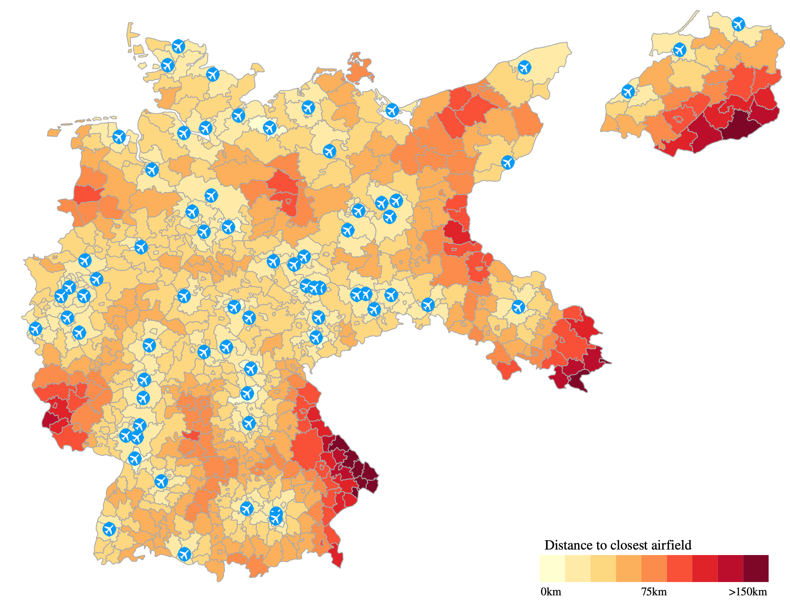
</div>
<div align="center" style="font-size:16px;">
Choropleth map illustrating the location of civilian airfields in the German Empire, 1932. Administrative counties are shaded according to their centroid's distance to the closest airfield</div>
]


---
# Visual inference

.pull-left-wide[

### Human talent and weakness

- Humans are extremely good at recognizing patterns.
- At the same time, humans are also extremely good at inferring patterns when there are none (tendency to see patterns in random data = "apophenia").
- This is somewhat linked to the fact that our species is bad at dealing with probability and randomness.

### Concerns with exploratory data analysis

- A concern that frequently arises with exploratory analysis is that it lacks the rigor of formal tests in confirmatory analysis or conventional statistical inference.
- Long-standing reservations against visualization as merely "informal" approach to data analysis and the fear that beautiful pictures may in fact not correspond to any meaningful patterns of substantive scientific interest.
]


.pull-right-small[
<div align="center">
<br>

<br>

</div>
]

---
# Visual inference (cont.)

.pull-left[
### Overcoming the exploratory vs. confirmatory visualization divide

- Graphical displays are implicit or explicit comparisons to a reference distribution or baseline model.
- If we discover an interesting pattern in data this usually means that it looks different from what we expected.
- We usually we have implicit models in our mind to which we compare the data ("What do we expect to see?")
- We can make these models explicit and use them to guard against "false discoveries"
- Visual discoveries correspond to the implicit or explicit rejection of null hypotheses ([Buja et al. 2009](https://royalsocietypublishing.org/doi/full/10.1098/rsta.2009.0120)).
]

.pull-right[
### Visual inference as an analogue to null hypothesis significance testing

The basic principle of formal testing remains the same in visual inference – with the exception that the test statistic is now a graphical display which is compared to a "reference distribution" of plots showing the null:

<div align="center">

</div>
]


---
# Visual inference: the line-up protocol

This method is called "after the 'police lineup' of criminal investigations [...], because it asks the witness to identify the plot of the real data from among a set of decoys, the null plots, under the veil of ignorance" ([Buja et al. 2009](https://royalsocietypublishing.org/doi/full/10.1098/rsta.2009.0120)).

The visual hypothesis test involves the following steps:

  1. Simulate data to create $m-1$ null plots.
  2. Randomly place the plot of the real data among them, resulting in a total of $m$ plots.
  3. Ask a human viewer to choose the plot that looks the most different from the rest.
  4. If the test person succeeds and picks the plot showing the actual data, then this visual discovery can be assigned a p-value of $1/m$. In other words, the probability of picking the true plot just by chance is $1/m$.

---
# Visual inference: which plot stands out from the rest?

<div align="center">

</div>


---
# Visual inference: which plot stands out from the rest?

<div align="center">

</div>


---
# Visual inference: which plot stands out from the rest?

<div align="center">

</div>

---
# None! All just show runif(500, 0, 1).

<div align="center">

</div>


<!-- ############################################ -->
---
class: inverse, center, middle
name: plottypes

# Types of data visualization

<html><div style='float:left'></div><hr color='#EB811B' size=1px style="width:1000px; margin:auto;"/></html>


---
# Different plot types for different purposes

A common mistake in visualization is that plot types are used for purposes they are not meant for. You'll gain more intuition and experience in picking the right types over time. 

Before you start plotting, ask yourself:

--

.pull-left-vsmall[
#### 1. Which quantity do I want to visualize?

- Amounts
- Distributions
- Proportions
- Associations
- Structures
- Trends
- Estimates
- Predictions
- Uncertainty
]

--

.pull-right-vwide[
#### 2. Which question do I want to answer?

- "Is the *distribution* normal (or uniform or...)?" → **Histogram, density plot, Q-Q plot**
- "Are univariate *distributions* across subgroups different?" → **Boxplots, ridgelines**
- "How do *differences in amounts* between groups compare?" → **Barplot, dotplot** 
- "What is the *relationship* between x and y?" → **Scatterplot, contour plot, hex bins** 
- "What are the *correlations* in a set of variables?" → **Correlogram, small multiples** 
- "How did a *trend* develop over time?" → **Line graph, slopegraph** 
- "Are the data *clustered* by subgroup?" → **Scatterplot with color**
- "Is there a *spatial pattern*?" → **Choropleth, cartogram heatmap**
- "What are the relative and absolute *effect sizes*? → **Coefficient plot**
- "How uncertain are *estimates*? → **Error bars, confidence bands**

]


---
# A directory of visualizations

.pull-left[
### Visualizing amounts

<div align="center">
<br>

</div>

<div align="center">

</div>
]

--

.pull-right[

### Visualizing distributions
<div align="center">
<br>

</div>

<div align="center">

</div>
]


---
# A directory of visualizations (cont.)

.pull-left[
### Visualizing proportions

<div align="center">
<br>

</div>

<div align="center">

</div>

<div align="center">

</div>
]


--

.pull-right[

### Visualizing x-y relationships
<div align="center">
<br>

</div>

<div align="center">

</div>

<div align="center">

</div>
]


---
# A directory of visualizations (cont.)

.pull-left[
### Visualizing uncertainty

<div align="center">
<br>

</div>

<div align="center">

</div>

<div align="center">

</div>
]


--

.pull-right[

### Visualizing geospatial data
<div align="center">
<br>

</div>
]


<!-- ############################################ -->
---
class: inverse, center, middle
name: plotingredients

# Ingredients of data visualization

<html><div style='float:left'></div><hr color='#EB811B' size=1px style="width:1000px; margin:auto;"/></html>


---
# Mapping data onto aesthetics

- Whenever we visualize data, we take data values and convert them in a systematic and logical way into the visual elements that make up the final graphic.
- Even though there are many different types of data visualizations, all these visualizations can be described with a common language. 
- All data visualizations map data values into quantifiable features of the resulting graphic. We refer to these features as **aesthetics**.
- Key aesthetics are:

<div align="center">

</div>

- All aesthetics fall into one of two groups: Those that can represent continuous data (e.g., position, size, color) and those that can not (e.g., shape, line type).


---
# Coordinate systems and axes

.pull-left[
- Visualization of quantitative data requires a communication of quantities.
- Positions of data values matter. Usually, we need two position scales (x and y axis of the plot).
- The combination of a set of position scales and their relative geometric arrangement is called a **coordinate system**.
- Often we have two axes representing two different **units**. 
- In a **Cartesian** coordinate system, the grid lines along an axis are spaced evenly both in data units and in the resulting visualization.
- There are scenarios where nonlinear scales are preferred. In a nonlinear scale, even spacing in data units corresponds to uneven spacing in the visualization (e.g., log scales).
- Be sure to **label axes properly**!
]

.pull-right[
<div align="center">


</div>
]

---
# Colors

.pull-left[
- There are three fundamental use cases for color in data visualizations:
  1. We can use color to distinguish groups of data from each other;
  2. We can use color to represent data values; and 
  3. We can use color to highlight.
]

.pull-right[
]

---
# Colors

.pull-left[
- There are three fundamental use cases for color in data visualizations:
  1. We can use color to **distinguish groups of data from each other**;
  2. We can use color to represent data values; and 
  3. We can use color to highlight.
]

.pull-right[
<div align="center">


</div>
]


---
# Colors

.pull-left[
- There are three fundamental use cases for color in data visualizations:
  1. We can use color to distinguish groups of data from each other;
  2. We can use color to **represent data values**; and 
  3. We can use color to highlight.
]

.pull-right[
<div align="center">


</div>
]


---
# Colors

.pull-left[
- There are three fundamental use cases for color in data visualizations:
  1. We can use color to distinguish groups of data from each other;
  2. We can use color to represent data values; and 
  3. We can use color to **highlight**.
]

.pull-right[
<div align="center">


</div>
]


---
# Colors

.pull-left[
- There are three fundamental use cases for color in data visualizations:
  1. We can use color to distinguish groups of data from each other;
  2. We can use color to represent data values; and 
  3. We can use color to highlight.
- While colors are very powerful aesthetics, try to avoid common pitfalls, such as:
]

.pull-right[
]


---
# Colors

.pull-left[
- There are three fundamental use cases for color in data visualizations:
  1. We can use color to distinguish groups of data from each other;
  2. We can use color to represent data values; and 
  3. We can use color to highlight.
- While colors are very powerful aesthetics, try to avoid common pitfalls, such as:
  - Encoding **too much / irrelevant information**
]

.pull-right[
<div align="center">
<br>

</div>
]


---
# Colors

.pull-left[
- There are three fundamental use cases for color in data visualizations:
  1. We can use color to distinguish groups of data from each other;
  2. We can use color to represent data values; and 
  3. We can use color to highlight.
- While colors are very powerful aesthetics, try to avoid common pitfalls, such as:
  - Encoding too much / irrelevant information
  - Using **non-monotonic color scales** to encode data values
]

.pull-right[
<div align="center">
<br>

<br>

</div>
]


---
# Colors

.pull-left[
- There are three fundamental use cases for color in data visualizations:
  1. We can use color to distinguish groups of data from each other;
  2. We can use color to represent data values; and 
  3. We can use color to highlight.
- While colors are very powerful aesthetics, try to avoid common pitfalls, such as:
  - Encoding too much / irrelevant information
  - Using non-monotonic color scales to encode data values
  - Not designing for **color-vision deficiency**

]

.pull-right[
<div align="center">
<br>

<br>


</div>
]


---
# Colors

.pull-left[
- There are three fundamental use cases for color in data visualizations:
  1. We can use color to distinguish groups of data from each other;
  2. We can use color to represent data values; and 
  3. We can use color to highlight.
- While colors are very powerful aesthetics, try to avoid common pitfalls, such as:
  - Encoding too much / irrelevant information
  - Using non-monotonic color scales to encode data values
  - Not designing for color-vision deficiency
- There's a whole science around the perception of colors in graphs, and a range of tools that help you select appropriate color schemes. My favorite is [ColorBrewer](https://colorbrewer2.org/), which is implemented in the [`RColorBrewer`](https://cran.r-project.org/web/packages/RColorBrewer/index.html) package.
]

.pull-right[
<div align="center">
<br>

<br>


</div>
]


---
# Line and point types

.pull-left[
- Different line and point types can help distinguish different data types (e.g., subgroups).
- For lines, we can, use solid, dashed or dotted formatting.
- For points, we can use solid dots, open circles, triangles, or really any symbol we can come up with.
- Try to avoid different line and point types. They add a lot of noise and are difficult to read.
]

.pull-right[
]

---
# Line and point types

.pull-left[
- Different line and point types can help distinguish different data types (e.g., subgroups).
- For lines, we can, use solid, dashed or dotted formatting.
- For points, we can use solid dots, open circles, triangles, or really any symbol we can come up with.
- Try to avoid different line and point types. They add a lot of noise and are difficult to read.
- Consider colored shapes instead of **different lines**.
]

.pull-right[
<div align="center">
<br><br>

</div>
]

---
# Line and point types

.pull-left[
- Different line and point types can help distinguish different data types (e.g., subgroups).
- For lines, we can, use solid, dashed or dotted formatting.
- For points, we can use solid dots, open circles, triangles, or really any symbol we can come up with.
- Try to avoid different line and point types. They add a lot of noise and are difficult to read.
- Consider **colored shapes** instead of different lines.
]

.pull-right[
<div align="center">
<br><br>

</div>
]


---
# Line and point types

.pull-left[
- Different line and point types can help distinguish different data types (e.g., subgroups).
- For lines, we can, use solid, dashed or dotted formatting.
- For points, we can use solid dots, open circles, triangles, or really any symbol we can come up with.
- Try to avoid different line and point types. They add a lot of noise and are difficult to read.
- Consider **colored shapes** instead of different lines.
]

.pull-right[
<div align="center">
<br><br>

</div>
]


---
# Line and point types

.pull-left[
- Different line and point types can help distinguish different data types (e.g., subgroups).
- For lines, we can, use solid, dashed or dotted formatting.
- For points, we can use solid dots, open circles, triangles, or really any symbol we can come up with.
- Try to avoid different line and point types. They add a lot of noise and are difficult to read.
- Consider colored shapes instead of different lines.
- Consider colored shapes instead of **different points**.
]

.pull-right[
<div align="center">
<br><br>

</div>
]


---
# Line and point types

.pull-left[
- Different line and point types can help distinguish different data types (e.g., subgroups).
- For lines, we can, use solid, dashed or dotted formatting.
- For points, we can use solid dots, open circles, triangles, or really any symbol we can come up with.
- Try to avoid different line and point types. They add a lot of noise and are difficult to read.
- Consider colored shapes instead of different lines.
- Consider **colored shapes** instead of different points.
]

.pull-right[
<div align="center">
<br><br>

</div>
]


---
# Line and point types

.pull-left[
- Different line and point types can help distinguish different data types (e.g., subgroups).
- For lines, we can, use solid, dashed or dotted formatting.
- For points, we can use solid dots, open circles, triangles, or really any symbol we can come up with.
- Try to avoid different line and point types. They add a lot of noise and are difficult to read.
- Consider colored shapes instead of different lines.
- Consider colored shapes instead of different points.
- Use **redundant coding**, i.e. use color to enhance the visual appearance of the figure without relying entirely on color to convey key information.
]

.pull-right[
<div align="center">
<br><br>

</div>
]


---
# Line and point types

.pull-left[
- Different line and point types can help distinguish different data types (e.g., subgroups).
- For lines, we can, use solid, dashed or dotted formatting.
- For points, we can use solid dots, open circles, triangles, or really any symbol we can come up with.
- Try to avoid different line and point types. They add a lot of noise and are difficult to read.
- Consider colored shapes instead of different lines.
- Consider colored shapes instead of different points.
- Use redundant coding, i.e. use color to enhance the visual appearance of the figure without relying entirely on color to convey key information.
- To tackle **overlapping data**, use partial transparency (alpha blending) and (moderate) jittering.
]

.pull-right[
<div align="center">
<br><br>

</div>
]


---
# Line and point types

.pull-left[
- Different line and point types can help distinguish different data types (e.g., subgroups).
- For lines, we can, use solid, dashed or dotted formatting.
- For points, we can use solid dots, open circles, triangles, or really any symbol we can come up with.
- Try to avoid different line and point types. They add a lot of noise and are difficult to read.
- Consider colored shapes instead of different lines.
- Consider colored shapes instead of different points.
- Use redundant coding, i.e. use color to enhance the visual appearance of the figure without relying entirely on color to convey key information.
- To tackle overlapping data, use **partial transparency** (alpha blending) and (moderate) jittering.
]

.pull-right[
<div align="center">
<br><br>

</div>
]


---
# Line and point types

.pull-left[
- Different line and point types can help distinguish different data types (e.g., subgroups).
- For lines, we can, use solid, dashed or dotted formatting.
- For points, we can use solid dots, open circles, triangles, or really any symbol we can come up with.
- Try to avoid different line and point types. They add a lot of noise and are difficult to read.
- Consider colored shapes instead of different lines.
- Consider colored shapes instead of different points.
- Use redundant coding, i.e. use color to enhance the visual appearance of the figure without relying entirely on color to convey key information.
- To tackle overlapping data, use partial transparency (alpha blending) and **(moderate) jittering**.
]

.pull-right[
<div align="center">
<br><br>

</div>
]


<!-- ############################################ -->
---
class: inverse, center, middle
name: rules

# Principles of good data visualization

<html><div style='float:left'></div><hr color='#EB811B' size=1px style="width:1000px; margin:auto;"/></html>


---
# On the shoulder of giants...

.pull-left[

"Visualization is surprisingly difficult. Even the most simple matters can easily go wrong."

"No matter how clever the choice of the information, and no matter how technologically impressive the encoding, a visualization fails if the decoding fails."

<br>

<div align="right"><i>William Cleveland</i></div>

<div align="center">
<br>

</div>
]

--

.pull-right[
"Although nothing can replace a good graphical idea applied to an interesting set of numbers, editing and revision are as essential to sound graphical work as they are to writing."

"Design cannot rescue failed content."

"Above all else show the data."

<div align="right"><i>Edward Tufte</i></div>

<div align="center">
<br>

</div>
]


---
# Fundamental principles of analytic design

In Chapter 5 of his book "[Beautiful Evidence](http://atc.berkeley.edu/201/readings/Tufte_BE_2006.pdf)", Edward Tufte outlines six fundamental principles of analytic design:

1. **Comparisons.** Show comparisons, contrasts, differences.

2. **Causality, mechanism, structure, explanation.** Show causality, mechanism, explanation, systematic structure.

3. **Multivariate analysis.** Show multivariate data; that is show more than 1 or 2 variables.

4. **Integration of evidence.** Completely integrate words, numbers, images, diagrams.

5. **Documentation.** Thoroughly describe the evidence. Provide a detailed title, indicate the authors and sponsors, document the data sources, show complete measurement scales, point out relevant issues.

6. **Content counts most of all.** Analytical presentations ultimately stand or fall depending on the quality, relevance and integrity of their content ("What is the problem you want to solve?")

--

On the following slide you'll see Minard's famous map of Napoleon's March, praised by Tufte as "one of the best statistical graphs ever". Can you spot how those principles were implemented in Minard’s Map? More information on the map [here](https://en.wikipedia.org/wiki/Charles_Joseph_Minard).


---
# Minard's map of Napoleon's March

<div align="center">
<br>
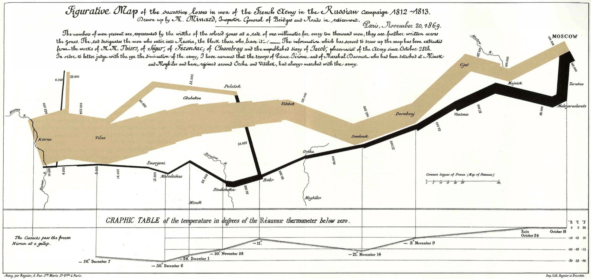
</div>


---
class: smalltext

# Dos and Don'ts

1. [Follow the principle of proportional ink.](https://clauswilke.com/dataviz/proportional-ink.html)<sup>1</sup>
2. [Maximize the data–ink ratio, within reason.](https://clauswilke.com/dataviz/balance-data-context.html)
3. [Avoid invisible overplotting.](https://clauswilke.com/dataviz/overlapping-points.html)
4. [Drop all the unimportant stuff.](https://clauswilke.com/dataviz/balance-data-context.html)
5. [Don't overload graphs. Instead, use several.](https://clauswilke.com/dataviz/multi-panel-figures.html)
6. [Use color scales that match the logic of the data scale.](https://clauswilke.com/dataviz/color-pitfalls.html)
7. [Use color-vision deficient-friendly colors.](https://clauswilke.com/dataviz/color-pitfalls.html#not-designing-for-color-vision-deficiency)
8. [Only use a legend when you need one.](https://clauswilke.com/dataviz/redundant-coding.html#designing-figures-without-legends)
9. [Pay attention to legend order.](https://clauswilke.com/dataviz/figure-titles-captions.html#axis-and-legend-titles)
10. [Label axes properly (but avoid trivial information).](https://clauswilke.com/dataviz/figure-titles-captions.html#figure-titles-and-captions)
11. [Use grids and helper lines, within reason.](https://clauswilke.com/dataviz/balance-data-context.html#background-grids)
12. [Don't order alphabetically ("Alabama first"). Use natural orders instead.](https://datajournalism.com/read/longreads/the-unspoken-rules-of-visualisation)
13. [Bar chart axes should include zero.](https://datajournalism.com/read/longreads/the-unspoken-rules-of-visualisation)
14. [Put the explanatory variable on the x axis, the outcome on the y axis.](https://datajournalism.com/read/longreads/the-unspoken-rules-of-visualisation)
15. [Axes have canonical directions. Larger values are placed above/right of smaller values.](https://datajournalism.com/read/longreads/the-unspoken-rules-of-visualisation)
16. [Avoid multiple y axes at all cost.](https://blog.datawrapper.de/dualaxis/)
17. [Don't do pie charts. (Or maybe do?)](https://clauswilke.com/dataviz/visualizing-proportions.html)
18. [Don't go 3D.](https://clauswilke.com/dataviz/no-3d.html)
19. [Use readable fonts and font sizes.](https://clauswilke.com/dataviz/small-axis-labels.html)
20. [Sometimes a table is just enough.](https://clauswilke.com/dataviz/figure-titles-captions.html#figure-titles-and-captions)

.footnote[<sup>1</sup>Follow the links for more information.]

---
# Small multiples

.pull-left[
- A powerful yet underestimated visualization strategy is to use [multi-panel figures](https://clauswilke.com/dataviz/multi-panel-figures.html).
- Often we want to compare relationships or trends between groups. With many groups, that's too much information for a single figure panel.
- There are various terms for multi-panel figures, including "small multiples" (Tufte 1990), "trellis plot" (Cleveland 1993) and "faceting" (Wickham 2016)
- In R we can implement this fairly easily with `ggplot`'s `facet_grid()` (or `facet_wrap()`).
- If you do small multiples, make sure to use:
  - common graph size
  - common axis scales
  - helpful alignment and order of panels
]


.pull-right[
<div align="center">
<br>

</div>
]


---
# Small multiples (cont.)

.pull-left[
- Check out the example on the right, which was also discussed [here](https://statmodeling.stat.columbia.edu/2014/04/10/small-multiples-lineplots-maps-ok-always-yes-case/) and [there](https://junkcharts.typepad.com/junk_charts/2014/02/small-multiples-with-simple-axes.html).
- What they did right (by Kaiser Fung):
  - Did not put the data on a map
  - Ordered the countries by the most recent data point rather than alphabetically
  - Scale labels are found only on outer edge of the chart area, rather than one set per panel
  - Only used three labels for the 11 years
  - Did not overdo the vertical scale either
  - The nicest feature was the XL scale applied only to South Korea. This destroys the small-multiples principle but draws attention to the top left corner, where the designer wants our eyes to go.
]

.pull-right[
<div align="center">
<br>
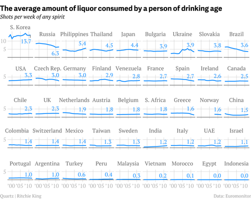
</div>
]


---
# Small multiples (cont.)

.pull-left[
- Check out the example on the right, which was also discussed [here](https://statmodeling.stat.columbia.edu/2014/04/10/small-multiples-lineplots-maps-ok-always-yes-case/) and [there](https://junkcharts.typepad.com/junk_charts/2014/02/small-multiples-with-simple-axes.html).
- What they did right (by Kaiser Fung):
  - Did not put the data on a map
  - Ordered the countries by the most recent data point rather than alphabetically
  - Scale labels are found only on outer edge of the chart area, rather than one set per panel
  - Only used three labels for the 11 years
  - Did not overdo the vertical scale either
  - The nicest feature was the XL scale applied only to South Korea. This destroys the small-multiples principle but draws attention to the top left corner, where the designer wants our eyes to go.
- Sometimes maps are not a good alternative.
]

.pull-right[
<div align="center">
<br>
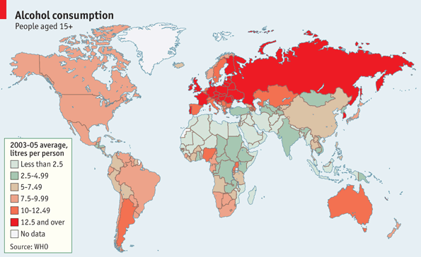
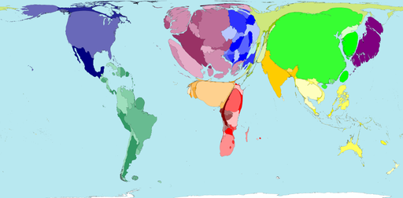
</div>
]


---
# Small multiples (cont.)

.pull-left[
- Check out the example on the right, which was also discussed [here](https://statmodeling.stat.columbia.edu/2014/04/10/small-multiples-lineplots-maps-ok-always-yes-case/) and [there](https://junkcharts.typepad.com/junk_charts/2014/02/small-multiples-with-simple-axes.html).
- What they did right (by Kaiser Fung):
  - Did not put the data on a map
  - Ordered the countries by the most recent data point rather than alphabetically
  - Scale labels are found only on outer edge of the chart area, rather than one set per panel
  - Only used three labels for the 11 years
  - Did not overdo the vertical scale either
  - The nicest feature was the XL scale applied only to South Korea. This destroys the small-multiples principle but draws attention to the top left corner, where the designer wants our eyes to go.
- Sometimes maps are not a good alternative.
- But you can do small multiples of maps!
]

.pull-right[
<div align="center">
<br>

</div>
]


---
# Visualizing many distributions at once

.pull-left[
- An increasingly popular, compact variant of small multiples for distributions is the **ridgeline plot** (they look like mountain ridgelines).
- The idea is to staggering distributions plots in the vertical direction (i.e., along the horizontal axis).
- Ridgeline plots tend to work particularly well if want to show trends in distributions over time.
]


.pull-right[
<div align="center">
<br>


</div>
]

---
# Visualizing many distributions at once (cont.)

.pull-left[
- An increasingly popular, compact variant of small multiples for distributions is the **ridgeline plot** (they look like mountain ridgelines).
- The idea is to staggering distributions plots in the vertical direction (i.e., along the horizontal axis).
- Ridgeline plots tend to work particularly well if want to show trends in distributions over time.
- Ridgelines scale to large numbers of distributions.
]


.pull-right[
<div align="center">
<br>

</div>
]

---
# Visualizing many distributions at once (cont.)

.pull-left[
- An increasingly popular, compact variant of small multiples for distributions is the **ridgeline plot** (they look like mountain ridgelines).
- The idea is to staggering distributions plots in the vertical direction (i.e., along the horizontal axis).
- Ridgeline plots tend to work particularly well if want to show trends in distributions over time.
- Ridgelines scale to large numbers of distributions.
- Ridgelines can be grouped.
]


.pull-right[
<div align="center">
<br>

</div>
]


---
# Visualizing many distributions at once (cont.)

.pull-left[
- An increasingly popular, compact variant of small multiples for distributions is the **ridgeline plot** (they look like mountain ridgelines).
- The idea is to staggering distributions plots in the vertical direction (i.e., along the horizontal axis).
- Ridgeline plots tend to work particularly well if want to show trends in distributions over time.
- Ridgelines scale to large numbers of distributions.
- Ridgelines can be grouped.
- They are implemented in R with the [`ggridges` package](https://cran.r-project.org/web/packages/ggridges/vignettes/introduction.html).
]

.pull-right[
<div align="center">
<br>

</div>
]


<!-- ############################################ -->
---
class: inverse, center, middle
name: vizinference

# Visualization with R

<html><div style='float:left'></div><hr color='#EB811B' size=1px style="width:1000px; margin:auto;"/></html>


---
# R base graphics vs. ggplot2

<div align="center">

</div>


---
# R base graphics vs. ggplot2 (cont.)

<div align="center">

</div>


---
# Plotting things in R with ggplot2

.pull-left-wide[

`ggplot2` is a system for declaratively creating graphics, based on *The Grammar of Graphics* (Leland Wilkinson). You provide the data, tell `ggplot2` how to map variables to aesthetics, what graphical primitives to use, and it takes care of the details. It is part of the [tidyverse](https://www.tidyverse.org/).<sup>1</sup>

There are **many** key `ggplot2` verbs that you need to learn, including:

1. `ggplot()`: Begins a plot that you finish by adding layers to.

2. `aes()`: Specify aesthetic mappings that describe how variables are mapped to visuals (e.g., x and y).

3. `geom_*()`: Specify geoms to represent data points in a layer, e.g., as points or lines.
]

.footnote[
<sup>1</sup> This is R, so you already know that there are multiple ways to do it, and all suck.<br>We will stay in the tidyverse and ignore R base graphics (`plot()`, `barplot()`, <br> `boxplot()`, `hist()`, etc.) for now.
]

.pull-right-small-center[
<div align="center">
<br>

<br>
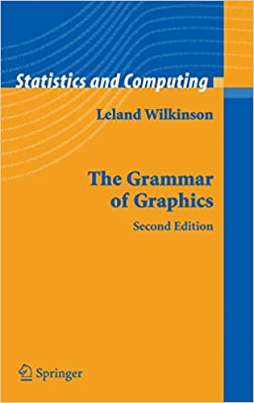
</div>
]


---
# The grammar of graphics

.pull-left-vwide[
### The easy logic of graphical grammar

- Coding a graphic requires us to describe each element of it very precisely.
- To do so, `ggplot` and its creator [Hadley Wickham](https://www.jstor.org/stable/pdf/25651297.pdf) build on and extend a particular grammar - the "Grammar of Graphics" by [Wilkinson, Anand, and Grossmann](https://ieeexplore.ieee.org/document/1532142).
- Building plots with `ggplot2` emphasizes the **concept of layers**, which are specified function by function and assembled with `+`.
- With this particular grammar, we talk less about chart *types* and more about specific chart *elements*.
- For instance, we don't say: 
<div style="margin-left: 1em;">
  <i>"R, give me a small multiple scatter plot."</i>
  </div>
- Instead, we say: 
<div style="margin-left: 1em;">
  <i>"Using this dataset, map wealth to the x-axis, health to the y-axis, add points, color by continent, size by population, scale the y-axis with a log, and facet by year."</i>
  </div>
]

.pull-right-vsmall[
<div align="center">
<br><br><br>

</div>
<div align="center">
Grammar components as layers in ggplot2
</div>
]


---
# The grammar of graphics (cont.)

.pull-left-wide[
### The hard practice of applying graphical grammar

- Building basic plots is fairly straightforward with `ggplot2`.
- There are two aspects that make things complicated:
  1. `ggplot` expects tidy (long) data. That's not always the data structure you have.
  2. It's a comprehensive grammar. All the `ggplot` verbs, arguments and defaults are difficult to learn.
- Things become more complicated (but also exciting) with a multiverse of additional packages that bring additional geometrics, themes, aesthetics, and much more. Check out [this overview](https://github.com/erikgahner/awesome-ggplot2) to learn more.
- We will only touch the basics here. You will learn how to do the first steps in the lab. The rest is learning by doing.
]

.pull-right-small[
<div align="center">
<br><br><br>

</div>
]


---
class: smalltext 

# Components of grammar of graphics

| Element 	| Description 	| Essential? 	| Example 	|
|---	|---	|---	|---	|
| Data 	| This is the dataset being plotted containing the variables to be plotted on the graph. 	| Yes 	| `ggplot(data = mpg)` 	|
| Aesthetics 	| Aesthetics refers to the scales on which we map our data. Some common aesthetics to consider are axis (x,y), shape, size and color.	|  Yes	| `aes(x = displ, y = hwy, color = drv)` 	|
| Geometries 	| Geom refers to the actual visual elements used for the data in the plot, such as points, lines, and bars. 	| Yes 	| `geom_point()` 	|
| Scales 	| Scales map data values to the visual values of an aesthetic. This can be used to change a default mapping 	| No 	| `scale_colour_manual(values = c("red", "blue", "green"))` 	|
| Facets 	| Faceting refers to splitting the data into multiple subsets and then displaying plots for the specific subsets in a panel (small multiples). 	|  No	| `facet_grid(vars(drv), ncol = 1)` 	|
| Statistics 	| This refers to representing statistical information about the data, such as mean and variance, to help in understanding the data.	| No 	| `stat_count(geom="bar")` 	|
| Coordinates 	| This refers to the space on which the data is plotted (e.g., Cartesian coordinates). 	| No 	| `coord_polar()`	|
| Labels 	| This refers to additional descriptions of your plot, such as title, subtitle, caption, x and y axis label 	| No 	| `labs(x = "Height", y = "Weight", title = "Look at my plot")`	|
| Themes 	| Themes are used to change the appearance of non-data elements, such as fonts, color, or legends.	| No 	| `theme_bw()` 	|


---
# Building a plot step by step with ggplot2 

.pull-left[
### Start with data and aesthetics<sup>1</sup>
```{r mpg-layers-1, tidy=FALSE, message=FALSE, fig.show="hide", fig.dim=c(4.8, 5), out.width="100%"}
ggplot(data = mpg,                  #<<
       mapping = aes(x = displ,     #<<
                     y = hwy,       #<<
                     color = drv))  #<<
```
]

.pull-right[
`)
]

.footnote[<sup>1</sup>This example is borrowed from [Andrew Heiss](https://datavizs21.classes.andrewheiss.com/content/).]


---
# Building a plot step by step with ggplot2 (cont.)

.pull-left[
### Add a point geom
```{r mpg-layers-2, tidy=FALSE, message=FALSE, fig.show="hide", fig.dim=c(4.8, 5), out.width="100%"}
ggplot(data = mpg,
       mapping = aes(x = displ,
                     y = hwy,
                     color = drv)) +
  geom_point() #<<
```
]

.pull-right[
`)
]


---
# Building a plot step by step with ggplot2 (cont.)

.pull-left[
### Add a smooth geom
```{r mpg-layers-3, tidy=FALSE, message=FALSE, fig.show="hide", fig.dim=c(4.8, 5), out.width="100%"}
ggplot(data = mpg,
       mapping = aes(x = displ,
                     y = hwy,
                     color = drv)) +
  geom_point() +
  geom_smooth() #<<
```
]

.pull-right[
`)
]

---
# Building a plot step by step with ggplot2 (cont.)

.pull-left[
### Make it straight
```{r mpg-layers-4, tidy=FALSE, message=FALSE, fig.show="hide", fig.dim=c(4.8, 5), out.width="100%"}
ggplot(data = mpg,
       mapping = aes(x = displ,
                     y = hwy,
                     color = drv)) +
  geom_point() +
  geom_smooth(method = "lm") #<<
```
]

.pull-right[
`)
]


---
# Building a plot step by step with ggplot2 (cont.)

.pull-left[
### Use a viridis color scale
```{r mpg-layers-5, tidy=FALSE, message=FALSE, fig.show="hide", fig.dim=c(4.8, 5), out.width="100%"}
ggplot(data = mpg,
       mapping = aes(x = displ,
                     y = hwy,
                     color = drv)) +
  geom_point() +
  geom_smooth(method = "lm") +
  scale_color_viridis_d() #<<
```
]

.pull-right[
`)
]


---
# Building a plot step by step with ggplot2 (cont.)

.pull-left[
### Facet by drive
```{r mpg-layers-6, tidy=FALSE, message=FALSE, fig.show="hide", fig.dim=c(4.8, 5), out.width="100%"}
ggplot(data = mpg,
       mapping = aes(x = displ,
                     y = hwy,
                     color = drv)) +
  geom_point() +
  geom_smooth(method = "lm") +
  scale_color_viridis_d() +
  facet_wrap(vars(drv), ncol = 1) #<<
```
]

.pull-right[
`)
]


---
# Building a plot step by step with ggplot2 (cont.)

.pull-left[
### Add labels
```{r mpg-layers-7, tidy=FALSE, message=FALSE, fig.show="hide", fig.dim=c(4.8, 5), out.width="100%"}
ggplot(data = mpg,
       mapping = aes(x = displ,
                     y = hwy,
                     color = drv)) +
  geom_point() +
  geom_smooth(method = "lm") +
  scale_color_viridis_d() +
  facet_wrap(vars(drv), ncol = 1) +
  labs(x = "Displacement", y = "Highway MPG",  #<<
       color = "Drive",   #<<
       title = "Cars with bigger engines get lower mileage",  #<<
       caption = "I know nothing about cars")  #<<
```
]

.pull-right[
`)
]


---
# Building a plot step by step with ggplot2 (cont.)

.pull-left[
### Add a theme
```{r mpg-layers-8, tidy=FALSE, message=FALSE, fig.show="hide", fig.dim=c(4.8, 5), out.width="100%"}
ggplot(data = mpg,
       mapping = aes(x = displ,
                     y = hwy,
                     color = drv)) +
  geom_point() +
  geom_smooth(method = "lm") +
  scale_color_viridis_d() +
  facet_wrap(vars(drv), ncol = 1) +
  labs(x = "Displacement", y = "Highway MPG",
       color = "Drive", 
       title = "Cars with bigger engines get lower mileage",
       caption = "I know nothing about cars") +
  theme_bw() #<<
```
]

.pull-right[
`)
]


---
# Building a plot step by step with ggplot2 (cont.)

.pull-left[
### Modify the theme
```{r mpg-layers-9, tidy=FALSE, message=FALSE, fig.show="hide", fig.dim=c(4.8, 5), out.width="100%"}
ggplot(data = mpg, 
       mapping = aes(x = displ,
                     y = hwy,
                     color = drv)) +
  geom_point() +
  geom_smooth(method = "lm") +
  scale_color_viridis_d() +
  facet_wrap(vars(drv), ncol = 1) +
  labs(x = "Displacement", y = "Highway MPG",
       color = "Drive", 
       title = "Cars with bigger engines get lower mileage",
       caption = "I know nothing about cars") +
  theme_bw() +
  theme(legend.position = "bottom", #<<
        plot.title = element_text(face = "bold")) #<<
```
]

.pull-right[
`)
]


---
# Building a plot step by step with ggplot2 (cont.)

.pull-left[
### Finished!
```{r mpg-layers-finished, tidy=FALSE, message=FALSE, fig.show="hide", fig.dim=c(4.8, 5), out.width="100%"}
ggplot(data = mpg, 
       mapping = aes(x = displ,
                     y = hwy,
                     color = drv)) +
  geom_point() +
  geom_smooth(method = "lm") + 
  scale_color_viridis_d() +
  facet_wrap(vars(drv), ncol = 1) +
  labs(x = "Displacement", y = "Highway MPG",
       color = "Drive", 
       title = "Cars with bigger engines get lower mileage",
       caption = "I know nothing about cars") +
  theme_bw() +
  theme(legend.position = "bottom",
        plot.title = element_text(face = "bold"))
```
]

.pull-right[
`)
]


---
# Plotting as an iterative process

<div align="center">
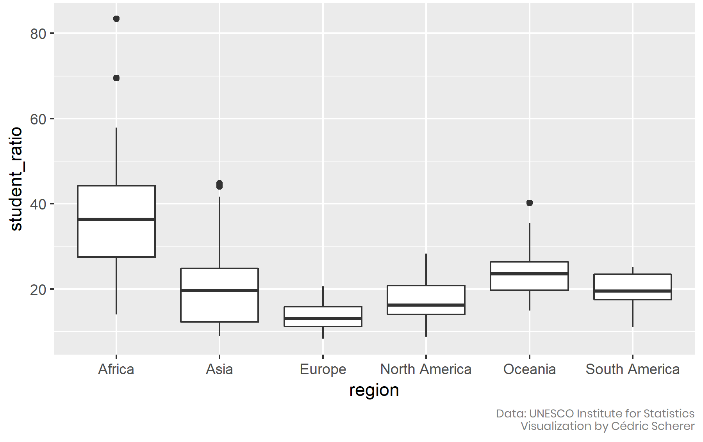
</div>
`Credit and code` [Cedric Scherer](https://www.cedricscherer.com/2019/05/17/the-evolution-of-a-ggplot-ep.-1/)


---
# Picking the right image file format

.pull-left[
### What are the formats?
- At the end of the visualization workflow, you have to decide [how to store/export/publish the figures](https://clauswilke.com/dataviz/image-file-formats.html).
- There are [many different file formats](https://en.wikipedia.org/wiki/Image_file_formats), but the most important difference is whether they are:
  - **Bitmap (raster graphics)**: store information as a grid of pixels
  - **Vector**: store information as geometric arrangement of individual graphical elements

### Which format to pick?
- Use `pdf/svg` whenever possible.
- Use `png` for online documents/presentations.
- Use `jpeg` as last resort (in particular if pngs are too large and loss by compression is acceptable).
]

.pull-right[
<div align="center">
<br>
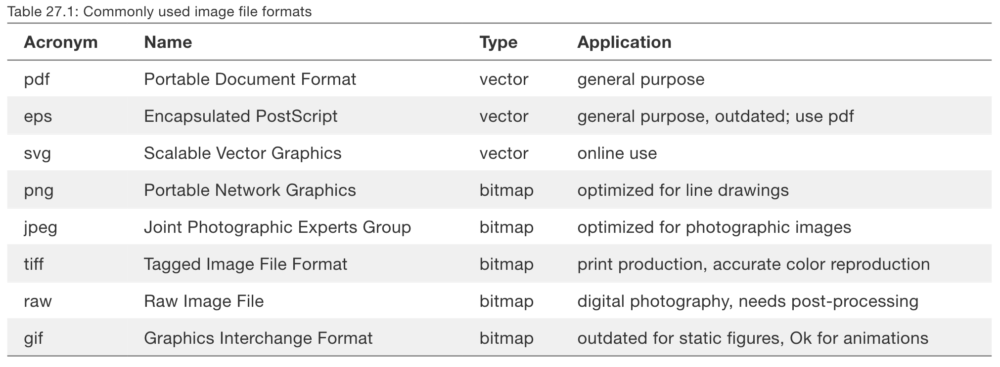
<br><br>
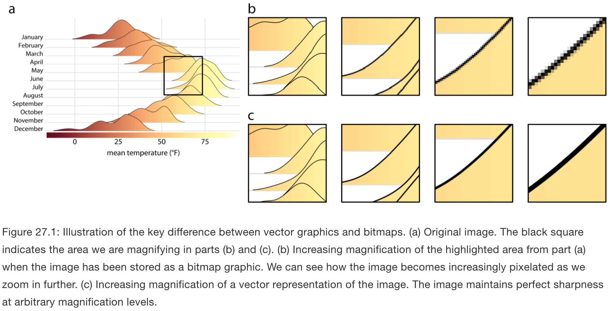
</div>
]


---
# Going interactive

.pull-left-wide[
- In online presentations of your data and analyses, you might want to go interactive.
- Interactive webpages are mainly run with JavaScript, and we can use R to draw on JavaScript libraries to create interactive content.
- In particular, the `htmlwidgets` package provides a framework to bind R commands to various JavaScript libraries, including those that create data graphs.
- Many "widgets" are already available - check out http://gallery.htmlwidgets.org/.
- Other JavaScript libraries for interactive graphics can be created with R, too:
  - [`leaflet`](https://rstudio.github.io/leaflet/) to connect to the [Leaflet library](https://leafletjs.com/) and create interactive maps
  - [`plotly`](https://plotly.com/r/) to connect to [Plotly](https://plotly.com/r/is-plotly-free/) and create graphs of all kinds
- For the record: interactive ≠ animated. On the right you see animated charts. Please don't do this at home.
]

.pull-right-small[
<div align="center">
<br><br>

<br>
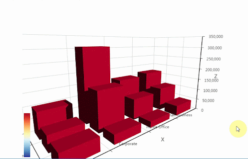
</div>
]

---
# Some notes on the right visualization software

.pull-left[
1. Always conceptualize first.

2. Prioritize programmatic solutions to stay reproducible (i.e., R over Excel).

3. For conceptual charts (not: data viz!), other tools might be just fine (e.g., Powerpoint or even hand-drawn figures).

4. Don't be distracted by interactives (as offered by, e.g., highcharts.com, Tableau, and others).

5. Designing good graphs is a learnable skill. Study how others do it in your software of choice!

6. But a good visualization takes time, even if you’re experienced. Working a full day on the key plot of your analysis? No problem! If you go the coding route, this is a good investment for Future-You.
]

.pull-right[
<div align="center">
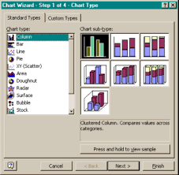
<br><br>

</div>
]


<!-- ############################################ -->
---
class: inverse, center, middle
name: bestgraph

# The best statistical graph of all times

<html><div style='float:left'></div><hr color='#EB811B' size=1px style="width:1000px; margin:auto;"/></html>


---
# The best statistical graph of all times

.pull-left-small[
<br>
- "Indeed, among all the forms of statistical graphics, **the humble scatterplot** may be considered the most versatile, polymorphic, and generally useful invention in the entire history of statistical graphics." ([Friendly & Denis 2005](https://doi.org/10.1002/jhbs.20078))
- There's another lesson to learn here: **Keep it simple.** Reading visualizations is a skill, and most people exposed to your work will be worse at it than you.
]

.pull-right-wide[
<div align="center">
<br>
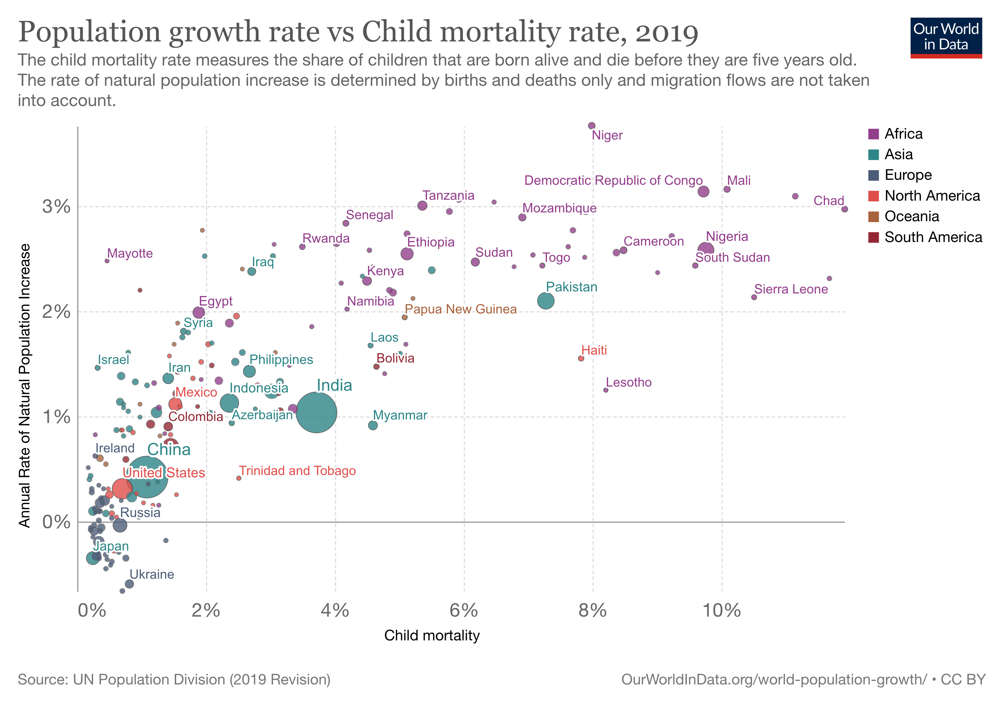
</div>
]


---
# The best statistical graph of all times

.pull-left-small[
<br>
- "Indeed, among all the forms of statistical graphics, **the humble scatterplot** may be considered the most versatile, polymorphic, and generally useful invention in the entire history of statistical graphics." ([Friendly & Denis 2005](https://doi.org/10.1002/jhbs.20078))
- There's another lesson to learn here: **Keep it simple.** Reading visualizations is a skill, and most people exposed to your work will be worse at it than you.
]

.pull-right-wide[
<div align="center">
<br>
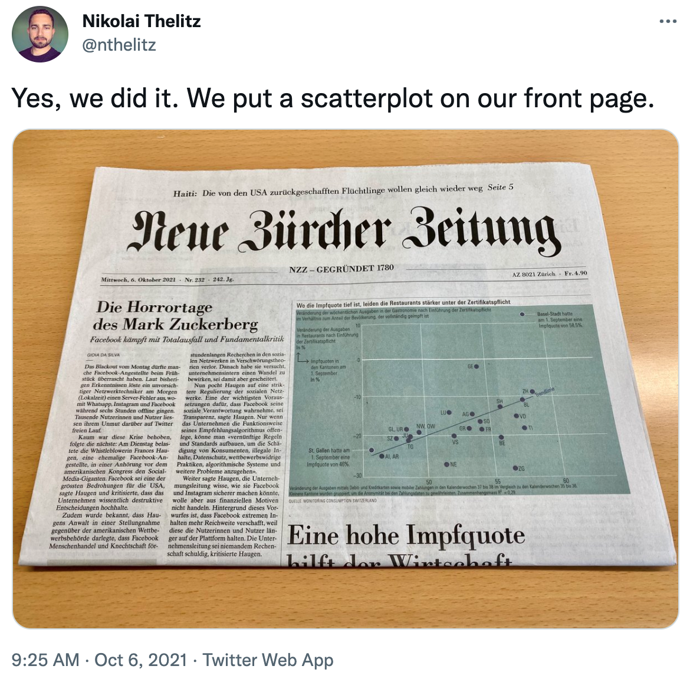
</div>
]


---
# Further reading

<div align="center">


</div>

<div align="center">


</div>


---
# Coming up

<br><br> 

### Assignment

Assignment 5 is about to go online on GitHub Classroom. Check it out and start plotting!

### Next lecture

The workshop! 😱


