```{css, echo=FALSE} 
@media print { # print out incremental slides; see https://stackoverflow.com/questions/56373198/get-xaringan-incremental-animations-to-print-to-pdf/56374619#56374619
  .has-continuation {
    display: block !important;
  }
}
```

```{r setup, include=FALSE}
# figures formatting setup
options(htmltools.dir.version = FALSE)
library(knitr)
opts_chunk$set(
  comment = "  ",
  prompt = T,
  fig.align="center", #fig.width=6, fig.height=4.5, 
  # out.width="748px", #out.length="520.75px",
  dpi=300, #fig.path='Figs/',
  cache=F, #echo=F, warning=F, message=F
  engine.opts = list(bash = "-l")
  )

## Next hook based on this SO answer: https://stackoverflow.com/a/39025054
knit_hooks$set(
  prompt = function(before, options, envir) {
    options(
      prompt = if (options$engine %in% c('sh','bash')) '$ ' else 'R> ',
      continue = if (options$engine %in% c('sh','bash')) '$ ' else '+ '
      )
})

library(tidyverse)
library(nycflights13)
library(kableExtra)
```


# Table of contents

<br>

1. [Why data visualization?](#whyviz)

2. [Data visualization as a method](#method)

3. [Types of data visualization](#plottypes)

4. [Ingredients of data visualization](#ingredients)<sup>1</sup>

5. [Principles of good data visualization](#rules)<sup>1</sup>

6. [Visualization with R](#vizr)

7. [Summary](#summary)

.footnote[<sup>1</sup> Much of these sections draws on materials from Claus Wilke's excellent book [*Fundamentals of Data Visualization*](https://clauswilke.com/dataviz/).]

<!-- ############################################ -->
---
class: inverse, center, middle
name: whyviz

# Why data visualization?

<html><div style='float:left'></div><hr color='#EB811B' size=1px style="width:1000px; margin:auto;"/></html>


---
# You came for this...

.pull-left-small2[
<div align="center">
<br>

<br>
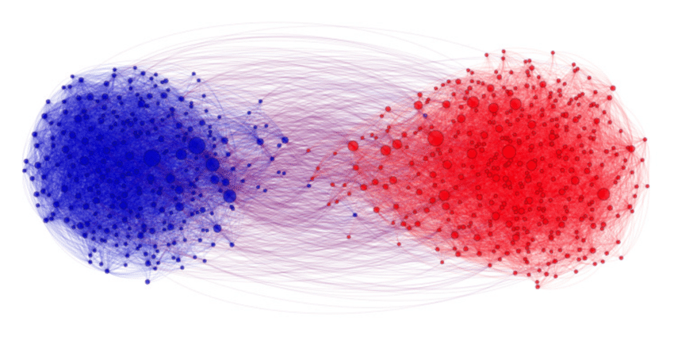
</div>
]

.pull-right-small2[
<div align="center">
<br>

</div>
]

.pull-right-small2[
<div align="center">
<br>
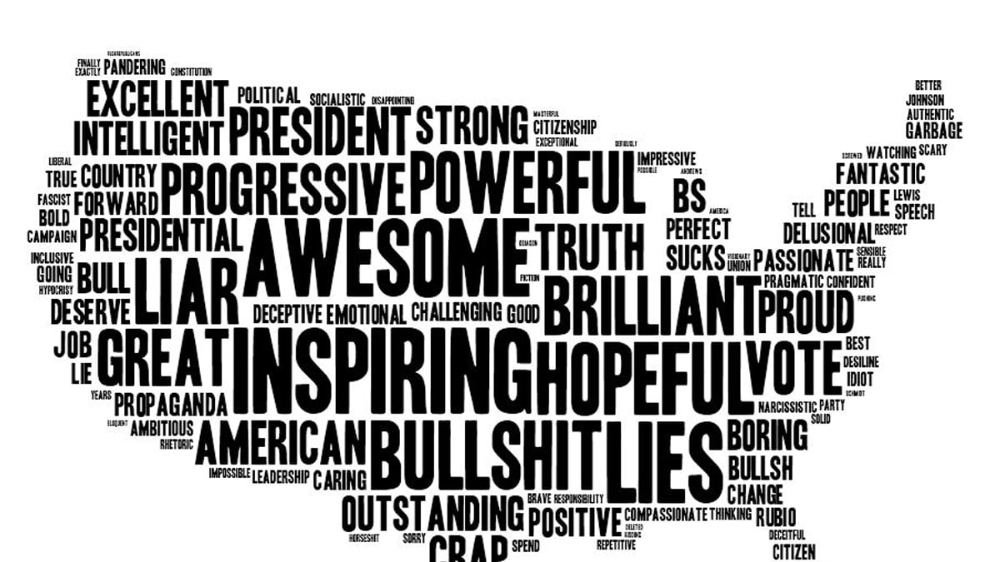
<br>
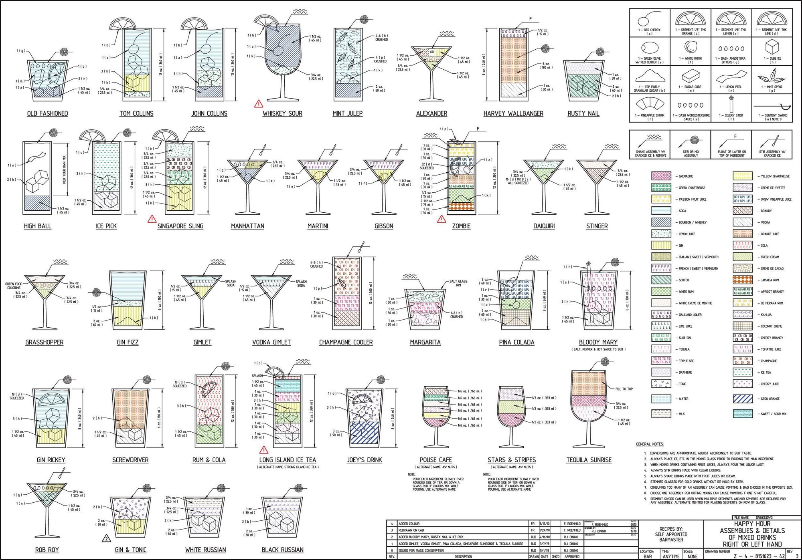
</div>
]


---
# ... but you'll be getting this


---
# Why data visualization?

.pull-left[

### A new method for the DS toolbox

- Data visualization is a method for making sense (and not just pictures) of data.
- Note that this is more than data visualization in the narrow sense, i.e. the act of encoding quantitative information in visual objects.
- Data scientists are mostly interested in patterns, not individual and exact values.
- Two ways to make sense of quantitative information:

<div align="center">
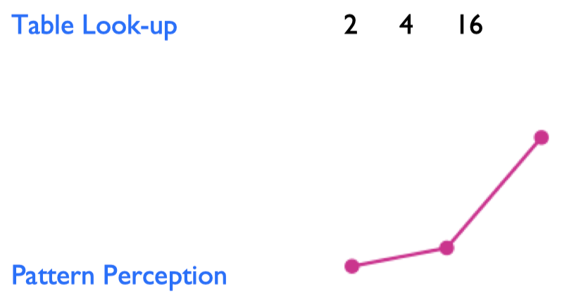
</div>
]

--

.pull-right[

### The case for visualization

- Visualization **provides useful summaries** for large, complicated data sets – in fact, the utility of visualization increases with data size.
- Visualization **lets you see things** that would otherwise be invisible, in particular relationships among data (patterns, trends, exceptions). 
- Visualization comes with **little or no assumptions** about the nature of the data.
- Visualization facilitates interaction between researcher and data – **it’s a hypothesis generating device**.

<i> "The critical question is how best to transform the data into something that people can understand for optimal decision making." </i>
[Colin Ware, 2013](https://books.google.de/books?id=qFmS95vf6H8C&pg=PA5)
]


---
# 1854 Broad Street cholera outbreak

.pull-left[
<div align="center">
<br>
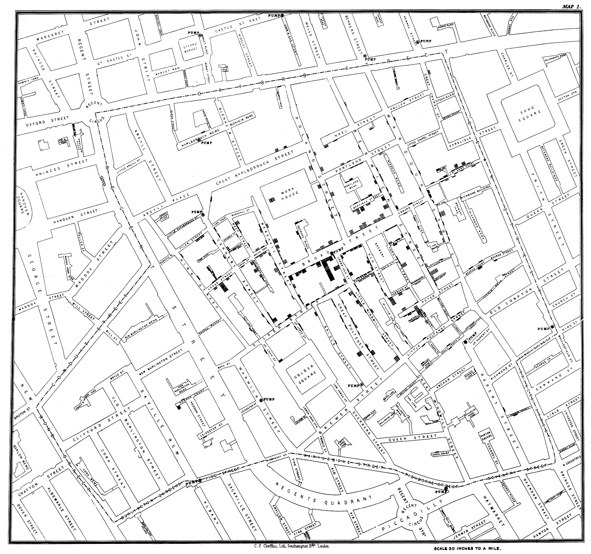
</div>
]


.pull-right[
- One of the most famous data viusalizations of all times: [John Snow](https://en.wikipedia.org/wiki/John_Snow)'s cholera case map.
- The [Broad Street cholera outbreak](https://en.wikipedia.org/wiki/1854_Broad_Street_cholera_outbreak) in in Soho, London in 1854 was studied by physician John Snow to study its causes (rival hypotheses: germ-contaminated water vs. airborne transmission).
- The germ theory was not established at this point but the map helped highlight how cases clustered around a contaminated pump (which was by far not the only source of contaminated water though).
- Fun fact: this is what doing good data viz gives you:

<div align="center">

</div>
]


---
# Nightingale's rose


.pull-left[
<div align="center">
<br><br><br>
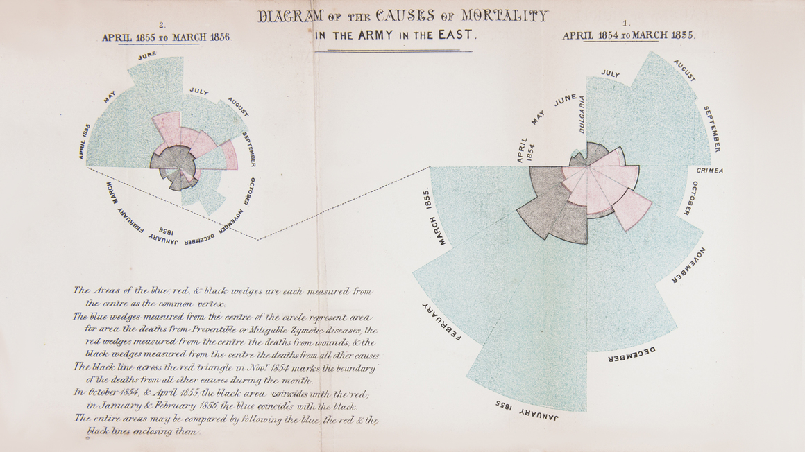
</div>
]


.pull-right[
- One of the potentially most influential graphs is by [Florence Nightingale](https://en.wikipedia.org/wiki/Florence_Nightingale), statistician and founder of modern nursing.
- She pioneered in using graphs to communicate data and to ease drawing conclusions.
- Nightingale's Rose, a polar area diagram, illustrates seasonal sources of soldier mortality in the field hospital Nightingale managed during the Crimean War and highlights that epidemic disease are responsible for more deaths than battlefield wounds. 
- Nightingale's work revolutionized points hygiene and other practices in hospitals, ultimately saving millions of lives.
]

---
# Nightingale's rose (cont.)


.pull-left[
<div align="center">
<br><br><br>

</div>
]


.pull-right[
- One of the potentially most influential graphs is by [Florence Nightingale](https://en.wikipedia.org/wiki/Florence_Nightingale), statistician and founder of modern nursing.
- She pioneered in using graphs to communicate data and to ease drawing conclusions.
- Nightingale's Rose, a polar area diagram, illustrates seasonal sources of soldier mortality in the field hospital Nightingale managed during the Crimean War and highlights that epidemic disease are responsible for more deaths than battlefield wounds. 
- Nightingale's work revolutionized points hygiene and other practices in hospitals, ultimately saving millions of lives.
- [Gelman and Unwin (2012)](http://www.stat.columbia.edu/~gelman/research/published/vis14.pdf) present an alternative presentation of the same data.
- More historical visualizations [here](https://storymaps.arcgis.com/stories/9c2f390fa3f54ed4a11a7d4a66e7c8cc)
]


---
# The case for visualization

.pull-left[
- The table on the right comprises data sets I through IV, each consisting of eleven $(x,y)$ points.
- Carefully study the table. How do $x$ and $y$ as well as their relationship compare across datasets?
]

.pull-right[
<br>
<div align="center">

</div>
]

---
# The case for visualization (cont.)

.pull-left[
- The table on the right comprises data sets I through IV, each consisting of eleven $(x,y)$ points.
- Carefully study the table. How do $x$ and $y$ as well as their relationship compare across datasets?
- It shows that all the data sets have nearly identical simple descriptive statistics in terms of mean, standard deviation, correlation, and linear fit!
]

.pull-right[
<br>
<div align="center">

</div>
]

---
# The case for visualization (cont.)

.pull-left[
- The table on the right comprises data sets I through IV, each consisting of eleven $(x,y)$ points.
- Carefully study the table. How do $x$ and $y$ as well as their relationship compare across datasets?
- It shows that all the data sets have nearly identical simple descriptive statistics in terms of mean, standard deviation, correlation, and linear fit!
- Plotting the data reveals wildly different distributions, countering the impression that "numerical calculations are exact, but graphs are rough" ([Anscombe 1973](https://www.tandfonline.com/doi/abs/10.1080/00031305.1973.10478966)).
- The dataset was constructed by [Francis Anscombe](https://en.wikipedia.org/wiki/Frank_Anscombe) and is known as "[Anscombe's quartet](https://en.wikipedia.org/wiki/Anscombe%27s_quartet)"
- Case closed.
]

.pull-right[
<br>
<div align="center">
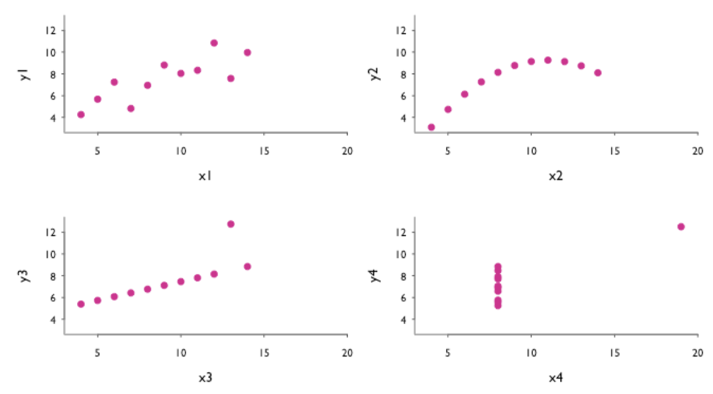
</div>
]


<!-- ############################################ -->
---
class: inverse, center, middle
name: method

# Data visualization as a method

<html><div style='float:left'></div><hr color='#EB811B' size=1px style="width:1000px; margin:auto;"/></html>


---
# Different goals, different looks (cont.)


.pull-left[
### Exploratory visualization

- "Analytic plots"
- Mostly for ourselves
- Often quick and dirty

### Goals

- What's in the data?
- Get a sense of size and complexity of data.
- Explore and interact.
- "Forces us to notice what we never expected to see" (Tukey 1977)
]

.pull-right[
### Explanatory visualization

- "Presentation plots"
- For others after the research is completed
- Few, carefully crafted, attractive graphs

### Goals

- Communicate content of data.
- Tell a story with data.
- Attract attention and interest.
- "Forces readers to see the information the designer wanted to convey" (Kosslyn 1994)
]

---
# Different goals, different looks (cont.)

.pull-left[
### Exploratory visualization

<div align="center">
<br>

</div>
]

.pull-right[
### Explanatory visualization

<div align="center">
<br>

</div>
]


---
# Fundamental principles of analytic design

.pull-left[
1. **Comparisons.** Show comparisons, contrasts, differences.
2. **Causality, mechanism, structure, explanation.** Show causality, mechanism, explanation, systematic structure.
3. **Multivariate analysis.** Show multivariate data; that is show more than 1 or 2 variables.
4. **Integration of evidence.** Completely integrate words, numbers, images, diagrams.
5. **Documentation.** Thoroughly describe the evidence. Provide a detailed title, indicate the authors and sponsors, document the data sources, show complete measurement scales, point out relevant issues.
6. **Content counts most of all.** Analytical presentations ultimately stand or fall depending on the quality, relevance and integrity of their content ("What is the problem you want to solve?")

Edward Tufte, "[Beautiful Evidence](http://atc.berkeley.edu/201/readings/Tufte_BE_2006.pdf)", Chapter 5.
]

.pull-right[
edward-tufte.jpeg
]

---
# Minard's map of Napoleon's March

<div align="center">
<br>

</div>

Can you spot those principles in Minard’s Map?
More information on the map [here](https://en.wikipedia.org/wiki/Charles_Joseph_Minard).


---
# Visualizing statistical models

Visualization can be useful at several steps in the modeling workflow. Potential usecases include:

- The presentation of results (regression tables vs. coefficient plots)
- Sensitivity and robustness testing
- Model checking and diagnostics
- Informal precursor to more complex models

For effective visualization, comparison is key.

---
# Visualizing statistical models

.pull-left[
<div align="center">
<br>

</div>
]

.pull-right[
<div align="center">
<br>
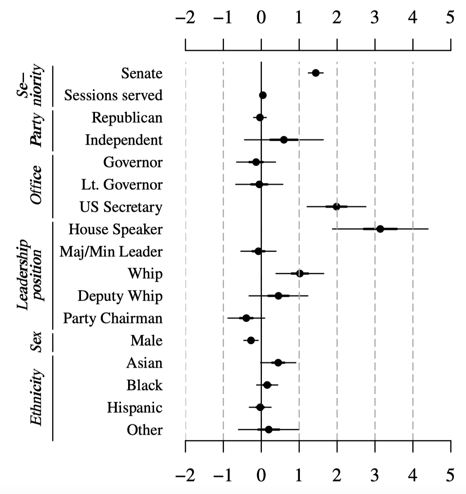
</div>
]


---
# Visual inference

.pull-left-wide[

### Human talent and weakness

- Humans are extremely good at recognizing patterns.
- At the same time, humans are also extremely good at inferring patterns when there are none (tendency to see patterns in random data = "apophenia").
- This is somewhat linked to the fact that our species is bad at dealing with probability and randomness.

### Concerns with exploratory data analysis

- A concern that frequently arises with exploratory analysis is that it lacks the rigor of formal tests in confirmatory analysis or conventional statistical inference.
- Long-standing reservations against visualization as merely "informal" approach to data analysis and the fear that beautiful pictures may in fact not correspond to any meaningful patterns of substantive scientific interest.
]


.pull-right-small[
<div align="center">
<br>

<br>

</div>
]

---
# Visual inference (cont.)

.pull-left[
### Overcoming the exploratory vs. confirmatory visualization divide

- Graphical displays are implicit or explicit comparisons to a reference distribution or baseline model.
- If we discover an interesting pattern in data this usually means that it looks different from what we expected.
- We usually we have implicit models in our mind to which we compare the data ("What do we expect to see?")
- We can make these models explicit and use them to guard against "false discoveries"
- Visual discoveries correspond to the implicit or explicit rejection of null hypotheses ([Buja et al. 2009](https://royalsocietypublishing.org/doi/full/10.1098/rsta.2009.0120)).
]

.pull-right[
### Visual inference as an analogue to null hypothesis significance testing

The basic principle of formal testing remains the same in visual inference – with the exception that the test statistic is now a graphical display which is compared to a "reference distribution" of plots showing the null:

<div align="center">
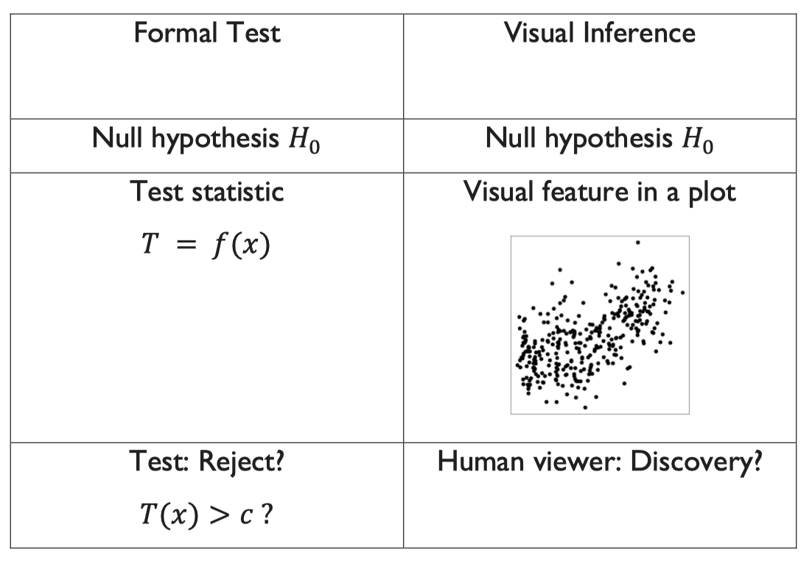
</div>
]


---
# Visual inference: the line-up protocol

This method is called "after the 'police lineup' of criminal investigations [...], because it asks the witness to identify the plot of the real data from among a set of decoys, the null plots, under the veil of ignorance" ([Buja et al. 2009](https://royalsocietypublishing.org/doi/full/10.1098/rsta.2009.0120)).

The visual hypothesis test involves the following steps:

  1. Simulate data to create $m-1$ null plots 
  2. Randomly place the plot of the real data among them, resulting in a total of $m$ plots.
  3. Ask a human viewer to choose the plot that looks the most different from the rest.
  4. If the test person succeeds and picks the plot showing the actual data, then this visual discovery can be assigned a p-value of $1/m$. In other words, the probability of picking the true plot just by chance is $1/m$.

---
# Visual inference: which plot stands out from the rest?

<div align="center">

</div>


---
# Visual inference: which plot stands out from the rest?

<div align="center">

</div>


---
# Visual inference: which plot stands out from the rest?

<div align="center">
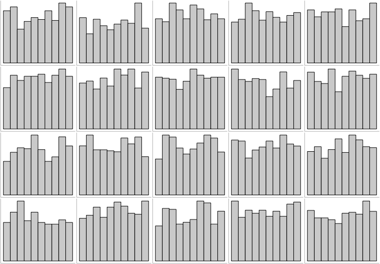
</div>

---
# None! All just show runif(500, 0, 1).

<div align="center">

</div>


---
# Summary

.pull-left[
### Visualization as an iterative process

- The choice of the right graphical format ultimately depends on the task or problem it is trying to solve.
- Always try different graphical formats on the same data – they may reveal different aspects.
- Constructing visualizations is almost always an iterative process – the first graph is rarely also the final one.
]

.pull-right[
### Comparison is key

- "The fundamental analytical act in statistical reasoning is to answer the question 'compared to what?'
- Whether we are evaluating changes over space or time, searching big data bases, adjusting and controlling for variables, designing experiments, specifying multiple regressions, or doing just about any kind of evidence-based reasoning, the essential point is to make intelligent and appropriate comparisons.
- Thus visual displays, if they are to assist thinking, should show comparisons."

<div align="right">
Edward Tufte, <a href="http://atc.berkeley.edu/201/readings/Tufte_BE_2006.pdf">Beautiful Evidence</a>, p.127.
</div>
]


<!-- ############################################ -->
---
class: inverse, center, middle
name: plottypes

# Types of data visualization

<html><div style='float:left'></div><hr color='#EB811B' size=1px style="width:1000px; margin:auto;"/></html>


---
# Different plot types for different purposes

- **Histogram**: "Is the **distribution** normal (or uniform or...)?"
- **Scatterplot**: "Is there a **correlation** between x and y?"
- **Scatterplot with color**: "Are the points **clustered** by color?"
- **Barplot**: "Is there a **difference** between groups/values?"
- **Line chart**: "Is there **change** over time?"
- **Choropleth**: "Is there a **spatial pattern**?"


<!-- ############################################ -->
---
class: inverse, center, middle
name: plotingredients

# Ingredients of data visualization

<html><div style='float:left'></div><hr color='#EB811B' size=1px style="width:1000px; margin:auto;"/></html>


---
# Mapping data onto aesthetics

- Whenever we visualize data, we take data values and convert them in a systematic and logical way into the visual elements that make up the final graphic.
- Even though there are many different types of data visualizations, all these visualizations can be described with a common language. 
- All data visualizations map data values into quantifiable features of the resulting graphic. We refer to these features as **aesthetics**.
- Key aesthetics are:

<div align="center">

</div>

- All aesthetics fall into one of two groups: Those that can represent continuous data (e.g., position, size, color) and those that can not (e.g., shape, line type).


---
# Coordinate systems and axes

.pull-left[
- Visualization of quantitative data requires a communication of quantities.
- Positions of data values matter. Usually, we need two position scales (x and y axis of the plot).
- The combination of a set of position scales and their relative geometric arrangement is called a **coordinate system**.
- Often we have two axes representing two different **units**. 
- In a **Cartesian** coordinate system, the grid lines along an axis are spaced evenly both in data units and in the resulting visualization.
- There are scenarios where nonlinear scales are preferred. In a nonlinear scale, even spacing in data units corresponds to uneven spacing in the visualization (e.g., log scales).
- Be sure to **label axes properly**!
]

.pull-right[
<div align="center">


</div>
]

---
# Colors

.pull-left[
- There are three fundamental use cases for color in data visualizations:
  1. We can use color to distinguish groups of data from each other;
  2. We can use color to represent data values; and 
  3. We can use color to highlight.
]

.pull-right[
]

---
# Colors

.pull-left[
- There are three fundamental use cases for color in data visualizations:
  1. We can use color to **distinguish groups of data from each other**;
  2. We can use color to represent data values; and 
  3. We can use color to highlight.
]

.pull-right[
<div align="center">


</div>
]


---
# Colors

.pull-left[
- There are three fundamental use cases for color in data visualizations:
  1. We can use color to distinguish groups of data from each other;
  2. We can use color to **represent data values**; and 
  3. We can use color to highlight.
]

.pull-right[
<div align="center">


</div>
]


---
# Colors

.pull-left[
- There are three fundamental use cases for color in data visualizations:
  1. We can use color to distinguish groups of data from each other;
  2. We can use color to represent data values; and 
  3. We can use color to **highlight**.
]

.pull-right[
<div align="center">


</div>
]


---
# Colors

.pull-left[
- There are three fundamental use cases for color in data visualizations:
  1. We can use color to distinguish groups of data from each other;
  2. We can use color to represent data values; and 
  3. We can use color to highlight.
- While colors are very powerful aesthetics, try to avoid common pitfalls, such as:
]

.pull-right[
]


---
# Colors

.pull-left[
- There are three fundamental use cases for color in data visualizations:
  1. We can use color to distinguish groups of data from each other;
  2. We can use color to represent data values; and 
  3. We can use color to highlight.
- While colors are very powerful aesthetics, try to avoid common pitfalls, such as:
  - Encoding **too much / irrelevant information**
]

.pull-right[
<div align="center">
<br>

</div>
]


---
# Colors

.pull-left[
- There are three fundamental use cases for color in data visualizations:
  1. We can use color to distinguish groups of data from each other;
  2. We can use color to represent data values; and 
  3. We can use color to highlight.
- While colors are very powerful aesthetics, try to avoid common pitfalls, such as:
  - Encoding too much / irrelevant information
  - Using **non-monotonic color scales** to encode data values
]

.pull-right[
<div align="center">
<br>

<br>

</div>
]


---
# Colors

.pull-left[
- There are three fundamental use cases for color in data visualizations:
  1. We can use color to distinguish groups of data from each other;
  2. We can use color to represent data values; and 
  3. We can use color to highlight.
- While colors are very powerful aesthetics, try to avoid common pitfalls, such as:
  - Encoding too much / irrelevant information
  - Using non-monotonic color scales to encode data values
  - Not designing for **color-vision deficiency**

]

.pull-right[
<div align="center">
<br>
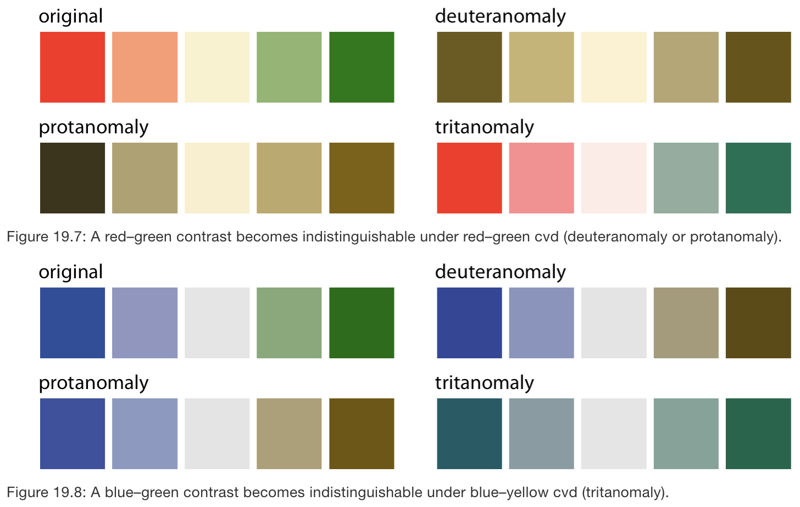
<br>
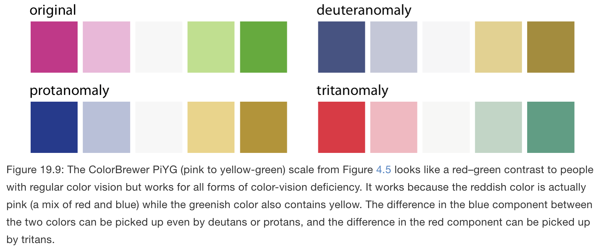

</div>
]


---
# Colors

.pull-left[
- There are three fundamental use cases for color in data visualizations:
  1. We can use color to distinguish groups of data from each other;
  2. We can use color to represent data values; and 
  3. We can use color to highlight.
- While colors are very powerful aesthetics, try to avoid common pitfalls, such as:
  - Encoding too much / irrelevant information
  - Using non-monotonic color scales to encode data values
  - Not designing for color-vision deficiency
- There's a whole science around the perception of colors in graphs, and a range of tools that help you select appropriate color schemes. My favorite is [ColorBrewer](https://colorbrewer2.org/), which is implemented in the [`RColorBrewer`](https://cran.r-project.org/web/packages/RColorBrewer/index.html) package.
]

.pull-right[
<div align="center">
<br>

<br>


</div>
]


---
# Line and point types

.pull-left[
- Different line and point types can help distinguish different data types (e.g., subgroups).
- For lines, we can, use solid, dashed or dotted formatting.
- For points, we can use solid dots, open circles, triangles, or really any symbol we can come up with.
- Try to avoid different line and point types. They add a lot of noise and are difficult to read.
]

.pull-right[
]

---
# Line and point types

.pull-left[
- Different line and point types can help distinguish different data types (e.g., subgroups).
- For lines, we can, use solid, dashed or dotted formatting.
- For points, we can use solid dots, open circles, triangles, or really any symbol we can come up with.
- Try to avoid different line and point types. They add a lot of noise and are difficult to read.
- Consider colored shapes instead of **different lines**.
]

.pull-right[
<div align="center">
<br><br>

</div>
]

---
# Line and point types

.pull-left[
- Different line and point types can help distinguish different data types (e.g., subgroups).
- For lines, we can, use solid, dashed or dotted formatting.
- For points, we can use solid dots, open circles, triangles, or really any symbol we can come up with.
- Try to avoid different line and point types. They add a lot of noise and are difficult to read.
- Consider **colored shapes** instead of different lines.
]

.pull-right[
<div align="center">
<br><br>

</div>
]


---
# Line and point types

.pull-left[
- Different line and point types can help distinguish different data types (e.g., subgroups).
- For lines, we can, use solid, dashed or dotted formatting.
- For points, we can use solid dots, open circles, triangles, or really any symbol we can come up with.
- Try to avoid different line and point types. They add a lot of noise and are difficult to read.
- Consider **colored shapes** instead of different lines.
]

.pull-right[
<div align="center">
<br><br>

</div>
]


---
# Line and point types

.pull-left[
- Different line and point types can help distinguish different data types (e.g., subgroups).
- For lines, we can, use solid, dashed or dotted formatting.
- For points, we can use solid dots, open circles, triangles, or really any symbol we can come up with.
- Try to avoid different line and point types. They add a lot of noise and are difficult to read.
- Consider colored shapes instead of different lines.
- Consider colored shapes instead of **different points**.
]

.pull-right[
<div align="center">
<br><br>

</div>
]


---
# Line and point types

.pull-left[
- Different line and point types can help distinguish different data types (e.g., subgroups).
- For lines, we can, use solid, dashed or dotted formatting.
- For points, we can use solid dots, open circles, triangles, or really any symbol we can come up with.
- Try to avoid different line and point types. They add a lot of noise and are difficult to read.
- Consider colored shapes instead of different lines.
- Consider **colored shapes** instead of different points.
]

.pull-right[
<div align="center">
<br><br>

</div>
]


---
# Line and point types

.pull-left[
- Different line and point types can help distinguish different data types (e.g., subgroups).
- For lines, we can, use solid, dashed or dotted formatting.
- For points, we can use solid dots, open circles, triangles, or really any symbol we can come up with.
- Try to avoid different line and point types. They add a lot of noise and are difficult to read.
- Consider colored shapes instead of different lines.
- Consider colored shapes instead of different points.
- Use **redundant coding**, i.e. use color to enhance the visual appearance of the figure without relying entirely on color to convey key information.
]

.pull-right[
<div align="center">
<br><br>

</div>
]


---
# Line and point types

.pull-left[
- Different line and point types can help distinguish different data types (e.g., subgroups).
- For lines, we can, use solid, dashed or dotted formatting.
- For points, we can use solid dots, open circles, triangles, or really any symbol we can come up with.
- Try to avoid different line and point types. They add a lot of noise and are difficult to read.
- Consider colored shapes instead of different lines.
- Consider colored shapes instead of different points.
- Use redundant coding, i.e. use color to enhance the visual appearance of the figure without relying entirely on color to convey key information.
- To tackle **overlapping data**, use partial transparency (alpha blending) and (moderate) jittering.
]

.pull-right[
<div align="center">
<br><br>

</div>
]


---
# Line and point types

.pull-left[
- Different line and point types can help distinguish different data types (e.g., subgroups).
- For lines, we can, use solid, dashed or dotted formatting.
- For points, we can use solid dots, open circles, triangles, or really any symbol we can come up with.
- Try to avoid different line and point types. They add a lot of noise and are difficult to read.
- Consider colored shapes instead of different lines.
- Consider colored shapes instead of different points.
- Use redundant coding, i.e. use color to enhance the visual appearance of the figure without relying entirely on color to convey key information.
- To tackle overlapping data, use **partial transparency** (alpha blending) and (moderate) jittering.
]

.pull-right[
<div align="center">
<br><br>

</div>
]


---
# Line and point types

.pull-left[
- Different line and point types can help distinguish different data types (e.g., subgroups).
- For lines, we can, use solid, dashed or dotted formatting.
- For points, we can use solid dots, open circles, triangles, or really any symbol we can come up with.
- Try to avoid different line and point types. They add a lot of noise and are difficult to read.
- Consider colored shapes instead of different lines.
- Consider colored shapes instead of different points.
- Use redundant coding, i.e. use color to enhance the visual appearance of the figure without relying entirely on color to convey key information.
- To tackle overlapping data, use partial transparency (alpha blending) and **(moderate) jittering**.
]

.pull-right[
<div align="center">
<br><br>

</div>
]


<!-- ############################################ -->
---
class: inverse, center, middle
name: rules

# Principles of good data visualization

<html><div style='float:left'></div><hr color='#EB811B' size=1px style="width:1000px; margin:auto;"/></html>


---
# Basic rules

"Visualization is surprisingly difficult. Even the most simple matters can easily go wrong." William Cleveland

"Graphical excellence is [...] a matter of substance, of statistics, and of design." Edward Tufte


---
# Basic rules

1. Drop all the unimportant stuff.
2. Bar chart axes should include zero.
3. Line chart axes need not include zero.
4. Avoid multiple y axes at all cost.


https://twitter.com/bengoldacre/status/1448222429973827584?s=11


epstein-martin.png
https://books.google.de/books?id=1BCSBAAAQBAJ&pg=PA245

---
# Basic rules

.pull-left[
1. Drop all the unimportant stuff
]

.pull-right[

]


<!-- ############################################ -->
---
class: inverse, center, middle
name: vizinference

# Visualization with R

<html><div style='float:left'></div><hr color='#EB811B' size=1px style="width:1000px; margin:auto;"/></html>

---
# How to plot things in R

- This is R, so you already know that there are multiple ways to do it...
- ... and all suck.
- The two most popular approaches are R base graphics (the stuff that comes with R by default) and ggplot2 (the tidyverse way to do graphs)
- Your instructor happily uses both
- Check out the scripts to learn some ggplot2 basics

---
# R base graphics vs. ggplot2

<div align="center">

</div>


---
# R base graphics vs. ggplot2 (cont:)

<div align="center">

</div>

---
# ggplot2: an overview


---
# A note on image file formats

https://clauswilke.com/dataviz/image-file-formats.html


<!-- ############################################ -->
---
class: inverse, center, middle
name: summary

# Summary

<html><div style='float:left'></div><hr color='#EB811B' size=1px style="width:1000px; margin:auto;"/></html>

---
# How to produce good data visualizations

- Always conceptualize first.
- Prioritize programmatic solutions (i.e., R over Excel).
- For conceptual charts (not: data viz!), other tools might be just fine (e.g., Powerpoint).
- Don't be distracted by interactives (as offered by, e.g., highcharts.com, Tableau, and others).
- Designing good graphs is a learnable skill. Study how others do it!
- But a good visualization takes time, even if you’re experienced. Working a full day on the key plot of your analysis? No problem!

---
# Outlook: going interactive

.pull-left-wide[
- In online presentations of your data and analyses, you might want to go interactive.
- Interactive webpages are mainly run with JavaScript, and we can use R to draw on JavaScript libraries to create interactive content.
- In particular, the `htmlwidgets` package provides a framework to bind R commands to various JavaScript libraries, including those that create data graphs.
- Many "widgets" are already available - check out http://gallery.htmlwidgets.org/.
- Other JavaScript libraries for interactive graphics can be created with R, too:
  - [`leaflet`](https://rstudio.github.io/leaflet/) to connect to the [Leaflet library](https://leafletjs.com/) and create interactive maps
  - [`plotly`](https://plotly.com/r/) to connect to [Plotly](https://plotly.com/r/is-plotly-free/) and create graphs of all kinds
- In the scripts you will find a couple of applications.
]

.pull-right-small[
<div align="center">
<br><br>
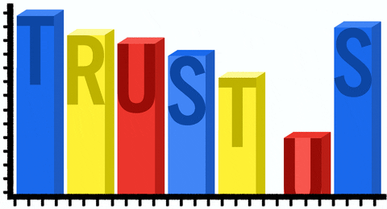
</div>
]
---
# Further reading

<div align="center">
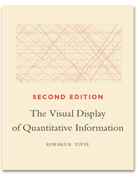

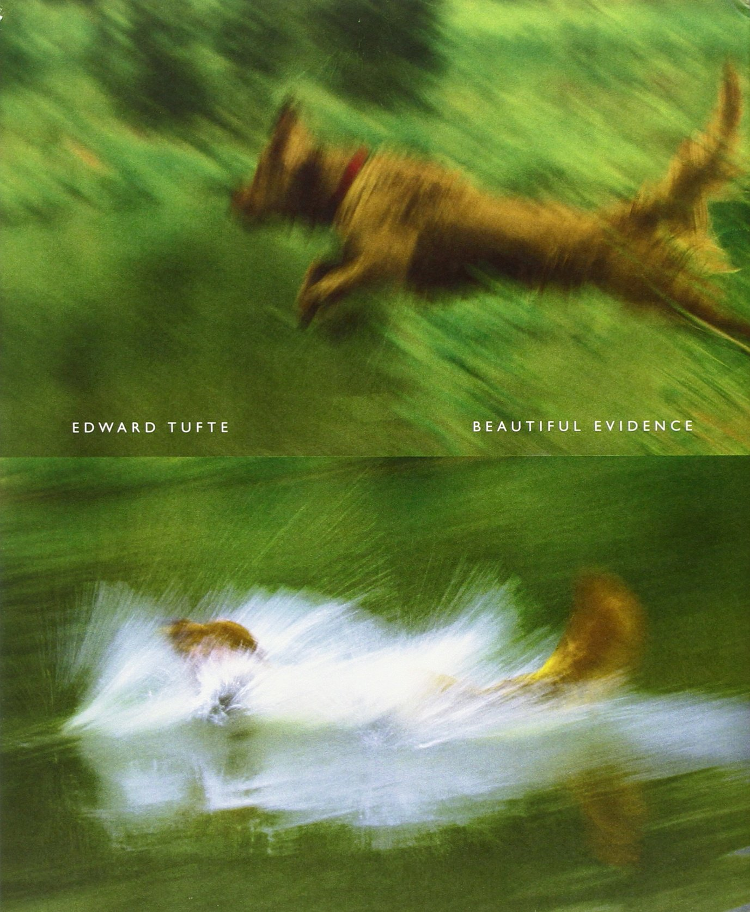
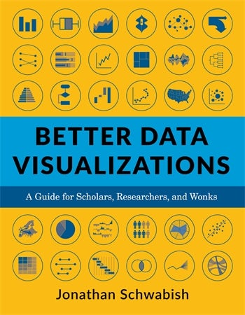
</div>

<div align="center">

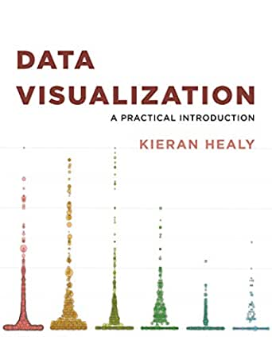
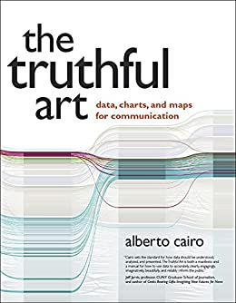

</div>


---
# Coming up

<br><br> 

### Assignment

Assignment 5 is about to go online on GitHub Classroom. Check it out and start plotting!

### Next lecture

The workshop! 😱


