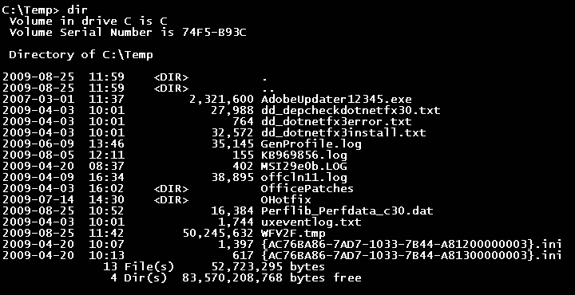
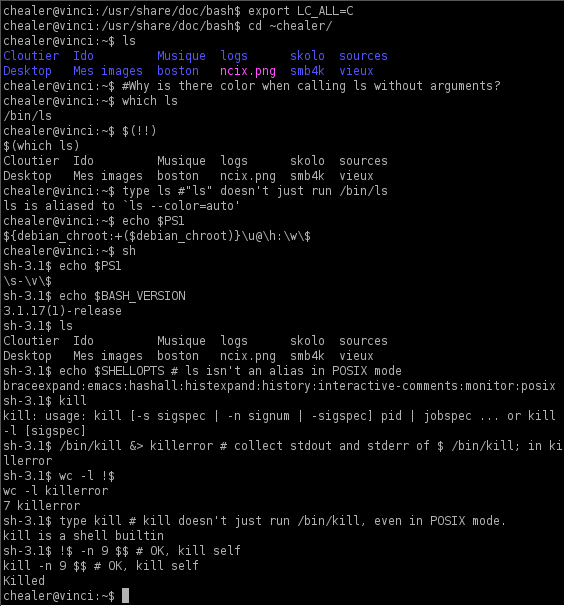
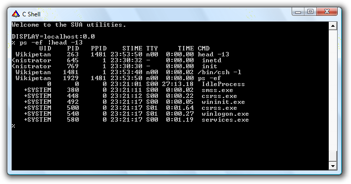
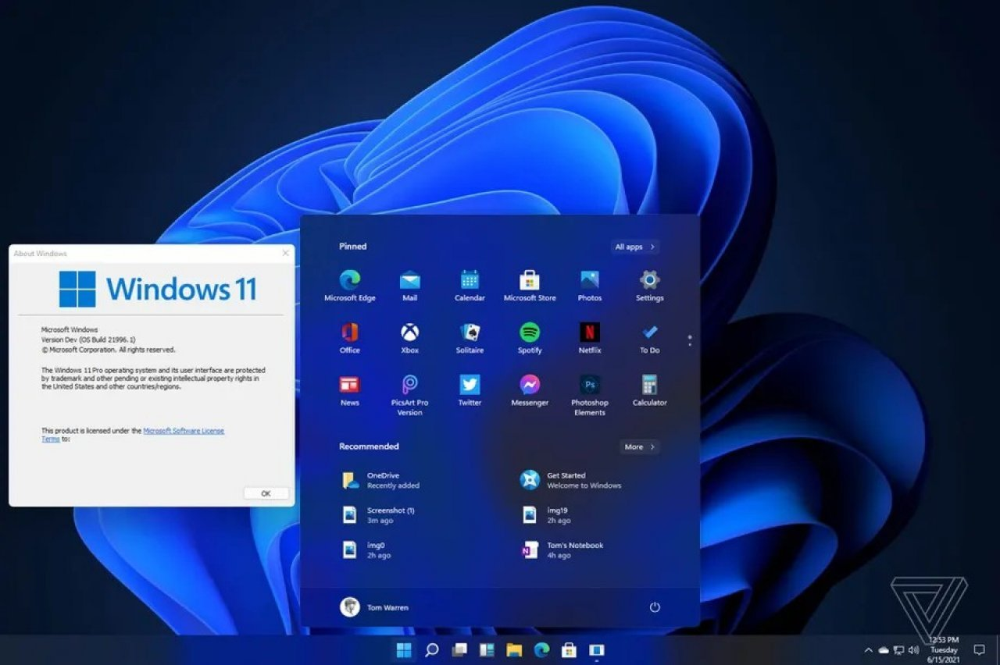
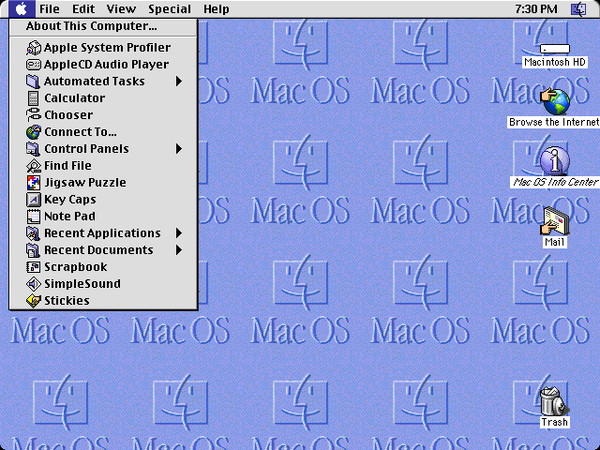
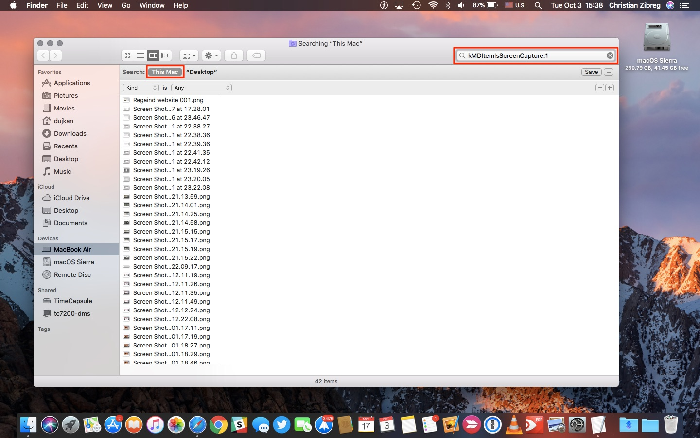

```{css, echo=FALSE} 
@media print { # print out incremental slides; see https://stackoverflow.com/questions/56373198/get-xaringan-incremental-animations-to-print-to-pdf/56374619#56374619
  .has-continuation {
    display: block !important;
  }
}
```

```{r setup, include=FALSE}
# figures formatting setup
options(htmltools.dir.version = FALSE)
library(knitr)
opts_chunk$set(
  comment = "  ",
  prompt = T,
  fig.align="center", #fig.width=6, fig.height=4.5, 
  # out.width="748px", #out.length="520.75px",
  dpi=300, #fig.path='Figs/',
  cache=F, #echo=F, warning=F, message=F
  engine.opts = list(bash = "-l")
  )

## Next hook based on this SO answer: https://stackoverflow.com/a/39025054
knit_hooks$set(
  prompt = function(before, options, envir) {
    options(
      prompt = if (options$engine %in% c('sh','bash')) '$ ' else 'R> ',
      continue = if (options$engine %in% c('sh','bash')) '$ ' else '+ '
      )
})

library(tidyverse)
library(nycflights13)
library(kableExtra)
```


# Table of contents

1. [Introduction](#intro)<sup>1</sup>

2. [Shell basics](#basics)

3. [Help!](#help)

4. [Navigating your system](#navigation)

5. [Managing your files](#files)

6. [Working with text files](#text)

7. [Redirects, pipes, and loops](#pipes)

8. [Scripting](#scripting)

9. [Next steps](#steps)

.footnote[<sup>1</sup> Much of this lecture draws on materials from Grant McDermott's excellent [*Data Science for Economists*](https://github.com/uo-ec607/lectures) class.]


<!-- ############################################ -->
---
class: inverse, center, middle
name: intro

# Introduction
<html><div style='float:left'></div><hr color='#EB811B' size=1px style="width:1000px; margin:auto;"/></html>


---
# What is the command line? What is the shell?

.pull-left[
### A computer in a nutshell

- The **operating system (OS)** is system software that interfaces with (and manages access to) a computer's hardware. It also provides software resources.
- The OS is divided into the kernel and user space.
- The **kernel** is the core of the OS. It's responsible for interfacing with hardware (drivers), managing resources etc. Running software in the kernel is *extremely* sensitive! That's why users are kept away from it.
- The **user space** provides an interface for users, who can run programs/applications on the machine. Hardware access of programs (e.g., memory usage) is managed by the kernel. Programs in user space are essentially in sandboxes, which sets a limit to how much damage they can do.
]

.pull-right-center[
<div align="center">
<br>

</div>
`Credit` [Dave Kerr](https://effective-shell.com/docs/part-2-core-skills/what-is-a-shell/)
]


---
# What is the command line? What is the shell? (cont.)

.pull-left[
### A computer in a nutshell

- The **shell** is just a general name for any user space program that allows access to resources in the system, via some kind of interface.
- Shells come in many different flavours but are generally provided to aid a human operator in accessing the system. This could be interactively, by **typing at a terminal**, or via **scripts**, which are files that contain a sequence of commands.
- Modern computers use **graphical user interfaces (GUIs)** as the standard tool for human-computer interaction.
- **Why "kernel" and "shell"?** The kernel is the soft, edible part of a nut or seed, which is surrounded by a shell to protect it. Useful metaphor, no?
]

.pull-right-center[
<div align="center">
<br>


</div>
`Credit` [Dave Kerr](https://effective-shell.com/docs/part-2-core-skills/what-is-a-shell/)/[Kkchaudhary11](https://commons.wikimedia.org/w/index.php?curid=49069244)
]


---
# What is the command line? What is the shell? (cont.)

.pull-left[
### Interacting with the shell

- Things are still a bit more complicated.
- We're not directly interacting with the "shell" but using a **terminal**.
- A terminal is just a program that **reads input** from the keyboard, **passes that input** to another program, and **displays the results** on the screen.
- A shell program on its own does not do this - it requires a terminal as an interface.
- **Why "terminal"?** Back in the old days (even before computer screen existed), terminal machines (hardware!) were used to let humans interface with large machines ("mainframes"). Often many terminals were connected to a single machine. 
- When you want to work with a computer in a data center (or remotely ~ cloud computing), you'll still do pretty much the same.
]

.pull-right-center[
<div align="center">


</div>
`Credit` [Dave Kerr](https://effective-shell.com/docs/part-2-core-skills/what-is-a-shell/)/[Rama/Musée Bolo](https://en.wikipedia.org/wiki/Teletype_Model_33#/media/File:Teletype-IMG_7287.jpg)/[ClickRick](https://de.m.wikipedia.org/wiki/Datei:IBM_3486_terminal.jpg)
]


---
# What is the command line? What is the shell? (cont.)

.pull-left[
### Interacting with the shell

- Terminals are really quite simple - they're just interfaces.
- The first thing that a terminal program will do is run a shell program - a program that we can use to operate the computer.
- **Back to the shell:** the shell usually takes input 
  (a) interactively from the user via the terminal's **command line**.
  (b) executes scripts (without command line).
- In interactive mode the shell then returns output 
  (a) to the terminal where it is printed/shown.
  (b) to files or other locations.
- The command line (or command prompt) represents what is shown and entered in the terminal. They can be [customized](https://ohmyz.sh/) (e.g., with color highlighting) to make interaction more convenient.
]

.pull-right-center[
<div align="center">

</div>
`Credit` [Dave Kerr](https://effective-shell.com/docs/part-2-core-skills/what-is-a-shell/)
]


---
# What is the command line? What is the shell? (cont.)

.pull-left[
### Shell variants

- It is important to note that there are many different shell programs, and they [differ in terms of functionality](https://en.wikipedia.org/wiki/Comparison_of_command_shells).
- On most Unix-like systems, the default shell is a program called [**bash**](https://en.wikipedia.org/wiki/Bash_(Unix_shell)), which stands for "Bourne Again Shell".
- Other examples are the  [Z Shell](https://en.wikipedia.org/wiki/Z_shell) (or zsh; default on MacOS)<sup>1</sup>, [Windows Command Prompt](https://en.wikipedia.org/wiki/Cmd.exe) (cmd.exe, the default CLI on MS Windows), [Windows PowerShell](https://en.wikipedia.org/wiki/PowerShell), [C Shell](https://en.wikipedia.org/wiki/C_shell), and many more.
- When a terminal opens, it will immediately start the user's preferred shell program. (This can be [changed](https://effective-shell.com/docs/getting-started/).)

.footnote[<sup>1</sup>That's what I use, which is why the shell on the following slides might look a bit different. Also, some commands/programs might or might not be available (or need to be installed).]
]

.pull-right-center[
<div align="center">
<br>
<i>Left:</i> Command Prompt, <i>right:</i> Bash


<br>
<i>Left:</i> C Shell, <i>right:</i> more shells


</div>
`Credit` [Read-back spider](https://commons.wikimedia.org/wiki/File:Different_types_of_shells.jpg)/[Dave Kerr](https://effective-shell.com/docs/part-2-core-skills/what-is-a-shell/)
]


---
# What is the command line? What is the shell? (cont.)

.pull-left[
### Summing things up

- All that being said, don't be thrown off by terminology: *shell*, *terminal*,  *command prompt*, *command line*, *bash*, etc.
- In everyday usage they  are all referring to a **command line interface** (CLI) with which we can talk to our computer, execute (chains of) programs, wrangling input and output, and so much more.
]

.pull-right-center[
<div align="center">
<br>

</div>
]


---
# Why bother with the shell?

.pull-left[
<div align="center">
<br><br>
<b>Why using this...</b>
<br>

</div>
]

.pull-right[
<div align="center">
<br><br>
<b>... instead of this?</b>
<br>


</div>

<div align="center">


</div>
]


---

# Why bother with the shell? (cont.)

1. **Speed.** Typing is fast: A skilled shell user can manipulate a system at dazzling speeds just using a keyboard. Typing commands is generally much faster than exploring through user interfaces with a mouse.

2. **Power.** Both for executing commands and for fixing problems. There are some things you just can't do in an IDE or GUI. It also avoids memory complications associated with certain applications and/or IDEs. 

3. **Reproducibility.** Scripting is reproducible, while clicking is not.

4. **Portability.** A shell can be used to interface to almost any type of computer, from a mainframe to a Raspberry Pi, in a very similar way. The shell is often the only game in town for high performance computing (interacting with servers and super computers). 

5. **Automation.** Shells are programmable: Working in the shell allows you to program workflows, that is create scripts to automate time-consuming or repetitive processes.

6. **Become a marketable data scientist.** Modern programming is often polyglot. The shell provides a common interface for tooling. Modern solutions are often built to run in containers on Linux. In this environment shell knowledge has become very valuable. In short, [the shell is having a renaissance](https://effective-shell.com/docs/part-1-transitioning-to-the-shell/the-renaissance-of-the-shell/) in the age of data science.


---
# The Unix philosophy

The shell tools that we're going to be using today have their roots in the [Unix](https://en.wikipedia.org/wiki/Unix) family of operating systems originally developed at Bells Labs in the 1970s.

Besides paying homage, acknowledging the Unix lineage is important because these tools still embody the "[Unix philosophy](https://en.wikipedia.org/wiki/Unix_philosophy)":

> **Do One Thing And Do It Well** 

--

By pairing and chaining well-designed individual components, we can build powerful and much more complex larger systems.

You can see why the Unix philosophy is also referred to as "minimalist and modular".
  
Again, this philosophy is very clearly expressed in the design and functionality of the Unix shell.


---

# Things to use the shell for

- Version control with Git

- Renaming and moving files *en masse*

- Finding things on your computer

- Combining and manipulating PDFs

- Installing and updating software

- Scheduling tasks

- Monitoring system resources

- Connecting to cloud environments

- Running analyses ("jobs") on super computers

- etc.


<!-- ############################################ -->
---
class: inverse, center, middle
name: basics

# Shell basics
<html><div style='float:left'></div><hr color='#EB811B' size=1px style="width:1000px; margin:auto;"/></html>

---

# First look

Let's open up our shell.

A convenient way to do this is through [RStudio's built-in Terminal](https://support.rstudio.com/hc/en-us/articles/115010737148-Using-the-RStudio-Terminal).

- Hitting `Shift`+`Alt`+`T` (or `Shift`+`⌥`+`R` on a Mac) will cause a "Terminal" tab to open up next to the "Console" tab.

- Your system default shell is loaded. To find out what that is, type:

```{bash}
echo $SHELL
```

- Ok, it's Z bash in my case.

--

Of course, it's always possible to open up the Shell directly if you prefer.
- [Linux](https://www.wikihow.com/Open-a-Terminal-Window-in-Ubuntu)
- [Mac](https://www.techwalla.com/articles/how-to-open-terminal-on-a-macbook)
- [Windows](https://www.howtogeek.com/265900/everything-you-can-do-with-windows-10s-new-bash-shell/)


---

# First look (cont.)

You should see something like:

```bash
 username@hostname:~$
```

--

This is shell-speak for: "Who am I and where am I?"
  <!-- - Type in `$ whoami` without the leading dollar sign to confirm. -->

---
count: false

# First look (cont.)

You should see something like:

```bash
 `username`@hostname:~$ 
```

This is shell-speak for: "Who am I and where am I?"

- `username` denotes a specific user (one of potentially many on this computer). 


---
count: false

# First look (cont.)

You should see something like:

```bash
 username`@hostname`:~$ 
```

This is shell-speak for: "Who am I and where am I?"

- `username` denotes a specific user (one of potentially many on this computer). 

- `@hostname` denotes the name of the computer or server.

---
count: false

# First look (cont.)

You should see something like:

```bash
 username@hostname`:~`$ 
```

This is shell-speak for: "Who am I and where am I?"

- `username` denotes a specific user (one of potentially many on this computer). 

- `@hostname` denotes the name of the computer or server.

- `:~` denotes the directory path (where `~` signifies the user's home directory).


---
count: false

# First look (cont.)

You should see something like:

```bash
 username@hostname:~`$`
```

This is shell-speak for: "Who am I and where am I?"

- `username` denotes a specific user (one of potentially many on this computer). 

- `@hostname` denotes the name of the computer or server.

- `:~` denotes the directory path (where `~` signifies the user's home directory).

- `$` (or maybe `%`) denotes the start of the command prompt.

(For a special "superuser" called root, the dollar sign will change to a `#`).


---

# Useful keyboard shortcuts

- `Tab` completion.

- Use the `↑` (and `↓`) keys to scroll through previous commands.

- `Ctrl`+`→` (and `Ctrl`+`←`) to skip whole words at a time.

- `Ctrl`+`a` moves the cursor to the beginning of the line.

- `Ctrl`+`e` moves the cursor to the end of the line.

- `Ctrl`+`k` deletes everything to the right of the cursor.

- `Ctrl`+`u` deletes everything to the left of the cursor.

- `Ctrl`+`Shift`+`c` to copy and `Ctrl`+`Shift`+`v` to paste (or just `⌘`+ `c/v` on a Mac).

- `Ctrl`+`l` clears your terminal.


---
# Syntax

.pull-left[
All Bash commands have the same basic syntax:

**<center>command option(s) argument(s)</center>**

**Examples:**

  ```bash
  $ ls -lh ~/Documents/
  ```
  ```bash
  $ sort -u myfile.txt
  ```
]

.pull-right[
]


---
# Syntax (cont.)

.pull-left[
All Bash commands have the same basic syntax:

**<center><span style='background: #ffff88;'>command</span> option(s) argument(s)</center>**

**Examples:**

  ```bash
  $ `ls` -lh ~/Documents/
  ```
  ```bash
  $ `sort` -u myfile.txt
  ```
]

.pull-right[
**Commands**
- You don't always need options or arguments. (For example, `$ ls ~/Documents/` and `$ ls -lh` are both valid commands that will yield output.)
- However, you always need a command.
]


---
# Syntax (cont.)

.pull-left[
All Bash commands have the same basic syntax:

**<center>command <span style='background: #ffff88;'>option(s)</span> argument(s)</center>**

**Examples:**

  ```bash
  $ ls `-lh` ~/Documents/
  ```
  ```bash
  $ sort `-u` myfile.txt
  ```
]

.pull-right[
**Options** (also called **Flags**)

- Start with a dash.
- Usually one letter.
- Multiple options can be chained together under a single dash.
  ```bash
  $ ls -l -a -h /var/log ## This works
  $ ls -lah /var/log ## So does this
  ```
- An exception is with (rarer) options requiring two dashes.
  ```bash
  $ ls --group-directories-first --human-readable /var/log
  ```
- Think it's difficult to memorize what the individual letters stand for? You're totally right.
]


---
# Syntax (cont.)

.pull-left[
All Bash commands have the same basic syntax:

**<center>command option(s) <span style='background: #ffff88;'>argument(s)</span></center>**

**Examples:**

  ```bash
  $ ls -lh `~/Documents/`
  ```
  ```bash
  $ sort -u `myfile.txt`
  ```
]

.pull-right[
**Arguments**
- Tell the command *what* to operate on.
- Totally depends on the command what legit inputs are.
- Can be a file, path, a set of files and folders, a string, and more
- Sometimes more than just one argument is needed:
  ```bash
  $ mv pics/cat.JPG best-pics/cat.jpeg
  ```
]


<!-- ############################################ -->
---
class: inverse, center, middle
name: help

# Help!
<html><div style='float:left'></div><hr color='#EB811B' size=1px style="width:1000px; margin:auto;"/></html>


---
# Multiple ways to get help

.pull-left[
### Overview 

- The `man` tool can be used to look at the manual page for a topic.
- The `man` pages are grouped into sections, we can see them with `man man`.
- The `tldr` tool shows a very short description of a tool, which covers the most common use cases only.
- The `cht.sh` website can be used directly from the shell to get help on tools or even ask specific questions. (Or install `cheat`.)


- For more info on how to get help, see [here](https://effective-shell.com/docs/part-1-transitioning-to-the-shell/getting-help/).
- Actually, typing `man bash` and reading/skimming the whole thing might be a good start to learn basic command line speak. 
]

.pull-right[
<br><br>
<div align="center">

</div>
]

---

# Getting help with man

The `man` command ("manual pages") is your friend if you ever need help.

```{bash}
man ls
```

---

# Getting help with man (cont.)

.pull-left[
Manual pages are shown in the shell *pager*. Here are the essentials to navigate through contents presented in the pager:

- `d` - Scroll down half a page
- `u` - Scroll up half a page
- `j` / `k` - Scroll down or up a line. You can also use the arrow keys for this
- `q` - Quit
- `/pattern` - Search for text provided as "pattern"
- `n` - When searching, find the next occurrence
- `N` - When searching, find the previous occurrence

These and other `man` tricks are detailed in the help pages (hit "h" when you're in the pager for an overview).
]

.pull-right[
<br>
<div align="center">

<b>RTFM</b>
</div>
]


---

# Help: cheat, tldr, cheat.sh

There are various other utilities which provide more readable summaries/cheatsheets of various commands. Those include

- [`cheat`](https://github.com/cheat/cheat)
- [`cheat.sh`](https://cheat.sh/)
- [`tldr`](https://tldr.sh/)


The first two need to be installed first. `cheat.sh` sheets are accessible via:

```{bash, eval = FALSE}
curl cheat.sh/ls  
```

```
# List files one per line:
ls -1

# List all files, including hidden files:
ls -a

# List all files, with trailing `/` added to directory names:
ls -F

# Long format list with size displayed using human readable units (KB, MB, GB):
ls -lh
```


<!-- ############################################ -->
---
class: inverse, center, middle
name: navigation

# Navigating your file system
<html><div style='float:left'></div><hr color='#EB811B' size=1px style="width:1000px; margin:auto;"/></html>


---
# Navigating your file system

.pull-left[
- We're all so used to a graphical user interface that switching to the shell can take some time to get used to. 
- Modern operating systems increasingly abstract away from underlying file systems (think about iOS, Android).
- For data science operations it is key that you're able to efficiently navigate your system to get information on files and folders. 
- Some questions that will pop up:
  - What is my home directory?
  - In which directory am I currently operating?
  - Where is my stuff?
  - Where do I want to put my stuff?
  - How do I navigate from here to there?
]

.pull-right[
<br>
<div align="center">

</div>
]

---

# Navigation

Key navigation commands are:

- `pwd` to print (the current) working directory.

- `cd` to change directory.

```{bash nav1}
pwd
```

--

You can use absolute paths, but it's better to use relative paths and invoke special symbols for a user's home folder (`~`), current directory (`.`), and parent directory (`..`) as needed. 

```{bash nav2}
cd examples ## Move into the "examples" sub-directory of this lecture directory.
cd ../.. ## Now go back up two directories.
pwd
```

---

# Navigation (cont.)

.pull-left-wide[
Beware of directory names that contain spaces. Say you have a directory called "My Documents". (I'm looking at you, Windows.)

- Why won't `$ cd My Documents` work?

- Bash syntax is super pedantic about spaces and ordering. Here it thinks that "My" and "Documents" are separate arguments.

- How to deal with it:
  - Use quotation marks: `$ cd "My Documents"`.
  - Use Tab completion to automatically "escape" the space: `$ cd My\ Documents`. 
  - Don't use spaces in file and folder names. Just don't.
  - I've developed the habit to name files and folders (a) always lowercase and (b) using dashes, as in `assignment-05`. It's a useful convention and frees up cognitive resources for more important decisions.
]

.pull-right-small[
<div align="center">
<br>

</div>
]


---

# Listing files and their properties

.pull-left-small[
We're about to go into more depth about the `ls` (list) command. It shows the contents of the current (or given) directory:

```{bash}
ls
```
]

--

.pull-right-wide[
Now we list the contents of the  `examples/` sub-directory with the `-lh` option ("long format", "human readable file size unit suffixes"; again, check out `man ls` for the details):

```{bash}
ls -lh examples
```
]

---

# Listing files and their properties (cont.)

What does this all mean? Let's focus on the top line.

```bash
drwxrwxr-x@ 3 simonmunzert staff 96B Nov 9 23:20 ABC
```

---
count:false

# Listing files and their properties (cont.)

What does this all mean? Let's focus on the top line.

<p span style="font-family:Fira Code; font-size:80%; color: #333; background: #f8f8f8; padding: 0.5em;";>
<span style='background: #ffff88;'>d</span>rwxrwxr-x@ 3 simonmunzert staff 96B Nov 9 23:20 ABC</span>

- The first column denotes the object type:
  - `d` (directory or folder), `l` (link), or `-` (file)

---
count:false

# Listing files and their properties (cont.)

What does this all mean? Let's focus on the top line.

<p span style="font-family:Fira Code; font-size:80%; color: #333; background: #f8f8f8; padding: 0.5em;";>d<span style='background: #ffff88;'><span style='color: #e41a1c;'>rwx</span><span style='color: #377eb8;'>rwx</span><span style='color: #4daf4a;'>r-x</span></span>@ 3 simonmunzert staff 96B Nov 9 23:20 ABC</span>

- <span style='color: #A9A9A9;'>The first column denotes the object type:
  - `d` (directory or folder), `l` (link), or `-` (file)</span>
- Next, we see the permissions associated with the object's three possible user types: 1) <span style='color: #e41a1c;'>owner</span>, 2) <span style='color: #377eb8;'>the owner's group</span>, and 3) <span style='color: #4daf4a;'>all other users</span>.
  - Permissions reflect `r` (read), `w` (write), or `x` (execute) access.
  - <b>`-`</b> denotes missing permissions for a class of operations.

---
count:false

# Listing files and their properties (cont.)

What does this all mean? Let's focus on the top line.

<p span style="font-family:Fira Code; font-size:80%; color: #333; background: #f8f8f8; padding: 0.5em;";>drwxrwxr-x@ <span style='background: #ffff88;'>3</span> simonmunzert staff 96B Nov 9 23:20 ABC</span>

- <span style='color: #A9A9A9;'>The first column denotes the object type:
  - `d` (directory or folder), `l` (link), or `-` (file)</span>
- <span style='color: #A9A9A9;'>Next, we see the permissions associated with the object's three possible user types: 1) owner, 2) the owner's group, and 3) all other users.
  - Permissions reflect `r` (read), `w` (write), or `x` (execute) access.
  - <b>`-`</b> denotes missing permissions for a class of operations.</span>
- The number of [hard links](https://linuxaria.com/howto/counting-and-listing-hard-links-on-linux) to the object.

---
count:false

# Listing files and their properties (cont.)

What does this all mean? Let's focus on the top line.

<p span style="font-family:Fira Code; font-size:80%; color: #333; background: #f8f8f8; padding: 0.5em;";>drwxrwxr-x@ 3 <span style='background: #ffff88;'><span style='color: #e41a1c;'>simonmunzert</span> <span style='color: #377eb8;'>staff</span></span> 96B Nov 9 23:20 ABC</span>

- <span style='color: #A9A9A9;'>The first column denotes the object type:
  - `d` (directory or folder), `l` (link), or `-` (file)</span>
- <span style='color: #A9A9A9;'>Next, we see the permissions associated with the object's three possible user types: 1) owner, 2) the owner's group, and 3) all other users.
  - Permissions reflect `r` (read), `w` (write), or `x` (execute) access.
  - <b>`-`</b> denotes missing permissions for a class of operations.</span>
- <span style='color: #A9A9A9;'>The number of hard links to the object.</span>
- We also see the identity of the object's <span style='color: #e41a1c;'>owner</span> and their <span style='color: #377eb8;'>group</span>.

---
count:false

# Listing files and their properties (cont.)

What does this all mean? Let's focus on the top line.

<p span style="font-family:Fira Code; font-size:80%; color: #333; background: #f8f8f8; padding: 0.5em;";>drwxrwxr-x@ 3 simonmunzert staff <span style='background: #ffff88;'>96B Nov 9 23:20 ABC</span></span>

- <span style='color: #A9A9A9;'>The first column denotes the object type:
  - `d` (directory or folder), `l` (link), or `-` (file)</span>
- <span style='color: #A9A9A9;'>Next, we see the permissions associated with the object's three possible user types: 1) owner, 2) the owner's group, and 3) all other users.
  - Permissions reflect `r` (read), `w` (write), or `x` (execute) access.
  - <b>`-`</b> denotes missing permissions for a class of operations.</span>
- <span style='color: #A9A9A9;'>The number of hard links to the object.</span>
- <span style='color: #A9A9A9;'>We also see the identity of the object's owner and their group.</span>
- Finally, we see some descriptive elements about the object: 
  - Size, date and time of creation, and the object name.

---
# Summary

- The `pwd` (print working directory) command shows the current working directory.
- The `ls` (list) command shows the contents of the current directory or a given directory.
- The `ls -l` command shows the contents of the current directory as list.
- The `cd` (change directory) changes the current working directory.
- You can run `cd` at any time to quickly go to your home directory.
- You can use the `cd -` command to go back to the last location.
- Absolute paths are paths which specify the exact location of a file or folder.
- Relative paths are paths which are relative to the current directory.
- The `.` special folder means ‘this folder’.
- The `..` special folder means ‘the parent folder’.
- The `~` special folder is the ‘home directory’.
- The `$PWD` environment variable holds the current working directory.
- The `$HOME` environment variable holds the user's home directory.
- The `tree` command can show the files and folders in a given directory. (Install first on a Mac.)
- The `file` command can be used to ask the shell what it thinks a file is.

For a more detailed overview, see [here](https://effective-shell.com/docs/part-1-transitioning-to-the-shell/navigating-your-system/).


<!-- ############################################ -->
---
class: inverse, center, middle
name: files

# Managing your files
<html><div style='float:left'></div><hr color='#EB811B' size=1px style="width:1000px; margin:auto;"/></html>


---
# Managing your files

.pull-left[

<br>
- The obvious next step after navigating the file system is managing files.
- There's a lot you can do with files, including downloading, unzipping, copying, moving, renaming and deleting.
- Again, doing this in a GUI is intuitive but usually scales badly. 
- We'll learn how to do these operations at scale using the shell.
- Be careful when handling files in the shell though! Don't expect friendly reminders such as "Do you really want to delete this folder of pictures from your anniversary?"
]

.pull-right[
<br><br>
<div align="center">

</div>
]

---

# Create: touch and mkdir

One of the most common shell tasks is object creation (files, directories, etc.).

We use `mkdir` to create directories. E.g., to create a new "testing" directory we do:

```{bash mkdir}
mkdir testing
```

--

We use `touch` to create (empty) files. If the file(s) already exist, `touch` changes a file's "Access", "Modify" and "Change" timestamps to the current time and date. To add some files to our new directory, we do:

```{bash touch}
touch testing/test1.txt testing/test2.txt testing/test3.txt
```

--

Check that it worked:
```{bash}
ls testing
```

---

# Remove: rm and rmdir

Let's delete the objects that we just created. Start with one of the .txt files, by using `rm`.
- We could delete all the files at the same time, but you'll see why I want to keep some.

```{bash rm1}
rm testing/test1.txt
```

--

The equivalent command for directories is `rmdir`.
```{bash rmdir, error=T}
rmdir testing
```

--

Uh oh... It won't let us delete the directory while it still has files inside of it. The solution is to use the `rm` command again with the "recursive" (`-r` or `-R`) and "force" (`-f`) options. 
- Excluding the `-f` option is safer, but will trigger a confirmation prompt for every file, which I'd rather avoid here.

```{bash rm2, error=T}
rm -rf testing ## Success
```

---

# Copy: cp

The syntax for copying is `$ cp object path/copyname`.
- If you don't provide a new name for the copied object, it will just take the old name.
- However, if there is already an object with the same name in the target destination, then you'll have to use `-f` to force an overwrite.

```{bash cp}
## Create new "copies" sub-directory
mkdir examples/copies
## Now copy across a file (with a new name)
cp examples/reps.txt examples/copies/reps-copy.txt
## Show that we were successful
ls examples/copies
```

--

You can use `cp` to copy directories, although you'll need the `-r` flag if you want to recursively copy over everything inside of it too:

```{bash}
cp -r examples/meals examples/copies
```

```{bash, include = FALSE}
rm -rf examples/copies/meals
```


---

# Move (and rename): mv 

The syntax for moving is `$ mv object path/newobjectname` 

```{bash mv1}
 ## Move the abc.txt file and show that it worked
mv examples/ABC/abc.txt examples
ls examples/ABC ## empty
```
```{bash mv2}
## Move it back again
mv examples/abc.txt examples/ABC
ls examples/ABC ## not empty
```

--

Note that "moving" an object within the same directory, but with specifying `newobjectname`, is effectively the same as renaming it.

```{bash mv3}
 ## Rename reps-copy to reps2 by "moving" it with a new name
mv examples/copies/reps-copy.txt examples/copies/reps2.txt
ls examples/copies
```

---

# Rename _en masse_: zmv

A more convenient way to do renaming in `zsh` is with `zmv`. It has to be installed and autoloaded first:

```{bash, eval = FALSE}
autoload -U zmv
```

The syntax is `zmv <options> <old-files-pattern> <new-files-pattern>`

For example, say we want to change the file type (i.e. extension) of a set of files in the `examples/meals` directory, we do: 

```{bash, eval = FALSE}
cd examples/meals
zmv -n -W  "*.csv" "*.txt"
```

```bash
mv -- friday.csv friday.txt
mv -- monday.csv monday.txt
mv -- saturday.csv saturday.txt
mv -- sunday.csv sunday.txt
mv -- thursday.csv thursday.txt
mv -- tuesday.csv tuesday.txt
mv -- wednesday.csv wednesday.txt
```

A very useful flag is `-n` which does not execute the command but prints the command that would be executed. Use this if you are unsure about your patterns. The `-W` flag ensures that the wildcard `*` is recycled in the second pattern.

---

# Rename _en masse_: zmv (cont.)

`zmv` really shines in conjunction with regular expressions and wildcards (more on the next slide). This works especially well for dealing with a whole list of files or folders.

As another example, let's change _all_ of the file names in the `examples/meals` directory.

```{bash, eval = FALSE}
zmv -n '(**/)(*).csv' '$1$2-sucks.csv'
```

```bash
mv -- friday.csv friday-sucks.csv
mv -- monday.csv monday-sucks.csv
mv -- saturday.csv saturday-sucks.csv
mv -- sunday.csv sunday-sucks.csv
mv -- thursday.csv thursday-sucks.csv
mv -- tuesday.csv tuesday-sucks.csv
mv -- wednesday.csv wednesday-sucks.csv
```

Notice that the patterns are now bit more complicated. The first is surrounded by single quotes, `(**/)` which defines a group that we can refer to later. It allows us to search in both the given directory and sub-directories (which we don't have in this case). The second, `(*)` is also grouped. Both are referred to in the replacement pattern with `$1` and `$2`.

Want to learn more about `zmv`? Check out [this](https://filipe.kiss.ink/zmv-zsh-rename/).

---

# Wildcards

[Wildcards](http://tldp.org/LDP/GNU-Linux-Tools-Summary/html/x11655.htm) are special characters that can be used as a replacement for other characters. The two most important ones are:

1. Replace any number of characters with `*`. 
 - Convenient when you want to copy, move, or delete a whole class of files.
  ```{bash asterisk}
  cp examples/*.sh examples/copies ## Copy any file with an .sh extension to "copies"
  rm examples/copies/* ## Delete everything in the "copies" directory
  ```

2. Replace a single character with `?`
 - Convenient when you want to discriminate between similarly named files.
  ```{bash qmark}
  ls examples/meals/??nday.csv
  ls examples/meals/?onday.csv
  ```  

```{bash, echo = F}
## Remove "copies" sub-dir to avoid "file already exists" problem when re-knitting this doc
rm -rf examples/copies
## Move back to the old folder again
cd ../..
```


---

# Find

The last command that I want to mention w.r.t. navigation is `find`.

This can be used to locate files and directories based on a variety of criteria; from pattern matching to object properties.

```{bash find1}
find examples -iname "monday.csv" ## will automatically do recursive, -iname makes search case-insensitive
```
```{bash find2}
find . -iname "*.txt" ## must use "." to indicate pwd
```
```{bash find3}
find . -size +2000k ## find files larger than 2000 KB
```


---
# Summary

- The `rm` (remove) command can delete a file (they are gone forever, no recycle bin!).
- The `rm` command won't delete a folder which has files in it, unless you tell it to by adding the `-r` (recursive) flag.
- The `cp` (copy) command can copy a file.
- The `cp` can also be given wildcards like `*` to copy many files.
- The `mv` (move) command can move or rename a file.
- The `zmv` command enables convenient renaming.
- The `mkdir` command can create a folder - it can even create a whole tree of folders if you pass the `-p` (create parent directories) flag.
- The `find` command lets you find files based on specified criteria.
- The `cat` command (concatenated) can be used to write the contents of a file to the screen.
- We can pass multiple files to commands like `cat` if we use wildcards, such as `quotes/*`.
- The `wget` (web get) command can download a file from the web. (Install first on a Mac.)
- The `zip`/`unzip` commands can zip/unzip a file/folder for us.

For a more detailed overview, see [here](https://effective-shell.com/docs/part-1-transitioning-to-the-shell/managing-your-files/).


<!-- ############################################ -->
---
class: inverse, center, middle
name: text

# Working with text files
<html><div style='float:left'></div><hr color='#EB811B' size=1px style="width:1000px; margin:auto;"/></html>


---
# Working with text files

.pull-left[
<br>
- Data scientists spend a lot of time working with text, including scripts, Markdown documents, and delimited text files like CSVs. 
- You will have the opportunity to learn more on the statistical analysis of text using NLP technique over the course of your studies.
- While Python and R are strong environments for text wrangling and analysis, it still makes sense to spend a few slides showing off some Bash shell capabilities for working with text files.
- We'll only scratch the surface, but hopefully you'll get an idea of how powerful the shell is in the text domain.
]

.pull-right[
<br>
<div align="center">

</div>
]


---

# Counting text: wc

You can use the `wc` command to count:
  1. The lines of text
  2. The number of words
  3. The number of characters

Let's demonstrate with a text file containing all of Shakespeare's Sonnets.<sup>1</sup>

```{bash wc}
wc examples/sonnets.txt
```

.footnote[
<sup>1</sup> Courtesy of [Project Gutenberg](http://www.gutenberg.org/cache/epub/1041/pg1041.txt).
]

(You couldn't tell here, but the character count is actually higher than we'd get if we (bothered) counting by hand, because `wc` counts the invisible newline character "\n".)


---
# Reading text

### Read everything: cat

The simplest way to read in text is with the `cat` ("concatenate") command. Note that `cat` will read in *all* of the text. You can scroll back up in your shell window, but this can still be a pain.

Again, let's demonstrate using Shakespeare's Sonnets. (This will overflow the slide.) 
We also use the `-n` flag to show line numbers:

--

```{bash cat}
cat -n examples/sonnets.txt
```

---

# Reading text (cont.)

### Scroll: more and less

The `more` and `less` commands provide extra functionality over `cat`. For example, they allow you to move through long text one page at a time. (While they look similar, `less` is more than `more`, [more or less](https://unix.stackexchange.com/questions/604/isnt-less-just-more)...)
- Try this yourself with `$ more examples/sonnets.txt`.
- You can move forward and back using the `f` and `b` keys, and quit by hitting `q`.

### Preview: head and tail

The `head` and `tail` commands let you limit yourself to a preview of the text, down to a specified number of rows. (The default is 10 rows if you don't specify a number with the `-n` flag.)

```{bash head}
head -n 3 examples/sonnets.txt ## First 3 rows
# head examples/sonnets.txt ## First 10 rows (default)
```

---

# Reading text (cont.)

### Preview: head and tail (cont.)

`tail` works very similarly to `head`, but starting from the bottom. For example, we can see the very last row of a file as follows:

```{bash tail1}
tail -n 1 examples/sonnets.txt ## Last row
```

By using the `-n +N` option, we can specify that we want to preview all lines starting from row N *and after*, as in:

```{bash tail2}
tail -n +3024 examples/sonnets.txt ## Show everything from line 3024
```

---

# Find patterns: grep

.pull-left[

To find patterns in text, we can use regular expression-type matching with `grep`. 

For example, say we want to find the famous opening line to Shakespeare's [Sonnet 18](https://en.wikipedia.org/wiki/Sonnet_18).

(We're going to include the `-n` ("number") flag to get the line that it occurs on.)

```{bash grep1}
grep -n "Shall I compare thee" examples/sonnets.txt
```
]

--

.pull-right[
By default, `grep` returns all matching patterns. 

Check out what happens when we do the following: 

```{bash}
grep -n "winter" examples/sonnets.txt
```
]

---

# Find patterns: grep (cont.)

Note that `grep` can be used to identify patterns in a group of files (e.g. within a directory) too.
 - This is particularly useful if you are trying to identify a file that contains, say, a function name. 
 
Here's a simple example: Which days will I eat pasta this week? 
 - I'm using the `r` (recursive) and `l` (just list the files; don't print the output) flags.

```{bash grep2}
grep -rl "pasta" examples/meals
```

Take a look at the `grep` man or cheat file for other useful examples and flags
(e.g. `-i` for ignore case).

---
# Manipulate text: sed

There are two main commands for manipulating text in the shell, namely `sed` and `awk`. Both of these are very powerful and flexible. We'll briefly look into `sed` for now. (Mac users, note that the MacOS `sed` works a bit differently; see [here](https://unix.stackexchange.com/questions/13711/differences-between-sed-on-mac-osx-and-other-standard-sed).)

`sed` is the *stream editor* command. It takes input from a stream - which in many cases will simply be a file. It then performs operations on the text as it is read, and returns the output.

--

.pull-left[
**Example 1.** Replace one text pattern with another.

```{bash nursery}
cat examples/nursery.txt
```

```{bash sed1a}
sed 's/Jack/Bill/g' examples/nursery.txt
cat examples/nursery.txt
```

```{bash, echo=F, eval = FALSE}
## Change it back for when we want to re-knit the file.
sed 's/Bill/Jack/g' examples/nursery.txt
```
]

.pull-right[
Let's look at the expression `s/Jack/Bill/g` in detail:

- The `s` indicates that we are going to run the substitute function, which is used to replace text.
- The `/` indicates the start of the pattern we are searching for - `Bill` in this case.
- The second `/` indicates the start of the replacement we will make when the pattern is found. 
- The final `/` indicates the end of the replacement - we can also optionally put flags after this slash. Here, `g` ensures global replacement (not just replacement of the first match).

]

---
# Manipulate text: sed (cont.)

**Example 2.** Find and count the 10 most commonly used words in Shakespeare's Sonnets.

The command below uses, among other things:

- `\s`, the whitespace metacharacter
- `\n`, the newline metacharacter
- `|`, the pipe operator (more on that later)

```{bash sed2}
sed 's/\s/\n/g' examples/sonnets.txt | sort | uniq -c | sort -nr | head -10
```

---

# Summary

- `head` will show the first ten lines of a file.
- `head -n 30` will show the first thirty lines of a file, using the -n flag to specify the number of lines.
- `tail` will show the final ten lines of a file.
- `tail -n 3` uses the -n flag to specify three lines only.
- `tr 'a' 'b'` is the translate characters command, which turns one set of characters into another.
- `cut` can be used to extract parts of a line of text.
- `cut -d',' -f 3` shows how the `-d` or delimiter flag is used to specify the delimiter to cut on and how the `-f` or field flag specifies which of the fields the text has been cut into is printed.
- `cut -c 2-4` uses the `-c` or characters flag to specify that we are extracting a subset of characters in the line, in this case characters two to four.
- `rev` reverses text - by reversing, cutting and then re-reversing you can quickly extract text from the end of a line.
- `sort` sorts the incoming text alphabetically. The `-r` flag for `sort` reverses the sort order.
- The `uniq` command removes duplicate lines - but only when they are next to each other, so you'll often use it in combination with `sort`.
- Your pager, for example the less program can be useful when inspecting the output of your text transformation commands.

For a more detailed overview, see [here](https://effective-shell.com/docs/part-3-manipulating-text/).


---
# Also, make sure to master regular expressions!


.pull-left[
<br><br>
**Good starting points are:**
- [This chapter](https://effective-shell.com/docs/part-3-manipulating-text/regex-essentials/) discussing regex in the context of the shell
- [This base R regex intro](https://stat.ethz.ch/R-manual/R-devel/library/base/html/regex.html)
- [This intro from R4DS](https://r4ds.had.co.nz/strings.html)
- [This vignette from the stringr package](https://cran.r-project.org/web/packages/stringr/vignettes/regular-expressions.html)
- And, of course, the great presentations on the topic featured [in our I2DS Tools for Data Science Workshop](https://intro-to-data-science-21-workshop.github.io/)!
]

.pull-right[
<br>
<div align="center">

</div>
]


<!-- ############################################ -->
---
class: inverse, center, middle
name: pipes

# Redirects, pipes, and loops
<html><div style='float:left'></div><hr color='#EB811B' size=1px style="width:1000px; margin:auto;"/></html>


---
# Redirects, pipes, and loops

.pull-left[
<br><br>
- You have learned about pipes in R already.
- Understanding the concept of pipelines in the shell, as well as how input and output work for command line programs is critical to be able to use the shell effectively.
- Think again of the Unix philosophy of "doing one thing, but doing it well" and combining multiple of these modules.
- Also, often you'll want to dump output in a file as part of your workflow.
- Let's learn how all this works.
]

.pull-right[
<br><br><br>
<div align="center">

</div>
]


---
# Redirect: >

You can send output from the shell to a file using the redirect operator `>`.

For example, let's print a message to the shell using the `echo` command.

```{bash}
echo "At first, I was afraid, I was petrified"
```

--

If you wanted to save this output to a file, you need simply redirect it to the filename of choice.

```{bash}
echo "At first, I was afraid, I was petrified" > survive.txt
find survive.txt ## Show that it now exists
```

---

# Redirect: > (cont.)

If you want to *append* text to an existing file, then you should use `>>`.
- Using `>` will try to overwrite the existing file contents.

```{bash}
echo "'Kept thinking I could never live without you by my side" >> survive.txt
cat survive.txt
```

```{bash, echo = F}
## Remove file so that we do't keep adding to it when we re-knit these slides
rm survive.txt
```

An example use case is when adding rules to your .gitignore, e.g. `$ echo "*.csv" >>  .gitignore`.


---
# Pipes: |

The pipe operator `|` is one of the coolest features in Bash.
- It lets you send (i.e. "pipe") intermediate output to another command.
- In other words, it allows us to chain together a sequence of simple operations and thereby implement a more complex operation.

**Here's a simple example:**

```{bash pipe1}
cat -n examples/sonnets.txt | head -n100 | tail -n10
```


---
# Iteration with _for_ loops

Sometimes you want to loop an operation over certain parameters. _for_ loops in Bash/Z shell work similarly to other programming languages that you are probably familiar with. 

**The basic syntax is:**

```bash
for i in LIST
do 
  OPERATION $i ## the $ sign indicates a variable in bash
done
```

--

We can also condense things into a single line by using `;` appropriately. 

```bash
for i in LIST; do OPERATION $i; done
```

Note: Using `;` isn't limited to _for loops_. Semicolons are a standard way to denote line endings in Bash/Z shell.

---

# Example 1: Print a sequence of numbers

To help make things concrete, here's a simple _for_ loop in action.

```{bash for1a}
for i in 1 2 3 4 5; do echo $i; done
```

--

FWIW, we can use bash's brace expansion (`{1..n}`) to save us from having to write out a long sequence of numbers.

```{bash for1b}
for i in {1..5}; do echo $i; done
```

---
name: combine_csvs

# Example 2: Combine CSVs

Here's a more realistic _for_ loop use-case: Combining (i.e. concatenating) multiple CSVs. 

Say we want to combine all the "daily" files in the `examples/meals` directory into a single CSV, which I'll call `mealplan.csv`. Here's one attempt that incorporates various bash commands and tricks that we've learned so far. The basic idea is:
1. Create a new (empty) CSV
2. Then, loop over the relevant input files, appending their contents to our new CSV

```{bash for2a, echo = FALSE}
touch examples/meals/mealplan.csv 
for i in $(ls examples/meals/*day.csv)
do 
  cat $i >> examples/meals/mealplan.csv
done
```

```bash
## create an empty CSV
$ touch examples/meals/mealplan.csv
## loop over the input files and append their contents to our new CSV
$ for i in $(ls examples/meals/*day.csv)
> do 
>   cat $i >> examples/meals/mealplan.csv
> done
```

--

Did it work? (See next slide.)

---

# Example 2: Combine CSVs (cont.)

```{bash for2b}
cat examples/meals/mealplan.csv
```

--

Hmmm. Sort of, but we need to get rid of the repeating header. 

--

Can you think of a way? (_Hint:_ `tail` and `head`...) 

---

# Example 2: Combine CSVs (cont.)

Let's try again. First delete the old file so we can start afresh.
```{bash for2c}
rm -f examples/meals/mealplan.csv ## delete old file
```

--

Here's our adapted gameplan:
- First, create the new file by grabbing the header (i.e. top line) from any of the input files and redirecting it. No need for `touch` this time.
- Next, loop over all the input files as before, but this time only append everything _after_ the top line.

```{bash for2d, echo = FALSE}
head -1 examples/meals/monday.csv > examples/meals/mealplan.csv
for i in $(ls examples/meals/*day.csv)
do 
  tail -n +2 $i >> examples/meals/mealplan.csv
done
```
```bash
## create a new CSV by redirecting the top line of any file
$ head -1 examples/meals/monday.csv > examples/meals/mealplan.csv
## loop over the input files, appending everything after the top line
$ for i in $(ls examples/meals/*day.csv)
> do 
>   tail -n +2 $i >> examples/meals/mealplan.csv
> done
```

---

# Example 2: Combine CSVs (cont.)

It worked!

```{bash for2e}
cat examples/meals/mealplan.csv
```

--

We still have to sort the correct week order, but that's an easy job in R.
- The explicit benefit of doing the concatenating in the shell is that it can be _much_ more efficient, since all the files don't simultaneously have to be held in memory (i.e RAM). 
- This doesn't matter here, but can make a dramatic difference once we start working with lots of files (or even a few really big ones).

```{bash for2f, echo = FALSE}
rm -f examples/meals/mealplan.csv ## Silently remove to avoid errors with later re-knits
```


<!-- ############################################ -->
---
class: inverse, center, middle
name: scripting

# Scripting
<html><div style='float:left'></div><hr color='#EB811B' size=1px style="width:1000px; margin:auto;"/></html>


---
# Scripting

.pull-left[
Writing code **interactively** in the shell makes a lot of sense when you are exploring data, file structures, etc.

However, it's also possible (and often desirable) to **write reproducible shell scripts** that combine a sequence of commands.

These scripts are demarcated by their `.sh` file extension.

Let's look at the contents of a short shell script, `hello.sh`, that is included in the examples folder:

```{bash hello}
cat examples/hello.sh
```

<br>
What does this script do?
]

.pull-right[
<br>
<div align="center">

</div>
]


---

# Hello World!

```bash
*#!/bin/sh
echo "\nHello World!\n"

```

- `#!/bin/sh` is a [shebang](https://en.wikipedia.org/wiki/Shebang_(Unix)), indicating which program to run the command with (here: any Bash-compatible shell). However, it is typically ignored (note that it begins with the hash comment character.)

---
count: false

# Hello World! (cont.)

```bash
#!/bin/sh
*echo "\nHello World!\n"

```

- `#!/bin/sh` is a [shebang](https://en.wikipedia.org/wiki/Shebang_(Unix)), indicating which program to run the command with (here: any Bash-compatible shell). However, it is typically ignored (note that it begins with the hash comment character.)
- `echo "\nHello World!\n"` is the actual command that we want to run.

---
count: false

# Hello World! (cont.)

```bash
#!/bin/sh
echo "\nHello World!\n"

```

- `#!/bin/sh` is a [shebang](https://en.wikipedia.org/wiki/Shebang_(Unix)), indicating which program to run the command with (here: any Bash-compatible shell). However, it is typically ignored (note that it begins with the hash comment character.)
- `echo "\nHello World!\n"` is the actual command that we want to run.

To run this simple script, you can just type in the file name and press enter.

```{bash hello_run}
examples/hello.sh
# bash examples/hello.sh ## Also works
```

---
name: rscript

# Rscript

It's important to realize that we aren't limited to running shell scripts in the shell. The exact same principles carry over to other programs and files.

The most relevant case for this class is the [`Rscript`](https://stat.ethz.ch/R-manual/R-devel/library/utils/html/Rscript.html) command for (you guessed it) executing R scripts and expressions. For example:

```{bash rscript_simple}
Rscript -e "cat('Hello World, from R!')"
```

--

Of course, the more typical `Rscript` use case is to execute full length R scripts. An optional, but very useful feature here is the ability to pass extra arguments from the shell to your R script. Consider the `hello.R` script in the examples folder:

```{bash rscript_hello_cat}
cat examples/hello.R
```

---

# Rscript (cont.)

The key step for using additional `Rscript` arguments is held within the top two lines.

```r
args = commandArgs(trailingOnly = TRUE)
i = args[1]; j = args[2]
```
These tell `Rscript` to capture any trailing arguments (i.e. after the file name) and then pass them on as objects that can be used within R. 

--

Let's run the script to see it in action.

```{bash rscript_hello}
Rscript examples/hello.R 12 9
```

--

Again, including trailing arguments is entirely optional. You could run `Rscript myfile.R` without any problems. But it often proves very useful for the type of work that you'd likely be using `Rscript` for (e.g. batching big jobs).

---

# Editing and writing scripts in the shell

Say you want to edit the `hello.sh` script. We have already seen how to append text lines to a file. But when it comes to more complicated editing work, you're better off using a command-line editor: 

- An easy starting point is [**nano**](https://www.nano-editor.org/). (**Windows users**, see [here](https://stackoverflow.com/questions/36802996/bash-nano-command-not-found-at-windows-git-bash).)
- Another popular (and nerdy) option is [**vim**](https://missing.csail.mit.edu/2020/editors/). Extremely powerful, but a steep learning curve (I am told).
- More options [here](https://itsfoss.com/command-line-text-editors-linux/). 

A key advantage of command-line editors is that using them fits the command-line workflow - the keyboard is the only hardware input device. 

But it's also absolutely legit to open (and modify) `.sh` scripts with your ordinary text editor. It will break the "flow" though.

With `nano`, open the script by typing `$ nano examples/hello.sh`. 

- Note that the functionality is more limited than a normal text editor.
- Once you are finished editing, hit `Ctrl`+`X`, then `y` and `enter` to exit.
- Finally, run the edited version of the script.


<!-- ############################################ -->
---
class: inverse, center, middle
name: steps

# Next steps
<html><div style='float:left'></div><hr color='#EB811B' size=1px style="width:1000px; margin:auto;"/></html>


---

# Things we didn't cover today

We covered a _lot_ of ground today. I hope that I've given you a sense of how the shell works and how powerful it is.

My main goal has been to "demystify" the shell, so that you aren't intimidated when we use shell commands later on.

At the same time, there's loads that we didn't cover.
- User roles and file permissions, environment variables, SSH, memory management (e.g. [top](https://ss64.com/bash/top.html) and [htop](https://hisham.hm/htop/)), GNU parallel, etc.
- Automation; see [here](https://stat545.com/automation-overview.html), [here](https://books.ropensci.org/drake/index.html), and [here](https://web.stanford.edu/~gentzkow/research/CodeAndData.pdf) are great places to start learning about automation on your own.

If you want to dig deeper, check out

- [The Unix Shell](http://swcarpentry.github.io/shell-novice/) (Software Carpentery)
- [The Unix Workbench](https://seankross.com/the-unix-workbench/) (Sean Kross)
- [Data Science at the Command Line](https://www.datascienceatthecommandline.com/) (Jeroen Janssens)
- [Effective Shell](https://effective-shell.com/) (Dave Kerr)
- [Using AWK and R to parse 25tb](https://livefreeordichotomize.com/2019/06/04/using_awk_and_r_to_parse_25tb/) (Nick Strayer)


---
# Next steps

<br>

### Assignment

No further assignment! Be sure to hand in assignments 4 and 5 until the updated deadlines.

### Next lecture

Back to R. Become an even more efficient R programmer with **Debugging, automation, packaging**.


