```{css, echo=FALSE} 
@media print { # print out incremental slides; see https://stackoverflow.com/questions/56373198/get-xaringan-incremental-animations-to-print-to-pdf/56374619#56374619
  .has-continuation {
    display: block !important;
  }
}
```

```{r setup, include=FALSE}
# figures formatting setup
options(htmltools.dir.version = FALSE)
library(knitr)
opts_chunk$set(
  comment = "  ",
  prompt = T,
  fig.align="center", #fig.width=6, fig.height=4.5, 
  # out.width="748px", #out.length="520.75px",
  dpi=300, #fig.path='Figs/',
  cache=F, #echo=F, warning=F, message=F
  engine.opts = list(bash = "-l")
  )

## Next hook based on this SO answer: https://stackoverflow.com/a/39025054
knit_hooks$set(
  prompt = function(before, options, envir) {
    options(
      prompt = if (options$engine %in% c('sh','bash')) '$ ' else 'R> ',
      continue = if (options$engine %in% c('sh','bash')) '$ ' else '+ '
      )
})

library(tidyverse)
library(kableExtra)
```


# Table of contents

<br>

1. [Communicating data science](#communication)

2. [Statistical communication](#stats)

3. [Written communication with R Markdown](#rmarkdown)

4. [Interactive communication with dashboards](#dashboards)

5. [The science of science communication](#science)

6. [Towards open data science](#openscience)


<!-- ############################################ -->
---
class: inverse, center, middle
name: communication

# Communicating data science
<html><div style='float:left'></div><hr color='#EB811B' size=1px style="width:1000px; margin:auto;"/></html>


---
# The final piece of the pipeline

.pull-left[

**Preparatory work**

  - **Problem definition** predict, infer, describe
  - **Design** conceptualize, build data collection device
  - **Data collection** recruit, collect, monitor

**Data operation**

   - **Wrangle**: import, tidy, manipulate
   - **Explore**: visualize, describe, discover
   - **Model**: build, test, infer, predict

**Dissemination**

  - 👉👉 **Communicate**: to the public, media, policymakers
  - 👉👉 **Publish**: articles, blogs, software
  - **Productize**: make usable, robust, scalable

]

.pull-right-center[
<br><br><br>
<div align="center">

</div>
]


---
# Communicating data science

<div align="center" style="font-size:40px">
<br>
<br>
<b>"[I]t doesn’t matter how great<br>your analysis is unless you can explain it to others:<br>you need to <b>communicate</b> your results."</b>
<br><br>
</div>
<span style="float:right;">Hadley Wickham & Garrett Grolemund, <i>R for Data Science</i></span>


---
# Lasswell model of communication **for data scientists**   

Laswell's framework of communication<sup>1</sup> dissects the task of communication along the following dimensions: (1) Who communicates (2) what (3) in what form (4) to whom (5) to what effect?

Let's apply this to us. Data scientists communicate...
</div>

.footnote[<sup>1</sup>HD Lasswell. 1948. The structure and function of communication in society. In <i>The communication of ideas</i> (ed. Bryson L), 37-51.]

--

.pull-left-vsmall[
### What
- Estimates
- Uncertainty
- Model implications
- Substantive knowledge
- Product
- Themselves
]

--

.pull-left-vsmall[
### How
- Spoken word
- Technical reports
- Academic papers
- Web applications
- Policy briefs
]

--

.pull-left-vsmall[
### To whom
- The public
- The media
- Policymakers
- Other scientists
- Managers / co-workers
]

--

.pull-left-vsmall[
### To what end
- Inform
- Influence
- Instruct
- Motivate
- Monitor
- Document
]

--

What, how, and to what end you communicate depends on your <b>audience/stakeholders</b> because they will differ in interest, contextual knowledge, data literacy, and motives.


<!-- ############################################ -->
---
class: inverse, center, middle
name: communication

# Statistical communication
<html><div style='float:left'></div><hr color='#EB811B' size=1px style="width:1000px; margin:auto;"/></html>

---
# Statistical communication

.pull-left[
### <b>What</b> we communicate
- The quantity of interest
- The selection/generation of data
- The empirical setup
- The model mechanics and results (estimates/predictions/uncertainty)

### Common challenges
- There's epistemological and statistical uncertainty.
- Effect sizes have implications that are often not easy to grasp.
- Conclusions about data science output crucially hinge on the validity of design aspects, which are extremely difficult to communicate.
]

.pull-right-center[
<div align="center">
<br>
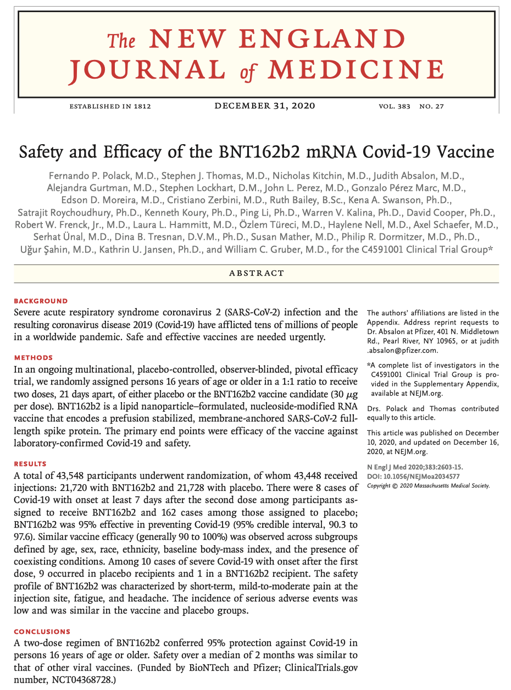
</div>
`Credit` [Polack et al. 2020, NEJM](https://www.nejm.org/doi/full/10.1056/nejmoa2034577)
]


---
# Uncertainty

.pull-left[

<br><br><br><br>
### Question to reflect on

Thinking about the task of publicly forecasting the U.S. presidential election using polling data, what kinds of uncertainty would you have to deal with as a forecaster?

<div align="center">
<br>

</div>
]

.pull-right-center[
<div align="center">
<br>
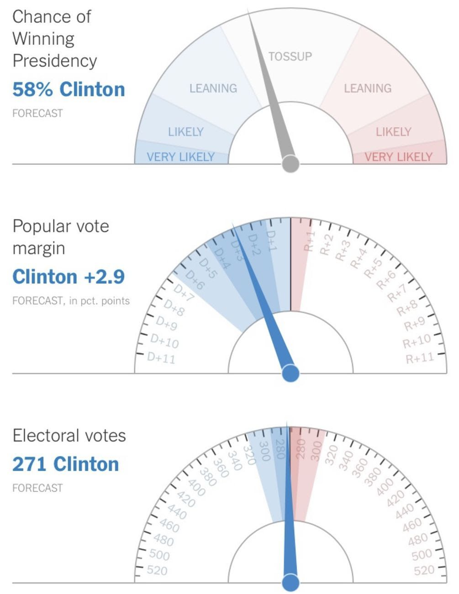
</div>
`Credit` [NYTimes.com at 9:20 p.m. Nov. 8, 2016](https://www.axios.com/spinning-needle-election-night-victory-d285c0da-db86-46b4-86bf-2253c5d661c2.html)
]


---
# Example: FiveThirtyEight 2020 election forecast

.pull-center[
<div align="center">
<br>

</div>
`Source` [FiveThirtyEight](https://projects.fivethirtyeight.com/2020-election-forecast/)
]


---
count: false

# Example: FiveThirtyEight 2020 election forecast

.pull-center[
<div align="center">
<br>

</div>
`Source` [FiveThirtyEight](https://projects.fivethirtyeight.com/2020-election-forecast/)
]


---
count: false

# Example: FiveThirtyEight 2020 election forecast

.pull-center[
<div align="center">
<br>

</div>
`Source` [FiveThirtyEight](https://projects.fivethirtyeight.com/2020-election-forecast/)
]


---
count: false

# Example: FiveThirtyEight 2020 election forecast

.pull-center[
<div align="center">
<br>

</div>
`Source` [FiveThirtyEight](https://projects.fivethirtyeight.com/2020-election-forecast/)
]


---
count: false

# Example: FiveThirtyEight 2020 election forecast

.pull-center[
<div align="center">
<br>

</div>
`Source` [FiveThirtyEight](https://projects.fivethirtyeight.com/2020-election-forecast/)
]


---
count: false
# Example: FiveThirtyEight 2020 election forecast

.pull-center[
<div align="center">
<br>

</div>
`Source` [FiveThirtyEight](https://projects.fivethirtyeight.com/2020-election-forecast/)
]


---
count: false
# Example: FiveThirtyEight 2020 election forecast

.pull-center[
<div align="center">
<br>

</div>
`Source` [FiveThirtyEight](https://projects.fivethirtyeight.com/2020-election-forecast/)
]

---
# Example: How the sausage is made

.pull-left-center[
<div align="center">
<br>
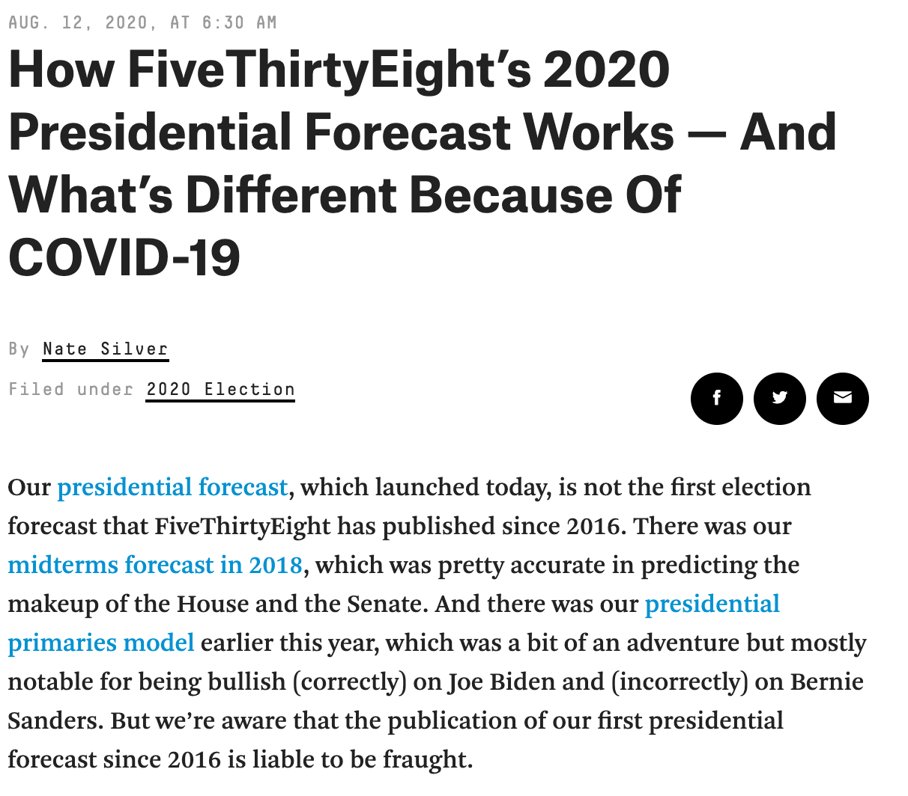
</div>
`Source` [FiveThirtyEight](https://fivethirtyeight.com/features/how-fivethirtyeights-2020-presidential-forecast-works-and-whats-different-because-of-covid-19/)

]

---
count: false
# Example: How the sausage is made

.pull-left-center[
<div align="center">
<br>
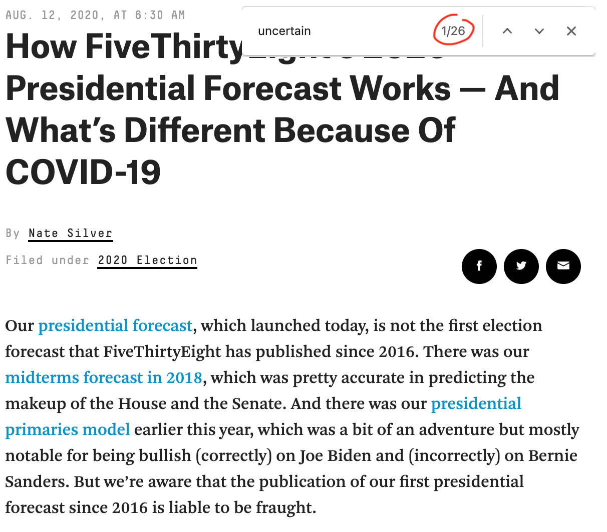
</div>
`Source` [FiveThirtyEight](https://fivethirtyeight.com/features/how-fivethirtyeights-2020-presidential-forecast-works-and-whats-different-because-of-covid-19/)
]


---
count: false
# Example: How the sausage is made

.pull-left-center[
<div align="center">
<br>
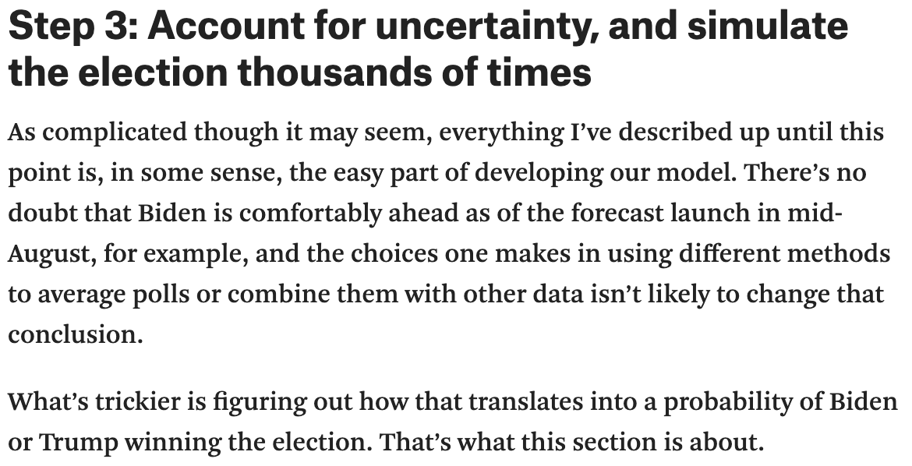
</div>
`Source` [FiveThirtyEight](https://fivethirtyeight.com/features/how-fivethirtyeights-2020-presidential-forecast-works-and-whats-different-because-of-covid-19/)
]

---
count: false
# Example: How the sausage is made

.pull-left-center[
<div align="center">
<br>
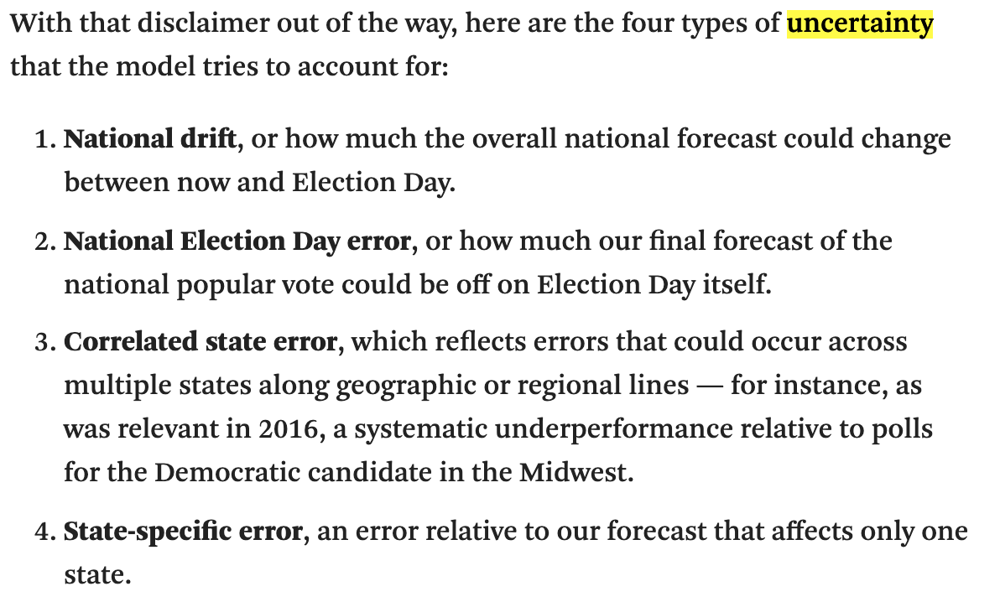
</div>
`Source` [FiveThirtyEight](https://fivethirtyeight.com/features/how-fivethirtyeights-2020-presidential-forecast-works-and-whats-different-because-of-covid-19/)
]

---
count: false
# Example: How the sausage is made

.pull-left-center[
<div align="center">
<br>
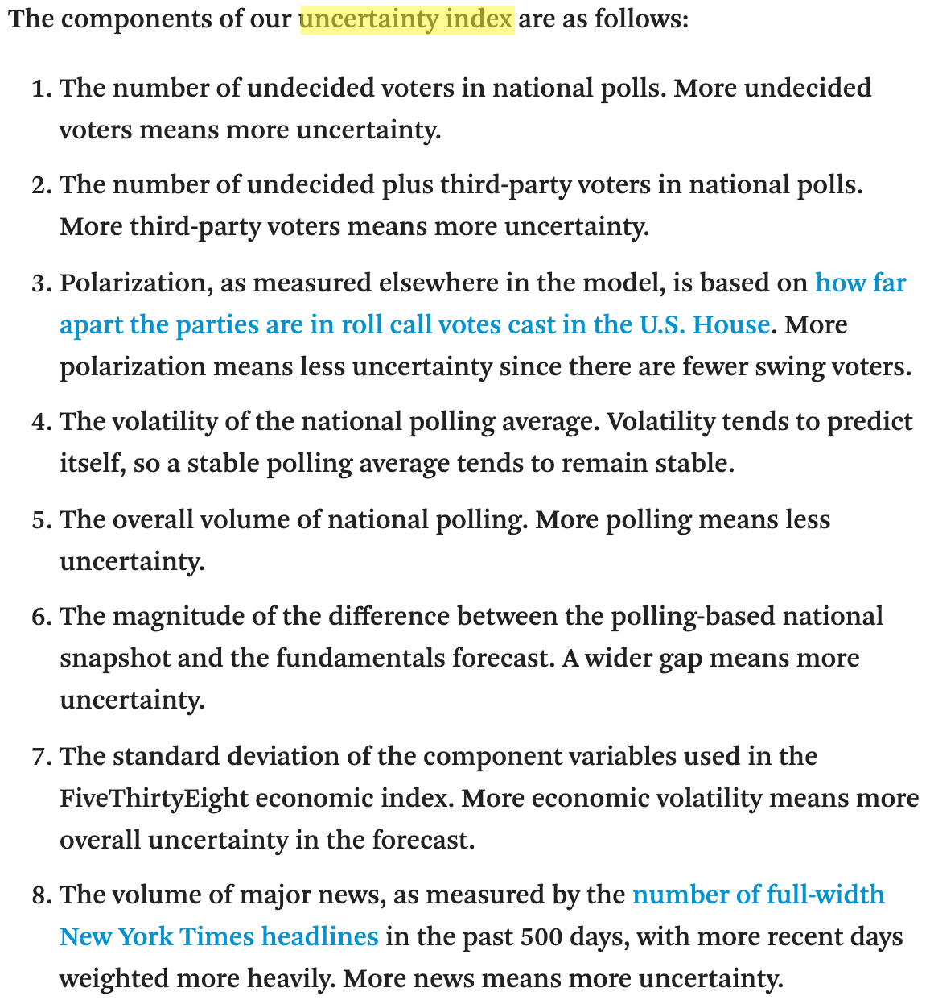
</div>
`Source` [FiveThirtyEight](https://fivethirtyeight.com/features/how-fivethirtyeights-2020-presidential-forecast-works-and-whats-different-because-of-covid-19/)
]

--
.pull-right-center[
<div align="center">
<br><br><br><br>

</div>
]


---
# Uncertainty

.pull-left[
### What we are uncertain about

- **Measurement** → uncertainty in single variables
- **Model specification** → uncertainty across multiple variables and how they connect
- **Parameter estimates** → uncertainty about bias and precision
- **Model outcomes** → uncertainty about (out-of-sample) fit
- **Generalizability** to other samples, the future

Depending on the empirical setup, various specific **sources of error** might enter (e.g., [survey data](https://academic.oup.com/poq/article/74/5/849/1817502), [digital trace data](https://academic.oup.com/poq/article/85/S1/399/6359490)).
]

.pull-right-center[
<div align="center">
<br>
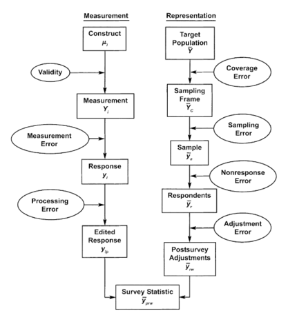
</div>
`Credit` [Robert Groves, Total Survey Error](https://academic.oup.com/poq/article/74/5/849/1817502?login=true)
]


---
# Communicating uncertainty

.pull-left[
### The difficulty of communicating uncertainty

- The concept is complex. Not all people think in probabilistic terms.
- Many humans are bad at understanding (conditional and unconditional) probabilities.
- Adding information about uncertainty might distract, confuse, and undermine trust.
]

.pull-right-center[
<div align="center">
<br>

</div>
`Credit` [Richard McElreath](https://twitter.com/rlmcelreath/status/1462719976259919879)
]


---
# Communicating uncertainty (cont.)

.pull-left-center[
### Visualizing uncertainty

<div align="center">
<br>

</div>

<div align="center">

</div>

<div align="center">

</div>

`Source` [Claus Wilke](https://clauswilke.com/dataviz/visualizing-uncertainty.html)
]


.pull-right-center[
### Uncertainty by numbers

<div align="center">
<br>
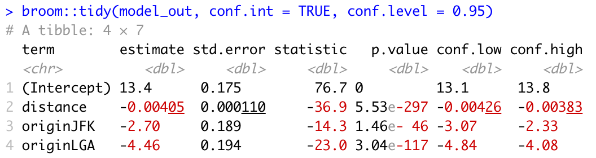
</div>


### Strategies by precision

<div align="center">
<br>

</div>
`Credit` [van der Bles et al. 2019](http://doi.org/10.1098/rsos.181870)
]


---
# Communicating probabilities with verbal expressions

.pull-left-center[
<div align="center">
<br>

</div>
`Source` [Willems et al. 2020](https://doi.org/10.22323/2.19020203)

]

.pull-right-center[
<div align="center">
<br>

</div>
]


---
# Probabilities: confusing vote share with p(win)

.pull-left-center[
<div align="center">
<br>

</div>
`Source` [Westwood et al. 2020](https://doi.org/10.1086/708682)

]

.pull-right[
<div align="center">
<br>

</div>
]


---
# Communicating data and analyses with <tt>report</tt>

.pull-left-small[
### The package
- The [`report`](https://easystats.github.io/report/) package (part of the [easystats](https://easystats.github.io/easystats/) project) provides verbal reports of models, tests, and data frames.
- In doing so, it helps ensure standardization in reporting.
]

.pull-right-wide[
### The workflow

<div align="center">
<br>

</div>
]


---
# Communicating data and analyses with <tt>report</tt>

.pull-left-small[
### The package
- The [`report`](https://easystats.github.io/report/) package (part of the [easystats](https://easystats.github.io/easystats/) project) provides verbal reports of models, tests, and data frames.
- In doing so, it helps ensure standardization in reporting.

### Use with care
- Fully automating this part of communication is probably not a good idea (do you enjoy talking to a bot?).
- The output is pseudo-objective (reporting some quantities but not others).
]

.pull-right-wide[
### Example

```{r, eval = F}
library(report)
model <- lm(Sepal.Length ~ Species, data = iris)
report(model)
```

```r
We fitted a linear model (estimated using OLS) to predict Sepal.Length 
with Species (formula: Sepal.Length ~ Species). The model explains a 
statistically significant and substantial proportion of variance 
(R2 = 0.62, F(2, 147) = 119.26, p < .001, adj. R2 = 0.61). The model's 
intercept, corresponding to Species = setosa, is at 5.01 (95% CI 
[4.86, 5.15], t(147) = 68.76, p < .001). Within this model:

  - The effect of Species [versicolor] is statistically significant 
  and positive (beta = 0.93, 95% CI [0.73, 1.13], t(147) = 9.03, 
  p < .001; Std. beta = 1.12, 95% CI [0.88, 1.37])
  - The effect of Species [virginica] is statistically significant 
  and positive (beta = 1.58, 95% CI [1.38, 1.79], t(147) = 15.37, 
  p < .001; Std. beta = 1.91, 95% CI [1.66, 2.16])

Standardized parameters were obtained by fitting the model on a 
standardized version of the dataset.
```
]


<!-- ############################################ -->
---
class: inverse, center, middle
name: rmarkdown

# Written communication with R Markdown
<html><div style='float:left'></div><hr color='#EB811B' size=1px style="width:1000px; margin:auto;"/></html>

---
# Written communication

.pull-left[

### When to communicate in writing

- For communicating to **the public and decision makers**, who want to focus on the conclusions, not the code behind the analysis.

- For collaborating with **other data scientists**, who are interested in both your conclusions, and how you reached them (i.e. the code).

### Authoring as part of the workflow

- Many different formats, including reports, briefs, blog posts, books, presentations, ...
- Form follows function: the write-up tool should talk to the analytic toolset.
]

.pull-right-center[
<div align="center">
<br>

</div>
`Source` [Kurt Newman](https://www.pinterest.com/pin/424745808581131349/)
]


---
# The continuum of written data science communication

<br><br>

.pull-left-vvsmall[
<div align="center">
<br><br>

</div>
]

.pull-left-vvsmall[
<div align="center">
<br><br>

</div>
]


.pull-left-vvsmall[
<div align="center">
<br><br>

</div>
]


.pull-left-vvsmall[
<div align="center">
<br><br>

</div>
]


.pull-left-vvsmall[
<div align="center">
<br><br>

</div>
]

.pull-left-vvsmall[
<div align="center">

</div>
]


<br>

.pull-left-vvsmall[
**Book**
<br>
<div align="center">

</div>
]

.pull-left-vvsmall[
**Conference proceeding, journal article**
<br>
<div align="center">

</div>
]

.pull-left-vvsmall[
**Technical report**
<br>
<div align="center">

</div>
]

.pull-left-vvsmall[
**Executive summary**
<br>
<div align="center">

</div>
]

.pull-left-vvsmall[
**Dashboard**
<br>
<div align="center">

</div>
]

.pull-left-vvsmall[
**Tweet**
<br>
<div align="center">

</div>
]


---
# Authoring with R Markdown

.pull-left[

### What you already know

- R Markdown (and the `rmarkdown` package) helps you create dynamic analysis documents that combine code, rendered output (such as figures), and prose. 
- You can use it to
  - Do data science interactively with notebooks.
  - Modify the layout of your report.
  - Communicate your results with others.
- You take care of content, R Markdown of format.

### More resources

- The [official website](https://rmarkdown.rstudio.com/)
- The [R Markdown Cookbook](https://bookdown.org/yihui/rmarkdown-cookbook/)
- [R Markdown - The Definitive Guide](https://bookdown.org/yihui/rmarkdown/)
]

--

.pull-right[

### What you probably don't know (yet)

- R Markdown can do much more than reports. You can use it to author
  - Reports (in PDF, HTML, Word, etc.)
  - Interactive documents
  - Dashboards
  - Slideshows
  - Books
  - Websites
- It stands on the shoulders of [Pandoc](https://pandoc.org/), a package that converts markup files into virtually any other format.

<div align="center">

</div>
]


---
# RMarkdown formats

.pull-left[
.pull-left-wide[
### bookdown
- A [package](https://bookdown.org/) that facilitates writing books and long-form articles/reports with R Markdown.
- See [here](https://bookdown.org/home/archive/) for an overview of books written with `bookdown`.
]
.pull-right-small[
<br>
<div align="center">

</div>
]
]

.pull-right[
.pull-left-wide[
### blogdown
- A [package](https://bookdown.org/yihui/blogdown/) that lets you create websites (not only blogs!) using R Markdown.
- It integrates [Hugo
](https://gohugo.io/) (or other site generators).
]
.pull-right-small[
<br>
<div align="center">

</div>
]
]

.pull-left[
.pull-left-wide[
<br>
### pagedown
- A [package](https://pagedown.rbind.io/) that lets you paginate the HTML output of R Markdown with CSS for print (PDF).
- Lots of different [templates](https://github.com/rstudio/pagedown) available.
]
.pull-right-small[
<br><br>
<div align="center">

</div>
]
]

.pull-right[
.pull-left-wide[
<br>
### xaringan
- A [package](https://github.com/yihui/xaringan) that lets you crate slideshows with [remark.js](https://remarkjs.com/) through R Markdown.
- These slides have been created using this package.
]
.pull-right-small[
<br><br>
<div align="center">

</div>
]
]


<!-- ############################################ -->
---
class: inverse, center, middle
name: dashboards

# Interactive communication with dashboards
<html><div style='float:left'></div><hr color='#EB811B' size=1px style="width:1000px; margin:auto;"/></html>


---
background-image: url("pics/delorean-dashboard.png")
background-size: contain
background-color: #000000

# What are dashboards?


---
# What are dashboards?

.pull-left-wide[
### Yeah, what are they really?
- A (business or data) [dashboard](https://en.wikipedia.org/wiki/Dashboard_(business)) is a GUI that provides high-level overviews of performance indicators or other quantities of interest. 
- It's a **monitoring** (and not so much analysis) **tool**.
- Think of dashboards as a **mash-up of data visualization and report**.
- Dashboards are increasingly popular in businesses and organizations to **synthesize data points** from operative units (for strategic and analytical purposes).
- Data journalism has started to embrace dashboards in the context of [elections](https://edition.cnn.com/election/2020/results/president), the [COVID-19 pandemic](https://covid19.who.int/), and [sports](https://projects.fivethirtyeight.com/2018-world-cup-predictions/).
- **Common features** are:
  - Accessibility via web browser
  - Featuring of interactives
  - Heavy focus on comparative visualization
  - Provision of trends on key performance indicators (KPIs)
]

.pull-right-small-center[
<div align="center">
<br>

</div>
`Credit` [Tim Green](https://commons.wikimedia.org/wiki/File:MG_interior_%2829094966463%29.jpg)

<div align="center">
<br>

</div>
`Credit` [HelicalInsight OpenSourceBI](https://commons.wikimedia.org/wiki/File:Marketing_dashboard.png)
]

---
# Why are dashboards?

.pull-left[
### Why are they a thing?

- There is increasing **abundance of data** (often process-generated) that cannot speak for itself.
- If used wisely, these data can provide an **important part of business intelligence** and a basis for high-level [evidence-based decision-making](https://stephanieevergreen.com/dashboard-conversation/).
- **Reduce information differential** between analysts and stakeholders but providing continuous quantification of indicators of interest (→ monitoring).
- Also, **measuring the health of organizations** can help stay in control (if only as a performative act) and satisfy managers' need for micromanaging.
]

.pull-right-center[
<div align="center">
<br><br><br>

</div>
`Credit` [towardsdatascience.com](https://towardsdatascience.com/5-most-popular-business-intelligence-bi-tools-in-2019-4e060b98039a)
]


---
# Dashboards in the wild

.pull-center[
<div align="center">
<br>

</div>
`Credit` [geckoboard.com](https://www.geckoboard.com/dashboard-examples/company/company-dashboard/)
]

---
# Dashboards in the wild

.pull-center[
<div align="center">
<br>

</div>
`Credit` [geckoboard.com](https://www.geckoboard.com/dashboard-examples/company/recruitment-dashboard/)
]


---
# Dashboards in the wild

.pull-center[
<div align="center">
<br>

</div>
`Credit` [idashboards.com](https://www.idashboards.com/dashboard-examples/healthcare-hospital-billing-scorecard/)
]


---
# Dashboards in the wild

.pull-center[
<div align="center">
<br>

</div>
`Credit` [idashboards.com](https://www.idashboards.com/dashboard-examples/government-parks-dashboard/)
]


---
# Dashboards in the wild

.pull-center[
<div align="center">
<br>

</div>
`Credit` [idashboards.com](https://www.matillion.com/resources/blog/dashboard-examples-the-good-the-bad-and-the-ugly)
]


---
# Dashboards in the wild

.pull-center[
<div align="center">
<br>

</div>
`Credit` [carmel.es](https://carmel.es/2018/10/26/6-examples-of-bad-dashboard-designs/
)
]


---
# The problem(s) with dashboards

.pull-left[
### Design challenges

- **They say too little.** Loss of information is [fatal](https://stephanieevergreen.com/problem-with-dashboards/) for good decision-making when aggregating results into few KPIs.
- **They say too much** (irrelevant things). 
- Dashboards often fail not in technology but in communication (rooted in poor design).
- "Dashboards are not for show. No amount of cuteness and technical wizardry can substitute for clear communication." [Stephen Few](http://blogs.ischool.berkeley.edu/i247s12/files/2012/01/Dashboard-Design-Overview-Presentation.pdf), [Perceptual Edge](https://perceptualedge.com)
- As dashboards are a subgenre of data viz, so **all rules of good/bad viz apply**.
- So, there is hope since we do know a bit about how to design good visuals. (See [here](https://stephanieevergreen.com/dashboard-conversation/) for a nice case study on improving the design of a dashboard.)
]

--

.pull-right[
### Analytic challenges

- Dashboards cater to the desire to be able to make good decisions on the basis of few selected metrics.
- This logic reflects a **gross simplification of reality**. 
- All challenges that pop up in careful analytic work - issues of selection, measurement, causality, predictiveness - are still valid but will be obscured when aggregating data. 
- Simple metrics can still be useful, but often **you need contextual knowledge** (which is difficult to communicate in dashboards).
- Another consequence of "dashboarding" business intelligence can be that by making decisions a function of metrics, they stop working well because they will be gamed.
]

---
# Thoughtful dashboard design and usage

.footnote[<sup>1</sup>Source: [Stephen Few/Perceptual Edge](http://perceptualedge.com/articles/misc/Dashboard_Design_Requirements_Questionnaire.pdf)
]

.pull-left[
### Checklist before you start<sup>1</sup>

1. Are you tackling a monitoring task that needs your data/metrics to be updated frequently?

2. Who will use the dashboard and to what end? What questions will they use it to answer? What actions will they take in response to these answers?

3. What specific information should be displayed, and is it meaningful without much context?

4. What could lead to the metrics being wrong/misleading?
]

--

.pull-right[
### Design advice

- Minimize distractions.
- Focus on meaningful quantities of interest, not the ones that look cool.
- Don't overload with information.
- Apply all rules of good data viz.
- Use interactives with care (e.g., to make optional content  conditionally visible)
- Try not to exceed the boundaries of a single screen. 
- Ensure desktop/mobile screen responsiveness.
]


---
# Dashboards in the wild: COVID-19 edition

.pull-center[
<div align="center">

</div>
`Credit` [NY Times](https://www.nytimes.com/interactive/2021/us/covid-cases-deaths-tracker.html
)
]

---
# Dashboards in the wild: COVID-19 edition

.pull-center[
<div align="center">
<br>

</div>
`Credit` [Our World in Data](https://ourworldindata.org/explorers/coronavirus-data-explorer?zoomToSelection=true)
]


---
# Dashboards in the wild: COVID-19 edition

.pull-center[
<div align="center">
<br>

</div>
`Credit` [SZ Online](https://www.sueddeutsche.de/wissen/corona-zahlen-1.4844448)
]


---
# Dashboards in the wild: COVID-19 edition

.pull-center[
<div align="center">
<br>

</div>
`Credit` [ZEIT Online](https://www.zeit.de/wissen/corona-karte-deutschland-aktuelle-zahlen-landkreise)
]


---
# Dashboards with R

.pull-left[
.pull-left-vwide[
### <tt>flexdashboard</tt> package
- Overview [here](https://pkgs.rstudio.com/flexdashboard).
- Good for easy dashboard building
- Just a document that looks like a dashboard
- Can be compiled into a static file (just like regular Markdown)
- Can only run interactive code client-fleside (in embedded JavaScript)
- Shiny  and `htmlwidgets` (`leaflet`, `plotly`, `highcharter`, etc.)  can be integrated (with all the up- and downsides)
]
.pull-right-vsmall[
<br>
<div align="center">

</div>
]
<br>
<div align="center">


</div>
]

.pull-right[
.pull-left-vwide[
### <tt>shiny</tt> package
- Overview [here](https://shiny.rstudio.com/).
- More complex to program, but the best option for complex apps.
- Can implement any layout.
- Needs a server behind it to execute R code on user input. 
- Can run interactive code either by processing serverside (in R) or clientside (in embedded JavaScript).
- The [shinydashboard](https://rstudio.github.io/shinydashboard/) package provides another way to create dashboards with Shiny.
]
.pull-right-vsmall[
<br>
<div align="center">

</div>
]
<br>
<div align="center">


</div>
]


---
# Dashboards with <tt>flexdashboard</tt>

.pull-left-vsmall[
### Functionality

- Use simple R Markdown to build a dashboard.
]

.pull-right-vwide[
<div align="center">
<br>


<tt>Source:</tt> <a href="https://beta.rstudioconnect.com/jjallaire/htmlwidgets-d3heatmap/htmlwidgets-d3heatmap.html">jjallaire</a>
</div>

]

---
# Dashboards with <tt>flexdashboard</tt>

.pull-left-vsmall[
### Functionality

- Use simple R Markdown to build a dashboard.
- Arrange panels as blocks with flexible syntax.
]

.pull-right-vwide[
<div align="center">
<br>

</div>
]


---
# Dashboards with <tt>flexdashboard</tt>

.pull-left-vsmall[
### Functionality

- Use simple R Markdown to build a dashboard.
- Arrange panels as blocks with flexible syntax.
]

.pull-right-vwide[
<div align="center">
<br>

</div>
]


---
# Dashboards with <tt>flexdashboard</tt>

.pull-left-vsmall[
### Functionality

- Use simple R Markdown to build a dashboard.
- Arrange panels as blocks with flexible syntax.
]

.pull-right-vwide[
<div align="center">
<br>

</div>
]


---
# Dashboards with <tt>flexdashboard</tt>

.pull-left-vsmall[
### Functionality

- Use simple R Markdown to build a dashboard.
- Arrange panels as blocks with flexible syntax.
- Add elements like gauges and value boxes.
]

.pull-right-vwide[
<div align="center">
<br>

<br>

</div>
]


---
# Dashboards with <tt>flexdashboard</tt>

.pull-left-vsmall[
### Functionality

- Use simple R Markdown to build a dashboard.
- Arrange panels as blocks with flexible syntax.
- Add elements like gauges and value boxes.
- Couple it with `shiny`.
]

.pull-right-vwide[
<div align="center">
<br>


</div>
]


---
# Dashboards with <tt>flexdashboard</tt>

.pull-left-vsmall[
### Functionality

- Use simple R Markdown to build a dashboard.
- Arrange panels as blocks with flexible syntax.
- Add elements like gauges and value boxes.
- Couple it with `shiny`.
- Customize themes.
]

.pull-right-vwide[
<div align="center">
<br>

</div>
]


---
# Dashboards with <tt>flexdashboard</tt>

.pull-left-vsmall[
### Functionality

- Use simple R Markdown to build a dashboard.
- Arrange panels as blocks with flexible syntax.
- Add elements like gauges and value boxes.
- Couple it with `shiny`.
- Customize themes.
- Explore more examples [here](https://pkgs.rstudio.com/flexdashboard/articles/examples.html).
]

.pull-right-vwide[
<div align="center">
<br>


</div>
]


---
# Web apps with <tt>shiny</tt>

.pull-left-vsmall[
### Functionality

- Shiny's functionality is too complex and rich to introduce it on a couple of slides. Wait for the labs!
- It certainly can do much more than dashboards.
- Think of it as a tool to create **web apps** that allow interaction with raw and cooked data.
]

.pull-right-vwide[
<div align="center">
<br><br><br>
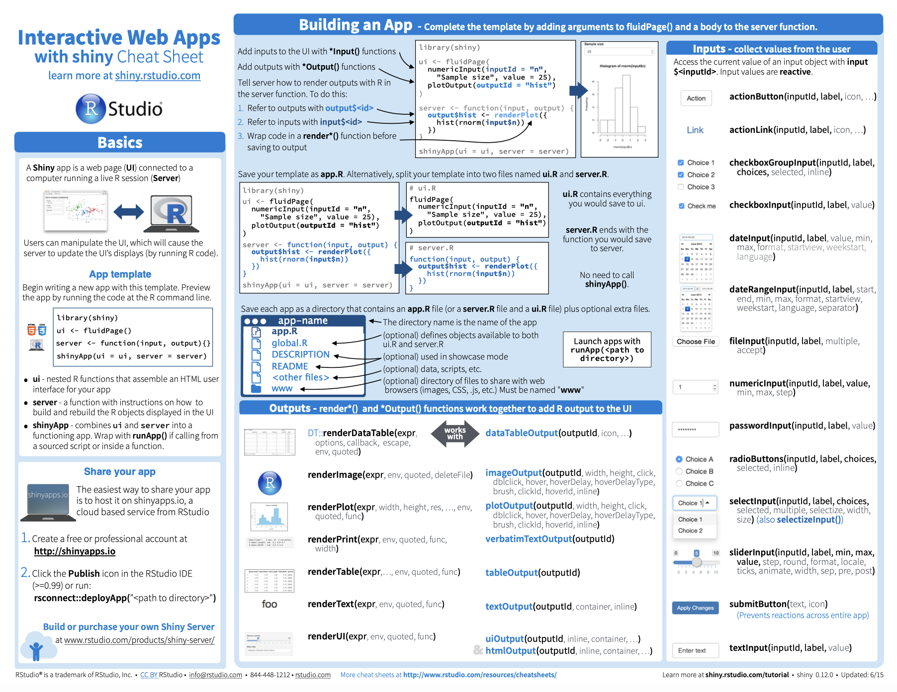
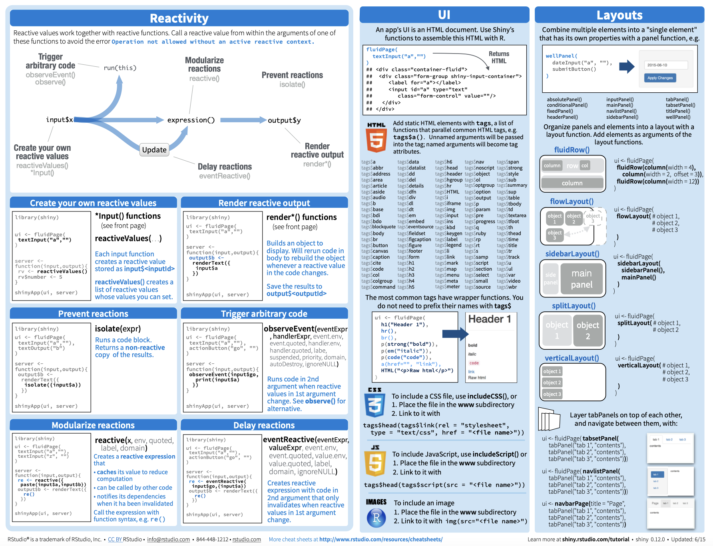
</div>
]

---
# Web apps with <tt>shiny</tt>

.pull-left-vsmall[
### Example applications
- Data explorer
]

.pull-right-vwide[
<div align="center">
<br>
<a href="https://cosima-meyer.shinyapps.io/conflict-elections/">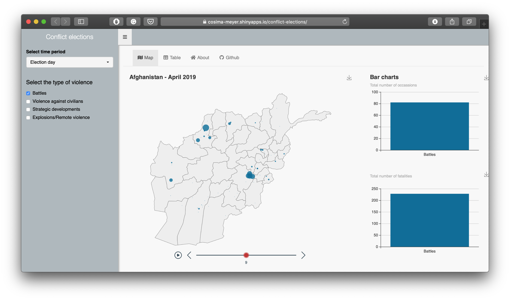</a>
</div>
]


---
# Web apps with <tt>shiny</tt>

.pull-left-vsmall[
### Example applications
- Data explorer
- Interactive appendix
]

.pull-right-vwide[
<div align="center">
<br>
<a href="http://134.155.108.111:3838/Populism/">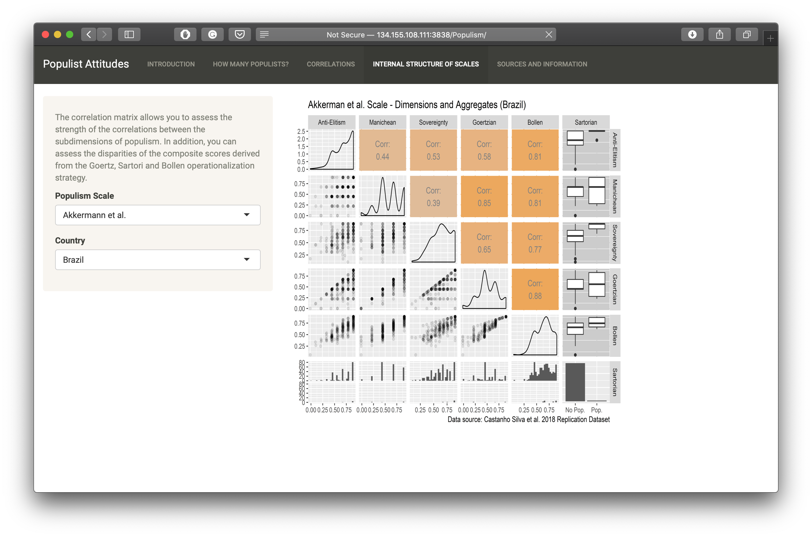</a>
</div>
]


---
# Web apps with <tt>shiny</tt>

.pull-left-vsmall[
### Example applications
- Data explorer
- Interactive appendix
- Workflow apps
]

.pull-right-vwide[
<div align="center">
<br>
<a href="https://leeper.shinyapps.io/pdfcount/">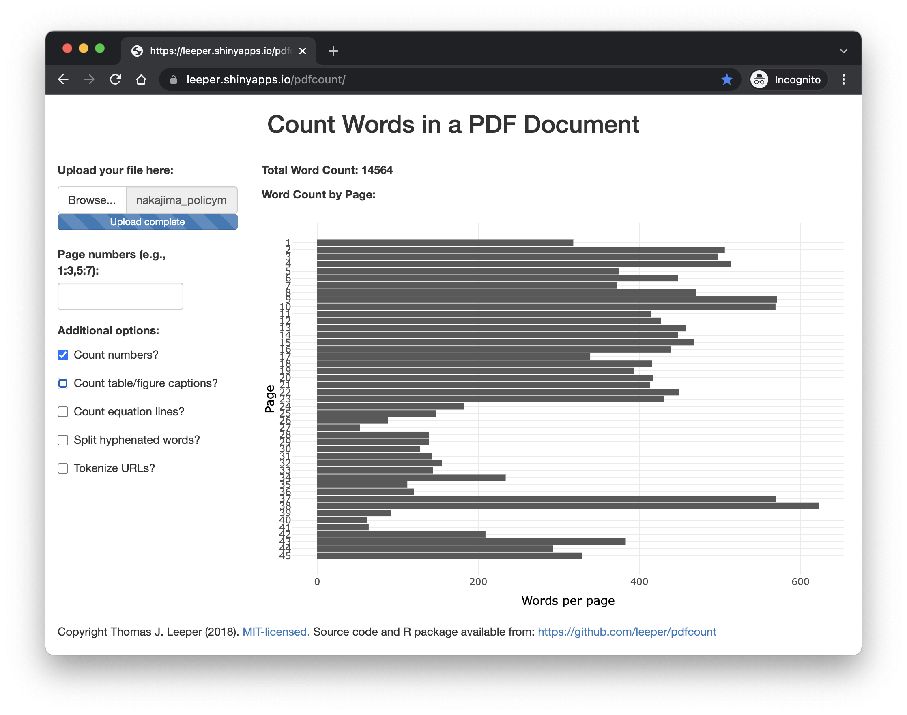</a>
</div>
]


---
# Web apps with <tt>shiny</tt>

.pull-left-vsmall[
### Example applications
- Data explorer
- Interactive appendix
- Workflow apps
- Learning tools
]

.pull-right-vwide[
<div align="center">
<br>
<a href="https://egap.shinyapps.io/Power_Calculator/">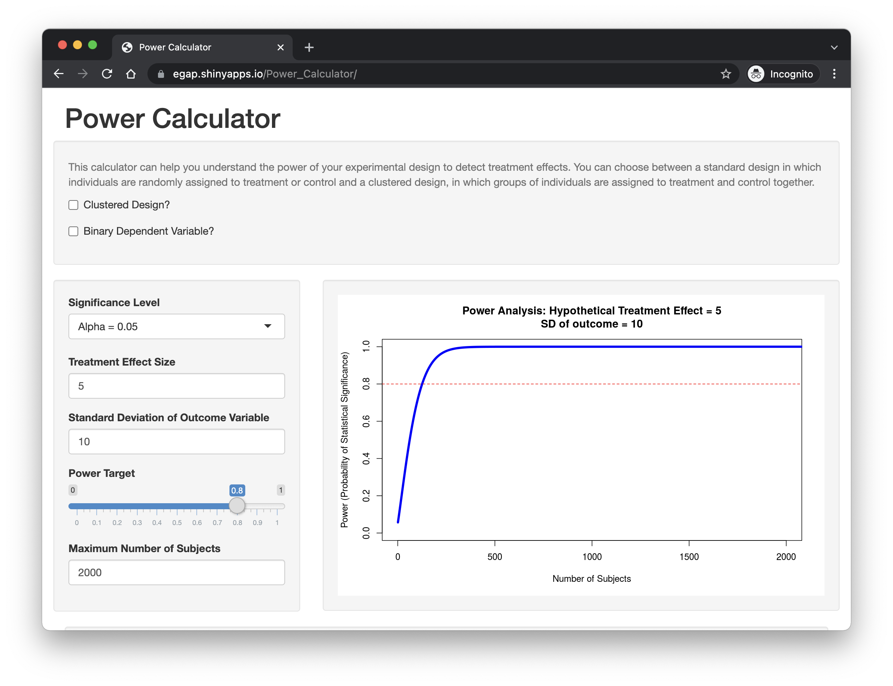</a>
</div>
]


---
# Web apps with <tt>shiny</tt>

.pull-left-vsmall[
### Example applications
- Data explorer
- Interactive appendix
- Workflow apps
- Learning tools
- ... and so much more!
]

.pull-right-vwide[
<div align="center">
<br>
<a href="https://shiny.rstudio.com/gallery/">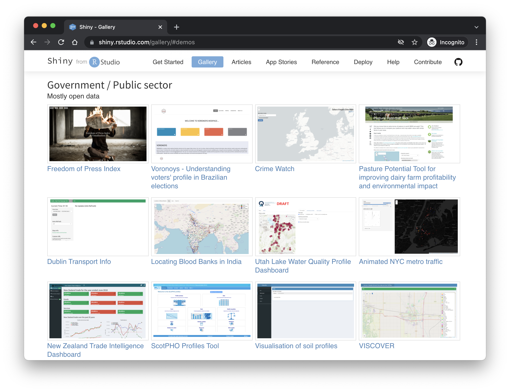</a>
</div>
]


---
# More Shiny resources

.pull-left[
### Online resources
- [Shiny official website](https://shiny.rstudio.com/)
- [Shiny official tutorial](https://shiny.rstudio.com/tutorial/)
- [Shiny cheatsheet](https://shiny.rstudio.com/images/shiny-cheatsheet.pdf)
- [Mastering Shiny](https://mastering-shiny.org/), book by Hadley Wickham
- [Many useful articles about different topics](https://shiny.rstudio.com/articles/)
- Publishing own Shiny apps for free with [shinapps.io](https://www.shinyapps.io/)
- Hosting your Shiny app [on your own server](https://deanattali.com/2015/05/09/setup-rstudio-shiny-server-digital-ocean/)
- [Debugging Shiny](https://shiny.rstudio.com/articles/debugging.html)
]

.pull-right[
### An overview of Shiny extensions
- [awesome-shiny-extensions](https://github.com/nanxstats/awesome-shiny-extensions)

### Some highlights
- [shinythemes](https://rstudio.github.io/shinythemes/): Altering the overall appearance of Shiny apps
- [shinyjs](https://deanattali.com/shinyjs/): Enrich apps with JavaScript operations
- [leaflet](https://rstudio.github.io/leaflet/): Interactive maps
- [ggvis](https://ggvis.rstudio.com/): Similar to ggplot2 but with focus on web and interaction
- [shinydashboard](): Tools to create visual dashboards
]


<!-- ############################################ -->
---
class: inverse, center, middle
name: science

# The science of science communication
<html><div style='float:left'></div><hr color='#EB811B' size=1px style="width:1000px; margin:auto;"/></html>

---
# The science of science communication

.pull-left-wide[
### Motivation
- You have learned the basic rules of good visualization and reporting, but what is the external validity of this advice?
- How are facts and figures perceived by the public, policymakers, or even other scientists?
- How does science communication affect attitudes and behaviors?

### Show us the data
- It turns out there's increasing evidence on how science communication is consumed by stakeholders, and to what effect. 
- However, much more research is needed to better understand how what we do and communicate travels to stakeholders.
- The following slides report some selected findings.
]

.pull-right-small[
<div align="center">
<br><br>
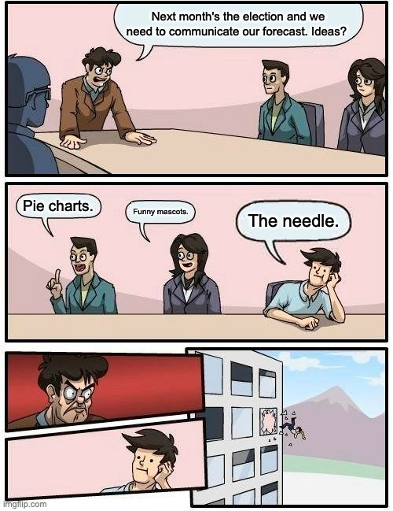
</div>
]


---
# Lawmakers, scientists, and evidence

.pull-left-center[
<div align="center">
<br><br><br>
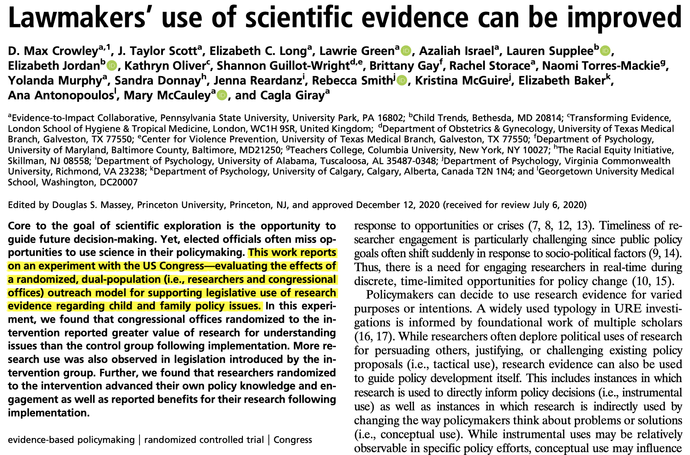
</div>
`Source` [Crowley et al. 2021, *PNAS*](https://www.pnas.org/content/118/9/e2012955118)
]

.pull-right[
<div align="center">
<br>
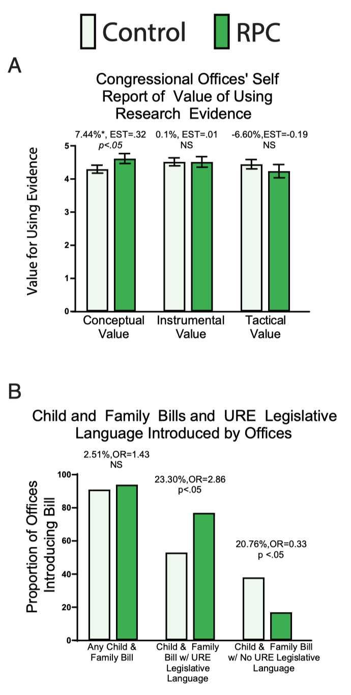
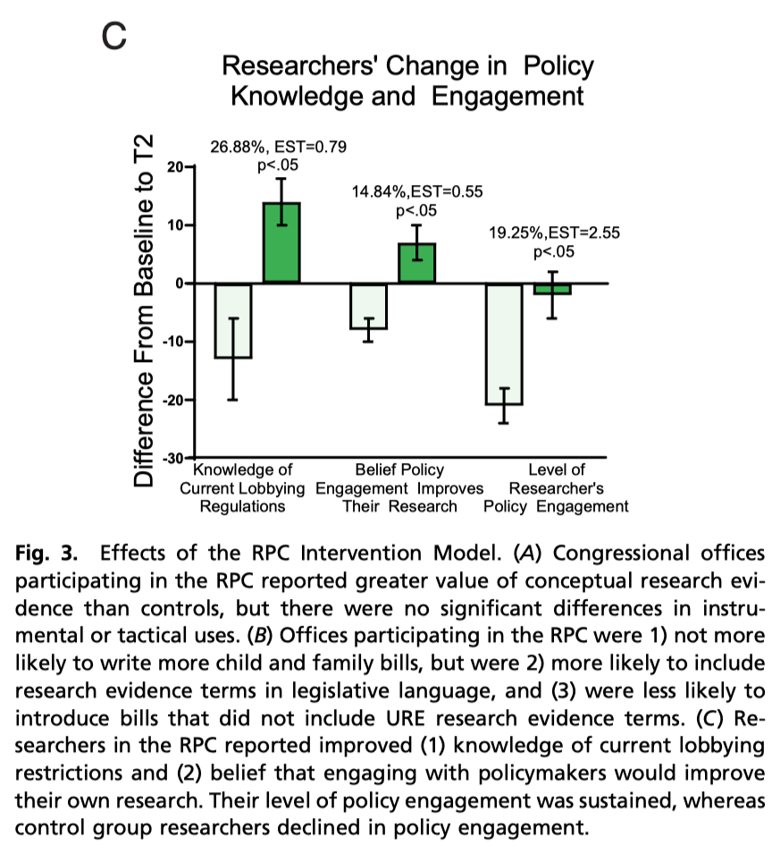
</div>
]

---
# Study characteristics and appreciation

.pull-left-center[
<div align="center">
<br>
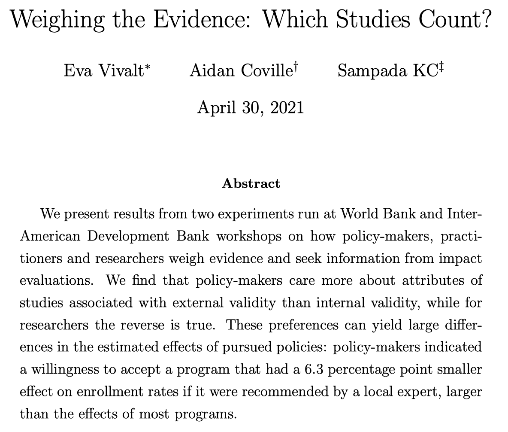
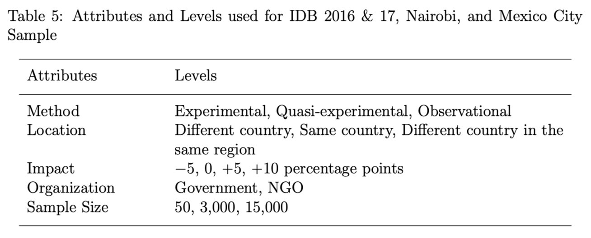
</div>
]

.pull-right-center[
<div align="center">
<br>
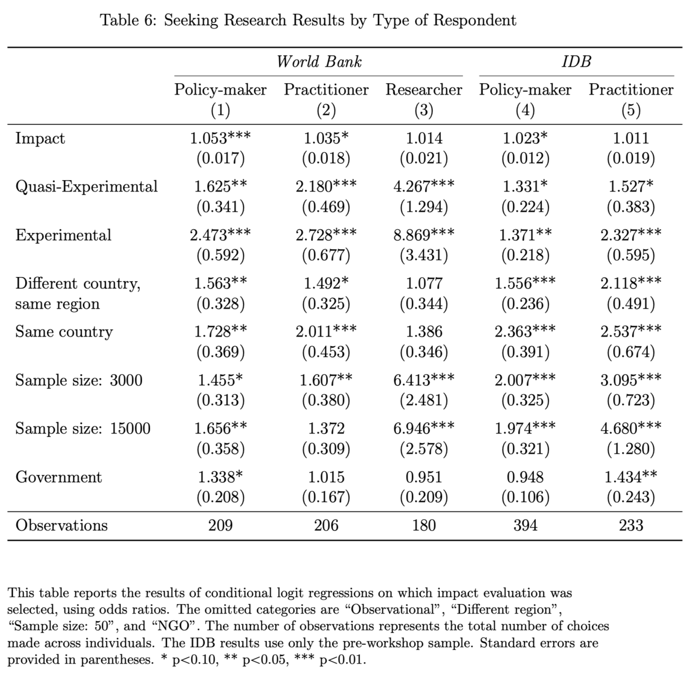
</div>
`Source` [Vivalt et al. 2021, *working paper*](http://evavivalt.com/wp-content/uploads/Weighing-the-Evidence.pdf)
]


---
# Reported uncertainty and public trust

.pull-left-center[
<div align="center">
<br>
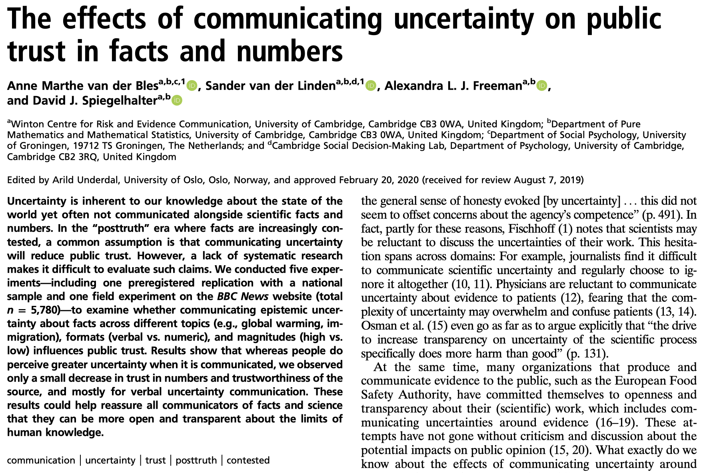
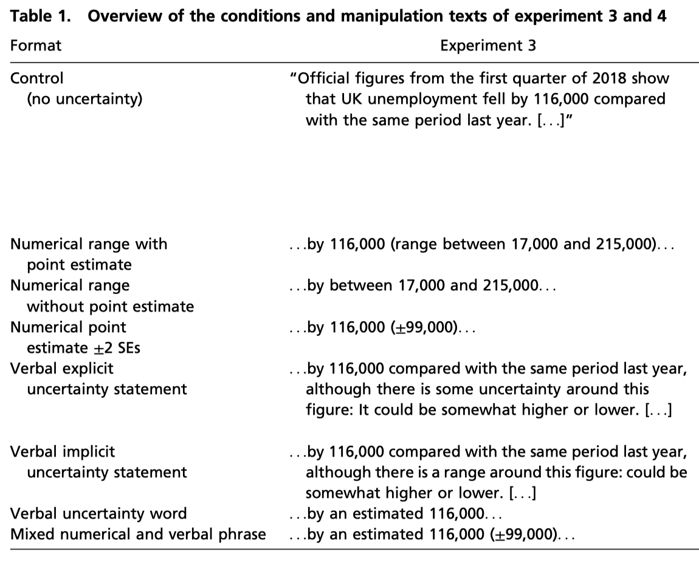
</div>
]

.pull-right-center[
<div align="center">
<br>
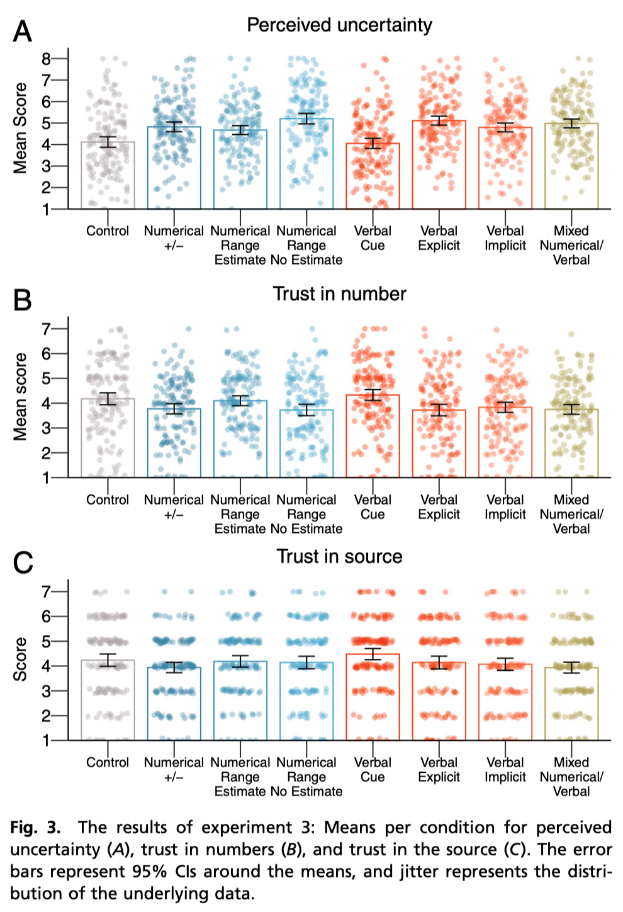
</div>
`Source` [Van der Bles et al. 2020, *PNAS*](https://doi.org/10.1073/pnas.1913678117)
]


<!-- ############################################ -->
---
class: inverse, center, middle
name: openscience

# Towards open data science
<html><div style='float:left'></div><hr color='#EB811B' size=1px style="width:1000px; margin:auto;"/></html>


---
# Trust in science

.pull-center[
<div align="center">
<br>


</div>
`Source` [Pew 2020](https://www.pewresearch.org/science/2020/09/29/science-and-scientists-held-in-high-esteem-across-global-publics/)
]


---
# Trust in data science

.pull-left[
<div align="center">
<br>
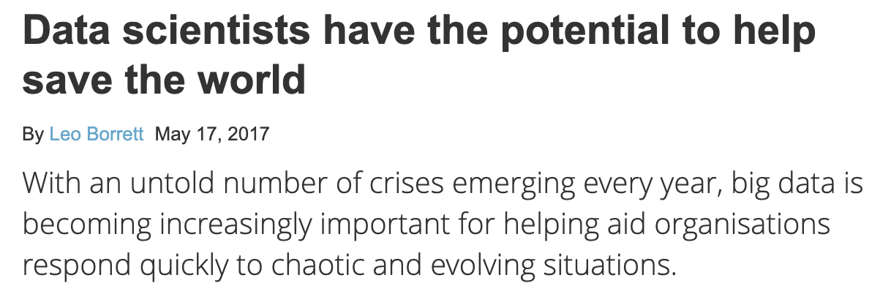
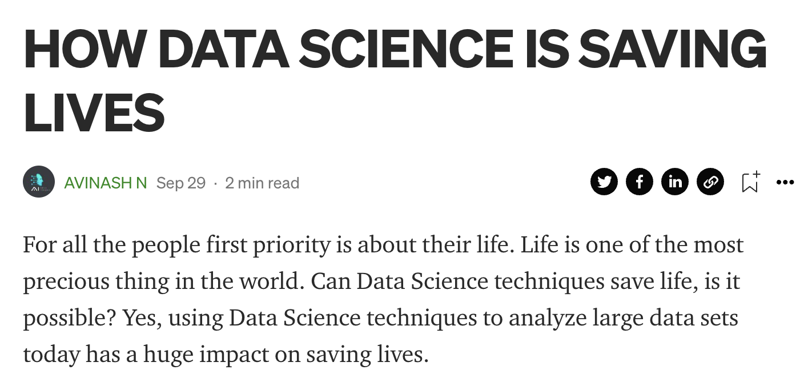

</div>
]

.pull-left[
<div align="center">
<br>
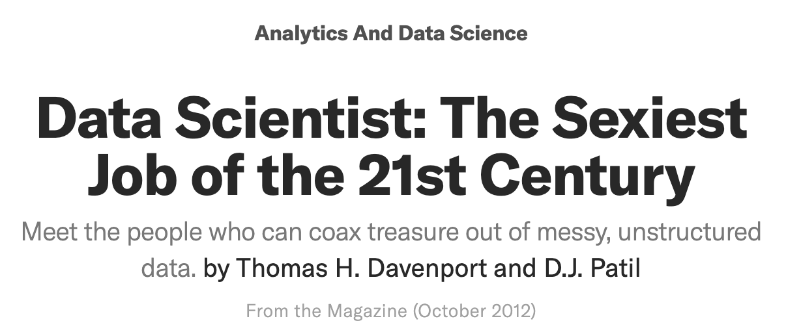
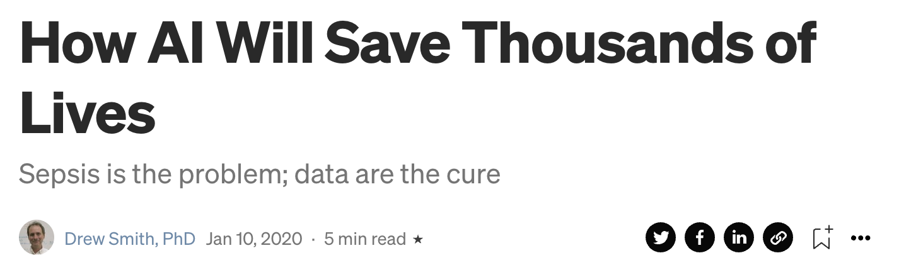
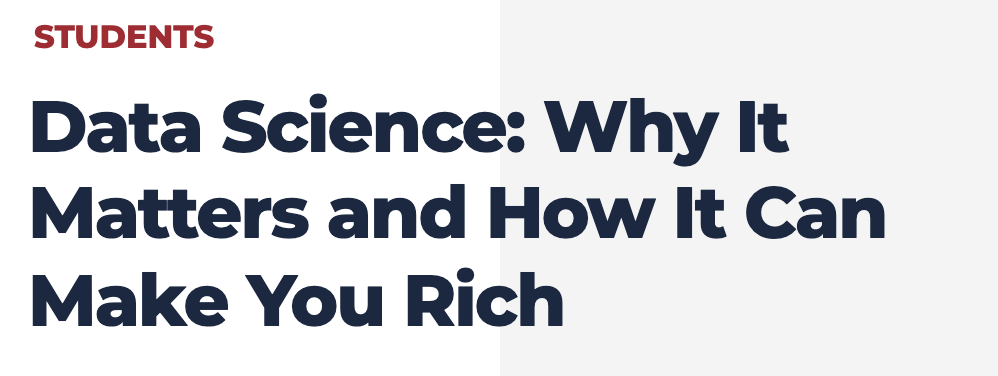
</div>
]

---
# Trust in data science?

.pull-left[
<div align="center">
<br><br><br>
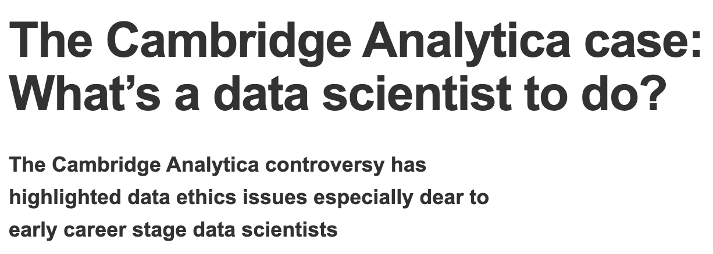
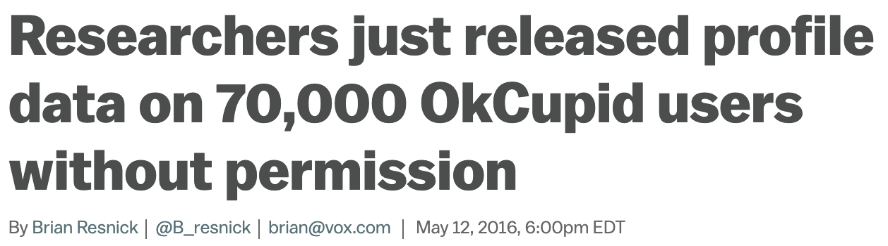
</div>
]

.pull-left[
<div align="center">
<br><br><br>
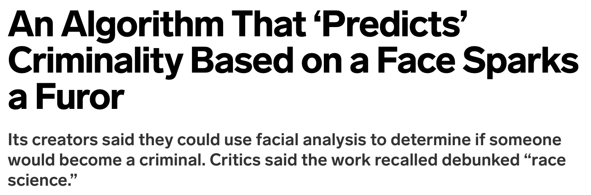

</div>
]


---
# The replication crisis

.pull-left-wide2[
### What the crisis is about
- The finding that many scientific studies are difficult or impossible to reproduce.
- Reproducibility is a cornerstone of science as an enterprise of knowledge generation → bad.


### Factors fueling the replication crisis
- Solo, silo-ed investigators limited to small sample sizes
- Wrong incentives in science
- No pre-registration of hypotheses being tested
- Post-hoc cherry picking of hypotheses with best P values
- Only requiring P < .05
- No replication
- No data sharing
]

.pull-right-small2[
<div align="center">
<br>
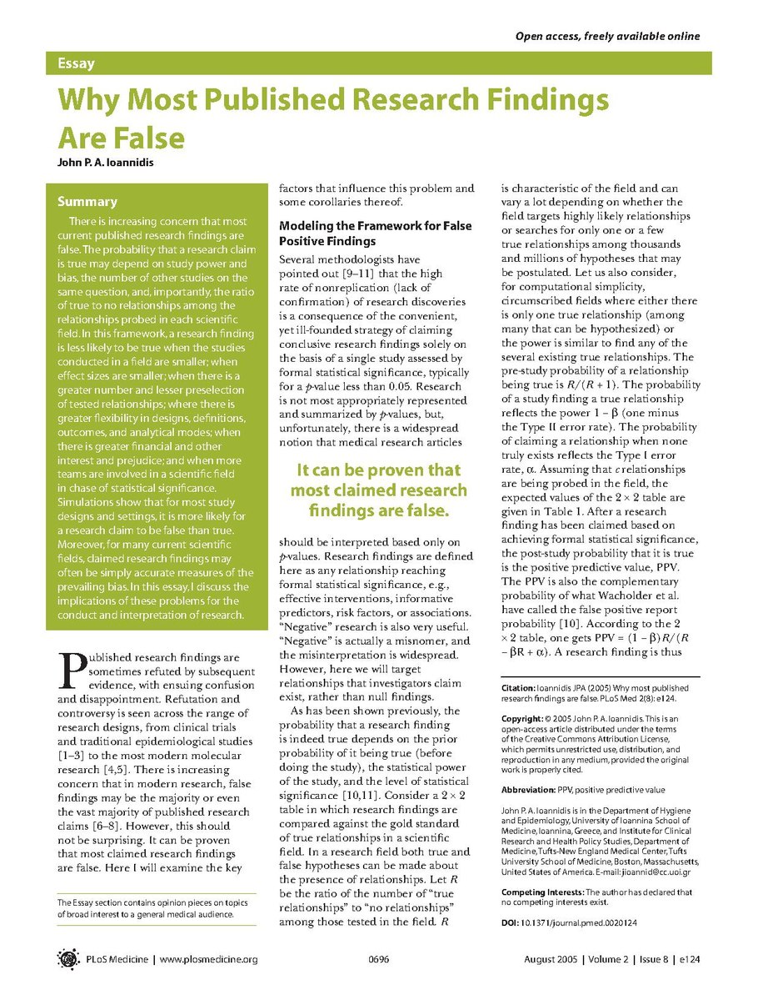
</div>
`Source` [Ioannidis 2005/PLOS Medicine](10.1371/journal.pmed.0020124)
]


---
# Fostering trust in science through open science

.pull-left[
### Communicating the entire workflow

- Any decision - from conceptualizing measures to formatting tables - is meaningful for your output.
  - Tiny mistakes can have massive technical consequences (→ debugging).
  - Various decisions can have ethical implications (→ next session).
  - For others to follow (and potentially invalidate) your analyses, all the details are important.
- What makes the scientific endeavor unique is that it has self-correcting mechanisms. 
- But in order for them to work effectively, you have to **be transparent about every step in your workflow**.
]

.pull-right-center[
<br><br><br>
<div align="center">

</div>
]


---
# Fostering trust in science through open science

.pull-left[
### Communicating the entire workflow

- Any decision - from conceptualizing measures to formatting tables - is meaningful for your output.
  - Tiny mistakes can have massive technical consequences (→ debugging).
  - Various decisions can have ethical implications (→ next session).
  - For others to follow (and potentially invalidate) your analyses, all the details are important.
- What makes the scientific endeavor unique is that it has self-correcting mechanisms. 
- But in order for them to work effectively, you have to **be transparent about every step in your workflow**.
- That's a meta meaning of communication: tell others, by publishing everything from input to code to output, what you've done.
]

.pull-right-center[
<br><br><br>
<div align="center">
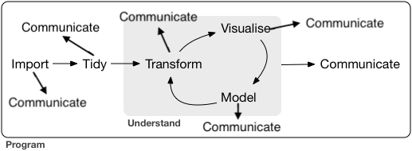
</div>
]


---
# Towards open data science (cont.)

.pull-left[
### Good practice

- Pre-register designs `osf.io`, `aspredicted.org` 
- Do version control `GitHub`
- Public all research outputs (and inputs if possible) `GitHub`, `plain-text formats`
- Disclose and document software pipeline `make`
- Make preprints accessible `arXiv`, `osf.io`
- Public in open access journals
]

.pull-right-center[
<br>
<div align="center">
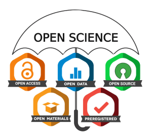
</div>
]


---
# Towards open data science (cont.)

.pull-left[
### Good practice

- Pre-register designs `osf.io`, `aspredicted.org` 
- Do version control `GitHub`
- Public all research outputs (and inputs if possible) `GitHub`, `plain-text formats`
- Disclose and document software pipeline `make`
- Make preprints accessible `arXiv`, `osf.io`
- Public in open access journals

**Notice something?** 

After the last 10 sessions, you have already become open science practitioners. You are welcome.
]

.pull-right-center[
<br>
<div align="center">

</div>
]


---
# Towards open data science (cont.)

.pull-left[
### Good practice

- Pre-register designs `osf.io`, `aspredicted.org` 
- Do version control `GitHub`
- Public all research outputs (and inputs if possible) `GitHub`, `plain-text formats`
- Disclose and document software pipeline `make`
- Make preprints accessible `arXiv`, `osf.io`
- Public in open access journals

**Notice something?** 

After the last 10 sessions, you have already become open science practitioners. You are welcome.

If you want to learn more about the open science movement, check out [this](https://www.nature.com/articles/s41562-016-0021) and  [this](https://psyarxiv.com/ak6jr/) and [this](https://en.wikipedia.org/wiki/Open_science).
]

.pull-right-center[
<br>
<div align="center">

</div>
]


---
# Next steps

<br>

### Final data project

Please submit your final data project proposals until Sunday, November 28 (11.59pm CET) at https://forms.gle/2CJUYnJDDpCzBfJi8


### Next lecture

One more session to go. We're going to talk data science ethics.


