```{css, echo=FALSE} 
@media print { # print out incremental slides; see https://stackoverflow.com/questions/56373198/get-xaringan-incremental-animations-to-print-to-pdf/56374619#56374619
  .has-continuation {
    display: block !important;
  }
}
```

```{r setup, include=FALSE}
# figures formatting setup
options(htmltools.dir.version = FALSE)
library(knitr)
opts_chunk$set(
  comment = "  ",
  prompt = T,
  fig.align="center", #fig.width=6, fig.height=4.5, 
  # out.width="748px", #out.length="520.75px",
  dpi=300, #fig.path='Figs/',
  cache=F, #echo=F, warning=F, message=F
  engine.opts = list(bash = "-l")
  )

## Next hook based on this SO answer: https://stackoverflow.com/a/39025054
knit_hooks$set(
  prompt = function(before, options, envir) {
    options(
      prompt = if (options$engine %in% c('sh','bash')) '$ ' else 'R> ',
      continue = if (options$engine %in% c('sh','bash')) '$ ' else '+ '
      )
})

library(tidyverse)
library(kableExtra)
```


# Table of contents

<br><br>

1. [Everyday ethics in data science](#everyday)

2. [Ethical principles](#principles)

3. [Research ethics in practice](#practice)

4. [Ethics committees in action](#activity)


<!-- ############################################ -->
---
class: inverse, center, middle
name: everyday

# Everyday ethics in data science

<html><div style='float:left'></div><hr color='#EB811B' size=1px style="width:1000px; margin:auto;"/></html>


---
background-image: url("pics/tesla-crash.jpeg")
background-size: contain
background-color: #000000

# You came for this...


---
background-image: url("pics/algo-fairness.png")
background-size: contain
background-color: #000000

# ...and this...


---
background-image: url("pics/great-hack.png")
background-size: contain
background-color: #000000

# ...and this...


---
background-image: url("pics/terminator.jpeg")
background-size: contain
background-color: #000000

# ...and this...


---
# ... but you'll be getting this.

.pull-left[

**Preparatory work**

  - **Problem definition** predict, infer, describe
  - **Design** conceptualize, build data collection device
  - **Data collection** recruit, collect, monitor

**Data operation**

   - **Wrangle**: import, tidy, manipulate
   - **Explore**: visualize, describe, discover
   - **Model**: build, test, infer, predict

**Dissemination**

  - **Communicate**: to the public, media, policymakers
  - **Publish**: journals/proceedings, blogs, software
  - **Productize**: make usable, robust, scalable

]

.pull-right-center[
<br>
<div align="center">

<br>

</div>
]


---
# ... but you'll be getting this.

.pull-left[

**Preparatory work**

  - **Problem definition** predict, infer, describe
  - **Design** conceptualize, build data collection device
  - **Data collection** recruit, collect, monitor

**Data operation**

   - **Wrangle**: import, tidy, manipulate
   - **Explore**: visualize, describe, discover
   - **Model**: build, test, infer, predict

**Dissemination**

  - **Communicate**: to the public, media, policymakers
  - **Publish**: journals/proceedings, blogs, software
  - **Productize**: make usable, robust, scalable

]

.pull-right-center[
<br>
<div align="center">
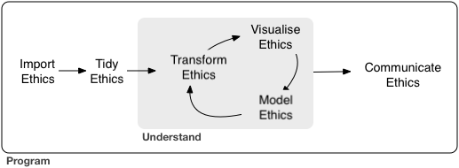
<br>

</div>
]


---
background-image: url("pics/research-ethics-2.png")
background-size: contain
background-color: #000000

# Data science ethics

.pull-left-small-center[
<br><br><br>
<div align="center" class = "font200">
<b>Data science ethics </br>∋</b> </br> <b>Classical research ethics<sup>1</sup></b>
</div>
<br><br><br><sup>1</sup>Honesty, objectivity, prudence, openness, respect for intellectual property, social responsibility, ...
]


---
background-image: url("pics/research-ethics-3.png")
background-size: contain
background-color: #000000

# Data science ethics

.pull-left-small-center[
<br><br><br>
<div align="center" class = "font200">
<b>Data science ethics </br>∋</b> </br> <b>The ethics of </br> everyday decisions </br> of data scientists</b>
</div>
]


---
class: inverse

.pull-left[


### Breakout time! Discuss which ethical issues you may face at various stages of the data science workflow. <br> Focus on:

  **Group A:** The data collection stage <br>
  **Group B:** The modeling stage <br>
  **Group C:** The communication/dissemination stage <br>

### You have **7 minutes** to discuss. Bring concrete examples!
]

.pull-right[
<div align="center">
<br>
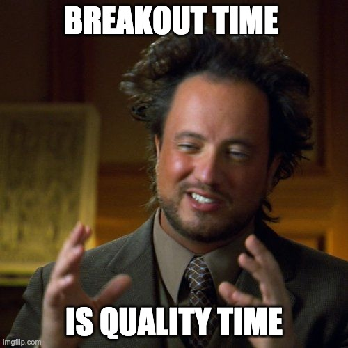
</div>
]


---
class: center
background-image: url("pics/clickworker.png")

# How do I pay clickworkers fairly?


---
class: center
background-image: url("pics/webscraping2.jpeg")
background-size: contain

# How do I respect intellectual property?

---
class: center
background-image: url("pics/google-streetview.webp")
background-size: contain
background-color: #000000

# How do I protect the privacy of my research subjects?

---
class: center
background-image: url("pics/hate-online.jpeg")
background-size: contain
background-color: #000000

# How do I protect the safety of my research subjects?

---
class: center
background-image: url("pics/xkcd.png")
background-size: contain
background-color: #000000

# How do I ensure statistical, measurement validity, etc.?


---
class: center
background-image: url("pics/versioncontrol.jpeg")
background-size: contain
background-color: #000000

# How do I ensure an open science workflow?


---
class: center
background-image: url("pics/meeting-presentation.png")
background-size: contain
background-color: #000000

# How do I communicate results honestly?


---
# Wrap-up

.pull-left[
1. **Data science** as a holistic endeavor is more than AI & machine learning.
2. **Data science ethics** is more than automated decision making, algorithm fairness, and privacy preservation.
3. While new data and technologies generate new-ish ethical problems, **you as students of data science** are more likely to be confronted with ethical decisions that pop up  in the data science pipeline (i.e., when generating, recording, processing, disseminating data).
4. For **others in your team who are not data scientists**, this implies that a fundamental understanding of the data science pipeline is key to generate ethical insight on relevant problems at the intersection of data science and ethics.
]

.pull-right[
<div align="center">
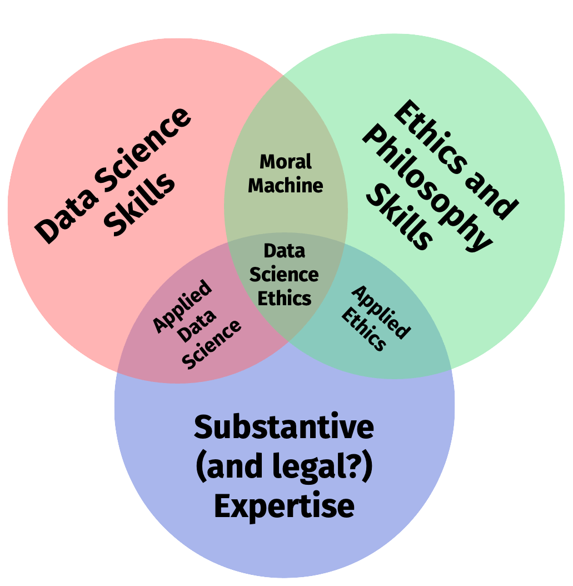
</div>
]


<!-- ############################################ -->
---
class: inverse, center, middle
name: principles

# Ethical principles

<html><div style='float:left'></div><hr color='#EB811B' size=1px style="width:1000px; margin:auto;"/></html>


---
# Two ethical frameworks

.pull-left[
### Deontology

- [Follow ethical duties](https://en.wikipedia.org/wiki/Consequentialism) that are derived from a set of rules independent of their consequences.
- Roots in the work of [Immanuel Kant](https://en.wikipedia.org/wiki/Immanuel_Kant). 
- The principle of *Respect for Persons* (autonomy) is deeply rooted in deontological thinking.
- Focused on **means**, not **ends**.

<div align="center">

</div>
]

.pull-right[
### Consequentialism

- [Take actions that lead to better states](https://en.wikipedia.org/wiki/Consequentialism) in the world.
- Roots in [utilitarianism](https://en.wikipedia.org/wiki/Utilitarianism) of [Jeremy Bentham](https://en.wikipedia.org/wiki/Jeremy_Bentham), [John Stuart Mill](https://en.wikipedia.org/wiki/John_Stuart_Mill).
- The principle of *Beneficence* (risk/benefit analysis) is deeply rooted in consequentialist thinking.
- Focused on **ends**, not **means**.

<div align="center">

</div>
]


---
# Ethical principles

.pull-left-wide[
- Ethical thinking is not an exercise of ticking boxes.
- A set of principles can guide researchers in reflecting about the ethical implications of their research.
- In different contexts these principles can come into conflict with each other.
- In fact, the most interesting cases are when the ethical implications of research involve trade-offs of principles.
- By making principles explicit, those trade-offs can be clarified and decisions better communicated.
- We will focus on the following four principles:

  1. Respect for persons
  2. Beneficence
  3. Justice
  4. Respect for law and public interest
]

.pull-right-small-center[
<div align="center">
<br><br>
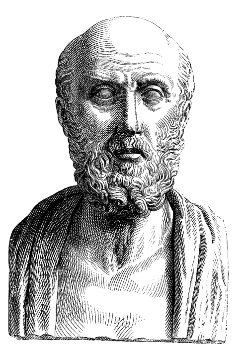
</div>
`Source` [Wikimedia Commons](https://commons.wikimedia.org/wiki/File:Hippocrates.jpg)
]

---
# 1. Respect for persons

.pull-left-wide[

*Respect for persons is about treating people as autonomous and honoring their wishes.*

- **Autonomy and consent**: All human subjects should have the right to decide whether to participate in a study, as well as the right to withdraw at any time, without any negative consequences.
- **No coercion**: The decision to participate in a study shall be made freely and without coercion, whether explicit or implied.
- **Protection**: Individuals with diminished capacity to make these decisions must be protected.
- **Orthodox interpretation**: Researchers should not do things to people without their consent.
- **Privacy**: Respect preferences regarding privacy and anonymity.
{{content}}
]

.pull-right-small-center[
<div align="center">
<br><br><br>

</div>
]

--

*Questions to reflect on:*
- How could coercion look like in practice?
- Under which circumstances is consent ethically problematic? And when could it be practically problematic?
{{content}}

---
# 2. Beneficience

.pull-left-wide[

*Beneficence is about understanding and improving the risk/benefit profile of your study, and then deciding if it strikes the right balance.*

- **Do no harm!**
- **Risk/benefit analysis**: Maximize possible benefits, minimize possible harms.
- **Social and scientific value**: Research involving risks or costs to human subjects must have social or scientific value.
- **Wellbeing**: Secure the physical, psychological, and social well-being of research participants and others affected by research.
- **Avoid misuse**: Anticipate the possibility of "Dual Use" (e.g. for military applications), or misuse (e.g. for criminal use) and share findings in ways that minimize these risks.
{{content}}
]

.pull-right-small-center[
<div align="center">
<br><br><br>

</div>
]

--

*Questions to reflect on:*
- Under which circumstances could research with a clear net benefit still be impermissible from an ethical point of view?
{{content}}

---
# 3. Justice

.pull-left-wide[
*Justice is about ensuring that the risks and benefits of research are distributed fairly.*

- **Protection**: Vulnerable people should be protected from researchers.
- **Equity of access**: Ensure that all groups who could benefit from research should have the chance to participate.
- **Compensation**: Compensate subjects appropriately for their participation.
{{content}}
]

.pull-right-small-center[
<div align="center">
<br><br><br>

</div>
]
--

*Questions to reflect on:*
- How makes digital research protection and equity of access easier to account for, and how could it become more difficult?
- What does appropriate compensation entail under which circumstances?
- What could be unintended consequences of generous compensation?
{{content}}

---
# 4. Respect for law and public interest

.pull-left-wide[
*Respect for law and public interest extends the principle of beneficience beyond specific research participants to include all relevant stakeholders.*

- **Compliance**: Identify and obey relevant laws, contracts, and terms of service.
- **Transparency-based accountability**: Be clear about goals, methods, and results at all stages of research and take responsibility for one's actions.
{{content}}
]

.pull-right-small-center[
<div align="center">
<br><br><br>
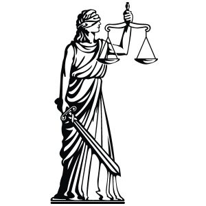
</div>
]

--

*Questions to reflect on:*
- Under which circumstances might compliance be impossible to fulfill but the research still ethically acceptable or even desirable?
- Which principle(s) is the transparency-based accountability likely to come in conflict with?
{{content}}


<!-- ############################################ -->
---
class: inverse, center, middle
name: practice

# Research ethics in practice

<html><div style='float:left'></div><hr color='#EB811B' size=1px style="width:1000px; margin:auto;"/></html>

---
# Informed consent

.pull-left[
### Why informed consent?
- Consent helps ensure individual autonomy.
- Consent should not be seen as a single act of signing a form, but rather a communicative process that extends throughout the course of a research project. 

### What informed consent should cover

In general, "informed consent" should include communicating
- the research procedure (what),
- the purpose (to what end),
- the stakeholders (by and for whom),
- anticipated risks and benefits, and 
- use of data to be collected.
]

.pull-right-center[

<div align="center">
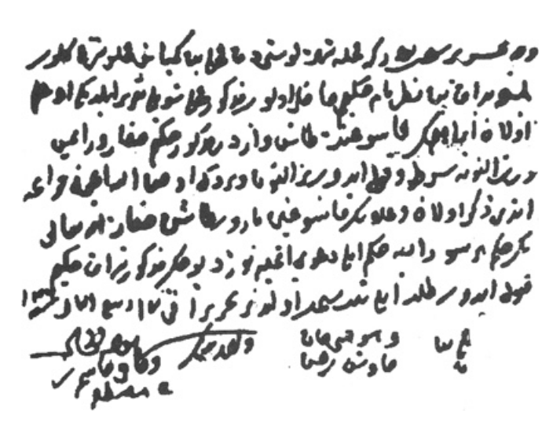
</div>
<div align="center" class = "font80">
<i>In this Ottoman Empire document from 1539 a father promises to not sue a surgeon in case of death following the removal of his son's urinary stones.</i>
</div>

`Source` [Salih Selek / Journal of Medical Ethics](https://jme.bmj.com/content/36/10/639)
]

---
# Informed consent: example

.pull-center[
<div align="center">
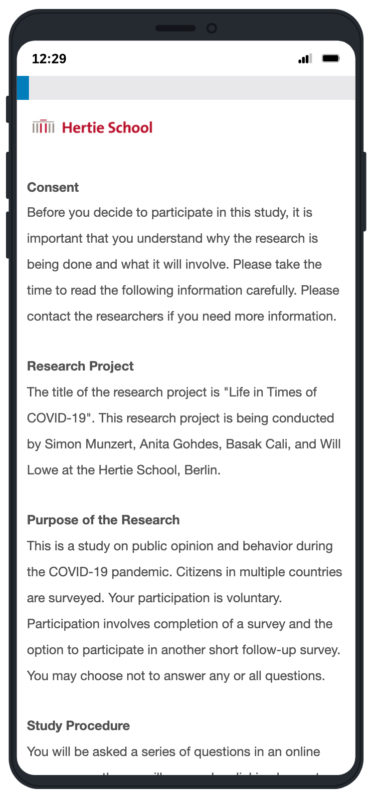
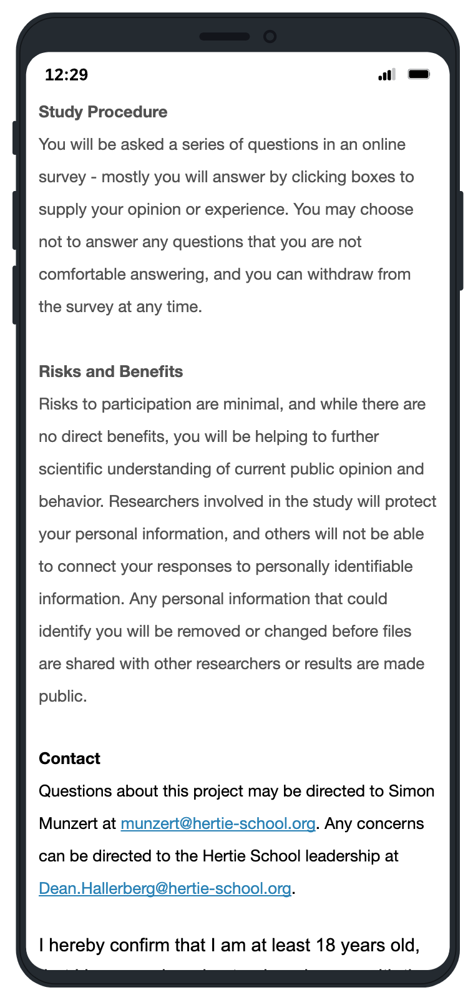
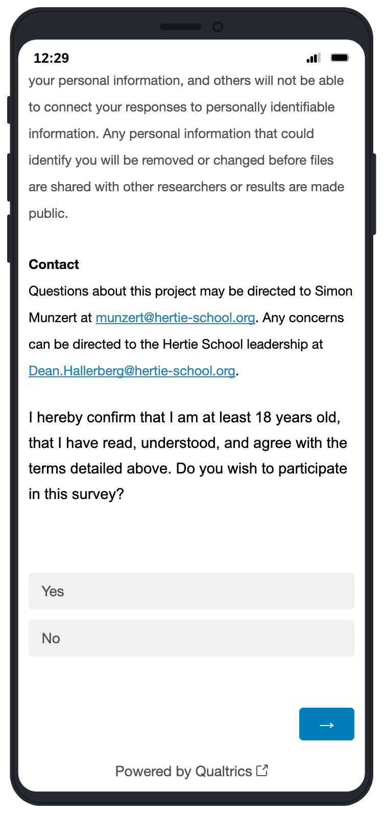
</div>
`Source` [Munzert et al. 2021](https://www.nature.com/articles/s41562-020-01044-x)
]


---
# Informed consent: challenges

.pull-left[
### When informed consent is not feasible

The **simple rule** "informed consent for everything" is not consistent with ethical principles and research practice. Why?
  - Sometimes asking participants to provide informed consent may increase the risks that they face.
  - Sometimes having fully informed consent before the study begins could compromise the scientific value of the study.
  - Sometimes it is logistically impractical to obtain informed consent from everyone impacted by your study
]

--

.pull-right[
### Towards a better practice

If obtaining full informed consent is not possible, for example, when informed consent would impair the research design, then it must be ensured that 

1. there are no undisclosed risks that are more than minimal, and
2. subjects are debriefed whenever possible and appropriate and have the right to withdraw ex post.  
  
**Better rule:** "The highest possible degree of informed consent must be obtained from research participants."
]
  


---
# Informational risk

.pull-left-wide2[
### What is informational risk?
- The potential for harm from the disclosure of information.
- Informational harms could be economic (e.g., losing a job), social (e.g., embarrassment), psychological (e.g., depression), or even criminal (e.g., arrest for illegal behavior).
- Unfortunately, a frequent by-product of research in the digital age (contrary to physical risk).
]


---
# Informational risk

.pull-left-wide2[
### What is informational risk?
- The potential for harm from the disclosure of information.
- Informational harms could be economic (e.g., losing a job), social (e.g., embarrassment), psychological (e.g., depression), or even criminal (e.g., arrest for illegal behavior).
- Unfortunately, a frequent by-product of research in the digital age (contrary to physical risk).

### How to mitigate informational risk?
- Anonymization, i.e. remove obvious personal identifiers such as name, address, telephone number, etc.
]

.pull-right-small2-center[
<div align="center">
<br>
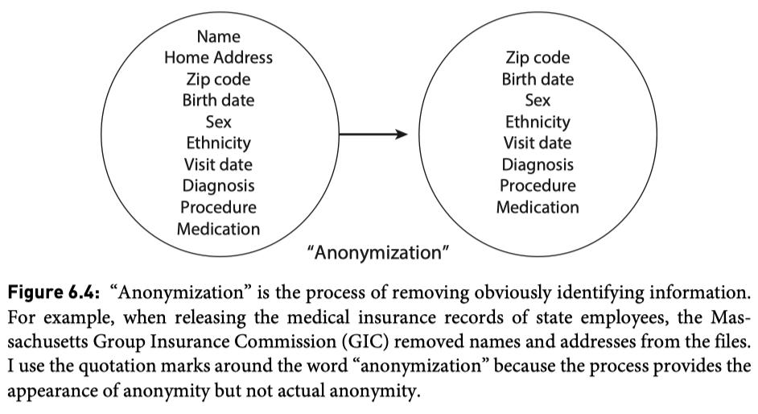
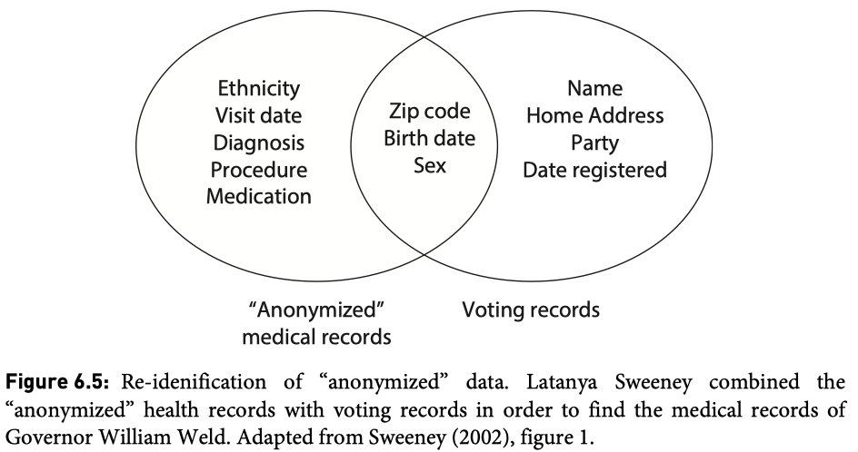
</div>

`Source` [Matt Salganik, Bit By Bit](https://www.bitbybitbook.com/)
]


---
# Informational risk

.pull-left-wide2[
### What is informational risk?
- The potential for harm from the disclosure of information.
- Informational harms could be economic (e.g., losing a job), social (e.g., embarrassment), psychological (e.g., depression), or even criminal (e.g., arrest for illegal behavior).
- Unfortunately, a frequent by-product of research in the digital age (contrary to physical risk).

### How to mitigate informational risk?
- Anonymization, i.e. remove obvious personal identifiers such as name, address, telephone number, etc.
- Safe projects, safe data, safe settings, safe output
]

.pull-right-small2-center[
<div align="center">
<br>
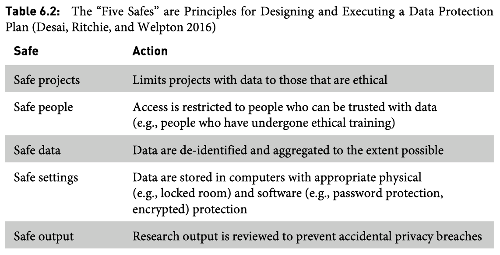
</div>

`Source` [Matt Salganik, Bit By Bit](https://www.bitbybitbook.com/)
]


---
# Ethics committees and IRBs

### Character and purpose
- A (research) [ethics committee](https://en.wikipedia.org/wiki/Ethics_committee) is an oversight body that ensures that human subject research is carried out in an ethical manner and (depending of the scope) in accordance with the law.
- At US academic institutions [Institutional Review Boards (IRBs)](https://en.wikipedia.org/wiki/Institutional_review_board) take care of this. Their work is regulated by the [Common Rule](https://en.wikipedia.org/wiki/Common_Rule), a rule of ethics that specifies procedures and requirements for ethical research.

### The current state of affairs
- In Europe, ethics committees used to be uncommon outside biomedical research. 
- As experimentation and other potentially problematic research practices become more common in the social and behavioral sciences, so does ethics oversight. 


---
# The mode of operation of ethics committees

1. Universities maintain interdisciplinary or discipline-specific committees.

--

2. Committees are usually composed of scientists from different disciplines, internal and external persons, and privacy protection officers (at least in Germany 🤷)

--

3. Researchers submit proposals according to predefined rules that provide information necessary to make judgments about potential ethical issues. This includes:
  - Aim of the research project, timetable, researchers involved, location of the research.
  - Research design: sample, measurement instruments, experiments, etc.
  - Data use and storage concept.
  - Information about features of the project that could be ethically relevant (usually a very long list of questions; see [here](https://www.lse.ac.uk/media-and-communications/assets/documents/research/eu-kids-online/toolkit/qualitative-research/Research-Ethics.pdf) or [here](https://www.ncl.ac.uk/media/wwwnclacuk/research/files/example-ethicsform-sexualhealth.pdf) for examples).

--

4. The commission meets, consults, and decides; possible outcomes: approval, reject, demand for modification.

--

5. Depending on the institution, this decision is binding or not. However, more and more journals are requesting the approval of an ethics committee.


---
# Example items from an ethics review questionnaire

1. Does the study involve vulnerable populations (e. g. children <18, prison populations, refugees, ...)?

2. Is it plausible that individuals feel compelled to participate in the study, for instance due to pressure from others, such as management, works council, teachers, traditional or religious leaders, parent, or spouses?

3. Does the research involve individuals who would have difficulty giving meaningful informed consent?

4.	Will compensation exceed what is reasonable for time investment and expenses? 

5. In the event that the project involves deception, will subjects be debriefed at the end of the study? 

6. Is physical pain more than mild discomfort likely to result from participation?

7. Will this project pose any risks to the health and safety of the researchers? 

8. Will research involve saving images or audio data from which respondents may be identified?

9. Will you require access to data on research participants held by a third party (physician, school, etc.)? 

10.	Does this research have potential for misuse (i. e. abuse by criminal or terrorist groups)


<!-- ############################################ -->
---
class: inverse, center, middle
name: activity

# Ethics committees in action

<html><div style='float:left'></div><hr color='#EB811B' size=1px style="width:1000px; margin:auto;"/></html>


---
class: inverse

.pull-left[

<br> 

### Breakout time! Take on the role of an ethics committee and evaluate one of the studies shown on the following pages. Consider these questions:

1. What ethical problems do you see?
2. What questions would you ask the authors to inform your opinion?

### You have **10 minutes** to discuss.
]

.pull-right[
<div align="center">
<br><br>

</div>
]

---
# An audit study 

.pull-center[
<div align="center">
<br><br>
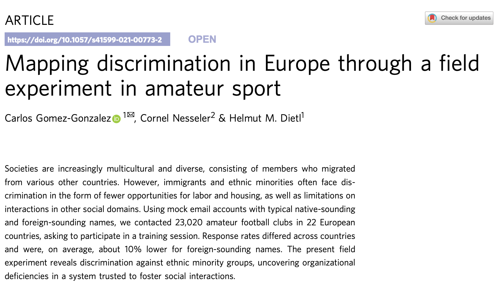
</div>
`Source` [Gomez-Gonzalez et al., 2021](https://www.nature.com/articles/s41599-021-00773-2)
]


---
# A delicate data set

.pull-center[
<div align="center">
<br><br>
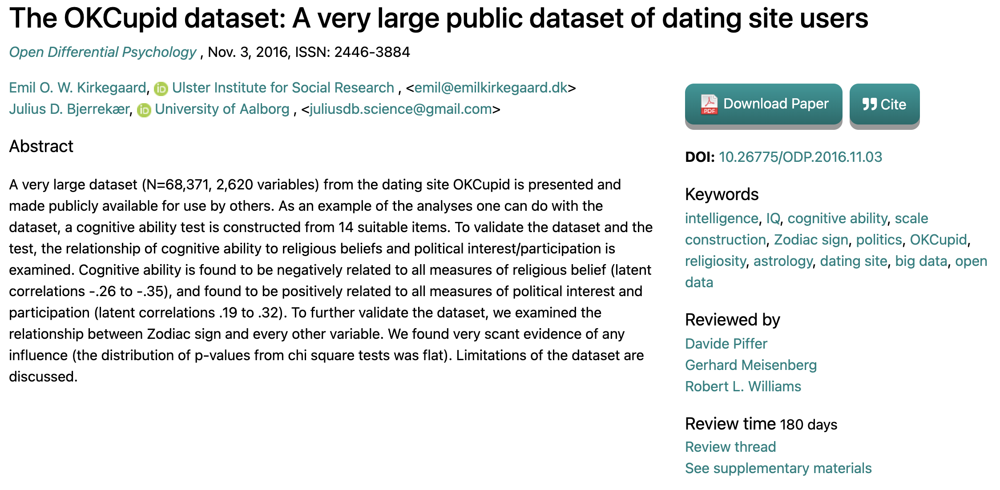
</div>
`Source` [Kirkegaard/Bjerrekær, 2016](https://openpsych.net/files/papers/Kirkegaard_2016g.pdf)
]


---
class: center
background-color: #27363A

# Thank you!

<br>
<div align="center">

</div>


